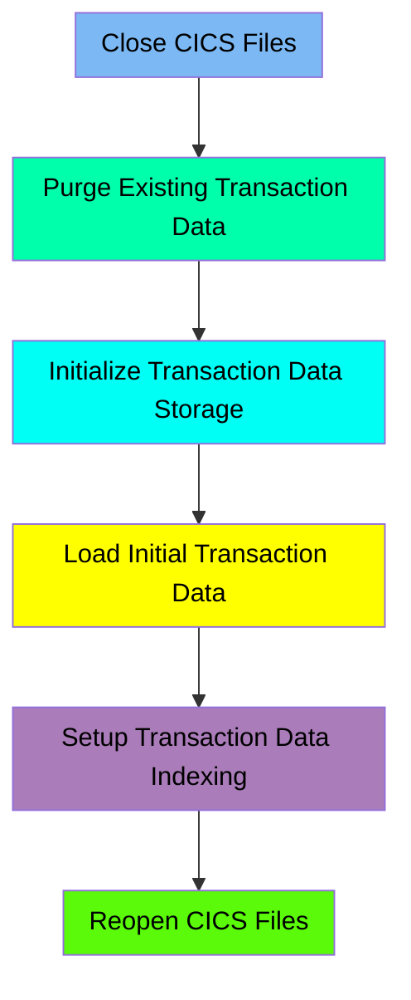

The TRANFILE job is responsible for defining and initializing the transaction master file in the CARDDEMO application. This process involves closing existing CICS files, purging old transaction data, defining new data storage, loading initial transaction data, setting up data indexing, and reopening the CICS files.

For example, the job starts by closing the TRANSACT and CXACAIX files in the CICS region, then deletes any existing transaction master VSAM files, defines a new VSAM file for transaction data, loads initial data from a flat file, sets up an alternate index for efficient data retrieval, and finally reopens the CICS files for use.

Here is a high level diagram of the file:

## Close CICS Files

Steps in this section: `CLCIFIL`.

This section is about closing specific files in the CICS region. It ensures that the TRANSACT and CXACAIX files are properly closed using the SDSF tool and CEMT commands.

## Purge Existing Transaction Data

Steps in this section: `STEP05`.

This section is responsible for deleting any existing transaction master VSAM files and their associated alternate indexes to ensure that the system starts with a clean slate for transaction processing.

## Initialize Transaction Data Storage

Steps in this section: `STEP10`.

This section is about defining a VSAM file for transaction data storage. The program uses IDCAMS to create a Key-Sequenced Data Set (KSDS) for managing transaction data efficiently within the CARDDEMO application.

## Load Initial Transaction Data

Steps in this section: `STEP15`.

This section is responsible for copying data from a flat file to a VSAM file to initialize the transaction database. It ensures that the transaction data is properly loaded into the VSAM Key-Sequenced Data Set for efficient management and retrieval.

## Setup Transaction Data Indexing

Steps in this section: `STEP20`, `STEP25`, `STEP30`.

This section is about setting up an alternate index for the transaction data. It defines the alternate index, relates it to the base cluster, and builds the index to facilitate efficient data retrieval and management.

## Reopen CICS Files

Steps in this section: `OPCIFIL`.

This section is responsible for reopening the TRANSACT and CXACAIX files in the CICS region using SDSF and specific CICS commands. It ensures that these files are available and operational for subsequent processing tasks.

&nbsp;

*This is an auto-generated document by Swimm 🌊 and has not yet been verified by a human*

<SwmMeta version="3.0.0" repo-id="Z2l0aHViJTNBJTNBa3luZHJ5bC1hd3MtbWFpbmZyYW1lLW1vZGVybml6YXRpb24tY2FyZGRlbW8lM0ElM0FTd2ltbS1EZW1v" repo-name="kyndryl-aws-mainframe-modernization-carddemo">Powered by [Swimm](/)</SwmMeta>
