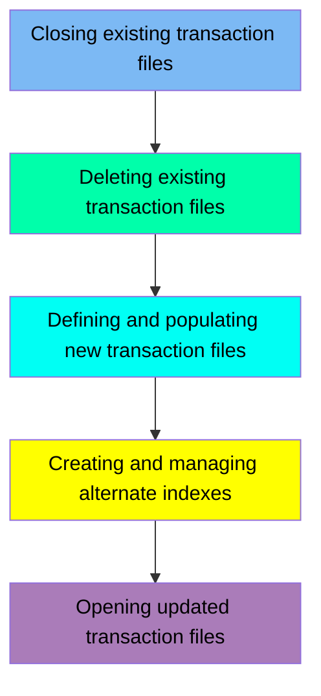

This document describes the TRANFILE job, which is responsible for managing transaction files in the CardDemo application. The process involves closing existing transaction files, deleting any pre-existing transaction data, defining and populating new transaction files, creating and managing alternate indexes, and finally, opening the updated transaction files. The input to this flow includes existing transaction files and initial transaction data, while the output is a set of updated and indexed transaction files ready for processing.

Here is a high level diagram of the file:

## Closing existing transaction files

Steps in this section: `CLCIFIL`.

This section is about closing existing transaction files in the CICS region. The program sends commands to the CICSAWSA component to close the TRANSACT and CXACAIX files, ensuring that no further transactions can be processed until the files are reopened.

## Deleting existing transaction files

Steps in this section: `STEP05`.

This section is responsible for deleting existing VSAM files related to transaction data if they already exist. It ensures that any pre-existing transaction data is removed before new data is processed.

## Defining and populating new transaction files

Steps in this section: `STEP10`, `STEP15`.

This section is about defining a new VSAM file for transaction data storage and populating it with data from a flat file. The process involves creating the VSAM file structure and then copying the initial transaction data into this newly defined file.

## Creating and managing alternate indexes

Steps in this section: `STEP20`, `STEP25`, `STEP30`.

This section is responsible for creating and managing alternate indexes on the processed timestamp dataset, defining a path to relate the alternate index to the base cluster, and building the alternate index cluster for efficient transaction data management.

## Opening updated transaction files

Steps in this section: `OPCIFIL`.

This section is about opening the necessary files in the CICS region to access transaction and cross-reference account data. It ensures that the transaction file and the cross-reference account dataset are available for processing within the CardDemo application.

&nbsp;

*This is an auto-generated document by Swimm 🌊 and has not yet been verified by a human*

<SwmMeta version="3.0.0" repo-id="Z2l0aHViJTNBJTNBa3luZHJ5bC1hd3MtbWFpbmZyYW1lLW1vZGVybml6YXRpb24tY2FyZGRlbW8lM0ElM0FTd2ltbS1EZW1v" repo-name="kyndryl-aws-mainframe-modernization-carddemo">Powered by [Swimm](/)</SwmMeta>
