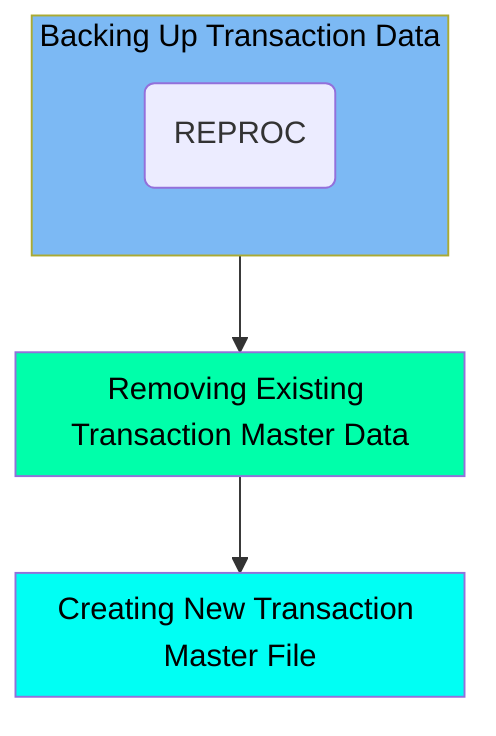

The TRANBKP job is responsible for managing the transaction master data within the application. This job involves three main steps: backing up the processed transaction data, removing any existing transaction master data, and creating a new transaction master file. The process ensures that the system maintains a clean and updated transaction dataset for efficient processing.

For instance, the job first creates a backup of the current transaction data, then deletes any pre-existing transaction master files, and finally defines a new VSAM Key-Sequenced Data Set (KSDS) for the transaction data.

Here is a high level diagram of the file:

## Backing Up Transaction Data

Steps in this section: `STEP05R`.

This section is responsible for creating a backup of the processed transaction data. It involves copying data from the main transaction dataset to a new backup dataset using the REPROC procedure.

## Removing Existing Transaction Master Data

Steps in this section: `STEP05`.

This section is responsible for deleting any pre-existing transaction master VSAM files and their associated alternate indexes to ensure that the system starts with a clean slate for transaction processing.

## Creating New Transaction Master File

Steps in this section: `STEP10`.

This section is about defining a new VSAM Key-Sequenced Data Set (KSDS) for managing transaction data. It sets up the necessary parameters for the transaction master file, including its name, size, volume, key structure, and data and index components.

&nbsp;

*This is an auto-generated document by Swimm 🌊 and has not yet been verified by a human*

<SwmMeta version="3.0.0" repo-id="Z2l0aHViJTNBJTNBa3luZHJ5bC1hd3MtbWFpbmZyYW1lLW1vZGVybml6YXRpb24tY2FyZGRlbW8lM0ElM0FTd2ltbS1EZW1v" repo-name="kyndryl-aws-mainframe-modernization-carddemo">Powered by [Swimm](/)</SwmMeta>
