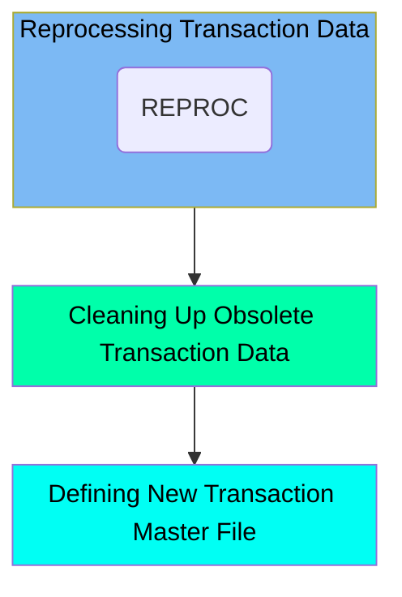

The TRANBKP job is responsible for managing the transaction master file in the CardDemo application. It achieves this by reprocessing transaction data, cleaning up obsolete transaction data, and defining a new transaction master file. The job starts by copying the contents of the transaction VSAM file to a new backup dataset, ensuring that the transaction data is backed up properly. Next, it deletes existing transaction master VSAM files and their associated alternate indexes if they already exist, ensuring that outdated transaction data is removed. Finally, it defines a new transaction master VSAM file, specifying details such as the file name, size, volume, keys, record size, and indexing options.

Here is a high level diagram of the file:

## Reprocessing Transaction Data

Steps in this section: `STEP05R`.

This section is responsible for reprocessing the transaction data by copying the contents of the transaction VSAM file to a new backup dataset. It ensures that the transaction data is backed up properly for future reference or recovery.

## Cleaning Up Obsolete Transaction Data

Steps in this section: `STEP05`.

This section is responsible for deleting existing transaction master VSAM files and their associated alternate indexes if they already exist. This cleanup ensures that outdated transaction data is removed before new data is processed.

## Defining New Transaction Master File

Steps in this section: `STEP10`.

This section is about defining a new transaction master VSAM file. The program uses IDCAMS to create the file structure, specifying details such as the file name, size, volume, keys, record size, and indexing options.

&nbsp;

*This is an auto-generated document by Swimm 🌊 and has not yet been verified by a human*

<SwmMeta version="3.0.0" repo-id="Z2l0aHViJTNBJTNBa3luZHJ5bC1hd3MtbWFpbmZyYW1lLW1vZGVybml6YXRpb24tY2FyZGRlbW8lM0ElM0FTd2ltbS1EZW1v" repo-name="kyndryl-aws-mainframe-modernization-carddemo">Powered by [Swimm](/)</SwmMeta>
