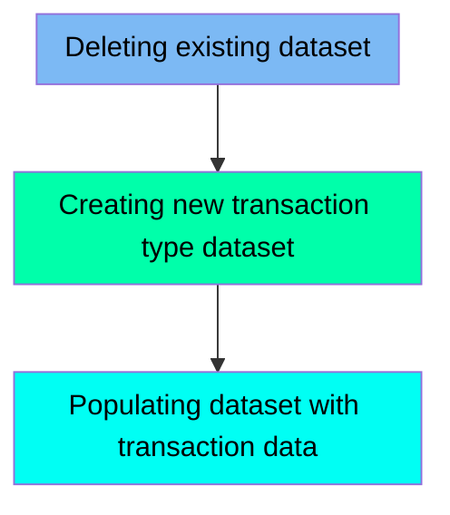

The TRANTYPE job is responsible for managing the transaction type dataset within the CardDemo mainframe application. This process involves three main steps: deleting any existing dataset, creating a new dataset, and populating the new dataset with transaction data. The input for this job is the existing transaction type dataset, and the output is a newly created and populated dataset ready for use in the application.

Here is a high level diagram of the file:

## Deleting existing dataset

Steps in this section: `STEP05`.

This section is responsible for deleting the existing transaction type dataset if it already exists. It ensures that any previous data is removed before new data is defined and loaded.

## Creating new transaction type dataset

Steps in this section: `STEP10`.

This section is about defining a new VSAM dataset for transaction types. It involves specifying the cluster, data, and index attributes for the dataset to store transaction type information within the CardDemo mainframe application.

## Populating dataset with transaction data

Steps in this section: `STEP15`.

This section is about copying transaction data from a flat file to a VSAM file. The program uses IDCAMS to perform the data transfer, ensuring that transaction types are properly stored and managed within the CardDemo application.

&nbsp;

*This is an auto-generated document by Swimm 🌊 and has not yet been verified by a human*

<SwmMeta version="3.0.0" repo-id="Z2l0aHViJTNBJTNBa3luZHJ5bC1hd3MtbWFpbmZyYW1lLW1vZGVybml6YXRpb24tY2FyZGRlbW8lM0ElM0FTd2ltbS1EZW1v" repo-name="kyndryl-aws-mainframe-modernization-carddemo">Powered by [Swimm](/)</SwmMeta>
