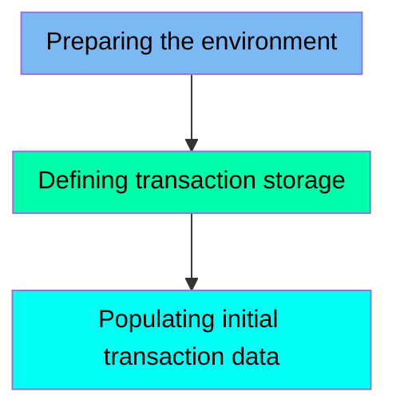

The TRANTYPE job is designed to manage the transaction type data within the CARDDEMO application. This job ensures that the environment is prepared by deleting any existing VSAM files, defines a new VSAM file for transaction types, and populates it with initial data. The process involves multiple steps to ensure the transaction data is correctly organized and ready for use.

For instance, the job starts by deleting any existing VSAM file to ensure a clean environment, then defines a new VSAM file using the IDCAMS utility, and finally copies transaction type data from a flat file to the newly created VSAM file.

Here is a high level diagram of the file:

## Preparing the environment

Steps in this section: `STEP05`.

This section is responsible for deleting an existing VSAM file that stores transaction type data if it already exists. This ensures that the environment is clean and ready for the subsequent steps in the job.

## Defining transaction storage

Steps in this section: `STEP10`.

This section is about defining a VSAM file for storing transaction types. The program uses the IDCAMS utility to create a Key-Sequenced Data Set (KSDS) that organizes and manages transaction data efficiently within the CARDDEMO application.

## Populating initial transaction data

Steps in this section: `STEP15`.

This section is responsible for copying transaction type data from a flat file to a VSAM file. It ensures that the transaction data is correctly transferred and organized within the VSAM dataset, which is crucial for the application's functionality.

&nbsp;

*This is an auto-generated document by Swimm 🌊 and has not yet been verified by a human*

<SwmMeta version="3.0.0" repo-id="Z2l0aHViJTNBJTNBa3luZHJ5bC1hd3MtbWFpbmZyYW1lLW1vZGVybml6YXRpb24tY2FyZGRlbW8lM0ElM0FTd2ltbS1EZW1v" repo-name="kyndryl-aws-mainframe-modernization-carddemo">Powered by [Swimm](/)</SwmMeta>
