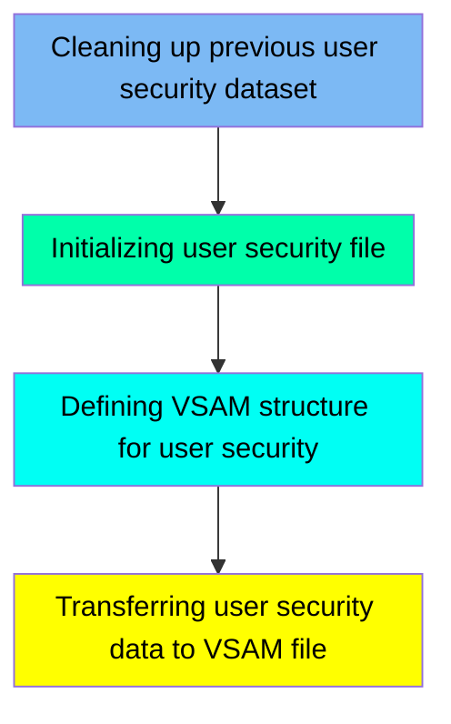

The DUSRSECJ job is responsible for managing user security data within the CARDDEMO application. This process involves cleaning up any previous user security datasets, initializing a new user security file, defining the VSAM structure for user security, and transferring user security data to the VSAM file. The job ensures that user security information is accurately maintained and efficiently accessible.

For instance, the job starts by deleting any existing user security dataset to remove outdated data. It then creates a new user security file from in-stream data, defines the VSAM structure for the new file, and finally transfers the user security data to the VSAM file for efficient access.

Here is a high level diagram of the file:

## Cleaning up previous user security dataset

Steps in this section: `PREDEL`.

This section is responsible for deleting the existing user security dataset to ensure that any outdated or redundant data is removed before new data is created or updated.

## Initializing user security file

Steps in this section: `STEP01`.

This section is responsible for creating a user security file from in-stream data using the IEBGENER utility program. It initializes the dataset <SwmPath>[app/…/EBCDIC/AWS.M2.CARDDEMO.USRSEC.PS](app/data/EBCDIC/AWS.M2.CARDDEMO.USRSEC.PS)</SwmPath> with user security information, ensuring that the necessary data structure is in place for managing user access and operations within the CARDDEMO application.

## Defining VSAM structure for user security

Steps in this section: `STEP02`.

This section is about defining the VSAM file structure for storing user security information. It involves deleting any existing VSAM file, setting the maximum condition code, and defining a new VSAM cluster with specific attributes such as key length, record size, and free space.

## Transferring user security data to VSAM file

Steps in this section: `STEP03`.

This section is responsible for copying user security data from a physical sequential (PS) dataset to a VSAM Key-Sequenced Data Set (KSDS). It ensures that the user security information is properly transferred and stored in the VSAM file for efficient access and management.

&nbsp;

*This is an auto-generated document by Swimm 🌊 and has not yet been verified by a human*

<SwmMeta version="3.0.0" repo-id="Z2l0aHViJTNBJTNBa3luZHJ5bC1hd3MtbWFpbmZyYW1lLW1vZGVybml6YXRpb24tY2FyZGRlbW8lM0ElM0FTd2ltbS1EZW1v" repo-name="kyndryl-aws-mainframe-modernization-carddemo">Powered by [Swimm](/)</SwmMeta>
