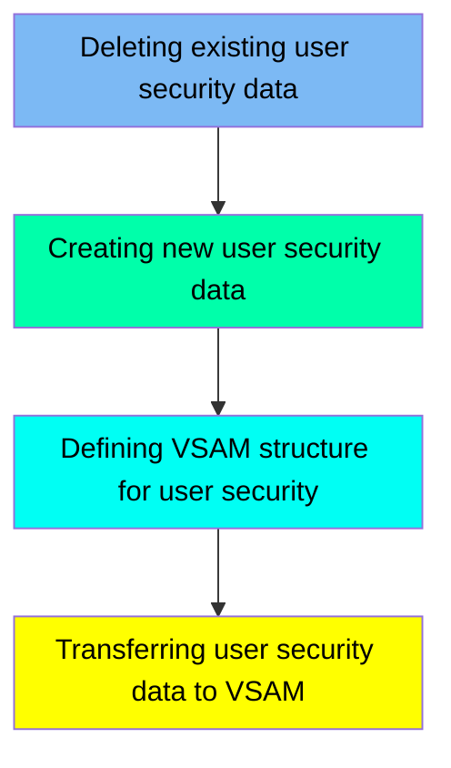

The DUSRSECJ job is responsible for managing user security data within the CardDemo mainframe application. This process involves deleting existing user security data, creating new user security data from in-stream data, defining the VSAM structure for user security, and transferring the user security data to the VSAM dataset. The input for this job includes the existing user security data and the new in-stream user security data, while the output is the updated VSAM dataset containing the new user security information.

Here is a high level diagram of the file:

## Deleting existing user security data

Steps in this section: `PREDEL`.

This section is responsible for deleting the existing user security file to ensure that outdated or redundant security information is removed before new data is created or updated.

## Creating new user security data

Steps in this section: `STEP01`.

This section is about creating a new user security file from in-stream data. The program uses IEBGENER to copy user security data to a new dataset, which is then used to store user security information in the CardDemo mainframe application.

## Defining VSAM structure for user security

Steps in this section: `STEP02`.

This section is about defining the VSAM file structure for storing user security data. The program deletes any existing VSAM file, sets the maximum condition code, and then defines a new VSAM Key-Sequenced Data Set (KSDS) with specific attributes such as keys, record size, reuse, indexing, tracks, free space, and control interval size.

## Transferring user security data to VSAM

Steps in this section: `STEP03`.

This section is responsible for copying user security data from a physical sequential (PS) dataset to a Virtual Storage Access Method (VSAM) Key-Sequenced Data Set (KSDS). The IDCAMS utility is used to perform the data transfer, ensuring that user security information is accurately migrated to the VSAM dataset for further processing or storage.

&nbsp;

*This is an auto-generated document by Swimm 🌊 and has not yet been verified by a human*

<SwmMeta version="3.0.0" repo-id="Z2l0aHViJTNBJTNBa3luZHJ5bC1hd3MtbWFpbmZyYW1lLW1vZGVybml6YXRpb24tY2FyZGRlbW8lM0ElM0FTd2ltbS1EZW1v" repo-name="kyndryl-aws-mainframe-modernization-carddemo">Powered by [Swimm](/)</SwmMeta>
