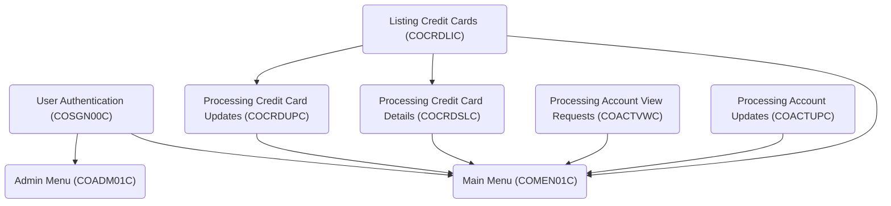

The repository 'kyndryl-aws-mainframe-modernization-carddemo' contains a Mainframe application called CardDemo. This application is designed to test and showcase AWS and partner technology for mainframe migration and modernization use-cases.

# Main Components

## Top Level Components

### Processing Account View Requests (COACTVWC)

Processing Account View Requests (COACTVWC) involves handling requests to view account details, performing input validations, retrieving account data, and displaying the account details or error messages as needed.

- <SwmLink doc-title="Processing Account View Requests (COACTVWC)">[Processing Account View Requests (COACTVWC)](/.swm/processing-account-view-requests-coactvwc.yktyz13l.sw.md)</SwmLink>

### User Authentication (COSGN00C)

User Authentication (COSGN00C) is the process of verifying user credentials to grant access to the CardDemo application, ensuring secure and authorized usage.

- <SwmLink doc-title="User Authentication (COSGN00C)">[User Authentication (COSGN00C)](/.swm/user-authentication-cosgn00c.gnpuc3xw.sw.md)</SwmLink>

### Processing Account Updates (COACTUPC)

Processing Account Updates (COACTUPC) refers to the functionality of accepting and processing updates to account information within the CardDemo application. This involves various steps such as validating input data, handling user interactions for updating account details, and ensuring that changes are correctly saved to the database. The process includes displaying prompts for user confirmation, managing potential errors during the update, and confirming successful updates. The program ensures that all necessary edits and validations are performed before committing the changes to maintain data integrity.

- <SwmLink doc-title="Processing Account Updates (COACTUPC)">[Processing Account Updates (COACTUPC)](/.swm/processing-account-updates-coactupc.c8gda1x9.sw.md)</SwmLink>

### Listing Credit Cards (COCRDLIC)

Listing Credit Cards (COCRDLIC) is a function that displays credit cards based on user context. If no context is provided and the user is an admin, all credit cards are listed. Otherwise, only the credit cards associated with the account in the communication area (COMMAREA) are displayed.

- <SwmLink doc-title="Listing Credit Cards (COCRDLIC)">[Listing Credit Cards (COCRDLIC)](/.swm/listing-credit-cards-cocrdlic.ysfqea8x.sw.md)</SwmLink>

## Other Components

### Deleting User (COUSR03C)

Deleting User (COUSR03C) refers to the functionality of removing a user from the USRSEC file in the CardDemo application. This process involves verifying the user ID, reading the user security file, and then performing the deletion operation. The program ensures that the user ID is valid and provides appropriate messages based on the success or failure of the deletion operation.

- <SwmLink doc-title="Deleting User (COUSR03C)">[Deleting User (COUSR03C)](/.swm/deleting-user-cousr03c.krafirl8.sw.md)</SwmLink>

### Updating User data (COUSR02C)

Updating user data involves validating input fields, reading the existing user data, and then updating the necessary fields in the USRSEC file if modifications are detected.

- <SwmLink doc-title="Updating User data (COUSR02C)">[Updating User data (COUSR02C)](/.swm/updating-user-data-cousr02c.8o3xonpd.sw.md)</SwmLink>

### Printing Transaction Report (CBTRN03C)

Printing Transaction Report (CBTRN03C) is a batch COBOL program designed to generate a detailed report of transactions.

- <SwmLink doc-title="Printing Transaction Report (CBTRN03C)">[Printing Transaction Report (CBTRN03C)](/.swm/printing-transaction-report-cbtrn03c.3g9qjczv.sw.md)</SwmLink>

### Admin Menu (COADM01C)

The Admin Menu (COADM01C) is a CICS COBOL program designed for administrative users within the CardDemo application. It provides a user interface for performing various administrative tasks such as managing user accounts and security settings. The program handles user inputs, validates options, and navigates to the appropriate administrative functions based on the selected options.

- <SwmLink doc-title="Admin Menu (COADM01C)">[Admin Menu (COADM01C)](/.swm/admin-menu-coadm01c.hjpydccn.sw.md)</SwmLink>

### Posting Daily Transactions (CBTRN02C)

Posting Daily Transactions (CBTRN02C) refers to the batch COBOL program responsible for processing and posting records from the daily transaction file. This program reads transactions, validates them, updates account balances, and handles any rejected transactions by writing them to a separate file. It ensures that all daily transactions are accurately recorded and reflected in the system.

- <SwmLink doc-title="Posting Daily Transactions (CBTRN02C)">[Posting Daily Transactions (CBTRN02C)](/.swm/posting-daily-transactions-cbtrn02c.3mcthtkp.sw.md)</SwmLink>

### Processing Credit Card Details (COCRDSLC)

Processing Credit Card Details (COCRDSLC) involves accepting and processing credit card detail requests. The program validates the input data, ensuring that the account and card numbers are correctly formatted and numeric. It handles various input scenarios, such as missing or incorrect data, and sets appropriate flags and messages to guide the user. The program also interacts with CICS for transaction processing and manages the display and input fields on the screen based on the context and user actions.

- <SwmLink doc-title="Processing Credit Card Details (COCRDSLC)">[Processing Credit Card Details (COCRDSLC)](/.swm/processing-credit-card-details-cocrdslc.1e65ye4y.sw.md)</SwmLink>

### Viewing Transaction (COTRN01C)

Viewing Transaction (COTRN01C) is a CICS COBOL program designed to view a transaction from the TRANSACT file. It handles user inputs, retrieves transaction details, and displays them on the screen. The program includes error handling for scenarios such as missing or invalid transaction IDs and ensures the user interface is updated accordingly.

- <SwmLink doc-title="Viewing Transaction (COTRN01C)">[Viewing Transaction (COTRN01C)](/.swm/viewing-transaction-cotrn01c.yxuwexsl.sw.md)</SwmLink>

### Printing Transaction Reports (CORPT00C)

Printing Transaction Reports (CORPT00C) involves generating transaction reports by submitting a batch job from an online interface using an extra partition Transient Data Queue (TDQ). This process is managed by the COBOL program CORPT00C, which is part of the CardDemo application. The program handles the creation and submission of the job, ensuring that transaction data is accurately compiled and reported.

- <SwmLink doc-title="Printing Transaction Reports (CORPT00C)">[Printing Transaction Reports (CORPT00C)](/.swm/printing-transaction-reports-corpt00c.anc1k74z.sw.md)</SwmLink>

### Printing Account Cross-Reference (CBACT03C)

Printing Account Cross-Reference (CBACT03C) is a batch COBOL program designed to read and print data from an account cross-reference file. It sequentially accesses records in an indexed file, displaying each record until the end of the file is reached. The program handles file opening, reading, and closing operations, and includes error handling routines to manage any issues encountered during these processes.

- <SwmLink doc-title="Printing Account Cross-Reference (CBACT03C)">[Printing Account Cross-Reference (CBACT03C)](/.swm/printing-account-cross-reference-cbact03c.yzju3vlm.sw.md)</SwmLink>

### Processing Bill Payments (COBIL00C)

Processing Bill Payments (COBIL00C) refers to the functionality of handling the payment of account balances in full through an online bill payment transaction. This process involves reading and updating account data files, managing transaction records, and interacting with the user interface to confirm and process payments. The program ensures that the account balance is updated accordingly and generates the necessary transaction records to reflect the payment.

- <SwmLink doc-title="Processing Bill Payments (COBIL00C)">[Processing Bill Payments (COBIL00C)](/.swm/processing-bill-payments-cobil00c.59aoqhgj.sw.md)</SwmLink>

### Posting Daily Transactions (CBTRN01C)

Posting Daily Transactions (CBTRN01C) is a batch COBOL program designed to post records from the daily transaction file. It sequentially processes transactions, updating relevant customer, account, and card files, ensuring that all daily transactions are accurately recorded and reflected in the system.

- <SwmLink doc-title="Posting Daily Transactions (CBTRN01C)">[Posting Daily Transactions (CBTRN01C)](/.swm/posting-daily-transactions-cbtrn01c.z3dzrs2y.sw.md)</SwmLink>

### Printing Card Data (CBACT02C)

Printing Card Data (CBACT02C) is a batch COBOL program designed to read and print data from a card file. It sequentially accesses records in an indexed file, retrieves card data, and displays it. The program handles file opening, reading, and closing operations, and includes error handling routines to manage any issues encountered during file access.

- <SwmLink doc-title="Printing Card Data (CBACT02C)">[Printing Card Data (CBACT02C)](/.swm/printing-card-data-cbact02c.a698m6p6.sw.md)</SwmLink>

### Main Menu (COMEN01C)

The Main Menu (COMEN01C) is a CICS COBOL program that serves as the main interface for regular users in the CardDemo application. It facilitates navigation through various user functions by displaying menu options and handling user inputs. The program manages the display and interaction of the main menu screen, processes user selections, and directs users to the appropriate application functions based on their input.

- <SwmLink doc-title="Main Menu (COMEN01C)">[Main Menu (COMEN01C)](/.swm/main-menu-comen01c.7o5saerm.sw.md)</SwmLink>

### Listing Transactions (COTRN00C)

Listing Transactions (COTRN00C) is a CICS COBOL program that lists transactions from the TRANSACT file. It handles the retrieval and display of transaction records, managing pagination through forward and backward navigation. The program ensures that transactions are fetched and displayed correctly, providing users with the ability to view transaction details in an organized manner.

- <SwmLink doc-title="Listing Transactions (COTRN00C)">[Listing Transactions (COTRN00C)](/.swm/listing-transactions-cotrn00c.5i8wg710.sw.md)</SwmLink>

### Adding User (COUSR01C)

Adding User (COUSR01C) is a CICS COBOL program designed to add a new regular or admin user to the USRSEC file. It handles user input validation, ensuring that fields such as first name, last name, user ID, password, and user type are not empty. Upon successful validation, the user details are written to the security file, and appropriate messages are displayed to the user.

- <SwmLink doc-title="Adding User (COUSR01C)">[Adding User (COUSR01C)](/.swm/adding-user-cousr01c.ln7ls4ac.sw.md)</SwmLink>

### Interest Calculator (CBACT04C)

The Interest Calculator (CBACT04C) is a batch COBOL program designed to calculate interest for accounts within the CardDemo application. It reads various input files, retrieves account and transaction data, computes the interest based on predefined rates, and updates the account balances accordingly. This program is essential for maintaining accurate financial records and ensuring that interest calculations are consistently applied to all relevant accounts.

- <SwmLink doc-title="Interest Calculator (CBACT04C)">[Interest Calculator (CBACT04C)](/.swm/interest-calculator-cbact04c.a356ckun.sw.md)</SwmLink>

### Listing Users (COUSR00C)

Listing Users (COUSR00C) is a CICS COBOL program that lists all users from the USRSEC file. It is part of the CardDemo application and is used to retrieve and display user information, including user IDs, names, and types. The program handles pagination and ensures that user data is correctly fetched and displayed across multiple pages.

- <SwmLink doc-title="Listing Users (COUSR00C)">[Listing Users (COUSR00C)](/.swm/listing-users-cousr00c.delpct8c.sw.md)</SwmLink>

### Processing Credit Card Updates (COCRDUPC)

Processing Credit Card Updates (COCRDUPC) involves accepting and handling requests to update credit card details, validating input data, and committing valid changes to the database while providing feedback to the user.

- <SwmLink doc-title="Processing Credit Card Updates (COCRDUPC)">[Processing Credit Card Updates (COCRDUPC)](/.swm/processing-credit-card-updates-cocrdupc.ig8w4ln2.sw.md)</SwmLink>

&nbsp;

*This is an auto-generated document by Swimm 🌊 and has not yet been verified by a human*

<SwmMeta version="3.0.0" repo-id="Z2l0aHViJTNBJTNBa3luZHJ5bC1hd3MtbWFpbmZyYW1lLW1vZGVybml6YXRpb24tY2FyZGRlbW8lM0ElM0FTd2ltbS1EZW1v" repo-name="kyndryl-aws-mainframe-modernization-carddemo">Powered by [Swimm](https://staging.swimm.cloud/)</SwmMeta>
