CardDemo is a Mainframe application designed and developed to test and showcase AWS and partner technology for mainframe migration and modernization use-cases such as discovery, migration, modernization, performance test, augmentation, service enablement, service extraction, test creation, test harness, etc.

## Main Components

```mermaid
graph TD;
 jgzg3("Sign-On Screen (COSGN00C)") --> 8d4h2("Main Menu (COMEN01C)")
 g7wnu("Viewing Transactions (COTRN01C)") --> by25l("Listing Transactions (COTRN00C)")
 by25l("Listing Transactions (COTRN00C)") --> g7wnu("Viewing Transactions (COTRN01C)")
 6av7h("Listing Credit Cards (COCRDLIC)") --> j7ku6("Credit Card Details (COCRDUPC)")
 fnew3("Adding New Users (COUSR01C)") --> jgzg3("Sign-On Screen (COSGN00C)")
 g7wnu("Viewing Transactions (COTRN01C)") --> jgzg3("Sign-On Screen (COSGN00C)")
 53zwo("Listing Users (COUSR00C)") --> jgzg3("Sign-On Screen (COSGN00C)")
 by25l("Listing Transactions (COTRN00C)") --> jgzg3("Sign-On Screen (COSGN00C)")
 bjqsi("Admin Menu (COADM01C)") --> jgzg3("Sign-On Screen (COSGN00C)")
 8d4h2("Main Menu (COMEN01C)") --> jgzg3("Sign-On Screen (COSGN00C)")
 bef4p("Bill Payments (COBIL00C)") --> jgzg3("Sign-On Screen (COSGN00C)")
 rrd7j("Adding Transactions (COTRN02C)") --> jgzg3("Sign-On Screen (COSGN00C)")
 ykkng("Transaction Reports (CORPT00C)") --> jgzg3("Sign-On Screen (COSGN00C)")
 hgu8e("Deleting Users (COUSR03C)") --> jgzg3("Sign-On Screen (COSGN00C)")
 3rrne("Updating User Data (COUSR02C)") --> jgzg3("Sign-On Screen (COSGN00C)")
 g7wnu("Viewing Transactions (COTRN01C)") --> 8d4h2("Main Menu (COMEN01C)")
 by25l("Listing Transactions (COTRN00C)") --> 8d4h2("Main Menu (COMEN01C)")
 bef4p("Bill Payments (COBIL00C)") --> 8d4h2("Main Menu (COMEN01C)")
 rrd7j("Adding Transactions (COTRN02C)") --> 8d4h2("Main Menu (COMEN01C)")
 ykkng("Transaction Reports (CORPT00C)") --> 8d4h2("Main Menu (COMEN01C)")
 ako1i("Credit Card Details (COCRDSLC)") --> 8d4h2("Main Menu (COMEN01C)")
 6av7h("Listing Credit Cards (COCRDLIC)") --> 8d4h2("Main Menu (COMEN01C)")
 c72ie("Account View Requests (COACTVWC)") --> 8d4h2("Main Menu (COMEN01C)")
 j7ku6("Credit Card Details (COCRDUPC)") --> 8d4h2("Main Menu (COMEN01C)")
 qg4yr("Account Updates (COACTUPC)") --> 8d4h2("Main Menu (COMEN01C)")
 6av7h("Listing Credit Cards (COCRDLIC)") --> ako1i("Credit Card Details (COCRDSLC)")
 53zwo("Listing Users (COUSR00C)") --> hgu8e("Deleting Users (COUSR03C)")
 53zwo("Listing Users (COUSR00C)") --> 3rrne("Updating User Data (COUSR02C)")
 fnew3("Adding New Users (COUSR01C)") --> bjqsi("Admin Menu (COADM01C)")
 jgzg3("Sign-On Screen (COSGN00C)") --> bjqsi("Admin Menu (COADM01C)")
 53zwo("Listing Users (COUSR00C)") --> bjqsi("Admin Menu (COADM01C)")
 hgu8e("Deleting Users (COUSR03C)") --> bjqsi("Admin Menu (COADM01C)")
 3rrne("Updating User Data (COUSR02C)") --> bjqsi("Admin Menu (COADM01C)")
```

### Adding New Users (COUSR01C)

Adding new users involves validating user input and writing the user data to the security file, ensuring all required fields are provided and handling any errors if the user ID already exists.

- <SwmLink doc-title="Adding New Users (COUSR01C)">[Adding New Users (COUSR01C)](/.swm/adding-new-users-cousr01c.fwf9px00.sw.md)</SwmLink>

### Interest Calculations (CBACT04C)

Interest Calculations (CBACT04C) is a batch COBOL program designed to calculate interest for credit card accounts.

- <SwmLink doc-title="Interest Calculations (CBACT04C)">[Interest Calculations (CBACT04C)](/.swm/interest-calculations-cbact04c.janbwsq5.sw.md)</SwmLink>

### Listing Users (COUSR00C)

Listing Users (COUSR00C) is a CICS COBOL program designed to list all users from the USRSEC file. It initializes user data, processes user input, and navigates through user records. The program handles different user actions such as entering data, paging forward and backward, and sending and receiving screens. It ensures that user data is populated and displayed correctly, managing the end-of-file conditions and user selections efficiently.

- <SwmLink doc-title="Listing Users (COUSR00C)">[Listing Users (COUSR00C)](/.swm/listing-users-cousr00c.h0h10c9e.sw.md)</SwmLink>

### Credit Card Details (COCRDUPC)

COCRDUPC is a COBOL program that processes and updates credit card details, ensuring data validation and integrity within the CardDemo application.

- <SwmLink doc-title="Credit Card Details (COCRDUPC)">[Credit Card Details (COCRDUPC)](/.swm/credit-card-details-cocrdupc.var8z9kr.sw.md)</SwmLink>

### Listing Credit Cards (COCRDLIC)

Listing Credit Cards (COCRDLIC) is a function that displays credit card information. It shows all cards for admin users or specific cards linked to an account for non-admin users.

- <SwmLink doc-title="Listing Credit Cards (COCRDLIC)">[Listing Credit Cards (COCRDLIC)](/.swm/listing-credit-cards-cocrdlic.sd4h52rh.sw.md)</SwmLink>

### Listing Transactions (COTRN00C)

Listing Transactions (COTRN00C) is a CICS COBOL program that lists transactions from the TRANSACT file, handling data retrieval, pagination, and user interactions.

- <SwmLink doc-title="Listing Transactions (COTRN00C)">[Listing Transactions (COTRN00C)](/.swm/listing-transactions-cotrn00c.vwr450pm.sw.md)</SwmLink>

### Account View Requests (COACTVWC)

Account View Requests (COACTVWC) refer to the functionality that accepts and processes requests to view account details.

- <SwmLink doc-title="Account View Requests (COACTVWC)">[Account View Requests (COACTVWC)](/.swm/account-view-requests-coactvwc.kja4pipt.sw.md)</SwmLink>

### Sign-On Screen (COSGN00C)

The Sign-On Screen (COSGN00C) is the initial interface for user authentication in the CardDemo application, verifying credentials and directing users to the appropriate menu.

- <SwmLink doc-title="Sign-On Screen (COSGN00C)">[Sign-On Screen (COSGN00C)](/.swm/sign-on-screen-cosgn00c.6qlm59m3.sw.md)</SwmLink>

### Printing Card Data (CBACT02C)

Printing Card Data (CBACT02C) involves reading card data from an indexed file and displaying it sequentially, with appropriate error handling and status checks.

- <SwmLink doc-title="Printing Card Data (CBACT02C)">[Printing Card Data (CBACT02C)](/.swm/printing-card-data-cbact02c.5odre56z.sw.md)</SwmLink>

### Main Menu (COMEN01C)

The Main Menu (COMEN01C) is a CICS COBOL program that provides the main interface for regular users to navigate and access various functionalities within the CardDemo application.

- <SwmLink doc-title="Main Menu (COMEN01C)">[Main Menu (COMEN01C)](/.swm/main-menu-comen01c.qrn494sb.sw.md)</SwmLink>

### Posting Daily Transactions (CBTRN01C)

Posting Daily Transactions (CBTRN01C) is a batch COBOL program designed to process and post records from a daily transaction file.

- <SwmLink doc-title="Posting Daily Transactions (CBTRN01C)">[Posting Daily Transactions (CBTRN01C)](/.swm/posting-daily-transactions-cbtrn01c.dt5zk61p.sw.md)</SwmLink>

### Bill Payments (COBIL00C)

Bill Payments (COBIL00C) is a CICS COBOL program that handles the functionality of paying the account balance in full and processes online bill payments.

- <SwmLink doc-title="Bill Payments (COBIL00C)">[Bill Payments (COBIL00C)](/.swm/bill-payments-cobil00c.cf8pp10q.sw.md)</SwmLink>

### Transaction Reports (CORPT00C)

Transaction Reports (CORPT00C) is a CICS COBOL program used to print transaction reports by submitting a batch job from an online interface using an extra partition Transient Data Queue (TDQ).

- <SwmLink doc-title="Transaction Reports (CORPT00C)">[Transaction Reports (CORPT00C)](/.swm/transaction-reports-corpt00c.onx7g7mm.sw.md)</SwmLink>

### Printing Account X-Ref (CBACT03C)

Printing Account X-Ref (CBACT03C) is a batch COBOL program that reads and prints account cross-reference data from an indexed file. It sequentially accesses records, displays them, and handles file operations such as opening, reading, and closing the file while managing file statuses and errors.

- <SwmLink doc-title="Printing Account X-Ref (CBACT03C)">[Printing Account X-Ref (CBACT03C)](/.swm/printing-account-x-ref-cbact03c.nl510qe4.sw.md)</SwmLink>

### Adding Transactions (COTRN02C)

Adding Transactions (COTRN02C) refers to the functionality of adding a new transaction to the TRANSACT file in the CardDemo application.

- <SwmLink doc-title="Adding Transactions (COTRN02C)">[Adding Transactions (COTRN02C)](/.swm/adding-transactions-cotrn02c.akpbxkpz.sw.md)</SwmLink>

### Viewing Transactions (COTRN01C)

Viewing Transactions (COTRN01C) refers to the functionality that allows users to view detailed information about a specific transaction from the TRANSACT file. This is achieved through the CICS COBOL program COTRN01C, which retrieves and displays transaction details based on the transaction ID provided by the user.

- <SwmLink doc-title="Viewing Transactions (COTRN01C)">[Viewing Transactions (COTRN01C)](/.swm/viewing-transactions-cotrn01c.26iwdtc5.sw.md)</SwmLink>

### Credit Card Details (COCRDSLC)

Credit Card Details (COCRDSLC) is a program that accepts and processes requests for credit card details, performing input validation and retrieving card information from the database.

- <SwmLink doc-title="Credit Card Details (COCRDSLC)">[Credit Card Details (COCRDSLC)](/.swm/credit-card-details-cocrdslc.fg0jbdef.sw.md)</SwmLink>

### Processing Daily Transactions (CBTRN02C)

Processing Daily Transactions (CBTRN02C) involves reading daily transaction records, validating them, updating transaction balances and account records, and handling rejected transactions.

- <SwmLink doc-title="Processing Daily Transactions (CBTRN02C)">[Processing Daily Transactions (CBTRN02C)](/.swm/processing-daily-transactions-cbtrn02c.svz9tjio.sw.md)</SwmLink>

### Deleting Users (COUSR03C)

Deleting Users (COUSR03C) refers to the functionality of removing a user from the USRSEC file in the CardDemo application.

- <SwmLink doc-title="Deleting Users (COUSR03C)">[Deleting Users (COUSR03C)](/.swm/deleting-users-cousr03c.hfkidvkq.sw.md)</SwmLink>

### Updating User Data (COUSR02C)

Updating User Data (COUSR02C) involves validating and modifying user information in the CardDemo application, ensuring data integrity and providing feedback on errors.

- <SwmLink doc-title="Updating User Data (COUSR02C)">[Updating User Data (COUSR02C)](/.swm/updating-user-data-cousr02c.fytskq6c.sw.md)</SwmLink>

### Printing Account Data (CBACT01C)

Printing Account Data (CBACT01C) involves reading account records from an indexed file and displaying the details of each account. The program handles file operations and includes error handling to ensure smooth execution.

- <SwmLink doc-title="Printing Account Data (CBACT01C)">[Printing Account Data (CBACT01C)](/.swm/printing-account-data-cbact01c.yut8k6dv.sw.md)</SwmLink>

### Transaction Detail Reports (CBTRN03C)

Transaction Detail Reports (CBTRN03C) are used to generate detailed reports of transactions, including transaction ID, account ID, type, category, source, and amount, formatted with headers, page totals, and grand totals.

- <SwmLink doc-title="Transaction Detail Reports (CBTRN03C)">[Transaction Detail Reports (CBTRN03C)](/.swm/transaction-detail-reports-cbtrn03c.yv4fidg4.sw.md)</SwmLink>

### Admin Menu (COADM01C)

Admin Menu (COADM01C) is a CICS COBOL program that provides a menu interface for administrative users to manage user-related functions within the CardDemo application.

- <SwmLink doc-title="Admin Menu (COADM01C)">[Admin Menu (COADM01C)](/.swm/admin-menu-coadm01c.ckxu4r8z.sw.md)</SwmLink>

### Printing Customer Data (CBCUS01C)

Printing Customer Data (CBCUS01C) is a batch COBOL program that reads and prints customer data from an indexed file, handling file operations and errors.

- <SwmLink doc-title="Printing Customer Data (CBCUS01C)">[Printing Customer Data (CBCUS01C)](/.swm/printing-customer-data-cbcus01c.jn4uuhkk.sw.md)</SwmLink>

### Programs

- <SwmLink doc-title="Date Validation and Formatting (CSUTLDTC)">[Date Validation and Formatting (CSUTLDTC)](/.swm/date-validation-and-formatting-csutldtc.6fg72fy2.sw.md)</SwmLink>

&nbsp;

*This is an auto-generated document by Swimm 🌊 and has not yet been verified by a human*

<SwmMeta version="3.0.0" repo-id="Z2l0aHViJTNBJTNBa3luZHJ5bC1hd3MtbWFpbmZyYW1lLW1vZGVybml6YXRpb24tY2FyZGRlbW8lM0ElM0FTd2ltbS1EZW1v" repo-name="kyndryl-aws-mainframe-modernization-carddemo">Powered by [Swimm](https://staging.swimm.cloud/)</SwmMeta>
