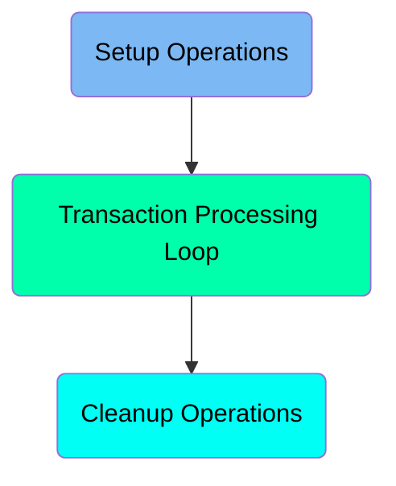
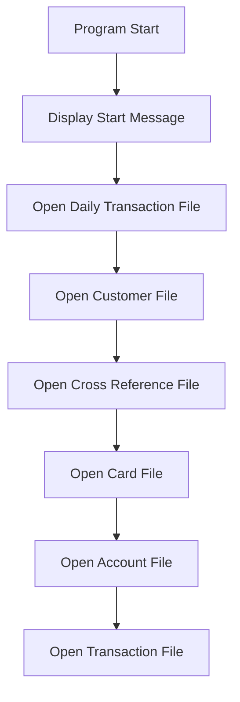
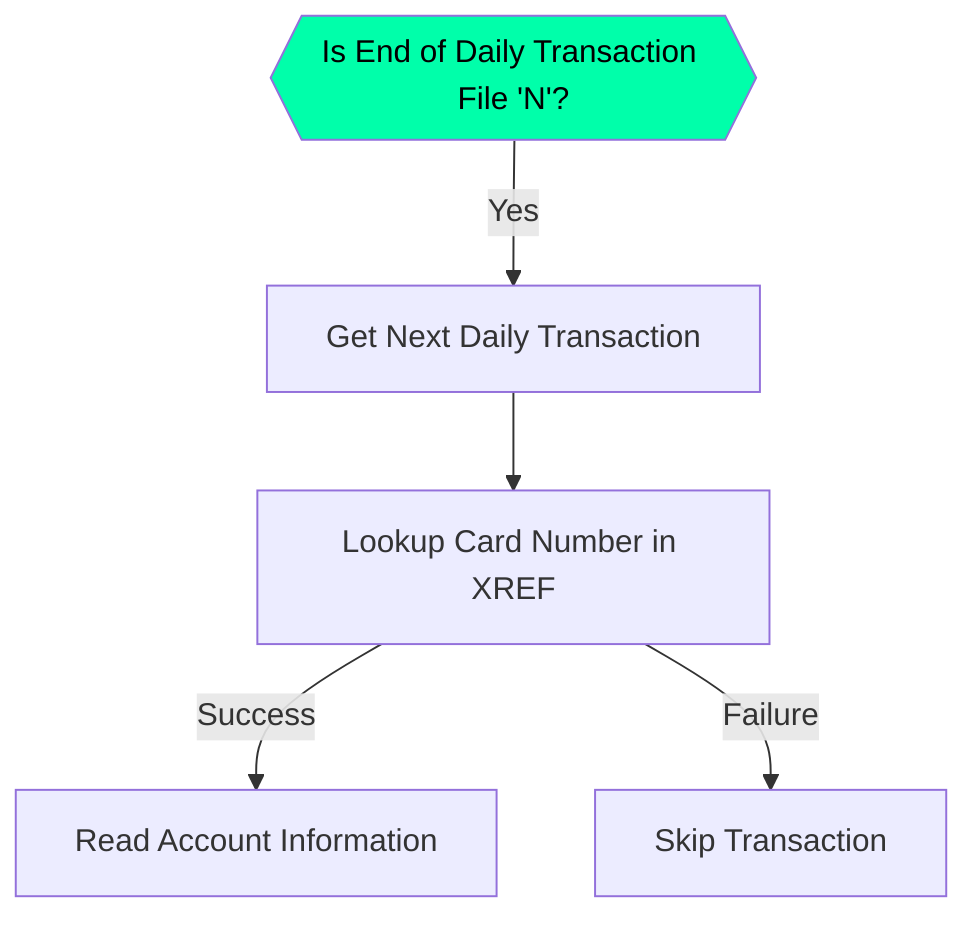
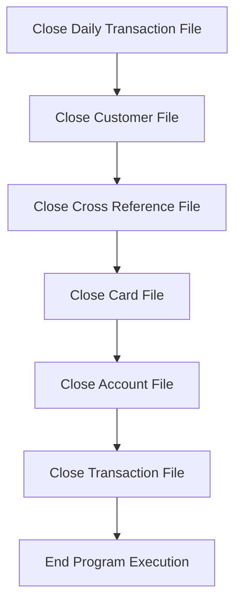

The <SwmToken path="app/cbl/CBTRN01C.cbl" pos="156:14:14" line-data="           DISPLAY &#39;START OF EXECUTION OF PROGRAM CBTRN01C&#39;.">`CBTRN01C`</SwmToken> program is responsible for processing daily transactions in a mainframe environment. It achieves this by opening necessary files, processing each transaction, and then closing the files. The program starts by displaying a start message, opens various files such as the daily transaction file, customer file, cross-reference file, card file, account file, and transaction file. It then enters a loop to process each transaction, performs necessary lookups and validations, and finally closes all the files and ends the program execution.

The <SwmToken path="app/cbl/CBTRN01C.cbl" pos="156:14:14" line-data="           DISPLAY &#39;START OF EXECUTION OF PROGRAM CBTRN01C&#39;.">`CBTRN01C`</SwmToken> program starts by displaying a start message and opening several files needed for transaction processing. It then enters a loop where it processes each transaction by reading the daily transaction file, performing lookups in the cross-reference file, and validating account information. If any errors occur, it skips the transaction and displays an error message. After processing all transactions, the program closes all the opened files and displays an end message before terminating.

Here is a high level diagram of the program:



# Setup Operations



<SwmSnippet path="/app/cbl/CBTRN01C.cbl" line="155">

---

## Display Start Message

First, the program displays a message indicating the start of execution. This helps in tracking the program's execution flow.

```cobol
       MAIN-PARA.
           DISPLAY 'START OF EXECUTION OF PROGRAM CBTRN01C'.
```

---

</SwmSnippet>

<SwmSnippet path="/app/cbl/CBTRN01C.cbl" line="157">

---

## Open Daily Transaction File

Next, the program performs the <SwmToken path="app/cbl/CBTRN01C.cbl" pos="157:3:7" line-data="           PERFORM 0000-DALYTRAN-OPEN.">`0000-DALYTRAN-OPEN`</SwmToken> paragraph to open the daily transaction file. This step is crucial for accessing daily transaction data.

```cobol
           PERFORM 0000-DALYTRAN-OPEN.
```

---

</SwmSnippet>

<SwmSnippet path="/app/cbl/CBTRN01C.cbl" line="158">

---

## Open Customer File

Moving to the next step, the program performs the <SwmToken path="app/cbl/CBTRN01C.cbl" pos="158:3:7" line-data="           PERFORM 0100-CUSTFILE-OPEN.">`0100-CUSTFILE-OPEN`</SwmToken> paragraph to open the customer file. This file contains customer information necessary for transaction processing.

```cobol
           PERFORM 0100-CUSTFILE-OPEN.
```

---

</SwmSnippet>

<SwmSnippet path="/app/cbl/CBTRN01C.cbl" line="159">

---

## Open Cross Reference File

Then, the program performs the <SwmToken path="app/cbl/CBTRN01C.cbl" pos="159:3:7" line-data="           PERFORM 0200-XREFFILE-OPEN.">`0200-XREFFILE-OPEN`</SwmToken> paragraph to open the cross-reference file. This file helps in mapping card numbers to account IDs.

```cobol
           PERFORM 0200-XREFFILE-OPEN.
```

---

</SwmSnippet>

<SwmSnippet path="/app/cbl/CBTRN01C.cbl" line="160">

---

## Open Card File

Next, the program performs the <SwmToken path="app/cbl/CBTRN01C.cbl" pos="160:3:7" line-data="           PERFORM 0300-CARDFILE-OPEN.">`0300-CARDFILE-OPEN`</SwmToken> paragraph to open the card file. This file contains information about the cards used in transactions.

```cobol
           PERFORM 0300-CARDFILE-OPEN.
```

---

</SwmSnippet>

<SwmSnippet path="/app/cbl/CBTRN01C.cbl" line="161">

---

## Open Account File

Following that, the program performs the <SwmToken path="app/cbl/CBTRN01C.cbl" pos="161:3:7" line-data="           PERFORM 0400-ACCTFILE-OPEN.">`0400-ACCTFILE-OPEN`</SwmToken> paragraph to open the account file. This file holds account details necessary for validating transactions.

```cobol
           PERFORM 0400-ACCTFILE-OPEN.
```

---

</SwmSnippet>

<SwmSnippet path="/app/cbl/CBTRN01C.cbl" line="162">

---

## Open Transaction File

Finally, the program performs the <SwmToken path="app/cbl/CBTRN01C.cbl" pos="162:3:7" line-data="           PERFORM 0500-TRANFILE-OPEN.">`0500-TRANFILE-OPEN`</SwmToken> paragraph to open the transaction file. This file contains the transaction records that need to be processed.

```cobol
           PERFORM 0500-TRANFILE-OPEN.
```

---

</SwmSnippet>

# Transaction Processing Loop



<SwmSnippet path="/app/cbl/CBTRN01C.cbl" line="165">

---

## Checking End of Daily Transaction File

First, the code checks if the <SwmToken path="app/cbl/CBTRN01C.cbl" pos="165:3:11" line-data="               IF  END-OF-DAILY-TRANS-FILE = &#39;N&#39;">`END-OF-DAILY-TRANS-FILE`</SwmToken> is 'N'. This indicates whether there are more transactions to process.

```cobol
               IF  END-OF-DAILY-TRANS-FILE = 'N'
```

---

</SwmSnippet>

<SwmSnippet path="/app/cbl/CBTRN01C.cbl" line="166">

---

## Getting Next Daily Transaction

If there are more transactions, the code performs <SwmToken path="app/cbl/CBTRN01C.cbl" pos="166:3:9" line-data="                   PERFORM 1000-DALYTRAN-GET-NEXT">`1000-DALYTRAN-GET-NEXT`</SwmToken> to read the next transaction record.

```cobol
                   PERFORM 1000-DALYTRAN-GET-NEXT
```

---

</SwmSnippet>

<SwmSnippet path="/app/cbl/CBTRN01C.cbl" line="202">

---

### <SwmToken path="app/cbl/CBTRN01C.cbl" pos="202:1:7" line-data="       1000-DALYTRAN-GET-NEXT.">`1000-DALYTRAN-GET-NEXT`</SwmToken>

The <SwmToken path="app/cbl/CBTRN01C.cbl" pos="202:1:7" line-data="       1000-DALYTRAN-GET-NEXT.">`1000-DALYTRAN-GET-NEXT`</SwmToken> function reads the next record from the daily transaction file and updates the <SwmToken path="app/cbl/CBTRN01C.cbl" pos="217:9:17" line-data="                   MOVE &#39;Y&#39; TO END-OF-DAILY-TRANS-FILE">`END-OF-DAILY-TRANS-FILE`</SwmToken> flag if the end of the file is reached.

```cobol
       1000-DALYTRAN-GET-NEXT.
           READ DALYTRAN-FILE INTO DALYTRAN-RECORD.
           IF  DALYTRAN-STATUS = '00'
               MOVE 0 TO APPL-RESULT
           ELSE
               IF  DALYTRAN-STATUS = '10'
                   MOVE 16 TO APPL-RESULT
               ELSE
                   MOVE 12 TO APPL-RESULT
               END-IF
           END-IF
           IF  APPL-AOK
               CONTINUE
           ELSE
               IF  APPL-EOF
                   MOVE 'Y' TO END-OF-DAILY-TRANS-FILE
               ELSE
                   DISPLAY 'ERROR READING DAILY TRANSACTION FILE'
                   MOVE DALYTRAN-STATUS TO IO-STATUS
                   PERFORM Z-DISPLAY-IO-STATUS
                   PERFORM Z-ABEND-PROGRAM
```

---

</SwmSnippet>

<SwmSnippet path="/app/cbl/CBTRN01C.cbl" line="167">

---

## Displaying Transaction Record

Next, if there are still more transactions, the code displays the current transaction record.

```cobol
                   IF  END-OF-DAILY-TRANS-FILE = 'N'
                       DISPLAY DALYTRAN-RECORD
                   END-IF
```

---

</SwmSnippet>

<SwmSnippet path="/app/cbl/CBTRN01C.cbl" line="170">

---

## Preparing for XREF Lookup

The code then prepares for the XREF lookup by resetting the <SwmToken path="app/cbl/CBTRN01C.cbl" pos="170:7:13" line-data="                   MOVE 0                 TO WS-XREF-READ-STATUS">`WS-XREF-READ-STATUS`</SwmToken> and moving the card number from the transaction record to the XREF lookup field.

```cobol
                   MOVE 0                 TO WS-XREF-READ-STATUS
                   MOVE DALYTRAN-CARD-NUM TO XREF-CARD-NUM
```

---

</SwmSnippet>

<SwmSnippet path="/app/cbl/CBTRN01C.cbl" line="172">

---

## Looking Up Card Number in XREF

The code performs <SwmToken path="app/cbl/CBTRN01C.cbl" pos="172:3:7" line-data="                   PERFORM 2000-LOOKUP-XREF">`2000-LOOKUP-XREF`</SwmToken> to verify the card number against the XREF file.

```cobol
                   PERFORM 2000-LOOKUP-XREF
```

---

</SwmSnippet>

<SwmSnippet path="/app/cbl/CBTRN01C.cbl" line="227">

---

### <SwmToken path="app/cbl/CBTRN01C.cbl" pos="227:1:5" line-data="       2000-LOOKUP-XREF.">`2000-LOOKUP-XREF`</SwmToken>

The <SwmToken path="app/cbl/CBTRN01C.cbl" pos="227:1:5" line-data="       2000-LOOKUP-XREF.">`2000-LOOKUP-XREF`</SwmToken> function reads the XREF file to verify the card number. If the card number is valid, it retrieves the associated account ID.

```cobol
       2000-LOOKUP-XREF.
           MOVE XREF-CARD-NUM TO FD-XREF-CARD-NUM
           READ XREF-FILE  RECORD INTO CARD-XREF-RECORD
           KEY IS FD-XREF-CARD-NUM
                INVALID KEY
                  DISPLAY 'INVALID CARD NUMBER FOR XREF'
                  MOVE 4 TO WS-XREF-READ-STATUS
                NOT INVALID KEY
                  DISPLAY 'SUCCESSFUL READ OF XREF'
                  DISPLAY 'CARD NUMBER: ' XREF-CARD-NUM
                  DISPLAY 'ACCOUNT ID : ' XREF-ACCT-ID
                  DISPLAY 'CUSTOMER ID: ' XREF-CUST-ID
           END-READ.
```

---

</SwmSnippet>

<SwmSnippet path="/app/cbl/CBTRN01C.cbl" line="173">

---

## Handling XREF Lookup Result

If the XREF lookup is successful, the code proceeds to read the account information. If the lookup fails, it skips the transaction and displays an error message.

```cobol
                   IF WS-XREF-READ-STATUS = 0
                     MOVE 0            TO WS-ACCT-READ-STATUS
                     MOVE XREF-ACCT-ID TO ACCT-ID
                     PERFORM 3000-READ-ACCOUNT
                     IF WS-ACCT-READ-STATUS NOT = 0
                         DISPLAY 'ACCOUNT ' ACCT-ID ' NOT FOUND'
                     END-IF
                   ELSE
                     DISPLAY 'CARD NUMBER ' DALYTRAN-CARD-NUM
                     ' COULD NOT BE VERIFIED. SKIPPING TRANSACTION ID-'
                     DALYTRAN-ID
                   END-IF
```

---

</SwmSnippet>

<SwmSnippet path="/app/cbl/CBTRN01C.cbl" line="175">

---

## Reading Account Information

If the XREF lookup is successful, the code moves the account ID to the appropriate field and performs <SwmToken path="app/cbl/CBTRN01C.cbl" pos="176:3:7" line-data="                     PERFORM 3000-READ-ACCOUNT">`3000-READ-ACCOUNT`</SwmToken> to retrieve the account information.

```cobol
                     MOVE XREF-ACCT-ID TO ACCT-ID
                     PERFORM 3000-READ-ACCOUNT
```

---

</SwmSnippet>

<SwmSnippet path="/app/cbl/CBTRN01C.cbl" line="177">

---

## Handling Account Read Result

If the account read is unsuccessful, the code displays an error message indicating that the account was not found.

```cobol
                     IF WS-ACCT-READ-STATUS NOT = 0
                         DISPLAY 'ACCOUNT ' ACCT-ID ' NOT FOUND'
                     END-IF
```

---

</SwmSnippet>

<SwmSnippet path="/app/cbl/CBTRN01C.cbl" line="180">

---

## Skipping Transaction

If the XREF lookup fails, the code displays an error message indicating that the card number could not be verified and skips the transaction.

```cobol
                   ELSE
                     DISPLAY 'CARD NUMBER ' DALYTRAN-CARD-NUM
                     ' COULD NOT BE VERIFIED. SKIPPING TRANSACTION ID-'
                     DALYTRAN-ID
                   END-IF
```

---

</SwmSnippet>

## Interim Summary

So far, we saw how the program opens various files such as the daily transaction file, customer file, cross-reference file, card file, account file, and transaction file, and processes transactions by checking the end of the daily transaction file, getting the next daily transaction, displaying the transaction record, preparing for XREF lookup, looking up the card number in XREF, handling the XREF lookup result, reading account information, and handling the account read result. Now, we will focus on the cleanup operations, where the program closes all the opened files and ends the program execution.

# Cleanup Operations



<SwmSnippet path="/app/cbl/CBTRN01C.cbl" line="188">

---

## Closing Daily Transaction File

First, the daily transaction file is closed to ensure that all transactions are properly finalized and no further operations can be performed on this file.

```cobol
           PERFORM 9000-DALYTRAN-CLOSE.
```

---

</SwmSnippet>

<SwmSnippet path="/app/cbl/CBTRN01C.cbl" line="189">

---

## Closing Customer File

Next, the customer file is closed. This step ensures that all customer-related data is securely saved and the file is no longer accessible for operations.

```cobol
           PERFORM 9100-CUSTFILE-CLOSE.
```

---

</SwmSnippet>

<SwmSnippet path="/app/cbl/CBTRN01C.cbl" line="379">

---

### <SwmToken path="app/cbl/CBTRN01C.cbl" pos="379:1:5" line-data="       9100-CUSTFILE-CLOSE.">`9100-CUSTFILE-CLOSE`</SwmToken>

The <SwmToken path="app/cbl/CBTRN01C.cbl" pos="379:1:5" line-data="       9100-CUSTFILE-CLOSE.">`9100-CUSTFILE-CLOSE`</SwmToken> function handles the actual closing of the customer file. It checks the status of the file and updates the application result accordingly. If there is an error, it displays an error message and performs necessary error handling.

```cobol
       9100-CUSTFILE-CLOSE.
           ADD 8 TO ZERO GIVING APPL-RESULT.
           CLOSE CUSTOMER-FILE
           IF  CUSTFILE-STATUS = '00'
               MOVE 0 TO APPL-RESULT
           ELSE
               MOVE 12 TO APPL-RESULT
           END-IF
           IF  APPL-AOK
               CONTINUE
           ELSE
               DISPLAY 'ERROR CLOSING CUSTOMER FILE'
               MOVE CUSTFILE-STATUS TO IO-STATUS
               PERFORM Z-DISPLAY-IO-STATUS
               PERFORM Z-ABEND-PROGRAM
           END-IF
           EXIT.
```

---

</SwmSnippet>

<SwmSnippet path="/app/cbl/CBTRN01C.cbl" line="190">

---

## Closing Cross Reference File

Then, the cross-reference file is closed to ensure that all cross-referenced data is properly saved and the file is no longer accessible for operations.

```cobol
           PERFORM 9200-XREFFILE-CLOSE.
```

---

</SwmSnippet>

<SwmSnippet path="/app/cbl/CBTRN01C.cbl" line="397">

---

### <SwmToken path="app/cbl/CBTRN01C.cbl" pos="397:1:5" line-data="       9200-XREFFILE-CLOSE.">`9200-XREFFILE-CLOSE`</SwmToken>

The <SwmToken path="app/cbl/CBTRN01C.cbl" pos="397:1:5" line-data="       9200-XREFFILE-CLOSE.">`9200-XREFFILE-CLOSE`</SwmToken> function handles the actual closing of the cross-reference file. It checks the status of the file and updates the application result accordingly. If there is an error, it displays an error message and performs necessary error handling.

```cobol
       9200-XREFFILE-CLOSE.
           ADD 8 TO ZERO GIVING APPL-RESULT.
           CLOSE XREF-FILE
           IF  XREFFILE-STATUS = '00'
               MOVE 0 TO APPL-RESULT
           ELSE
               MOVE 12 TO APPL-RESULT
           END-IF
           IF  APPL-AOK
               CONTINUE
           ELSE
               DISPLAY 'ERROR CLOSING CROSS REF FILE'
               MOVE XREFFILE-STATUS TO IO-STATUS
               PERFORM Z-DISPLAY-IO-STATUS
               PERFORM Z-ABEND-PROGRAM
           END-IF
           EXIT.
```

---

</SwmSnippet>

<SwmSnippet path="/app/cbl/CBTRN01C.cbl" line="191">

---

## Closing Card File

Next, the card file is closed. This step ensures that all card-related data is securely saved and the file is no longer accessible for operations.

```cobol
           PERFORM 9300-CARDFILE-CLOSE.
```

---

</SwmSnippet>

<SwmSnippet path="/app/cbl/CBTRN01C.cbl" line="415">

---

### <SwmToken path="app/cbl/CBTRN01C.cbl" pos="415:1:5" line-data="       9300-CARDFILE-CLOSE.">`9300-CARDFILE-CLOSE`</SwmToken>

The <SwmToken path="app/cbl/CBTRN01C.cbl" pos="415:1:5" line-data="       9300-CARDFILE-CLOSE.">`9300-CARDFILE-CLOSE`</SwmToken> function handles the actual closing of the card file. It checks the status of the file and updates the application result accordingly. If there is an error, it displays an error message and performs necessary error handling.

```cobol
       9300-CARDFILE-CLOSE.
           ADD 8 TO ZERO GIVING APPL-RESULT.
           CLOSE CARD-FILE
           IF  CARDFILE-STATUS = '00'
               MOVE 0 TO APPL-RESULT
           ELSE
               MOVE 12 TO APPL-RESULT
           END-IF
           IF  APPL-AOK
               CONTINUE
           ELSE
               DISPLAY 'ERROR CLOSING CARD FILE'
               MOVE CARDFILE-STATUS TO IO-STATUS
               PERFORM Z-DISPLAY-IO-STATUS
               PERFORM Z-ABEND-PROGRAM
           END-IF
           EXIT.
```

---

</SwmSnippet>

<SwmSnippet path="/app/cbl/CBTRN01C.cbl" line="192">

---

## Closing Account File

Then, the account file is closed to ensure that all account-related data is properly saved and the file is no longer accessible for operations.

```cobol
           PERFORM 9400-ACCTFILE-CLOSE.
```

---

</SwmSnippet>

<SwmSnippet path="/app/cbl/CBTRN01C.cbl" line="433">

---

### <SwmToken path="app/cbl/CBTRN01C.cbl" pos="433:1:5" line-data="       9400-ACCTFILE-CLOSE.">`9400-ACCTFILE-CLOSE`</SwmToken>

The <SwmToken path="app/cbl/CBTRN01C.cbl" pos="433:1:5" line-data="       9400-ACCTFILE-CLOSE.">`9400-ACCTFILE-CLOSE`</SwmToken> function handles the actual closing of the account file. It checks the status of the file and updates the application result accordingly. If there is an error, it displays an error message and performs necessary error handling.

```cobol
       9400-ACCTFILE-CLOSE.
           ADD 8 TO ZERO GIVING APPL-RESULT.
           CLOSE ACCOUNT-FILE
           IF  ACCTFILE-STATUS = '00'
               MOVE 0 TO APPL-RESULT
           ELSE
               MOVE 12 TO APPL-RESULT
           END-IF
           IF  APPL-AOK
               CONTINUE
           ELSE
               DISPLAY 'ERROR CLOSING ACCOUNT FILE'
               MOVE ACCTFILE-STATUS TO IO-STATUS
               PERFORM Z-DISPLAY-IO-STATUS
               PERFORM Z-ABEND-PROGRAM
           END-IF
           EXIT.
```

---

</SwmSnippet>

<SwmSnippet path="/app/cbl/CBTRN01C.cbl" line="193">

---

## Closing Transaction File

Finally, the transaction file is closed to ensure that all transaction-related data is properly saved and the file is no longer accessible for operations.

```cobol
           PERFORM 9500-TRANFILE-CLOSE.
```

---

</SwmSnippet>

<SwmSnippet path="/app/cbl/CBTRN01C.cbl" line="451">

---

### <SwmToken path="app/cbl/CBTRN01C.cbl" pos="451:1:5" line-data="       9500-TRANFILE-CLOSE.">`9500-TRANFILE-CLOSE`</SwmToken>

The <SwmToken path="app/cbl/CBTRN01C.cbl" pos="451:1:5" line-data="       9500-TRANFILE-CLOSE.">`9500-TRANFILE-CLOSE`</SwmToken> function handles the actual closing of the transaction file. It checks the status of the file and updates the application result accordingly. If there is an error, it displays an error message and performs necessary error handling.

```cobol
       9500-TRANFILE-CLOSE.
           ADD 8 TO ZERO GIVING APPL-RESULT.
           CLOSE TRANSACT-FILE
           IF  TRANFILE-STATUS = '00'
               MOVE 0 TO APPL-RESULT
           ELSE
               MOVE 12 TO APPL-RESULT
           END-IF
           IF  APPL-AOK
               CONTINUE
           ELSE
               DISPLAY 'ERROR CLOSING TRANSACTION FILE'
               MOVE TRANFILE-STATUS TO IO-STATUS
               PERFORM Z-DISPLAY-IO-STATUS
               PERFORM Z-ABEND-PROGRAM
           END-IF
           EXIT.
```

---

</SwmSnippet>

<SwmSnippet path="/app/cbl/CBTRN01C.cbl" line="195">

---

## End Program Execution

After all files are closed, a message indicating the end of the program execution is displayed, and the program terminates.

```cobol
           DISPLAY 'END OF EXECUTION OF PROGRAM CBTRN01C'.

           GOBACK.
```

---

</SwmSnippet>

&nbsp;

*This is an auto-generated document by Swimm 🌊 and has not yet been verified by a human*

<SwmMeta version="3.0.0" repo-id="Z2l0aHViJTNBJTNBa3luZHJ5bC1hd3MtbWFpbmZyYW1lLW1vZGVybml6YXRpb24tY2FyZGRlbW8lM0ElM0FTd2ltbS1EZW1v" repo-name="kyndryl-aws-mainframe-modernization-carddemo"><sup>Powered by [Swimm](/)</sup></SwmMeta>
