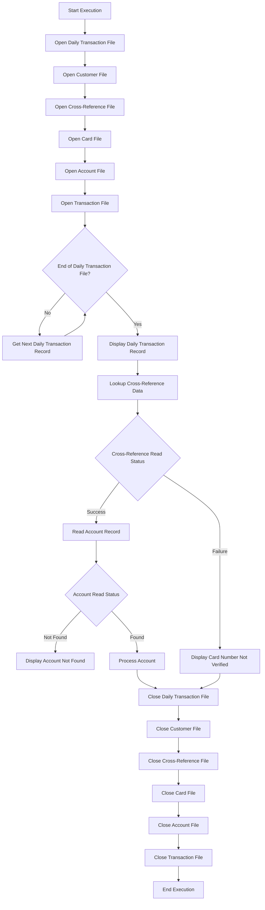
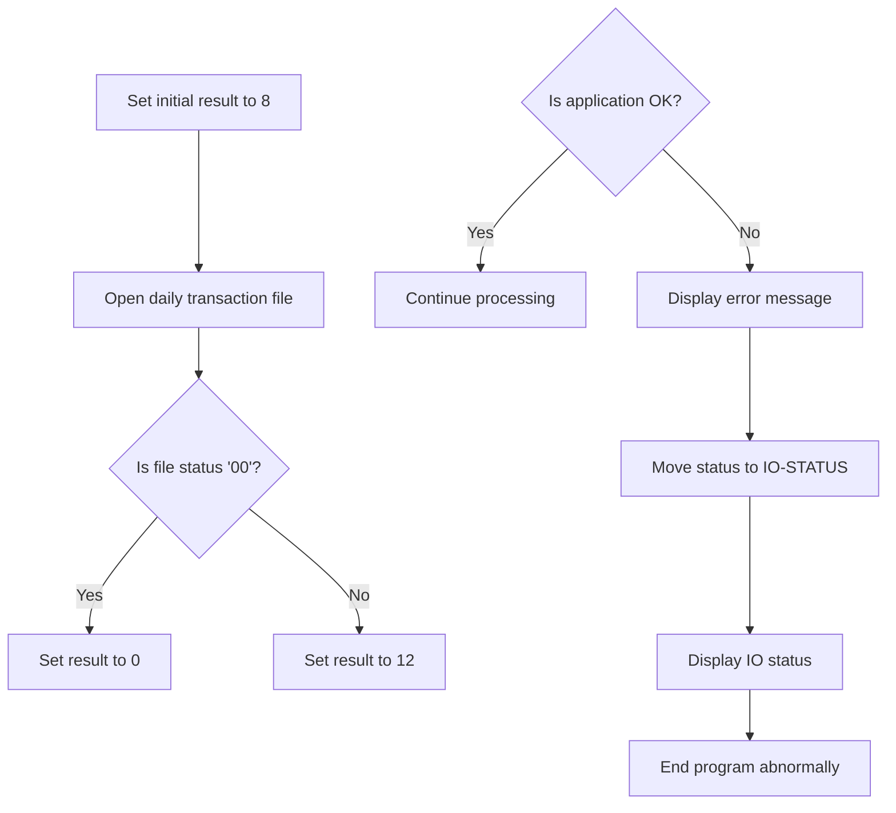
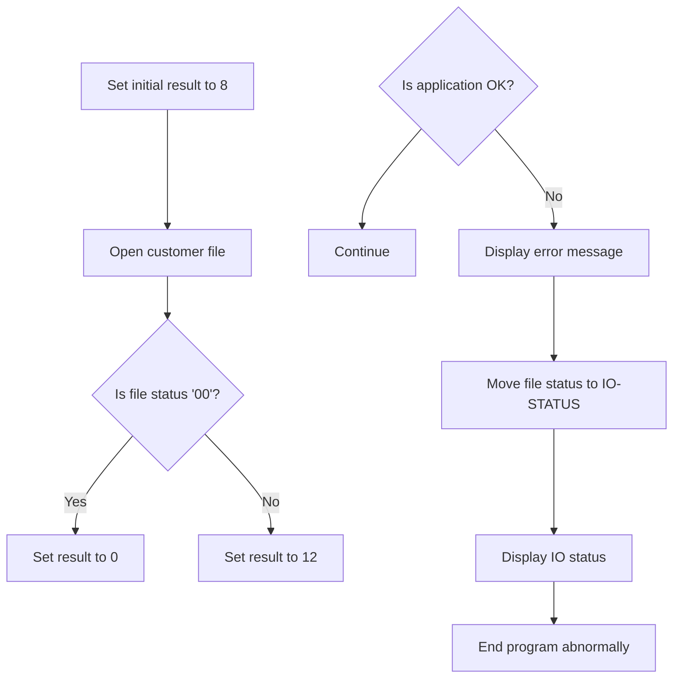
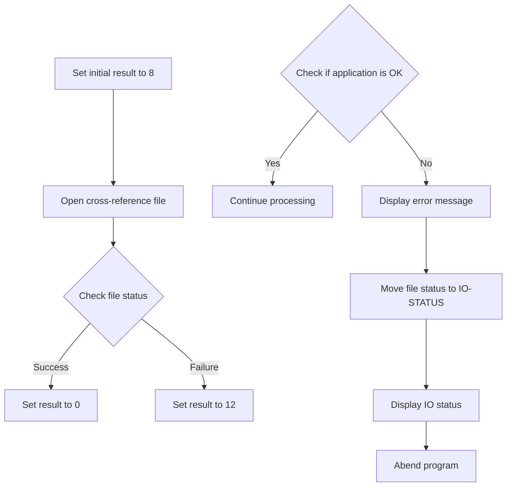

This document describes the process of posting records from the daily transaction file using the <SwmToken path="app/cbl/CBTRN01C.cbl" pos="156:14:14" line-data="           DISPLAY &#39;START OF EXECUTION OF PROGRAM CBTRN01C&#39;.">`CBTRN01C`</SwmToken> batch COBOL program. The program is designed to handle the daily transactions by opening necessary files, processing each transaction, and then closing the files. The input for this flow is the daily transaction file, and the output includes processed transaction records and status messages.

For instance, if a transaction record is successfully processed, the program will display the transaction details and update the corresponding account. If a transaction cannot be verified, an error message will be displayed, and the transaction will be skipped.

# Process transactions (<SwmToken path="app/cbl/CBTRN01C.cbl" pos="155:1:3" line-data="       MAIN-PARA.">`MAIN-PARA`</SwmToken>)

Lets' zoom into the program flow:



<SwmSnippet path="/app/cbl/CBTRN01C.cbl" line="155">

---

### Opening necessary files

Going into the <SwmToken path="app/cbl/CBTRN01C.cbl" pos="155:1:3" line-data="       MAIN-PARA.">`MAIN-PARA`</SwmToken> function, the initial steps involve opening several necessary files. The function opens the daily transaction file, customer file, cross-reference file, card file, account file, and transaction file. These files are essential for processing the daily transaction records.

```cobol
       MAIN-PARA.
           DISPLAY 'START OF EXECUTION OF PROGRAM CBTRN01C'.
           PERFORM 0000-DALYTRAN-OPEN.
           PERFORM 0100-CUSTFILE-OPEN.
           PERFORM 0200-XREFFILE-OPEN.
           PERFORM 0300-CARDFILE-OPEN.
           PERFORM 0400-ACCTFILE-OPEN.
           PERFORM 0500-TRANFILE-OPEN.
```

---

</SwmSnippet>

<SwmSnippet path="/app/cbl/CBTRN01C.cbl" line="164">

---

### Processing daily transaction records

Next, the function processes the daily transaction records until the end of the file is reached. It checks if there are more transactions to process and retrieves the next transaction record if available.

```cobol
           PERFORM UNTIL END-OF-DAILY-TRANS-FILE = 'Y'
               IF  END-OF-DAILY-TRANS-FILE = 'N'
                   PERFORM 1000-DALYTRAN-GET-NEXT
```

---

</SwmSnippet>

<SwmSnippet path="/app/cbl/CBTRN01C.cbl" line="167">

---

### Displaying transaction records

Then, if there are more transactions to process, the function displays the current transaction record. This helps in tracking and monitoring the transactions being processed.

```cobol
                   IF  END-OF-DAILY-TRANS-FILE = 'N'
                       DISPLAY DALYTRAN-RECORD
                   END-IF
```

---

</SwmSnippet>

<SwmSnippet path="/app/cbl/CBTRN01C.cbl" line="170">

---

### Looking up cross-reference data

Next, the function prepares to look up cross-reference data by setting the read status and moving the card number to the appropriate field. It then performs the lookup operation to retrieve the cross-reference data.

```cobol
                   MOVE 0                 TO WS-XREF-READ-STATUS
                   MOVE DALYTRAN-CARD-NUM TO XREF-CARD-NUM
                   PERFORM 2000-LOOKUP-XREF
```

---

</SwmSnippet>

<SwmSnippet path="/app/cbl/CBTRN01C.cbl" line="173">

---

### Reading account records

If the cross-reference data is successfully retrieved, the function proceeds to read the account record associated with the transaction. It checks the read status and displays an error message if the account is not found. If the cross-reference data is not verified, it skips the transaction and displays a message indicating the issue.

```cobol
                   IF WS-XREF-READ-STATUS = 0
                     MOVE 0            TO WS-ACCT-READ-STATUS
                     MOVE XREF-ACCT-ID TO ACCT-ID
                     PERFORM 3000-READ-ACCOUNT
                     IF WS-ACCT-READ-STATUS NOT = 0
                         DISPLAY 'ACCOUNT ' ACCT-ID ' NOT FOUND'
                     END-IF
                   ELSE
                     DISPLAY 'CARD NUMBER ' DALYTRAN-CARD-NUM
                     ' COULD NOT BE VERIFIED. SKIPPING TRANSACTION ID-'
                     DALYTRAN-ID
                   END-IF
```

---

</SwmSnippet>

<SwmSnippet path="/app/cbl/CBTRN01C.cbl" line="188">

---

### Closing files

Finally, the function closes all the files that were opened at the beginning. This includes the daily transaction file, customer file, cross-reference file, card file, account file, and transaction file. The function then displays a message indicating the end of execution and terminates.

```cobol
           PERFORM 9000-DALYTRAN-CLOSE.
           PERFORM 9100-CUSTFILE-CLOSE.
           PERFORM 9200-XREFFILE-CLOSE.
           PERFORM 9300-CARDFILE-CLOSE.
           PERFORM 9400-ACCTFILE-CLOSE.
           PERFORM 9500-TRANFILE-CLOSE.

           DISPLAY 'END OF EXECUTION OF PROGRAM CBTRN01C'.

           GOBACK.
```

---

</SwmSnippet>

# Open Daily Transaction File (<SwmToken path="app/cbl/CBTRN01C.cbl" pos="157:3:7" line-data="           PERFORM 0000-DALYTRAN-OPEN.">`0000-DALYTRAN-OPEN`</SwmToken>)

Lets' zoom into the program flow:



<SwmSnippet path="/app/cbl/CBTRN01C.cbl" line="252">

---

### Opening the daily transaction file

Going into the <SwmToken path="app/cbl/CBTRN01C.cbl" pos="252:1:5" line-data="       0000-DALYTRAN-OPEN.">`0000-DALYTRAN-OPEN`</SwmToken> function, the initial step is to set the application result to indicate an initial state. The function then attempts to open the daily transaction file. If the file status indicates a successful operation, the application result is updated to reflect success. Otherwise, it is updated to indicate failure.

```cobol
       0000-DALYTRAN-OPEN.
           MOVE 8 TO APPL-RESULT.
           OPEN INPUT DALYTRAN-FILE
           IF  DALYTRAN-STATUS = '00'
               MOVE 0 TO APPL-RESULT
           ELSE
               MOVE 12 TO APPL-RESULT
           END-IF
```

---

</SwmSnippet>

<SwmSnippet path="/app/cbl/CBTRN01C.cbl" line="260">

---

### Handling the result of opening the file

Next, the function checks if the application is in an OK state. If it is, the function continues processing. If not, it displays an error message indicating that there was an error opening the daily transaction file. It then updates the IO status and ends the program abnormally.

```cobol
           IF  APPL-AOK
               CONTINUE
           ELSE
               DISPLAY 'ERROR OPENING DAILY TRANSACTION FILE'
               MOVE DALYTRAN-STATUS TO IO-STATUS
               PERFORM Z-DISPLAY-IO-STATUS
               PERFORM Z-ABEND-PROGRAM
           END-IF
           EXIT.
```

---

</SwmSnippet>

# Display File Status (<SwmToken path="app/cbl/CBTRN01C.cbl" pos="265:3:9" line-data="               PERFORM Z-DISPLAY-IO-STATUS">`Z-DISPLAY-IO-STATUS`</SwmToken>)

<SwmSnippet path="/app/cbl/CBTRN01C.cbl" line="476">

---

### Displaying File Operation Status

Going into the <SwmToken path="app/cbl/CBTRN01C.cbl" pos="476:1:7" line-data="       Z-DISPLAY-IO-STATUS.">`Z-DISPLAY-IO-STATUS`</SwmToken> function, it checks if the file operation status is valid or if there is a critical error. If there is an error, it formats the status message accordingly and displays it. If the operation was successful, it sets the status message to indicate success and displays it.

```cobol
       Z-DISPLAY-IO-STATUS.
           IF  IO-STATUS NOT NUMERIC
           OR  IO-STAT1 = '9'
               MOVE IO-STAT1 TO IO-STATUS-04(1:1)
               MOVE 0        TO TWO-BYTES-BINARY
               MOVE IO-STAT2 TO TWO-BYTES-RIGHT
               MOVE TWO-BYTES-BINARY TO IO-STATUS-0403
               DISPLAY 'FILE STATUS IS: NNNN' IO-STATUS-04
           ELSE
               MOVE '0000' TO IO-STATUS-04
               MOVE IO-STATUS TO IO-STATUS-04(3:2)
               DISPLAY 'FILE STATUS IS: NNNN' IO-STATUS-04
           END-IF
           EXIT.
```

---

</SwmSnippet>

# Open Customer File (<SwmToken path="app/cbl/CBTRN01C.cbl" pos="158:3:7" line-data="           PERFORM 0100-CUSTFILE-OPEN.">`0100-CUSTFILE-OPEN`</SwmToken>)

Lets' zoom into the program flow:



<SwmSnippet path="/app/cbl/CBTRN01C.cbl" line="271">

---

### Opening the customer file

Going into the <SwmToken path="app/cbl/CBTRN01C.cbl" pos="271:1:5" line-data="       0100-CUSTFILE-OPEN.">`0100-CUSTFILE-OPEN`</SwmToken> function, the initial step is to set the result to indicate an initial state. The customer file is then opened. If the file status indicates a successful operation, the result is updated to reflect success. Otherwise, the result is updated to indicate failure.

```cobol
       0100-CUSTFILE-OPEN.
           MOVE 8 TO APPL-RESULT.
           OPEN INPUT CUSTOMER-FILE
           IF  CUSTFILE-STATUS = '00'
               MOVE 0 TO APPL-RESULT
           ELSE
               MOVE 12 TO APPL-RESULT
           END-IF
```

---

</SwmSnippet>

<SwmSnippet path="/app/cbl/CBTRN01C.cbl" line="279">

---

### Handling the result of opening the customer file

Next, the function checks if the application is in an OK state. If it is, the process continues. If not, an error message is displayed, the file status is recorded, and the program displays the IO status and ends abnormally.

```cobol
           IF  APPL-AOK
               CONTINUE
           ELSE
               DISPLAY 'ERROR OPENING CUSTOMER FILE'
               MOVE CUSTFILE-STATUS TO IO-STATUS
               PERFORM Z-DISPLAY-IO-STATUS
               PERFORM Z-ABEND-PROGRAM
           END-IF
           EXIT.
```

---

</SwmSnippet>

# Open Cross Reference File (<SwmToken path="app/cbl/CBTRN01C.cbl" pos="159:3:7" line-data="           PERFORM 0200-XREFFILE-OPEN.">`0200-XREFFILE-OPEN`</SwmToken>)

Lets' zoom into the program flow:



<SwmSnippet path="/app/cbl/CBTRN01C.cbl" line="289">

---

### Setting initial result and opening the cross-reference file

Going into the first part of the <SwmToken path="app/cbl/CBTRN01C.cbl" pos="289:1:5" line-data="       0200-XREFFILE-OPEN.">`0200-XREFFILE-OPEN`</SwmToken> function, the initial result is set to indicate a pending state. The function then attempts to open the cross-reference file. If the file opens successfully, the result is updated to indicate success. Otherwise, the result is updated to indicate a failure.

```cobol
       0200-XREFFILE-OPEN.
           MOVE 8 TO APPL-RESULT.
           OPEN INPUT XREF-FILE
           IF  XREFFILE-STATUS = '00'
               MOVE 0 TO APPL-RESULT
           ELSE
               MOVE 12 TO APPL-RESULT
           END-IF
```

---

</SwmSnippet>

<SwmSnippet path="/app/cbl/CBTRN01C.cbl" line="297">

---

### Validating the application state and handling errors

Next, the function checks if the application is in a valid state to proceed. If it is, the processing continues. If not, an error message is displayed, the file status is recorded for further investigation, and the program performs steps to display the IO status and terminate the program abnormally to prevent further issues.

```cobol
           IF  APPL-AOK
               CONTINUE
           ELSE
               DISPLAY 'ERROR OPENING CROSS REF FILE'
               MOVE XREFFILE-STATUS TO IO-STATUS
               PERFORM Z-DISPLAY-IO-STATUS
               PERFORM Z-ABEND-PROGRAM
           END-IF
           EXIT.
```

---

</SwmSnippet>

&nbsp;

*This is an auto-generated document by Swimm 🌊 and has not yet been verified by a human*

<SwmMeta version="3.0.0" repo-id="Z2l0aHViJTNBJTNBa3luZHJ5bC1hd3MtbWFpbmZyYW1lLW1vZGVybml6YXRpb24tY2FyZGRlbW8lM0ElM0FTd2ltbS1EZW1v" repo-name="kyndryl-aws-mainframe-modernization-carddemo"><sup>Powered by [Swimm](/)</sup></SwmMeta>
