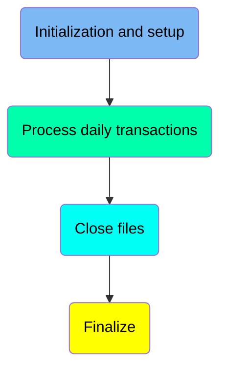
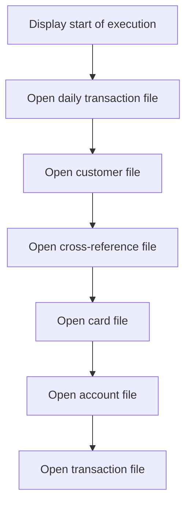
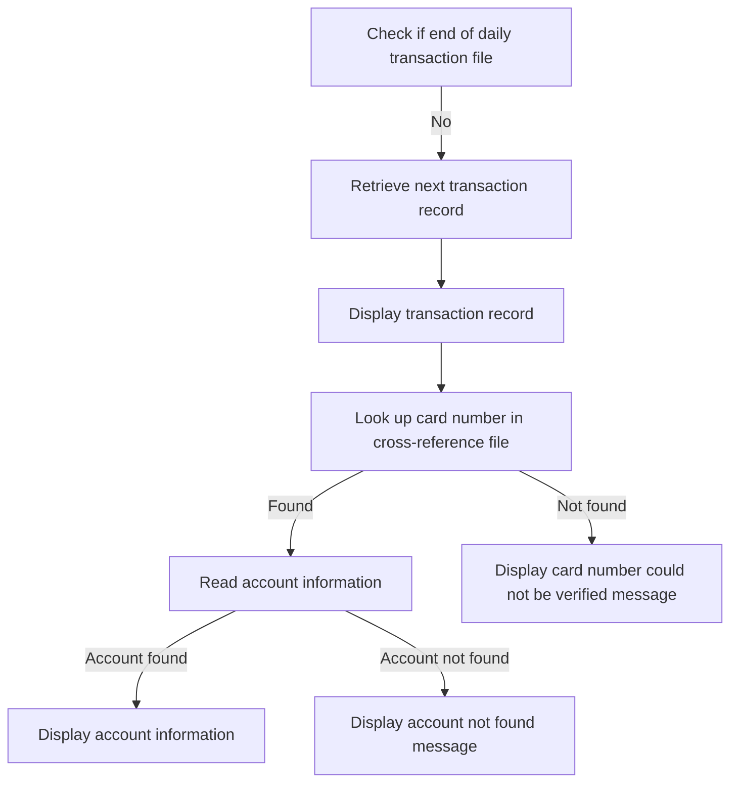
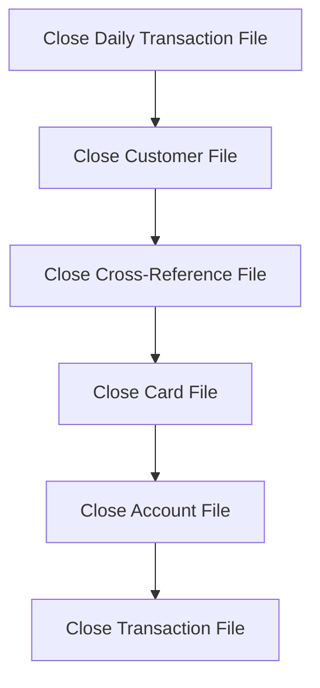
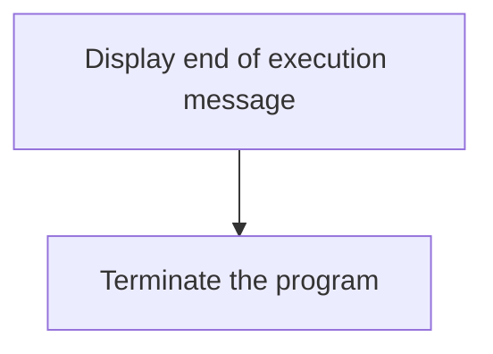

The Posting Daily Transactions (<SwmToken path="app/cbl/CBTRN01C.cbl" pos="195:14:14" line-data="           DISPLAY &#39;END OF EXECUTION OF PROGRAM CBTRN01C&#39;.">`CBTRN01C`</SwmToken>) document describes the role of the <SwmToken path="app/cbl/CBTRN01C.cbl" pos="195:14:14" line-data="           DISPLAY &#39;END OF EXECUTION OF PROGRAM CBTRN01C&#39;.">`CBTRN01C`</SwmToken> program in the <SwmToken path="app/cbl/CBTRN01C.cbl" pos="3:7:7" line-data="      * Application : CardDemo                                          ">`CardDemo`</SwmToken> application. This program is responsible for posting records from the daily transaction file. The process involves initializing and setting up necessary files, processing each transaction, and finally closing the files and finalizing the program execution.

The flow begins with initializing and setting up by opening various files needed for transaction processing. It then processes each transaction by retrieving and validating transaction records. Finally, it closes all the files and finalizes the program execution by displaying a completion message and terminating the program.

Here is a high level diagram of the program:



## Initialization and setup

First, we'll zoom into this section of the flow:



The <SwmToken path="app/cbl/CBTRN01C.cbl" pos="155:1:3" line-data="       MAIN-PARA SECTION.">`MAIN-PARA`</SwmToken> function begins by displaying a message indicating the start of the program execution. This is important for logging and tracking the program's progress.

Next, the function opens the daily transaction file, which is crucial for processing the daily transactions. This step ensures that the file is ready for reading and processing the transaction records.

Following this, the customer file is opened. This file contains customer information that will be used in conjunction with the transaction data to validate and process transactions.

The cross-reference file is then opened. This file helps in linking various pieces of data, such as card numbers to account IDs, which is essential for accurate transaction processing.

Subsequently, the card file is opened. This file contains information about the credit cards, which is necessary for validating and processing transactions involving these cards.

The account file is then opened. This file holds account information, which is used to verify and process transactions against the correct accounts.

## Process daily transactions

Now, lets zoom into this section of the flow:



## Interim Summary

So far, we saw the initialization and setup process, including opening various files necessary for transaction processing. We also explored the steps involved in processing daily transactions, such as retrieving and validating transaction records. Now, we will focus on the final steps of the process, which involve closing all the files that were opened during the transaction processing.

## Close files

Now, lets zoom into this section of the flow:



<SwmSnippet path="/app/cbl/CBTRN01C.cbl" line="188">

---

The function <SwmToken path="app/cbl/CBTRN01C.cbl" pos="155:1:3" line-data="       MAIN-PARA SECTION.">`MAIN-PARA`</SwmToken> ensures that all files used during the processing of daily transactions are properly closed. This includes the daily transaction file, customer file, cross-reference file, card file, account file, and transaction file. Each file is closed sequentially to ensure data integrity and proper resource management. Closing these files is crucial to finalize the transaction processing and to prevent data corruption or loss.

```cobol
           05  CARDFILE-STAT1      PIC X.
           05  CARDFILE-STAT2      PIC X.

      *****************************************************************
      *    Data-structure for  account entity (RECLN 300)
      *****************************************************************
```

---

</SwmSnippet>

## Finalize

This is the next section of the flow.



<SwmSnippet path="/app/cbl/CBTRN01C.cbl" line="195">

---

The program displays a message 'END OF EXECUTION OF PROGRAM <SwmToken path="app/cbl/CBTRN01C.cbl" pos="195:14:14" line-data="           DISPLAY &#39;END OF EXECUTION OF PROGRAM CBTRN01C&#39;.">`CBTRN01C`</SwmToken>' to indicate that the processing of the daily transaction file has been completed. This message serves as a clear indicator to the user or system administrator that the batch processing has finished successfully.

```cobol
           05  ACCT-ID                           PIC 9(11).
```

---

</SwmSnippet>

<SwmSnippet path="/app/cbl/CBTRN01C.cbl" line="197">

---

After displaying the completion message, the program terminates its execution using the <SwmToken path="app/cbl/CBTRN01C.cbl" pos="197:1:1" line-data="           GOBACK.">`GOBACK`</SwmToken> statement. This ensures that all resources are properly released and the program ends gracefully.

```cobol
           05  ACCT-CURR-BAL                     PIC S9(10)V99.
```

---

</SwmSnippet>

&nbsp;

*This is an auto-generated document by Swimm 🌊 and has not yet been verified by a human*

<SwmMeta version="3.0.0" repo-id="Z2l0aHViJTNBJTNBa3luZHJ5bC1hd3MtbWFpbmZyYW1lLW1vZGVybml6YXRpb24tY2FyZGRlbW8lM0ElM0FTd2ltbS1EZW1v" repo-name="kyndryl-aws-mainframe-modernization-carddemo"><sup>Powered by [Swimm](/)</sup></SwmMeta>
