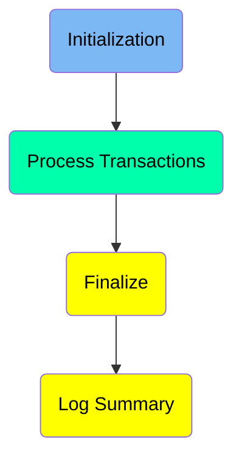
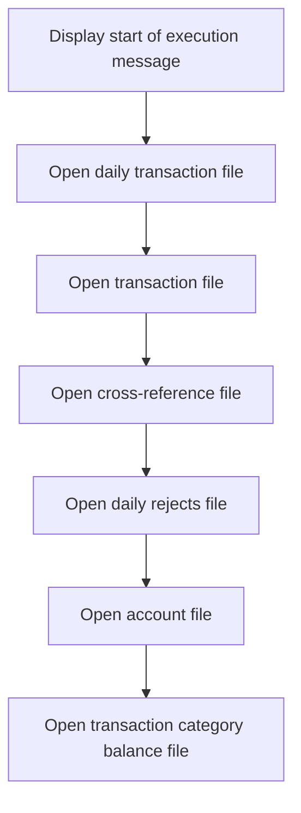
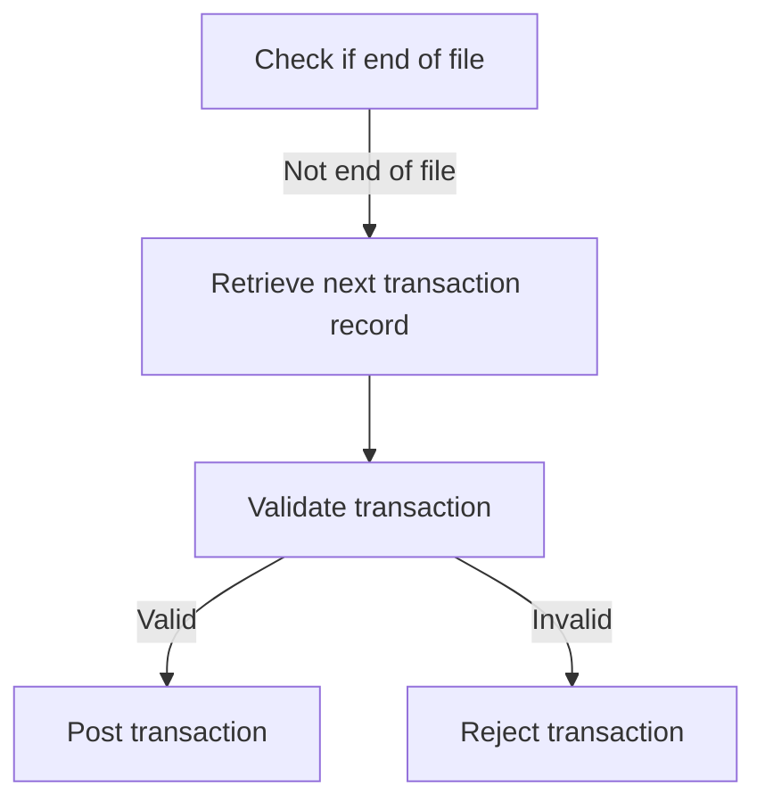
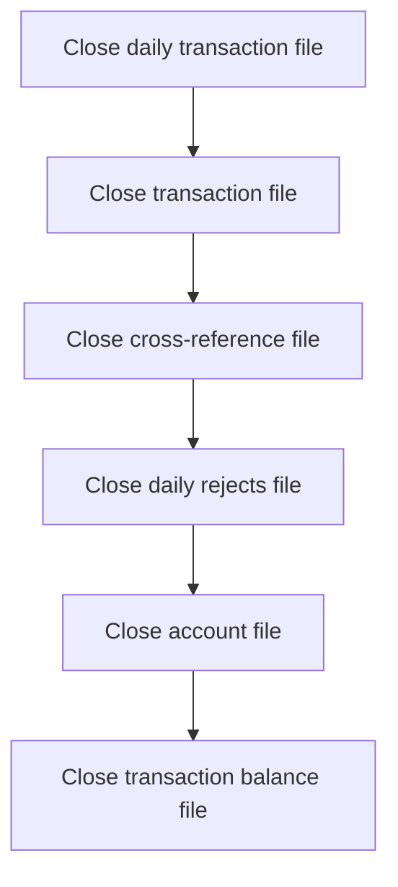
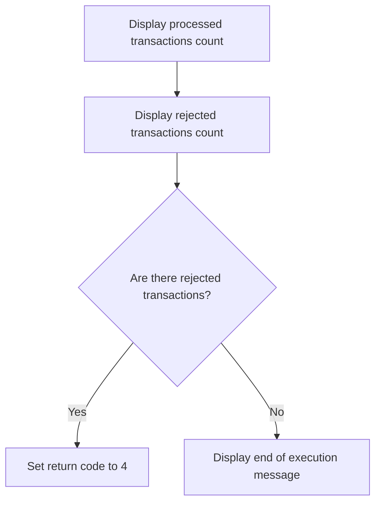

The Posting Daily Transactions (<SwmToken path="app/cbl/CBTRN02C.cbl" pos="195:14:14" line-data="           DISPLAY &#39;START OF EXECUTION OF PROGRAM CBTRN02C&#39;.                    ">`CBTRN02C`</SwmToken>) document describes the process of posting records from the daily transaction file within the <SwmToken path="app/cbl/CBTRN02C.cbl" pos="3:7:7" line-data="      * Application : CardDemo                                          ">`CardDemo`</SwmToken> application. This process is achieved by initializing necessary files, processing each transaction by validating and posting it, and finally finalizing the process by closing the files and logging the summary.

The flow involves initializing files, processing transactions by validating and posting them, and finalizing the process by closing the files and logging the summary.

Here is a high level diagram of the program:



## Initialization

First, we'll zoom into this section of the flow:



<SwmSnippet path="/app/cbl/CBTRN02C.cbl" line="195">

---

### Display start of execution message

The program begins by displaying a message indicating the start of execution. This helps in tracking the program's execution flow and is useful for debugging and logging purposes.

```cobol
           DISPLAY 'START OF EXECUTION OF PROGRAM CBTRN02C'.                    
```

---

</SwmSnippet>

<SwmSnippet path="/app/cbl/CBTRN02C.cbl" line="196">

---

### Open daily transaction file

The program then opens the daily transaction file, which contains records of daily transactions that need to be processed. This file is essential for the subsequent steps as it holds the data that will be validated and posted.

```cobol
           PERFORM 0000-DALYTRAN-OPEN.                                          
```

---

</SwmSnippet>

<SwmSnippet path="/app/cbl/CBTRN02C.cbl" line="197">

---

### Open transaction file

Next, the program opens the transaction file for output. This file will store the processed transaction records, ensuring that all valid transactions are recorded.

```cobol
           PERFORM 0100-TRANFILE-OPEN.                                          
```

---

</SwmSnippet>

<SwmSnippet path="/app/cbl/CBTRN02C.cbl" line="198">

---

### Open cross-reference file

The cross-reference file is then opened in input mode. This file is used to look up additional information related to the transactions, such as account details.

```cobol
           PERFORM 0200-XREFFILE-OPEN.                                          
```

---

</SwmSnippet>

<SwmSnippet path="/app/cbl/CBTRN02C.cbl" line="199">

---

### Open daily rejects file

The program opens the daily rejects file for output. This file will store records of transactions that fail validation, allowing for further analysis and correction.

```cobol
           PERFORM 0300-DALYREJS-OPEN.                                          
```

---

</SwmSnippet>

<SwmSnippet path="/app/cbl/CBTRN02C.cbl" line="200">

---

### Open account file

The account file is opened in input-output mode. This file contains account information that will be updated based on the transactions processed.

```cobol
           PERFORM 0400-ACCTFILE-OPEN.                                          
```

---

</SwmSnippet>

<SwmSnippet path="/app/cbl/CBTRN02C.cbl" line="201">

---

### Open transaction category balance file

Finally, the program opens the transaction category balance file in input-output mode. This file is used to manage and update the balances for different transaction categories.

```cobol
           PERFORM 0500-TCATBALF-OPEN.                                          
```

---

</SwmSnippet>

## Process Transactions

Now, lets zoom into this section of the flow:



<SwmSnippet path="/app/cbl/CBTRN02C.cbl" line="203">

---

First, the program checks if the end of the file has been reached by evaluating the <SwmToken path="app/cbl/CBTRN02C.cbl" pos="203:5:9" line-data="           PERFORM UNTIL END-OF-FILE = &#39;Y&#39;                                      ">`END-OF-FILE`</SwmToken> variable (which indicates whether the end of the file has been reached during file processing). If the end of the file has not been reached, it proceeds to retrieve the next transaction record.

```cobol
           PERFORM UNTIL END-OF-FILE = 'Y'                                      
               IF  END-OF-FILE = 'N'                                            
                   PERFORM 1000-DALYTRAN-GET-NEXT                               
```

---

</SwmSnippet>

<SwmSnippet path="/app/cbl/CBTRN02C.cbl" line="206">

---

Next, the program validates the retrieved transaction. If the transaction is valid, it posts the transaction. If the transaction is invalid, it increments the reject count and writes the transaction to the reject file.

```cobol
                   IF  END-OF-FILE = 'N'                                        
                     ADD 1 TO WS-TRANSACTION-COUNT                              
      *              DISPLAY DALYTRAN-RECORD                                    
                     MOVE 0 TO WS-VALIDATION-FAIL-REASON                        
                     MOVE SPACES TO WS-VALIDATION-FAIL-REASON-DESC              
                     PERFORM 1500-VALIDATE-TRAN                                 
                     IF WS-VALIDATION-FAIL-REASON = 0                           
                       PERFORM 2000-POST-TRANSACTION                            
                     ELSE                                                       
                       ADD 1 TO WS-REJECT-COUNT                                 
                       PERFORM 2500-WRITE-REJECT-REC                            
                     END-IF                                                     
                   END-IF                                                       
               END-IF                                                           
           END-PERFORM.                                                         
```

---

</SwmSnippet>

## Interim Summary

So far, we saw the initialization steps where the program opens various files necessary for processing transactions, including the daily transaction file, transaction file, cross-reference file, daily rejects file, account file, and transaction category balance file. We also explored the process of checking for the end of the file, retrieving the next transaction record, validating transactions, and handling valid and invalid transactions. Now, we will focus on the finalization steps, where the program closes all the files that were opened during the initialization phase.

## Finalize

Now, lets zoom into this section of the flow:



## Log Summary

This is the next section of the flow.



The program displays the count of processed transactions to inform the user about the total number of transactions that were handled.

Next, it displays the count of rejected transactions to indicate how many transactions failed to process.

The program then checks if there are any rejected transactions by evaluating if <SwmToken path="app/cbl/CBTRN02C.cbl" pos="215:7:11" line-data="                       ADD 1 TO WS-REJECT-COUNT                                 ">`WS-REJECT-COUNT`</SwmToken> (which holds the count of rejected transactions) is greater than 0.

If there are rejected transactions, the return code is set to 4 to signal that some transactions were not processed successfully.

&nbsp;

*This is an auto-generated document by Swimm 🌊 and has not yet been verified by a human*

<SwmMeta version="3.0.0" repo-id="Z2l0aHViJTNBJTNBa3luZHJ5bC1hd3MtbWFpbmZyYW1lLW1vZGVybml6YXRpb24tY2FyZGRlbW8lM0ElM0FTd2ltbS1EZW1v" repo-name="kyndryl-aws-mainframe-modernization-carddemo"><sup>Powered by [Swimm](/)</sup></SwmMeta>
