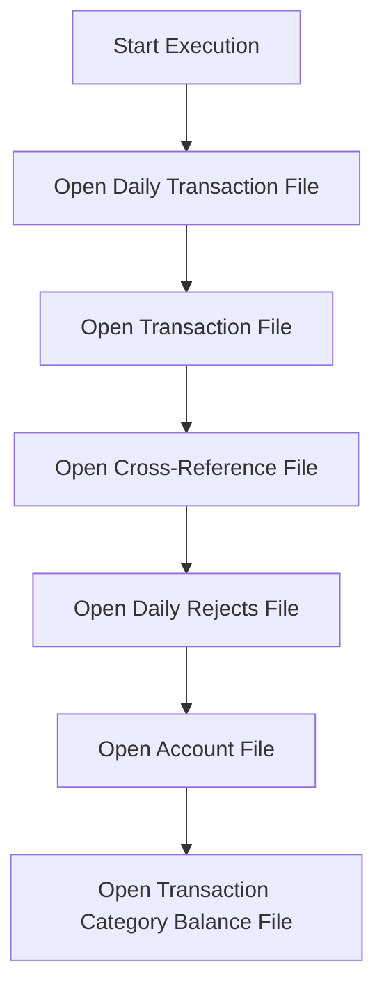
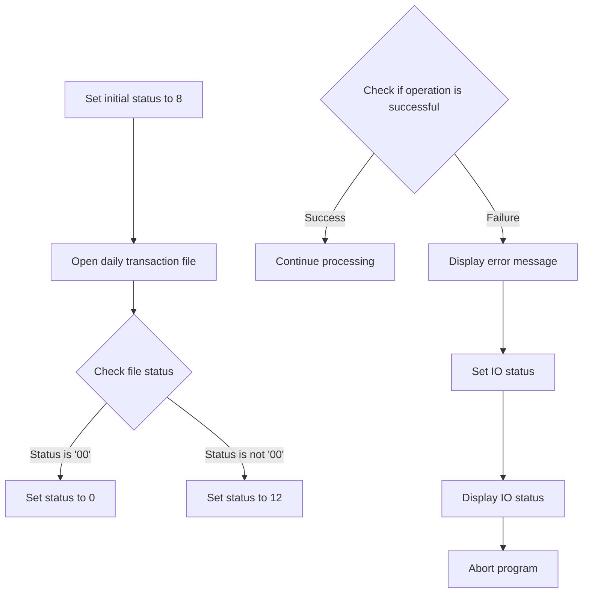
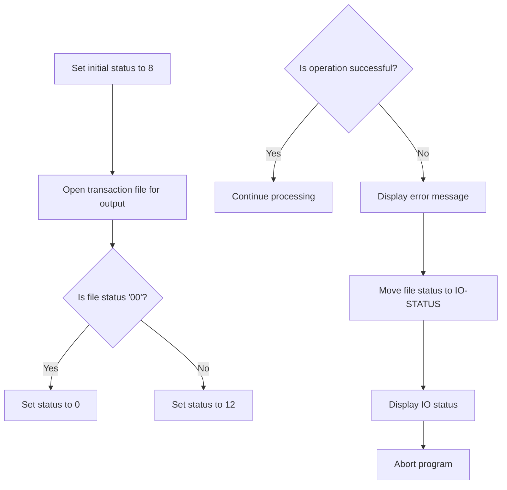
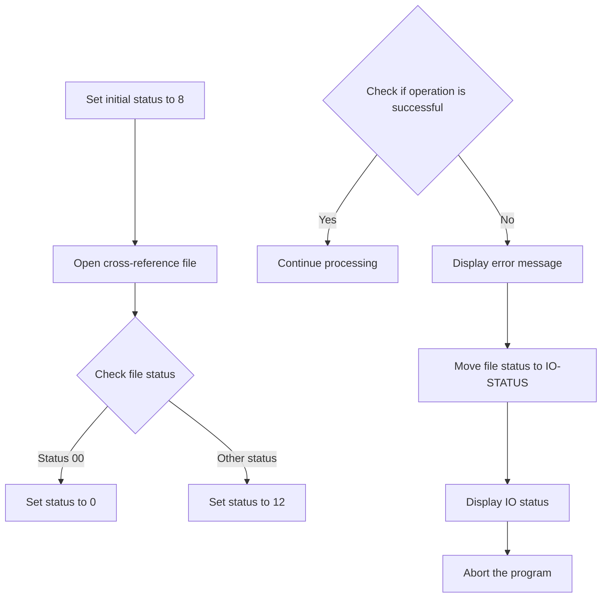

The <SwmToken path="app/cbl/CBTRN02C.cbl" pos="194:14:14" line-data="           DISPLAY &#39;START OF EXECUTION OF PROGRAM CBTRN02C&#39;.                    ">`CBTRN02C`</SwmToken> program is a batch COBOL program used in the <SwmToken path="app/cbl/CBTRN02C.cbl" pos="3:7:7" line-data="      * Application : CardDemo                                          ">`CardDemo`</SwmToken> application to post records from the daily transaction file. This process is initiated by the POSTTRAN flow and involves opening and processing several necessary files, such as the daily transaction file, transaction file, cross-reference file, daily rejects file, account file, and transaction category balance file.

For example, the program starts by opening the daily transaction file and checking its status. If the file opens successfully, the program proceeds to open other required files and continues processing. If any file fails to open, an error message is displayed, and the program is aborted to prevent further processing.

# Where is this program used?

This program is used once, in a flow starting from `POSTTRAN` as represented in the following diagram:

```mermaid
graph TD
POSTTRAN("POSTTRAN") --> CBTRN02C("Posting Daily Transactions (CBTRN02C)"):::currentEntity
  classDef currentEntity color:#000000,fill:#7CB9F4

%% Swimm:
%% graph TD
%% POSTTRAN("POSTTRAN") --> <SwmToken path="app/cbl/CBTRN02C.cbl" pos="194:14:14" line-data="           DISPLAY &#39;START OF EXECUTION OF PROGRAM CBTRN02C&#39;.                    ">`CBTRN02C`</SwmToken>("Posting Daily Transactions (<SwmToken path="app/cbl/CBTRN02C.cbl" pos="194:14:14" line-data="           DISPLAY &#39;START OF EXECUTION OF PROGRAM CBTRN02C&#39;.                    ">`CBTRN02C`</SwmToken>)"):::currentEntity
%%   classDef currentEntity color:#000000,fill:#7CB9F4
```



# Post records from daily transaction file (`PROCEDURE-DIVISION`)

Lets' zoom into the program flow:



<SwmSnippet path="/app/cbl/CBTRN02C.cbl" line="193">

---

### Opening necessary files

Going into the PROCEDURE-DIVISION, the program starts by displaying a message indicating the start of execution. It then proceeds to open several necessary files: the daily transaction file, the transaction file, the cross-reference file, the daily rejects file, the account file, and the transaction category balance file.

```cobol
       PROCEDURE DIVISION.                                                      
           DISPLAY 'START OF EXECUTION OF PROGRAM CBTRN02C'.                    
           PERFORM 0000-DALYTRAN-OPEN.                                          
           PERFORM 0100-TRANFILE-OPEN.                                          
           PERFORM 0200-XREFFILE-OPEN.                                          
           PERFORM 0300-DALYREJS-OPEN.                                          
           PERFORM 0400-ACCTFILE-OPEN.                                          
           PERFORM 0500-TCATBALF-OPEN.                                          
```

---

</SwmSnippet>

# Open Transaction File (<SwmToken path="app/cbl/CBTRN02C.cbl" pos="195:3:7" line-data="           PERFORM 0000-DALYTRAN-OPEN.                                          ">`0000-DALYTRAN-OPEN`</SwmToken>)

Lets' zoom into the program flow:



<SwmSnippet path="/app/cbl/CBTRN02C.cbl" line="236">

---

### Setting initial status and opening the file

Going into the first part of the function, the initial status is set to indicate a pending operation. The daily transaction file is then opened. If the file status indicates a successful open, the status is updated to reflect success. Otherwise, the status is set to indicate an error.

```cobol
       0000-DALYTRAN-OPEN.                                                      
           MOVE 8 TO APPL-RESULT.                                               
           OPEN INPUT DALYTRAN-FILE                                             
           IF  DALYTRAN-STATUS = '00'                                           
               MOVE 0 TO APPL-RESULT                                            
           ELSE                                                                 
               MOVE 12 TO APPL-RESULT                                           
           END-IF                                                               
```

---

</SwmSnippet>

<SwmSnippet path="/app/cbl/CBTRN02C.cbl" line="244">

---

### Handling file open status

Next, the function checks if the operation was successful. If it was, processing continues. If not, an error message is displayed, the IO status is set to reflect the file status, the IO status is displayed, and the program is aborted to prevent further processing.

```cobol
           IF  APPL-AOK                                                         
               CONTINUE                                                         
           ELSE                                                                 
               DISPLAY 'ERROR OPENING DALYTRAN'                                 
               MOVE DALYTRAN-STATUS TO IO-STATUS                                
               PERFORM 9910-DISPLAY-IO-STATUS                                   
               PERFORM 9999-ABEND-PROGRAM                                       
           END-IF                                                               
           EXIT.                                                                
```

---

</SwmSnippet>

# Display File Status (<SwmToken path="app/cbl/CBTRN02C.cbl" pos="249:3:9" line-data="               PERFORM 9910-DISPLAY-IO-STATUS                                   ">`9910-DISPLAY-IO-STATUS`</SwmToken>)

<SwmSnippet path="/app/cbl/CBTRN02C.cbl" line="714">

---

### Displaying File Operation Status

Going into the <SwmToken path="app/cbl/CBTRN02C.cbl" pos="714:1:7" line-data="       9910-DISPLAY-IO-STATUS.                                                  ">`9910-DISPLAY-IO-STATUS`</SwmToken> function, it checks if the file operation status is either non-numeric or indicates a specific error. If so, it updates the status message accordingly and displays it. Otherwise, it sets the status to indicate a successful operation and displays the message.

```cobol
       9910-DISPLAY-IO-STATUS.                                                  
           IF  IO-STATUS NOT NUMERIC                                            
           OR  IO-STAT1 = '9'                                                   
               MOVE IO-STAT1 TO IO-STATUS-04(1:1)                               
               MOVE 0        TO TWO-BYTES-BINARY                                
               MOVE IO-STAT2 TO TWO-BYTES-RIGHT                                 
               MOVE TWO-BYTES-BINARY TO IO-STATUS-0403                          
               DISPLAY 'FILE STATUS IS: NNNN' IO-STATUS-04                      
           ELSE                                                                 
               MOVE '0000' TO IO-STATUS-04                                      
               MOVE IO-STATUS TO IO-STATUS-04(3:2)                              
               DISPLAY 'FILE STATUS IS: NNNN' IO-STATUS-04                      
           END-IF                                                               
           EXIT.                                                                
```

---

</SwmSnippet>

# Open Transaction File (<SwmToken path="app/cbl/CBTRN02C.cbl" pos="196:3:7" line-data="           PERFORM 0100-TRANFILE-OPEN.                                          ">`0100-TRANFILE-OPEN`</SwmToken>)

Lets' zoom into the program flow:



<SwmSnippet path="/app/cbl/CBTRN02C.cbl" line="254">

---

### Opening the transaction file

Going into the <SwmToken path="app/cbl/CBTRN02C.cbl" pos="254:1:5" line-data="       0100-TRANFILE-OPEN.                                                      ">`0100-TRANFILE-OPEN`</SwmToken> function, the initial status is set to indicate a pending operation. The transaction file is then opened for output operations. If the file opens successfully, the status is updated to indicate success. Otherwise, the status is set to indicate an error.

```cobol
       0100-TRANFILE-OPEN.                                                      
           MOVE 8 TO APPL-RESULT.                                               
           OPEN OUTPUT TRANSACT-FILE                                            
           IF  TRANFILE-STATUS = '00'                                           
               MOVE 0 TO APPL-RESULT                                            
           ELSE                                                                 
               MOVE 12 TO APPL-RESULT                                           
           END-IF                                                               
```

---

</SwmSnippet>

<SwmSnippet path="/app/cbl/CBTRN02C.cbl" line="262">

---

### Handling file open errors

Next, the function checks if the operation was successful. If it was, processing continues. If not, an error message is displayed, the file status is recorded, the IO status is displayed, and the program is aborted to prevent further processing.

```cobol
           IF  APPL-AOK                                                         
               CONTINUE                                                         
           ELSE                                                                 
               DISPLAY 'ERROR OPENING TRANSACTION FILE'                         
               MOVE TRANFILE-STATUS TO IO-STATUS                                
               PERFORM 9910-DISPLAY-IO-STATUS                                   
               PERFORM 9999-ABEND-PROGRAM                                       
           END-IF                                                               
           EXIT.                                                                
```

---

</SwmSnippet>

# Open Cross-Reference File (<SwmToken path="app/cbl/CBTRN02C.cbl" pos="197:3:7" line-data="           PERFORM 0200-XREFFILE-OPEN.                                          ">`0200-XREFFILE-OPEN`</SwmToken>)

Lets' zoom into the program flow:



<SwmSnippet path="/app/cbl/CBTRN02C.cbl" line="273">

---

### Setting initial status and opening the file

Going into the first part of the <SwmToken path="app/cbl/CBTRN02C.cbl" pos="273:1:5" line-data="       0200-XREFFILE-OPEN.                                                      ">`0200-XREFFILE-OPEN`</SwmToken> function, the initial status is set to indicate a pending operation. The function then attempts to open the cross-reference file for reading. If the file is successfully opened, the status is updated to indicate success. Otherwise, the status is set to indicate an error.

```cobol
       0200-XREFFILE-OPEN.                                                      
           MOVE 8 TO APPL-RESULT.                                               
           OPEN INPUT XREF-FILE                                                 
           IF  XREFFILE-STATUS = '00'                                           
               MOVE 0 TO APPL-RESULT                                            
           ELSE                                                                 
               MOVE 12 TO APPL-RESULT                                           
           END-IF                                                               
```

---

</SwmSnippet>

<SwmSnippet path="/app/cbl/CBTRN02C.cbl" line="281">

---

### Handling file open status

Now, the function checks if the operation was successful by evaluating the status. If the operation was successful, it continues processing. Otherwise, it displays an error message, logs the file status, and aborts the program.

```cobol
           IF  APPL-AOK                                                         
               CONTINUE                                                         
           ELSE                                                                 
               DISPLAY 'ERROR OPENING CROSS REF FILE'                           
               MOVE XREFFILE-STATUS TO IO-STATUS                                
               PERFORM 9910-DISPLAY-IO-STATUS                                   
               PERFORM 9999-ABEND-PROGRAM                                       
           END-IF                                                               
           EXIT.                                                                
```

---

</SwmSnippet>

&nbsp;

*This is an auto-generated document by Swimm 🌊 and has not yet been verified by a human*

<SwmMeta version="3.0.0" repo-id="Z2l0aHViJTNBJTNBa3luZHJ5bC1hd3MtbWFpbmZyYW1lLW1vZGVybml6YXRpb24tY2FyZGRlbW8lM0ElM0FTd2ltbS1EZW1v" repo-name="kyndryl-aws-mainframe-modernization-carddemo"><sup>Powered by [Swimm](/)</sup></SwmMeta>
