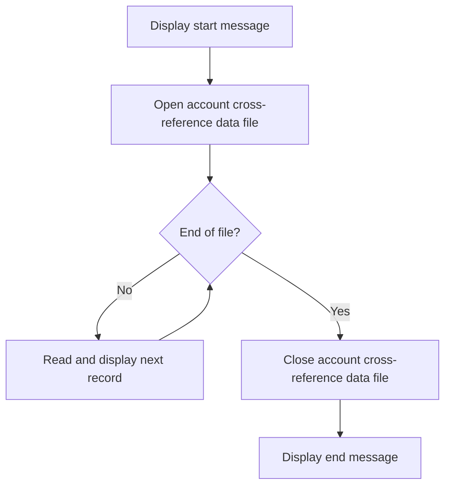

The document describes the process of printing account cross-reference data using the <SwmToken path="app/cbl/CBACT03C.cbl" pos="72:14:14" line-data="           DISPLAY &#39;START OF EXECUTION OF PROGRAM CBACT03C&#39;.                    ">`CBACT03C`</SwmToken> program. This program is part of the <SwmToken path="app/cbl/CBACT03C.cbl" pos="3:7:7" line-data="      * Application : CardDemo                                          ">`CardDemo`</SwmToken> application, which is designed to test and showcase AWS and partner technology for mainframe migration and modernization use-cases. The <SwmToken path="app/cbl/CBACT03C.cbl" pos="72:14:14" line-data="           DISPLAY &#39;START OF EXECUTION OF PROGRAM CBACT03C&#39;.                    ">`CBACT03C`</SwmToken> program achieves this by reading records from the account cross-reference data file and displaying them until the end of the file is reached.

The flow involves starting the program, opening the account cross-reference data file, reading and displaying records in a loop until the end of the file is reached, and finally closing the file and displaying an end message.

## MAIN

Lets' zoom into this section of the flow:



<SwmSnippet path="/app/cbl/CBACT03C.cbl" line="72">

---

First, the program displays a start message indicating the beginning of execution.

```cobol
           DISPLAY 'START OF EXECUTION OF PROGRAM CBACT03C'.                    
```

---

</SwmSnippet>

<SwmSnippet path="/app/cbl/CBACT03C.cbl" line="73">

---

Next, the program opens the account cross-reference data file to prepare for reading records.

```cobol
           PERFORM 0000-XREFFILE-OPEN.                                          
```

---

</SwmSnippet>

<SwmSnippet path="/app/cbl/CBACT03C.cbl" line="75">

---

Moving to the core logic, the program enters a loop to read and display records until the end of the file is reached. If the end of the file is not reached, it reads the next record and displays it.

```cobol
           PERFORM UNTIL END-OF-FILE = 'Y'                                      
               IF  END-OF-FILE = 'N'                                            
                   PERFORM 1000-XREFFILE-GET-NEXT                               
                   IF  END-OF-FILE = 'N'                                        
                       DISPLAY CARD-XREF-RECORD                                 
                   END-IF                                                       
               END-IF                                                           
```

---

</SwmSnippet>

<SwmSnippet path="/app/cbl/CBACT03C.cbl" line="84">

---

Then, the program closes the account cross-reference data file after all records have been processed.

```cobol
           PERFORM 9000-XREFFILE-CLOSE.                                         
```

---

</SwmSnippet>

<SwmSnippet path="/app/cbl/CBACT03C.cbl" line="86">

---

Finally, the program displays an end message indicating the completion of execution.

```cobol
           DISPLAY 'END OF EXECUTION OF PROGRAM CBACT03C'.                      
```

---

</SwmSnippet>

&nbsp;

*This is an auto-generated document by Swimm 🌊 and has not yet been verified by a human*

<SwmMeta version="3.0.0" repo-id="Z2l0aHViJTNBJTNBa3luZHJ5bC1hd3MtbWFpbmZyYW1lLW1vZGVybml6YXRpb24tY2FyZGRlbW8lM0ElM0FTd2ltbS1EZW1v" repo-name="kyndryl-aws-mainframe-modernization-carddemo"><sup>Powered by [Swimm](/)</sup></SwmMeta>
