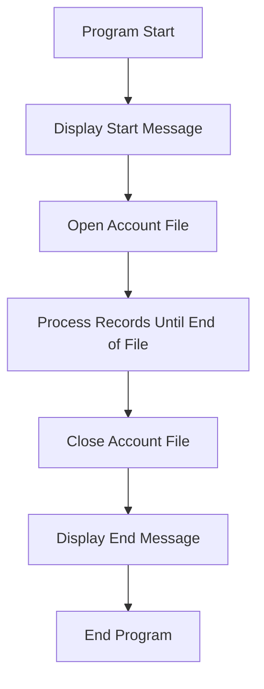

The <SwmToken path="app/cbl/CBACT01C.cbl" pos="2:7:7" line-data="      * Program     : CBACT01C.CBL                                      ">`CBACT01C`</SwmToken> program is responsible for processing account records in a file. The program starts by displaying a start message, opens the account file, processes each record until the end of the file, closes the account file, and finally displays an end message. This flow ensures that all account records are read and processed sequentially.

The flow begins with the program displaying a start message to indicate the beginning of execution. It then opens the account file and enters a loop to process each account record one by one until the end of the file is reached. After processing all records, the program closes the account file and displays an end message to indicate the completion of the process.

Lets' zoom into the flow:



<SwmSnippet path="/app/cbl/CBACT01C.cbl" line="91">

---

## Program Start

The program starts by displaying a message indicating the start of execution.

```cobol
      *****************************************************************         
       1000-ACCTFILE-GET-NEXT.                                                  
           READ ACCTFILE-FILE INTO ACCOUNT-RECORD.                              
```

---

</SwmSnippet>

<SwmSnippet path="/app/cbl/CBACT01C.cbl" line="94">

---

## Open Account File

The program performs the <SwmToken path="app/cbl/CBACT01C.cbl" pos="72:3:7" line-data="           PERFORM 0000-ACCTFILE-OPEN.                                          ">`0000-ACCTFILE-OPEN`</SwmToken> routine to open the account file for reading.

```cobol
           IF  ACCTFILE-STATUS = '00'                                           
```

---

</SwmSnippet>

<SwmSnippet path="/app/cbl/CBACT01C.cbl" line="96">

---

## Process Records Until End of File

The program enters a loop to process each account record until the end of the file is reached. It performs the <SwmToken path="app/cbl/CBACT01C.cbl" pos="92:1:7" line-data="       1000-ACCTFILE-GET-NEXT.                                                  ">`1000-ACCTFILE-GET-NEXT`</SwmToken> routine to read the next record and displays the account record if it is not the end of the file.

```cobol
               PERFORM 1100-DISPLAY-ACCT-RECORD                                 
           ELSE                                                                 
               IF  ACCTFILE-STATUS = '10'                                       
                   MOVE 16 TO APPL-RESULT                                       
               ELSE                                                             
                   MOVE 12 TO APPL-RESULT                                       
               END-IF                                                           
           END-IF                                                               
```

---

</SwmSnippet>

<SwmSnippet path="/app/cbl/CBACT01C.cbl" line="105">

---

## Close Account File

The program performs the <SwmToken path="app/cbl/CBACT01C.cbl" pos="83:3:7" line-data="           PERFORM 9000-ACCTFILE-CLOSE.                                         ">`9000-ACCTFILE-CLOSE`</SwmToken> routine to close the account file.

```cobol
               CONTINUE                                                         
```

---

</SwmSnippet>

<SwmSnippet path="/app/cbl/CBACT01C.cbl" line="107">

---

## Display End Message

The program displays a message indicating the end of execution.

```cobol
               IF  APPL-EOF                                                     
```

---

</SwmSnippet>

<SwmSnippet path="/app/cbl/CBACT01C.cbl" line="109">

---

## End Program

The program ends with the <SwmToken path="app/cbl/CBACT01C.cbl" pos="87:1:1" line-data="           GOBACK.                                                              ">`GOBACK`</SwmToken> statement.

```cobol
               ELSE                                                             
```

---

</SwmSnippet>

&nbsp;

*This is an auto-generated document by Swimm 🌊 and has not yet been verified by a human*

<SwmMeta version="3.0.0" repo-id="Z2l0aHViJTNBJTNBa3luZHJ5bC1hd3MtbWFpbmZyYW1lLW1vZGVybml6YXRpb24tY2FyZGRlbW8lM0ElM0FTd2ltbS1EZW1v" repo-name="kyndryl-aws-mainframe-modernization-carddemo"><sup>Powered by [Swimm](/)</sup></SwmMeta>
