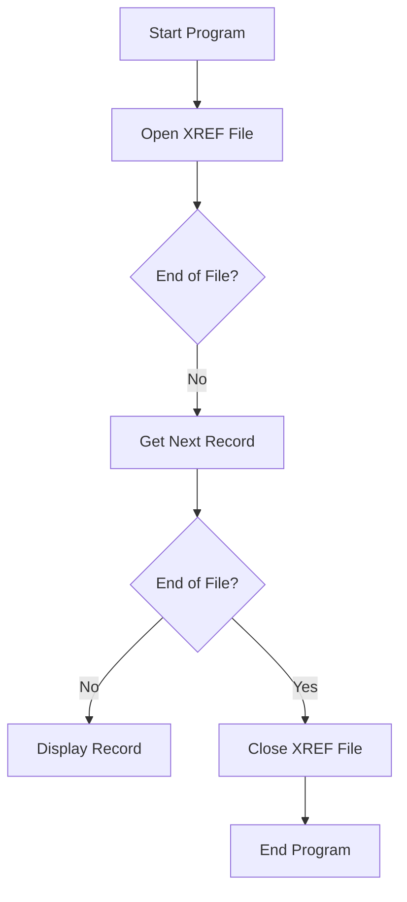

The <SwmToken path="app/cbl/CBACT03C.cbl" pos="85:14:14" line-data="           DISPLAY &#39;END OF EXECUTION OF PROGRAM CBACT03C&#39;.                      ">`CBACT03C`</SwmToken> program is designed to manage the cross-reference file (XREF) in the system. The program starts by opening the XREF file, processes records until the end of the file is reached, and then closes the XREF file. This flow ensures that all records are read and displayed properly, and the file is closed correctly at the end of the execution.

The flow of the <SwmToken path="app/cbl/CBACT03C.cbl" pos="85:14:14" line-data="           DISPLAY &#39;END OF EXECUTION OF PROGRAM CBACT03C&#39;.                      ">`CBACT03C`</SwmToken> program involves starting the program, opening the XREF file, processing each record until the end of the file is reached, and then closing the XREF file. This ensures that all records are handled correctly and the file is properly closed.

Lets' zoom into the flow:



<SwmSnippet path="/app/cbl/CBACT03C.cbl" line="82">

---

## Start Program

First, the program starts by displaying a message indicating the start of execution.

```cobol
                                                                                
           PERFORM 9000-XREFFILE-CLOSE.                                         
                                                                                
```

---

</SwmSnippet>

<SwmSnippet path="/app/cbl/CBACT03C.cbl" line="85">

---

## Open XREF File

Next, the program performs the <SwmToken path="app/cbl/CBACT03C.cbl" pos="72:3:7" line-data="           PERFORM 0000-XREFFILE-OPEN.                                          ">`0000-XREFFILE-OPEN`</SwmToken> routine to open the cross-reference file.

```cobol
           DISPLAY 'END OF EXECUTION OF PROGRAM CBACT03C'.                      
```

---

</SwmSnippet>

<SwmSnippet path="/app/cbl/CBACT03C.cbl" line="87">

---

## Process Records Until End of File

Then, the program enters a loop that continues until the end of the file is reached. Within this loop, it checks if the end of the file has not been reached and performs the <SwmToken path="app/cbl/CBACT03C.cbl" pos="92:1:7" line-data="       1000-XREFFILE-GET-NEXT.                                                  ">`1000-XREFFILE-GET-NEXT`</SwmToken> routine to get the next record. If the end of the file is still not reached, it displays the current record.

```cobol
           GOBACK.                                                              
                                                                                
      *****************************************************************         
      * I/O ROUTINES TO ACCESS A KSDS, VSAM DATA SET...               *         
      *****************************************************************         
       1000-XREFFILE-GET-NEXT.                                                  
           READ XREFFILE-FILE INTO CARD-XREF-RECORD.                            
           IF  XREFFILE-STATUS = '00'                                           
```

---

</SwmSnippet>

<SwmSnippet path="/app/cbl/CBACT03C.cbl" line="96">

---

## Close XREF File

Moving to the next step, the program performs the <SwmToken path="app/cbl/CBACT03C.cbl" pos="83:3:7" line-data="           PERFORM 9000-XREFFILE-CLOSE.                                         ">`9000-XREFFILE-CLOSE`</SwmToken> routine to close the cross-reference file.

```cobol
               DISPLAY CARD-XREF-RECORD                                         
```

---

</SwmSnippet>

<SwmSnippet path="/app/cbl/CBACT03C.cbl" line="98">

---

## End Program

Finally, the program displays a message indicating the end of execution and then executes the <SwmToken path="app/cbl/CBACT03C.cbl" pos="87:1:1" line-data="           GOBACK.                                                              ">`GOBACK`</SwmToken> statement to return control to the calling program or operating system.

```cobol
               IF  XREFFILE-STATUS = '10'                                       
                   MOVE 16 TO APPL-RESULT                                       
               ELSE                                                             
```

---

</SwmSnippet>

<SwmSnippet path="/app/cbl/CBACT03C.cbl" line="149">

---

### <SwmToken path="app/cbl/CBACT03C.cbl" pos="83:3:7" line-data="           PERFORM 9000-XREFFILE-CLOSE.                                         ">`9000-XREFFILE-CLOSE`</SwmToken> Routine

The <SwmToken path="app/cbl/CBACT03C.cbl" pos="83:3:7" line-data="           PERFORM 9000-XREFFILE-CLOSE.                                         ">`9000-XREFFILE-CLOSE`</SwmToken> routine is responsible for closing the cross-reference file. It updates the application result status and checks if the file was closed successfully. If there is an error, it displays an error message and performs error handling routines.

```cobol
               PERFORM 9910-DISPLAY-IO-STATUS                                   
               PERFORM 9999-ABEND-PROGRAM                                       
           END-IF                                                               
           EXIT.                                                                
                                                                                
       9999-ABEND-PROGRAM.                                                      
           DISPLAY 'ABENDING PROGRAM'                                           
           MOVE 0 TO TIMING                                                     
           MOVE 999 TO ABCODE                                                   
           CALL 'CEE3ABD'.                                                      
                                                                                
      *****************************************************************         
       9910-DISPLAY-IO-STATUS.                                                  
           IF  IO-STATUS NOT NUMERIC                                            
           OR  IO-STAT1 = '9'                                                   
               MOVE IO-STAT1 TO IO-STATUS-04(1:1)                               
               MOVE 0        TO TWO-BYTES-BINARY                                
```

---

</SwmSnippet>

&nbsp;

*This is an auto-generated document by Swimm 🌊 and has not yet been verified by a human*

<SwmMeta version="3.0.0" repo-id="Z2l0aHViJTNBJTNBa3luZHJ5bC1hd3MtbWFpbmZyYW1lLW1vZGVybml6YXRpb24tY2FyZGRlbW8lM0ElM0FTd2ltbS1EZW1v" repo-name="kyndryl-aws-mainframe-modernization-carddemo"><sup>Powered by [Swimm](/)</sup></SwmMeta>
