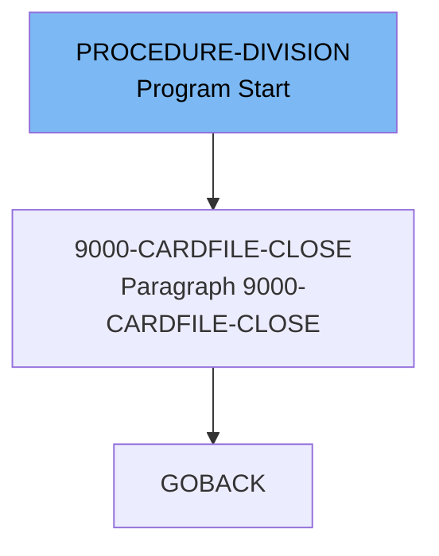

The <SwmToken path="app/cbl/CBACT02C.cbl" pos="85:14:14" line-data="           DISPLAY &#39;END OF EXECUTION OF PROGRAM CBACT02C&#39;.                      ">`CBACT02C`</SwmToken> program is designed to handle the opening, processing, and closing of a card file. The program starts by displaying a message indicating the start of execution, opens the card file, processes each card record in a loop until the end of the file is reached, and finally closes the card file before ending the execution.

The flow starts with the program displaying a start message and opening the card file. It then enters a loop to process each card record until the end of the file is reached. After processing all records, the program closes the card file and displays an end message before terminating.

Lets' zoom into the flow:



<SwmSnippet path="/app/cbl/CBACT02C.cbl" line="85">

---

## PROCEDURE-DIVISION

First, the `PROCEDURE-DIVISION` starts by displaying a message indicating the start of the program execution. It then performs the <SwmToken path="app/cbl/CBACT02C.cbl" pos="72:3:7" line-data="           PERFORM 0000-CARDFILE-OPEN.                                          ">`0000-CARDFILE-OPEN`</SwmToken> routine to open the card file for processing. The program enters a loop that continues until the <SwmToken path="app/cbl/CBACT02C.cbl" pos="65:3:7" line-data="       01  END-OF-FILE             PIC X(01)    VALUE &#39;N&#39;.                      ">`END-OF-FILE`</SwmToken> flag is set to 'Y'. Within the loop, it checks if the <SwmToken path="app/cbl/CBACT02C.cbl" pos="65:3:7" line-data="       01  END-OF-FILE             PIC X(01)    VALUE &#39;N&#39;.                      ">`END-OF-FILE`</SwmToken> flag is 'N' and performs the <SwmToken path="app/cbl/CBACT02C.cbl" pos="92:1:7" line-data="       1000-CARDFILE-GET-NEXT.                                                  ">`1000-CARDFILE-GET-NEXT`</SwmToken> routine to read the next card record. If a record is successfully read, it displays the card record. After exiting the loop, the program performs the <SwmToken path="app/cbl/CBACT02C.cbl" pos="83:3:7" line-data="           PERFORM 9000-CARDFILE-CLOSE.                                         ">`9000-CARDFILE-CLOSE`</SwmToken> routine to close the card file and displays a message indicating the end of the program execution before executing the <SwmToken path="app/cbl/CBACT02C.cbl" pos="87:1:1" line-data="           GOBACK.                                                              ">`GOBACK`</SwmToken> statement.

```cobol
           DISPLAY 'END OF EXECUTION OF PROGRAM CBACT02C'.                      
                                                                                
           GOBACK.                                                              
                                                                                
      *****************************************************************         
      * I/O ROUTINES TO ACCESS A KSDS, VSAM DATA SET...               *         
      *****************************************************************         
       1000-CARDFILE-GET-NEXT.                                                  
           READ CARDFILE-FILE INTO CARD-RECORD.                                 
           IF  CARDFILE-STATUS = '00'                                           
               MOVE 0 TO APPL-RESULT                                            
      *        DISPLAY CARD-RECORD                                              
           ELSE                                                                 
               IF  CARDFILE-STATUS = '10'                                       
                   MOVE 16 TO APPL-RESULT                                       
               ELSE                                                             
                   MOVE 12 TO APPL-RESULT                                       
               END-IF                                                           
           END-IF                                                               
```

---

</SwmSnippet>

<SwmSnippet path="/app/cbl/CBACT02C.cbl" line="152">

---

## <SwmToken path="app/cbl/CBACT02C.cbl" pos="83:3:7" line-data="           PERFORM 9000-CARDFILE-CLOSE.                                         ">`9000-CARDFILE-CLOSE`</SwmToken>

Next, the <SwmToken path="app/cbl/CBACT02C.cbl" pos="83:3:7" line-data="           PERFORM 9000-CARDFILE-CLOSE.                                         ">`9000-CARDFILE-CLOSE`</SwmToken> routine is responsible for closing the card file. It starts by setting the <SwmToken path="app/cbl/CBACT02C.cbl" pos="95:7:9" line-data="               MOVE 0 TO APPL-RESULT                                            ">`APPL-RESULT`</SwmToken> to 8 and then attempts to close the card file. If the file is closed successfully, it resets the <SwmToken path="app/cbl/CBACT02C.cbl" pos="95:7:9" line-data="               MOVE 0 TO APPL-RESULT                                            ">`APPL-RESULT`</SwmToken> to 0. If there is an error in closing the file, it sets the <SwmToken path="app/cbl/CBACT02C.cbl" pos="95:7:9" line-data="               MOVE 0 TO APPL-RESULT                                            ">`APPL-RESULT`</SwmToken> to 12. If the application status (<SwmToken path="app/cbl/CBACT02C.cbl" pos="62:3:5" line-data="           88  APPL-AOK            VALUE 0.                                     ">`APPL-AOK`</SwmToken>) is not okay, it displays an error message, moves the <SwmToken path="app/cbl/CBACT02C.cbl" pos="94:3:5" line-data="           IF  CARDFILE-STATUS = &#39;00&#39;                                           ">`CARDFILE-STATUS`</SwmToken> to <SwmToken path="app/cbl/CBACT02C.cbl" pos="161:5:7" line-data="       9910-DISPLAY-IO-STATUS.                                                  ">`IO-STATUS`</SwmToken>, and performs the <SwmToken path="app/cbl/CBACT02C.cbl" pos="161:1:7" line-data="       9910-DISPLAY-IO-STATUS.                                                  ">`9910-DISPLAY-IO-STATUS`</SwmToken> and <SwmToken path="app/cbl/CBACT02C.cbl" pos="154:1:5" line-data="       9999-ABEND-PROGRAM.                                                      ">`9999-ABEND-PROGRAM`</SwmToken> routines to handle the error.

```cobol
           EXIT.                                                                
                                                                                
       9999-ABEND-PROGRAM.                                                      
           DISPLAY 'ABENDING PROGRAM'                                           
           MOVE 0 TO TIMING                                                     
           MOVE 999 TO ABCODE                                                   
           CALL 'CEE3ABD'.                                                      
                                                                                
      *****************************************************************         
       9910-DISPLAY-IO-STATUS.                                                  
           IF  IO-STATUS NOT NUMERIC                                            
           OR  IO-STAT1 = '9'                                                   
               MOVE IO-STAT1 TO IO-STATUS-04(1:1)                               
               MOVE 0        TO TWO-BYTES-BINARY                                
               MOVE IO-STAT2 TO TWO-BYTES-RIGHT                                 
               MOVE TWO-BYTES-BINARY TO IO-STATUS-0403                          
               DISPLAY 'FILE STATUS IS: NNNN' IO-STATUS-04                      
```

---

</SwmSnippet>

&nbsp;

*This is an auto-generated document by Swimm 🌊 and has not yet been verified by a human*

<SwmMeta version="3.0.0" repo-id="Z2l0aHViJTNBJTNBa3luZHJ5bC1hd3MtbWFpbmZyYW1lLW1vZGVybml6YXRpb24tY2FyZGRlbW8lM0ElM0FTd2ltbS1EZW1v" repo-name="kyndryl-aws-mainframe-modernization-carddemo"><sup>Powered by [Swimm](/)</sup></SwmMeta>
