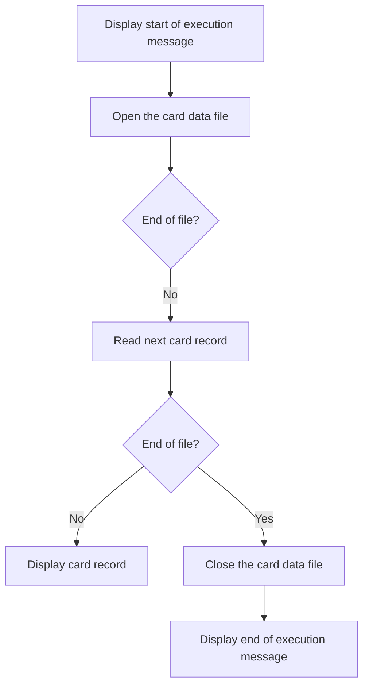

The program <SwmToken path="app/cbl/CBACT02C.cbl" pos="72:14:14" line-data="           DISPLAY &#39;START OF EXECUTION OF PROGRAM CBACT02C&#39;.                    ">`CBACT02C`</SwmToken> is a batch COBOL program within the <SwmToken path="app/cbl/CBACT02C.cbl" pos="3:7:7" line-data="      * Application : CardDemo                                          ">`CardDemo`</SwmToken> application. It is designed to read and print card data from a file. The program achieves this by opening the card data file, reading each card record, displaying the record, and then closing the file once all records have been processed.

The flow starts with displaying a message indicating the start of execution. The program then opens the card data file and enters a loop to read and display each card record until the end of the file is reached. After processing all records, the program closes the card data file and displays a message indicating the end of execution.

## MAIN

Lets' zoom into this section of the flow:



<SwmSnippet path="/app/cbl/CBACT02C.cbl" line="72">

---

First, the program displays a message indicating the start of execution.

```cobol
           DISPLAY 'START OF EXECUTION OF PROGRAM CBACT02C'.                    
```

---

</SwmSnippet>

<SwmSnippet path="/app/cbl/CBACT02C.cbl" line="73">

---

Next, the program opens the card data file to prepare for reading card records.

```cobol
           PERFORM 0000-CARDFILE-OPEN.                                          
```

---

</SwmSnippet>

<SwmSnippet path="/app/cbl/CBACT02C.cbl" line="75">

---

Then, the program enters a loop to read and display card records until the end of the file is reached.

```cobol
           PERFORM UNTIL END-OF-FILE = 'Y'                                      
               IF  END-OF-FILE = 'N'                                            
                   PERFORM 1000-CARDFILE-GET-NEXT                               
                   IF  END-OF-FILE = 'N'                                        
                       DISPLAY CARD-RECORD                                      
                   END-IF                                                       
               END-IF                                                           
           END-PERFORM.                                                         
```

---

</SwmSnippet>

<SwmSnippet path="/app/cbl/CBACT02C.cbl" line="84">

---

Moving to the next step, the program closes the card data file after all records have been processed.

```cobol
           PERFORM 9000-CARDFILE-CLOSE.                                         
```

---

</SwmSnippet>

<SwmSnippet path="/app/cbl/CBACT02C.cbl" line="86">

---

Finally, the program displays a message indicating the end of execution.

```cobol
           DISPLAY 'END OF EXECUTION OF PROGRAM CBACT02C'.                      
```

---

</SwmSnippet>

&nbsp;

*This is an auto-generated document by Swimm 🌊 and has not yet been verified by a human*

<SwmMeta version="3.0.0" repo-id="Z2l0aHViJTNBJTNBa3luZHJ5bC1hd3MtbWFpbmZyYW1lLW1vZGVybml6YXRpb24tY2FyZGRlbW8lM0ElM0FTd2ltbS1EZW1v" repo-name="kyndryl-aws-mainframe-modernization-carddemo"><sup>Powered by [Swimm](/)</sup></SwmMeta>
