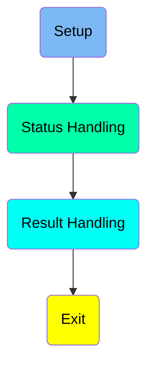
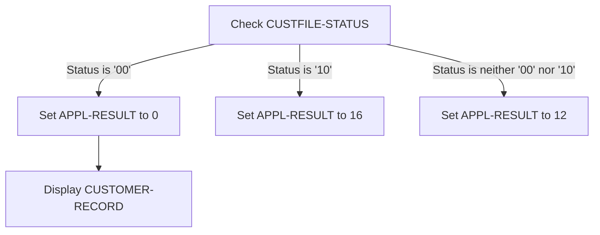
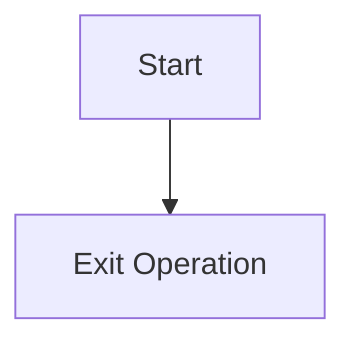

The <SwmToken path="app/cbl/CBCUS01C.cbl" pos="2:7:7" line-data="      * Program     : CBCUS01C.CBL                                      ">`CBCUS01C`</SwmToken> program is responsible for reading customer records from a file and handling the status of the read operation. It sets appropriate application results based on the status and performs necessary error handling routines. The program ensures that customer data is accurately retrieved and processed, providing a reliable mechanism for managing customer information.

The <SwmToken path="app/cbl/CBCUS01C.cbl" pos="2:7:7" line-data="      * Program     : CBCUS01C.CBL                                      ">`CBCUS01C`</SwmToken> program starts by reading a customer record from a file. It then checks the status of the read operation. If the read is successful, it displays the customer record. If the end of the file is reached, it sets an end-of-file indicator. For any other status, it sets an error code and performs error handling routines. This ensures that customer data is correctly processed and any issues are appropriately handled.

Here is a high level diagram of the program:



# Setup

```mermaid
graph TD
  A[Start 1000-CUSTFILE-GET-NEXT] --> B[Read Customer File]
  B --> C{CUSTFILE-STATUS = '00'}
  C -->|Yes| D[Set APPL-RESULT to 0]
  D --> E[Display Customer Record]
  C -->|No| F{CUSTFILE-STATUS = '10'}
  F -->|Yes| G[Set APPL-RESULT to 16]
  F -->|No| H[Set APPL-RESULT to 12]
  G --> I{APPL-AOK}
  H --> I{APPL-AOK}
  I -->|Yes| J[Continue]
  I -->|No| K{APPL-EOF}
  K -->|Yes| L[Set END-OF-FILE to 'Y']
  K -->|No| M[Display Error]
  M --> N[Move CUSTFILE-STATUS to IO-STATUS]
  N --> O[Perform Z-DISPLAY-IO-STATUS]
  O --> P[Perform Z-ABEND-PROGRAM]

%% Swimm:
%% graph TD
%%   A[Start 1000-CUSTFILE-GET-NEXT] --> B[Read Customer File]
%%   B --> C{CUSTFILE-STATUS = '00'}
%%   C -->|Yes| D[Set <SwmToken path="app/cbl/CBCUS01C.cbl" pos="95:7:9" line-data="               MOVE 0 TO APPL-RESULT">`APPL-RESULT`</SwmToken> to 0]
%%   D --> E[Display Customer Record]
%%   C -->|No| F{CUSTFILE-STATUS = '10'}
%%   F -->|Yes| G[Set <SwmToken path="app/cbl/CBCUS01C.cbl" pos="95:7:9" line-data="               MOVE 0 TO APPL-RESULT">`APPL-RESULT`</SwmToken> to 16]
%%   F -->|No| H[Set <SwmToken path="app/cbl/CBCUS01C.cbl" pos="95:7:9" line-data="               MOVE 0 TO APPL-RESULT">`APPL-RESULT`</SwmToken> to 12]
%%   G --> I{APPL-AOK}
%%   H --> I{APPL-AOK}
%%   I -->|Yes| J[Continue]
%%   I -->|No| K{APPL-EOF}
%%   K -->|Yes| L[Set <SwmToken path="app/cbl/CBCUS01C.cbl" pos="108:9:13" line-data="                   MOVE &#39;Y&#39; TO END-OF-FILE">`END-OF-FILE`</SwmToken> to 'Y']
%%   K -->|No| M[Display Error]
%%   M --> N[Move <SwmToken path="app/cbl/CBCUS01C.cbl" pos="94:3:5" line-data="           IF  CUSTFILE-STATUS = &#39;00&#39;">`CUSTFILE-STATUS`</SwmToken> to IO-STATUS]
%%   N --> O[Perform Z-DISPLAY-IO-STATUS]
%%   O --> P[Perform Z-ABEND-PROGRAM]
```



<SwmSnippet path="/app/cbl/CBCUS01C.cbl" line="93">

---

## Reading the Customer File

First, the program starts by reading the customer file into the <SwmToken path="app/cbl/CBCUS01C.cbl" pos="93:9:11" line-data="           READ CUSTFILE-FILE INTO CUSTOMER-RECORD.">`CUSTOMER-RECORD`</SwmToken>. This is the initial step to fetch the next customer record.

```cobol
           READ CUSTFILE-FILE INTO CUSTOMER-RECORD.
           IF  CUSTFILE-STATUS = '00'
```

---

</SwmSnippet>

<SwmSnippet path="/app/cbl/CBCUS01C.cbl" line="95">

---

## Checking Customer File Status

Next, the program checks the status of the customer file read operation. If the status is '00', it means the read was successful, and the program sets <SwmToken path="app/cbl/CBCUS01C.cbl" pos="95:7:9" line-data="               MOVE 0 TO APPL-RESULT">`APPL-RESULT`</SwmToken> to 0 and displays the customer record. If the status is '10', it indicates the end of the file, and <SwmToken path="app/cbl/CBCUS01C.cbl" pos="95:7:9" line-data="               MOVE 0 TO APPL-RESULT">`APPL-RESULT`</SwmToken> is set to 16. For any other status, <SwmToken path="app/cbl/CBCUS01C.cbl" pos="95:7:9" line-data="               MOVE 0 TO APPL-RESULT">`APPL-RESULT`</SwmToken> is set to 12.

```cobol
               MOVE 0 TO APPL-RESULT
               DISPLAY CUSTOMER-RECORD 
           ELSE
               IF  CUSTFILE-STATUS = '10'
                   MOVE 16 TO APPL-RESULT
               ELSE
                   MOVE 12 TO APPL-RESULT
               END-IF
           END-IF
           IF  APPL-AOK
```

---

</SwmSnippet>

<SwmSnippet path="/app/cbl/CBCUS01C.cbl" line="105">

---

## Handling Application Result

Then, the program checks if <SwmToken path="app/cbl/CBCUS01C.cbl" pos="104:3:5" line-data="           IF  APPL-AOK">`APPL-AOK`</SwmToken> is true. If it is, the program continues. If not, it checks if <SwmToken path="app/cbl/CBCUS01C.cbl" pos="107:3:5" line-data="               IF  APPL-EOF">`APPL-EOF`</SwmToken> is true. If <SwmToken path="app/cbl/CBCUS01C.cbl" pos="107:3:5" line-data="               IF  APPL-EOF">`APPL-EOF`</SwmToken> is true, it sets <SwmToken path="app/cbl/CBCUS01C.cbl" pos="108:9:13" line-data="                   MOVE &#39;Y&#39; TO END-OF-FILE">`END-OF-FILE`</SwmToken> to 'Y'. Otherwise, it displays an error message, moves the <SwmToken path="app/cbl/CBCUS01C.cbl" pos="111:3:5" line-data="                   MOVE CUSTFILE-STATUS TO IO-STATUS">`CUSTFILE-STATUS`</SwmToken> to <SwmToken path="app/cbl/CBCUS01C.cbl" pos="111:9:11" line-data="                   MOVE CUSTFILE-STATUS TO IO-STATUS">`IO-STATUS`</SwmToken>, and performs error handling routines <SwmToken path="app/cbl/CBCUS01C.cbl" pos="112:3:9" line-data="                   PERFORM Z-DISPLAY-IO-STATUS">`Z-DISPLAY-IO-STATUS`</SwmToken> and <SwmToken path="app/cbl/CBCUS01C.cbl" pos="113:3:7" line-data="                   PERFORM Z-ABEND-PROGRAM">`Z-ABEND-PROGRAM`</SwmToken>.

```cobol
               CONTINUE
           ELSE
               IF  APPL-EOF
                   MOVE 'Y' TO END-OF-FILE
               ELSE
                   DISPLAY 'ERROR READING CUSTOMER FILE'
                   MOVE CUSTFILE-STATUS TO IO-STATUS
                   PERFORM Z-DISPLAY-IO-STATUS
                   PERFORM Z-ABEND-PROGRAM
               END-IF
           END-IF
           EXIT.
```

---

</SwmSnippet>

# Status Handling



<SwmSnippet path="/app/cbl/CBCUS01C.cbl" line="95">

---

## Checking <SwmToken path="app/cbl/CBCUS01C.cbl" pos="94:3:5" line-data="           IF  CUSTFILE-STATUS = &#39;00&#39;">`CUSTFILE-STATUS`</SwmToken>

First, the code checks if <SwmToken path="app/cbl/CBCUS01C.cbl" pos="94:3:5" line-data="           IF  CUSTFILE-STATUS = &#39;00&#39;">`CUSTFILE-STATUS`</SwmToken> is '00'. This status indicates that the customer file retrieval was successful.

```cobol
               MOVE 0 TO APPL-RESULT
```

---

</SwmSnippet>

<SwmSnippet path="/app/cbl/CBCUS01C.cbl" line="96">

---

## Setting <SwmToken path="app/cbl/CBCUS01C.cbl" pos="95:7:9" line-data="               MOVE 0 TO APPL-RESULT">`APPL-RESULT`</SwmToken> to 0

If <SwmToken path="app/cbl/CBCUS01C.cbl" pos="94:3:5" line-data="           IF  CUSTFILE-STATUS = &#39;00&#39;">`CUSTFILE-STATUS`</SwmToken> is '00', the code sets <SwmToken path="app/cbl/CBCUS01C.cbl" pos="95:7:9" line-data="               MOVE 0 TO APPL-RESULT">`APPL-RESULT`</SwmToken> to 0, indicating a successful operation.

```cobol
               DISPLAY CUSTOMER-RECORD 
```

---

</SwmSnippet>

<SwmSnippet path="/app/cbl/CBCUS01C.cbl" line="97">

---

## Displaying <SwmToken path="app/cbl/CBCUS01C.cbl" pos="93:9:11" line-data="           READ CUSTFILE-FILE INTO CUSTOMER-RECORD.">`CUSTOMER-RECORD`</SwmToken>

Next, the code displays the <SwmToken path="app/cbl/CBCUS01C.cbl" pos="93:9:11" line-data="           READ CUSTFILE-FILE INTO CUSTOMER-RECORD.">`CUSTOMER-RECORD`</SwmToken>, which contains the details of the retrieved customer.

```cobol
           ELSE
```

---

</SwmSnippet>

<SwmSnippet path="/app/cbl/CBCUS01C.cbl" line="99">

---

## Handling <SwmToken path="app/cbl/CBCUS01C.cbl" pos="94:3:5" line-data="           IF  CUSTFILE-STATUS = &#39;00&#39;">`CUSTFILE-STATUS`</SwmToken> '10'

If <SwmToken path="app/cbl/CBCUS01C.cbl" pos="94:3:5" line-data="           IF  CUSTFILE-STATUS = &#39;00&#39;">`CUSTFILE-STATUS`</SwmToken> is '10', the code sets <SwmToken path="app/cbl/CBCUS01C.cbl" pos="99:7:9" line-data="                   MOVE 16 TO APPL-RESULT">`APPL-RESULT`</SwmToken> to 16. This status indicates that the end of the customer file has been reached.

```cobol
                   MOVE 16 TO APPL-RESULT
               ELSE
```

---

</SwmSnippet>

<SwmSnippet path="/app/cbl/CBCUS01C.cbl" line="102">

---

## Handling Other <SwmToken path="app/cbl/CBCUS01C.cbl" pos="94:3:5" line-data="           IF  CUSTFILE-STATUS = &#39;00&#39;">`CUSTFILE-STATUS`</SwmToken> Values

If <SwmToken path="app/cbl/CBCUS01C.cbl" pos="94:3:5" line-data="           IF  CUSTFILE-STATUS = &#39;00&#39;">`CUSTFILE-STATUS`</SwmToken> is neither '00' nor '10', the code sets <SwmToken path="app/cbl/CBCUS01C.cbl" pos="95:7:9" line-data="               MOVE 0 TO APPL-RESULT">`APPL-RESULT`</SwmToken> to 12, indicating an error or an unknown status.

```cobol
               END-IF
           END-IF
```

---

</SwmSnippet>

## Interim Summary

So far, we saw how the program reads the customer file and checks the status of the read operation, setting appropriate application results based on the status. Now, we will focus on handling the application result, including checking if the application is okay, handling end-of-file scenarios, and performing error handling routines.

# Result Handling

```mermaid
graph TD
  A[Check if APPL-AOK] -->|Yes| B[Continue]
  A -->|No| C[Check if APPL-EOF]
  C -->|Yes| D[Set END-OF-FILE to 'Y']
  C -->|No| E[Display error message]
  E --> F[Move CUSTFILE-STATUS to IO-STATUS]
  F --> G[Perform Z-DISPLAY-IO-STATUS]
  G --> H[Perform Z-ABEND-PROGRAM]

%% Swimm:
%% graph TD
%%   A[Check if APPL-AOK] -->|Yes| B[Continue]
%%   A -->|No| C[Check if APPL-EOF]
%%   C -->|Yes| D[Set <SwmToken path="app/cbl/CBCUS01C.cbl" pos="108:9:13" line-data="                   MOVE &#39;Y&#39; TO END-OF-FILE">`END-OF-FILE`</SwmToken> to 'Y']
%%   C -->|No| E[Display error message]
%%   E --> F[Move <SwmToken path="app/cbl/CBCUS01C.cbl" pos="94:3:5" line-data="           IF  CUSTFILE-STATUS = &#39;00&#39;">`CUSTFILE-STATUS`</SwmToken> to IO-STATUS]
%%   F --> G[Perform Z-DISPLAY-IO-STATUS]
%%   G --> H[Perform Z-ABEND-PROGRAM]
```



<SwmSnippet path="/app/cbl/CBCUS01C.cbl" line="105">

---

## Check if <SwmToken path="app/cbl/CBCUS01C.cbl" pos="104:3:5" line-data="           IF  APPL-AOK">`APPL-AOK`</SwmToken>

First, the code checks if <SwmToken path="app/cbl/CBCUS01C.cbl" pos="104:3:5" line-data="           IF  APPL-AOK">`APPL-AOK`</SwmToken> is true. If it is, the process continues without any interruption.

```cobol
               CONTINUE
           ELSE
```

---

</SwmSnippet>

<SwmSnippet path="/app/cbl/CBCUS01C.cbl" line="107">

---

## Check if <SwmToken path="app/cbl/CBCUS01C.cbl" pos="107:3:5" line-data="               IF  APPL-EOF">`APPL-EOF`</SwmToken>

Next, if <SwmToken path="app/cbl/CBCUS01C.cbl" pos="104:3:5" line-data="           IF  APPL-AOK">`APPL-AOK`</SwmToken> is not true, the code checks if <SwmToken path="app/cbl/CBCUS01C.cbl" pos="107:3:5" line-data="               IF  APPL-EOF">`APPL-EOF`</SwmToken> is true. If it is, it sets <SwmToken path="app/cbl/CBCUS01C.cbl" pos="108:9:13" line-data="                   MOVE &#39;Y&#39; TO END-OF-FILE">`END-OF-FILE`</SwmToken> to 'Y', indicating that the end of the file has been reached.

```cobol
               IF  APPL-EOF
                   MOVE 'Y' TO END-OF-FILE
               ELSE
```

---

</SwmSnippet>

<SwmSnippet path="/app/cbl/CBCUS01C.cbl" line="110">

---

## Display error message

If neither <SwmToken path="app/cbl/CBCUS01C.cbl" pos="104:3:5" line-data="           IF  APPL-AOK">`APPL-AOK`</SwmToken> nor <SwmToken path="app/cbl/CBCUS01C.cbl" pos="107:3:5" line-data="               IF  APPL-EOF">`APPL-EOF`</SwmToken> is true, an error message 'ERROR READING CUSTOMER FILE' is displayed to indicate a problem in reading the customer file.

```cobol
                   DISPLAY 'ERROR READING CUSTOMER FILE'
                   MOVE CUSTFILE-STATUS TO IO-STATUS
                   PERFORM Z-DISPLAY-IO-STATUS
```

---

</SwmSnippet>

<SwmSnippet path="/app/cbl/CBCUS01C.cbl" line="112">

---

## Move <SwmToken path="app/cbl/CBCUS01C.cbl" pos="94:3:5" line-data="           IF  CUSTFILE-STATUS = &#39;00&#39;">`CUSTFILE-STATUS`</SwmToken> to <SwmToken path="app/cbl/CBCUS01C.cbl" pos="112:7:9" line-data="                   PERFORM Z-DISPLAY-IO-STATUS">`IO-STATUS`</SwmToken>

Then, the code moves the value of <SwmToken path="app/cbl/CBCUS01C.cbl" pos="94:3:5" line-data="           IF  CUSTFILE-STATUS = &#39;00&#39;">`CUSTFILE-STATUS`</SwmToken> to <SwmToken path="app/cbl/CBCUS01C.cbl" pos="112:7:9" line-data="                   PERFORM Z-DISPLAY-IO-STATUS">`IO-STATUS`</SwmToken> to capture the status of the <SwmToken path="app/cbl/CBCUS01C.cbl" pos="90:3:5" line-data="      * I/O ROUTINES TO ACCESS A KSDS, VSAM DATA SET...               *">`I/O`</SwmToken> operation.

```cobol
                   PERFORM Z-DISPLAY-IO-STATUS
                   PERFORM Z-ABEND-PROGRAM
```

---

</SwmSnippet>

<SwmSnippet path="/app/cbl/CBCUS01C.cbl" line="113">

---

## Perform <SwmToken path="app/cbl/CBCUS01C.cbl" pos="112:3:9" line-data="                   PERFORM Z-DISPLAY-IO-STATUS">`Z-DISPLAY-IO-STATUS`</SwmToken>

Next, the code performs the <SwmToken path="app/cbl/CBCUS01C.cbl" pos="112:3:9" line-data="                   PERFORM Z-DISPLAY-IO-STATUS">`Z-DISPLAY-IO-STATUS`</SwmToken> function to display the <SwmToken path="app/cbl/CBCUS01C.cbl" pos="90:3:5" line-data="      * I/O ROUTINES TO ACCESS A KSDS, VSAM DATA SET...               *">`I/O`</SwmToken> status. This function checks if <SwmToken path="app/cbl/CBCUS01C.cbl" pos="111:9:11" line-data="                   MOVE CUSTFILE-STATUS TO IO-STATUS">`IO-STATUS`</SwmToken> is numeric or if <SwmToken path="app/cbl/CBCUS01C.cbl" pos="163:3:5" line-data="           OR  IO-STAT1 = &#39;9&#39;">`IO-STAT1`</SwmToken> is '9', and then displays the appropriate file status.

```cobol
                   PERFORM Z-ABEND-PROGRAM
               END-IF
```

---

</SwmSnippet>

<SwmSnippet path="/app/cbl/CBCUS01C.cbl" line="162">

---

### <SwmToken path="app/cbl/CBCUS01C.cbl" pos="112:3:9" line-data="                   PERFORM Z-DISPLAY-IO-STATUS">`Z-DISPLAY-IO-STATUS`</SwmToken>

The <SwmToken path="app/cbl/CBCUS01C.cbl" pos="112:3:9" line-data="                   PERFORM Z-DISPLAY-IO-STATUS">`Z-DISPLAY-IO-STATUS`</SwmToken> function displays the file status based on the value of <SwmToken path="app/cbl/CBCUS01C.cbl" pos="162:3:5" line-data="           IF  IO-STATUS NOT NUMERIC">`IO-STATUS`</SwmToken>. If <SwmToken path="app/cbl/CBCUS01C.cbl" pos="162:3:5" line-data="           IF  IO-STATUS NOT NUMERIC">`IO-STATUS`</SwmToken> is not numeric or <SwmToken path="app/cbl/CBCUS01C.cbl" pos="163:3:5" line-data="           OR  IO-STAT1 = &#39;9&#39;">`IO-STAT1`</SwmToken> is '9', it moves <SwmToken path="app/cbl/CBCUS01C.cbl" pos="163:3:5" line-data="           OR  IO-STAT1 = &#39;9&#39;">`IO-STAT1`</SwmToken> to <SwmToken path="app/cbl/CBCUS01C.cbl" pos="164:9:13" line-data="               MOVE IO-STAT1 TO IO-STATUS-04(1:1)">`IO-STATUS-04`</SwmToken> and displays 'FILE STATUS IS: NNNN' followed by <SwmToken path="app/cbl/CBCUS01C.cbl" pos="164:9:13" line-data="               MOVE IO-STAT1 TO IO-STATUS-04(1:1)">`IO-STATUS-04`</SwmToken>. Otherwise, it sets <SwmToken path="app/cbl/CBCUS01C.cbl" pos="164:9:13" line-data="               MOVE IO-STAT1 TO IO-STATUS-04(1:1)">`IO-STATUS-04`</SwmToken> to '0000' and displays 'FILE STATUS IS: NNNN' followed by <SwmToken path="app/cbl/CBCUS01C.cbl" pos="164:9:13" line-data="               MOVE IO-STAT1 TO IO-STATUS-04(1:1)">`IO-STATUS-04`</SwmToken>.

```cobol
           IF  IO-STATUS NOT NUMERIC
           OR  IO-STAT1 = '9'
               MOVE IO-STAT1 TO IO-STATUS-04(1:1)
               MOVE 0        TO TWO-BYTES-BINARY
               MOVE IO-STAT2 TO TWO-BYTES-RIGHT
               MOVE TWO-BYTES-BINARY TO IO-STATUS-0403
               DISPLAY 'FILE STATUS IS: NNNN' IO-STATUS-04 
           ELSE
               MOVE '0000' TO IO-STATUS-04
               MOVE IO-STATUS TO IO-STATUS-04(3:2)
               DISPLAY 'FILE STATUS IS: NNNN' IO-STATUS-04 
           END-IF
           EXIT.

```

---

</SwmSnippet>

<SwmSnippet path="/app/cbl/CBCUS01C.cbl" line="102">

---

## Perform <SwmToken path="app/cbl/CBCUS01C.cbl" pos="113:3:7" line-data="                   PERFORM Z-ABEND-PROGRAM">`Z-ABEND-PROGRAM`</SwmToken>

Finally, the code performs the <SwmToken path="app/cbl/CBCUS01C.cbl" pos="113:3:7" line-data="                   PERFORM Z-ABEND-PROGRAM">`Z-ABEND-PROGRAM`</SwmToken> function to abnormally end the program. This function displays 'ABENDING PROGRAM' and then calls <SwmToken path="app/cbl/CBCUS01C.cbl" pos="158:4:4" line-data="           CALL &#39;CEE3ABD&#39;.">`CEE3ABD`</SwmToken> to terminate the program.

```cobol
               END-IF
           END-IF
```

---

</SwmSnippet>

<SwmSnippet path="/app/cbl/CBCUS01C.cbl" line="155">

---

### <SwmToken path="app/cbl/CBCUS01C.cbl" pos="113:3:7" line-data="                   PERFORM Z-ABEND-PROGRAM">`Z-ABEND-PROGRAM`</SwmToken>

The <SwmToken path="app/cbl/CBCUS01C.cbl" pos="113:3:7" line-data="                   PERFORM Z-ABEND-PROGRAM">`Z-ABEND-PROGRAM`</SwmToken> function displays 'ABENDING PROGRAM', sets <SwmToken path="app/cbl/CBCUS01C.cbl" pos="156:7:7" line-data="           MOVE 0 TO TIMING">`TIMING`</SwmToken> to 0, <SwmToken path="app/cbl/CBCUS01C.cbl" pos="157:7:7" line-data="           MOVE 999 TO ABCODE">`ABCODE`</SwmToken> to 999, and calls <SwmToken path="app/cbl/CBCUS01C.cbl" pos="158:4:4" line-data="           CALL &#39;CEE3ABD&#39;.">`CEE3ABD`</SwmToken> to terminate the program.

```cobol
           DISPLAY 'ABENDING PROGRAM'
           MOVE 0 TO TIMING
           MOVE 999 TO ABCODE
           CALL 'CEE3ABD'.

      *****************************************************************
```

---

</SwmSnippet>

# Exit

This is the next section of the flow.



<SwmSnippet path="/app/cbl/CBCUS01C.cbl" line="117">

---

## Exiting the Operation

The <SwmToken path="app/cbl/CBCUS01C.cbl" pos="116:1:1" line-data="           EXIT.">`EXIT`</SwmToken> statement is used to exit the current operation or program. In this context, it signifies the end of the <SwmToken path="app/cbl/CBCUS01C.cbl" pos="76:3:9" line-data="                   PERFORM 1000-CUSTFILE-GET-NEXT">`1000-CUSTFILE-GET-NEXT`</SwmToken> function, indicating that no further processing is required for this function.

```cobol
      *---------------------------------------------------------------*
       0000-CUSTFILE-OPEN.
```

---

</SwmSnippet>

&nbsp;

*This is an auto-generated document by Swimm 🌊 and has not yet been verified by a human*

<SwmMeta version="3.0.0" repo-id="Z2l0aHViJTNBJTNBa3luZHJ5bC1hd3MtbWFpbmZyYW1lLW1vZGVybml6YXRpb24tY2FyZGRlbW8lM0ElM0FTd2ltbS1EZW1v" repo-name="kyndryl-aws-mainframe-modernization-carddemo"><sup>Powered by [Swimm](https://staging.swimm.cloud/)</sup></SwmMeta>
