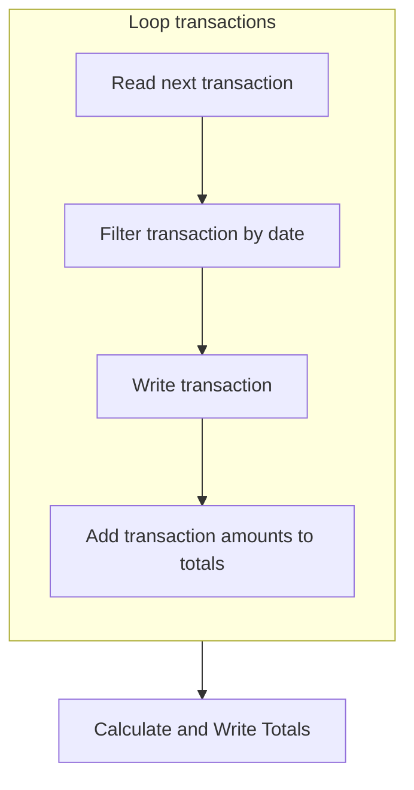

The document provides a detailed overview of the transaction detail report generation process. It explains how the program processes transaction records, and generates the final report.



<SwmSnippet path="/app/cbl/CBTRN03C.cbl" line="170" repo-id="Z2l0aHViJTNBJTNBa3luZHJ5bC1hd3MtbWFpbmZyYW1lLW1vZGVybml6YXRpb24tY2FyZGRlbW8lM0ElM0FTd2ltbS1EZW1v">

---

## Processing transactions

First, the program enters a loop that continues until the end of the file is reached. Within this loop, it reads the next transaction record and checks if the transaction's timestamp falls within the specified date range.

```cobol
           PERFORM UNTIL END-OF-FILE = 'Y'                                      
             IF END-OF-FILE = 'N'                                               
                PERFORM 1000-TRANFILE-GET-NEXT                                  
                IF TRAN-PROC-TS (1:10) >= WS-START-DATE                         
                   AND TRAN-PROC-TS (1:10) <= WS-END-DATE                       
                   CONTINUE                                                     
                ELSE                                                            
                   NEXT SENTENCE                                                
                END-IF                                                          
```

---

</SwmSnippet>

<SwmSnippet path="app/cbl/CBTRN03C.cbl" line="179" repo-id="Z2l0aHViJTNBJTNBa3luZHJ5bC1hd3MtbWFpbmZyYW1lLW1vZGVybml6YXRpb24tY2FyZGRlbW8lM0ElM0FTd2ltbS1EZW1v">

---

If the transaction is within the date range, it processes the transaction record, updating various totals and writing transaction details to the report. If the current card number changes, it writes the account totals to the report.

```
                IF END-OF-FILE = 'N'                                            
                   DISPLAY TRAN-RECORD                                          
                   IF WS-CURR-CARD-NUM NOT= TRAN-CARD-NUM                       
                     IF WS-FIRST-TIME = 'N'                                     
                       PERFORM 1120-WRITE-ACCOUNT-TOTALS                        
                     END-IF                                                     
                     MOVE TRAN-CARD-NUM TO WS-CURR-CARD-NUM                     
                     MOVE TRAN-CARD-NUM TO FD-XREF-CARD-NUM                     
                     PERFORM 1500-A-LOOKUP-XREF                                 
                   END-IF                                                       
                   MOVE TRAN-TYPE-CD OF TRAN-RECORD TO FD-TRAN-TYPE             
                   PERFORM 1500-B-LOOKUP-TRANTYPE                               
                   MOVE TRAN-TYPE-CD OF TRAN-RECORD                             
                     TO FD-TRAN-TYPE-CD OF FD-TRAN-CAT-KEY                      
                   MOVE TRAN-CAT-CD OF TRAN-RECORD                              
                     TO FD-TRAN-CAT-CD OF FD-TRAN-CAT-KEY                       
                   PERFORM 1500-C-LOOKUP-TRANCATG                               
                   PERFORM 1100-WRITE-TRANSACTION-REPORT                        
```

---

</SwmSnippet>

<SwmSnippet path="app/cbl/CBTRN03C.cbl" line="197" repo-id="Z2l0aHViJTNBJTNBa3luZHJ5bC1hd3MtbWFpbmZyYW1lLW1vZGVybml6YXRpb24tY2FyZGRlbW8lM0ElM0FTd2ltbS1EZW1v">

---

Finally, it writes end of report totals.

```
                ELSE                                                            
                 DISPLAY 'TRAN-AMT ' TRAN-AMT                                   
                 DISPLAY 'WS-PAGE-TOTAL'  WS-PAGE-TOTAL                         
                 ADD TRAN-AMT TO WS-PAGE-TOTAL                                  
                                 WS-ACCOUNT-TOTAL                               
                 PERFORM 1110-WRITE-PAGE-TOTALS                                 
                 PERFORM 1110-WRITE-GRAND-TOTALS                                
                END-IF                                                          
```

---

</SwmSnippet>

<SwmSnippet path="/app/cbl/CBTRN03C.cbl" line="248" repo-id="Z2l0aHViJTNBJTNBa3luZHJ5bC1hd3MtbWFpbmZyYW1lLW1vZGVybml6YXRpb24tY2FyZGRlbW8lM0ElM0FTd2ltbS1EZW1v">

---

## Reading next transaction

The <SwmToken path="/app/cbl/CBTRN03C.cbl" pos="248:1:7" line-data="       1000-TRANFILE-GET-NEXT.                                                  " repo-id="Z2l0aHViJTNBJTNBa3luZHJ5bC1hd3MtbWFpbmZyYW1lLW1vZGVybml6YXRpb24tY2FyZGRlbW8lM0ElM0FTd2ltbS1EZW1v" repo-name="aws-mainframe-modernization-carddemo">`1000-TRANFILE-GET-NEXT`</SwmToken> function reads the next transaction record from the transaction file and evaluates the status of the file operation. If the read operation is successful, it continues processing.

```cobol
       1000-TRANFILE-GET-NEXT.                                                  
           READ TRANSACT-FILE INTO TRAN-RECORD.                                 
                                                                                
           EVALUATE TRANFILE-STATUS                                             
             WHEN '00'                                                          
                 MOVE 0 TO APPL-RESULT                                          
             WHEN '10'                                                          
                 MOVE 16 TO APPL-RESULT                                         
             WHEN OTHER                                                         
                 MOVE 12 TO APPL-RESULT                                         
           END-EVALUATE                                                         
                                                                                
           IF APPL-AOK                                                          
              CONTINUE                                                          
           ELSE                                                                 
              IF APPL-EOF                                                       
                 MOVE 'Y' TO END-OF-FILE                                        
              ELSE                                                              
                 DISPLAY 'ERROR READING TRANSACTION FILE'                       
                 MOVE TRANFILE-STATUS TO IO-STATUS                              
                 PERFORM 9910-DISPLAY-IO-STATUS                                 
                 PERFORM 9999-ABEND-PROGRAM                                     
              END-IF                                                            
           END-IF                                                               
```

---

</SwmSnippet>

<SwmSnippet path="/app/cbl/CBTRN03C.cbl" line="274" repo-id="Z2l0aHViJTNBJTNBa3luZHJ5bC1hd3MtbWFpbmZyYW1lLW1vZGVybml6YXRpb24tY2FyZGRlbW8lM0ElM0FTd2ltbS1EZW1v">

---

## Writing transaction report

The <SwmToken path="/app/cbl/CBTRN03C.cbl" pos="274:1:7" line-data="       1100-WRITE-TRANSACTION-REPORT.                                           " repo-id="Z2l0aHViJTNBJTNBa3luZHJ5bC1hd3MtbWFpbmZyYW1lLW1vZGVybml6YXRpb24tY2FyZGRlbW8lM0ElM0FTd2ltbS1EZW1v" repo-name="aws-mainframe-modernization-carddemo">`1100-WRITE-TRANSACTION-REPORT`</SwmToken> function is responsible for writing the transaction report. It starts by checking if it is the first time the report is being written and, if so, writes the headers. It then adds the transaction amount to the page and account totals and writes the transaction details to the report.

```cobol
       1100-WRITE-TRANSACTION-REPORT.                                           
           IF WS-FIRST-TIME = 'Y'                                               
              MOVE 'N' TO WS-FIRST-TIME                                         
              MOVE WS-START-DATE TO REPT-START-DATE                             
              MOVE WS-END-DATE TO REPT-END-DATE                                 
              PERFORM 1120-WRITE-HEADERS                                        
           END-IF                                                               
                                                                                
           IF FUNCTION MOD(WS-LINE-COUNTER, WS-PAGE-SIZE) = 0                   
              PERFORM 1110-WRITE-PAGE-TOTALS                                    
              PERFORM 1120-WRITE-HEADERS                                        
           END-IF                                                               
                                                                                
           ADD TRAN-AMT TO WS-PAGE-TOTAL                                        
                           WS-ACCOUNT-TOTAL                                     
           PERFORM 1120-WRITE-DETAIL                                            
           EXIT.                                                                
```

---

</SwmSnippet>

&nbsp;

*This is an auto-generated document by Swimm 🌊 and has not yet been verified by a human*

<SwmMeta version="3.0.0"><sup>Powered by [Swimm](https://app.swimm.io/)</sup></SwmMeta>
