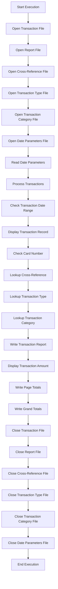
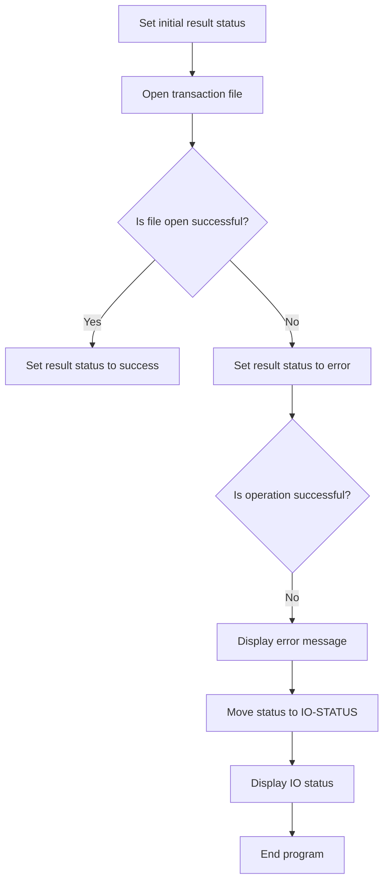
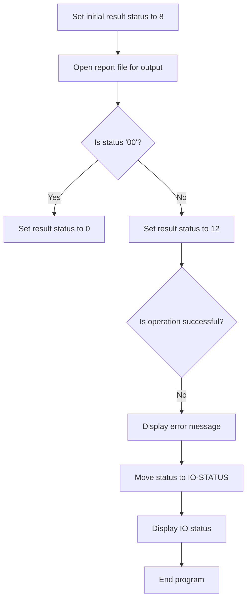
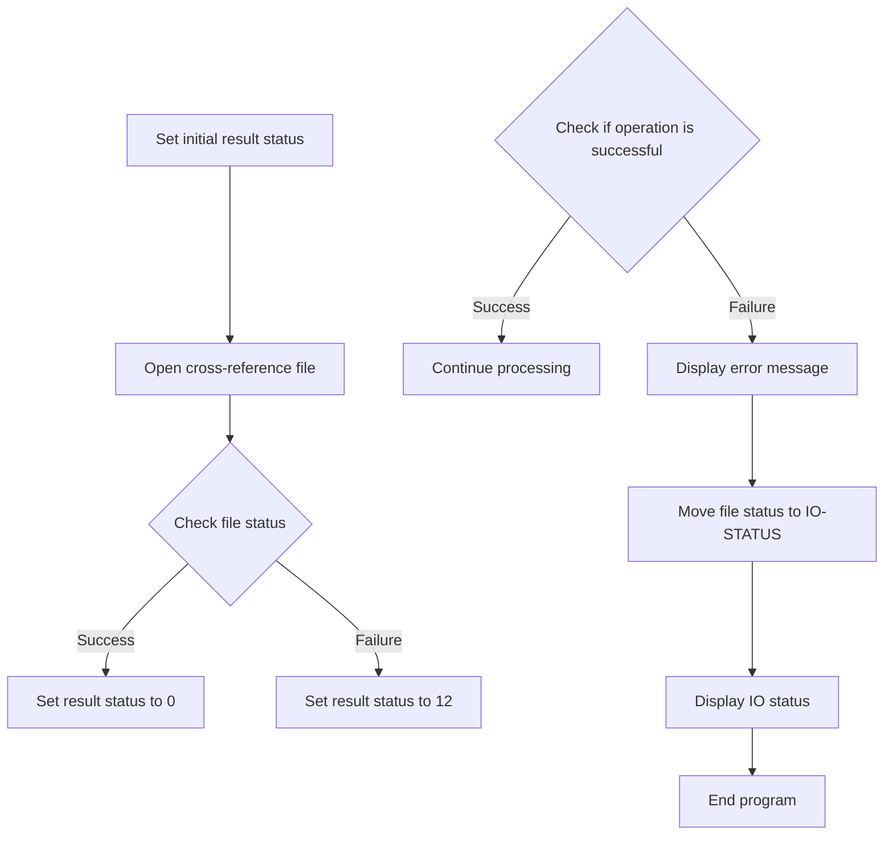

The <SwmToken path="app/cbl/CBTRN03C.cbl" pos="160:14:14" line-data="           DISPLAY &#39;START OF EXECUTION OF PROGRAM CBTRN03C&#39;.                    ">`CBTRN03C`</SwmToken> program is a batch COBOL program designed to print transaction detail reports in the <SwmToken path="app/cbl/CBTRN03C.cbl" pos="3:7:7" line-data="      * Application : CardDemo                                          ">`CardDemo`</SwmToken> application. This program processes transaction data by opening necessary files, reading and processing transactions, and generating detailed reports. The input for this program includes transaction files, report files, cross-reference files, transaction type files, transaction category files, and date parameters files. The output is a detailed transaction report.

For instance, the program reads transaction records, checks if they fall within a specified date range, and then processes and displays the transaction details. If the transaction card number changes, it writes account totals and continues processing until all transactions are handled.

# Where is this program used?

This program is used multiple times in the codebase as represented in the following diagram:

```mermaid
graph TD
TRANREPT("TRANREPT") --> CBTRN03C("Printing Transaction Detail Reports (CBTRN03C)"):::currentEntity
TRANREPT("TRANREPT") --> CBTRN03C("Printing Transaction Detail Reports (CBTRN03C)"):::currentEntity
  classDef currentEntity color:#000000,fill:#7CB9F4

%% Swimm:
%% graph TD
%% TRANREPT("TRANREPT") --> <SwmToken path="app/cbl/CBTRN03C.cbl" pos="160:14:14" line-data="           DISPLAY &#39;START OF EXECUTION OF PROGRAM CBTRN03C&#39;.                    ">`CBTRN03C`</SwmToken>("Printing Transaction Detail Reports (<SwmToken path="app/cbl/CBTRN03C.cbl" pos="160:14:14" line-data="           DISPLAY &#39;START OF EXECUTION OF PROGRAM CBTRN03C&#39;.                    ">`CBTRN03C`</SwmToken>)"):::currentEntity
%% TRANREPT("TRANREPT") --> <SwmToken path="app/cbl/CBTRN03C.cbl" pos="160:14:14" line-data="           DISPLAY &#39;START OF EXECUTION OF PROGRAM CBTRN03C&#39;.                    ">`CBTRN03C`</SwmToken>("Printing Transaction Detail Reports (<SwmToken path="app/cbl/CBTRN03C.cbl" pos="160:14:14" line-data="           DISPLAY &#39;START OF EXECUTION OF PROGRAM CBTRN03C&#39;.                    ">`CBTRN03C`</SwmToken>)"):::currentEntity
%%   classDef currentEntity color:#000000,fill:#7CB9F4
```



# Generate transaction reports (`PROCEDURE-DIVISION`)

Lets' zoom into the program flow:



<SwmSnippet path="/app/cbl/CBTRN03C.cbl" line="159">

---

### Initializing Files

Going into the PROCEDURE-DIVISION, the program starts by displaying a message indicating the start of execution. It then performs a series of operations to open various files necessary for processing transactions. These include the transaction file, report file, cross-reference file, transaction type file, transaction category file, and date parameters file.

```cobol
       PROCEDURE DIVISION.                                                      
           DISPLAY 'START OF EXECUTION OF PROGRAM CBTRN03C'.                    
           PERFORM 0000-TRANFILE-OPEN.                                          
           PERFORM 0100-REPTFILE-OPEN.                                          
           PERFORM 0200-CARDXREF-OPEN.                                          
           PERFORM 0300-TRANTYPE-OPEN.                                          
           PERFORM 0400-TRANCATG-OPEN.                                          
           PERFORM 0500-DATEPARM-OPEN.                                          
                                                                                
           PERFORM 0550-DATEPARM-READ.                                          
```

---

</SwmSnippet>

<SwmSnippet path="/app/cbl/CBTRN03C.cbl" line="170">

---

### Processing Transactions

Next, the program enters a loop that continues until the end of the file is reached. Within this loop, it checks if the end of the file has not been reached and then performs the operation to get the next transaction record.

```cobol
           PERFORM UNTIL END-OF-FILE = 'Y'                                      
             IF END-OF-FILE = 'N'                                               
                PERFORM 1000-TRANFILE-GET-NEXT                                  
```

---

</SwmSnippet>

<SwmSnippet path="/app/cbl/CBTRN03C.cbl" line="173">

---

### Checking Transaction Date Range

Then, the program checks if the transaction processing timestamp falls within the specified start and end dates. If it does, it continues processing; otherwise, it moves to the next sentence.

```cobol
                IF TRAN-PROC-TS (1:10) >= WS-START-DATE                         
                   AND TRAN-PROC-TS (1:10) <= WS-END-DATE                       
                   CONTINUE                                                     
                ELSE                                                            
                   NEXT SENTENCE                                                
                END-IF                                                          
```

---

</SwmSnippet>

<SwmSnippet path="/app/cbl/CBTRN03C.cbl" line="179">

---

### Displaying Transaction Record

If the end of the file has not been reached, the program displays the transaction record. It then checks if the current card number is different from the transaction card number. If it is, and it's not the first time, it performs the operation to write account totals.

```cobol
                IF END-OF-FILE = 'N'                                            
                   DISPLAY TRAN-RECORD                                          
                   IF WS-CURR-CARD-NUM NOT= TRAN-CARD-NUM                       
                     IF WS-FIRST-TIME = 'N'                                     
                       PERFORM 1120-WRITE-ACCOUNT-TOTALS                        
                     END-IF                                                     
                     MOVE TRAN-CARD-NUM TO WS-CURR-CARD-NUM                     
                     MOVE TRAN-CARD-NUM TO FD-XREF-CARD-NUM                     
                     PERFORM 1500-A-LOOKUP-XREF                                 
                   END-IF                                                       
```

---

</SwmSnippet>

<SwmSnippet path="/app/cbl/CBTRN03C.cbl" line="189">

---

### Looking Up Transaction Type

Moving to the next step, the program moves the transaction type code from the transaction record and performs the operation to look up the transaction type.

```cobol
                   MOVE TRAN-TYPE-CD OF TRAN-RECORD TO FD-TRAN-TYPE             
                   PERFORM 1500-B-LOOKUP-TRANTYPE                               
```

---

</SwmSnippet>

<SwmSnippet path="/app/cbl/CBTRN03C.cbl" line="191">

---

### Looking Up Transaction Category

Next, the program moves the transaction type code and transaction category code from the transaction record and performs the operation to look up the transaction category.

```cobol
                   MOVE TRAN-TYPE-CD OF TRAN-RECORD                             
                     TO FD-TRAN-TYPE-CD OF FD-TRAN-CAT-KEY                      
                   MOVE TRAN-CAT-CD OF TRAN-RECORD                              
                     TO FD-TRAN-CAT-CD OF FD-TRAN-CAT-KEY                       
                   PERFORM 1500-C-LOOKUP-TRANCATG                               
```

---

</SwmSnippet>

<SwmSnippet path="/app/cbl/CBTRN03C.cbl" line="197">

---

### Writing Totals

If the transaction amount is displayed, the program adds the transaction amount to the page total and account total. It then performs the operations to write page totals and grand totals.

```cobol
                ELSE                                                            
                 DISPLAY 'TRAN-AMT ' TRAN-AMT                                   
                 DISPLAY 'WS-PAGE-TOTAL'  WS-PAGE-TOTAL                         
                 ADD TRAN-AMT TO WS-PAGE-TOTAL                                  
                                 WS-ACCOUNT-TOTAL                               
                 PERFORM 1110-WRITE-PAGE-TOTALS                                 
                 PERFORM 1110-WRITE-GRAND-TOTALS                                
                END-IF                                                          
```

---

</SwmSnippet>

<SwmSnippet path="/app/cbl/CBTRN03C.cbl" line="208">

---

### Closing Files

Finally, the program performs a series of operations to close the transaction file, report file, cross-reference file, transaction type file, transaction category file, and date parameters file. It then displays a message indicating the end of execution and returns control to the operating system.

```cobol
           PERFORM 9000-TRANFILE-CLOSE.                                         
           PERFORM 9100-REPTFILE-CLOSE.                                         
           PERFORM 9200-CARDXREF-CLOSE.                                         
           PERFORM 9300-TRANTYPE-CLOSE.                                         
           PERFORM 9400-TRANCATG-CLOSE.                                         
           PERFORM 9500-DATEPARM-CLOSE.                                         
                                                                                
           DISPLAY 'END OF EXECUTION OF PROGRAM CBTRN03C'.                      
                                                                                
           GOBACK.                                                              
```

---

</SwmSnippet>

# Open Transaction File (<SwmToken path="app/cbl/CBTRN03C.cbl" pos="161:3:7" line-data="           PERFORM 0000-TRANFILE-OPEN.                                          ">`0000-TRANFILE-OPEN`</SwmToken>)

Lets' zoom into the program flow:



<SwmSnippet path="/app/cbl/CBTRN03C.cbl" line="376">

---

### Setting initial result status and opening the transaction file

Going into the first snippet, the code sets an initial result status to indicate a pending operation. It then attempts to open the transaction file. If the file opens successfully, the result status is updated to indicate success. Otherwise, it is set to indicate an error.

```cobol
       0000-TRANFILE-OPEN.                                                      
           MOVE 8 TO APPL-RESULT.                                               
           OPEN INPUT TRANSACT-FILE                                             
           IF TRANFILE-STATUS = '00'                                            
              MOVE 0 TO APPL-RESULT                                             
           ELSE                                                                 
              MOVE 12 TO APPL-RESULT                                            
           END-IF                                                               
```

---

</SwmSnippet>

<SwmSnippet path="/app/cbl/CBTRN03C.cbl" line="384">

---

### Handling file open errors

Next, the code checks if the operation was successful by evaluating the status flag. If the operation was not successful, it displays an error message, moves the file status to a status variable, and performs a routine to display the IO status. Finally, it ends the program due to the error.

```cobol
           IF APPL-AOK                                                          
              CONTINUE                                                          
           ELSE                                                                 
              DISPLAY 'ERROR OPENING TRANFILE'                                  
              MOVE TRANFILE-STATUS TO IO-STATUS                                 
              PERFORM 9910-DISPLAY-IO-STATUS                                    
              PERFORM 9999-ABEND-PROGRAM                                        
           END-IF                                                               
           EXIT.                                                                
```

---

</SwmSnippet>

# Display IO Status (<SwmToken path="app/cbl/CBTRN03C.cbl" pos="389:3:9" line-data="              PERFORM 9910-DISPLAY-IO-STATUS                                    ">`9910-DISPLAY-IO-STATUS`</SwmToken>)

<SwmSnippet path="/app/cbl/CBTRN03C.cbl" line="633">

---

### Displaying File Operation Status

Going into the <SwmToken path="app/cbl/CBTRN03C.cbl" pos="633:1:7" line-data="       9910-DISPLAY-IO-STATUS.                                                  ">`9910-DISPLAY-IO-STATUS`</SwmToken> function, it first checks if the file operation status is not numeric or if it indicates a critical error. If either condition is true, it formats and displays the file status accordingly. Otherwise, it sets a default success status and displays it.

```cobol
       9910-DISPLAY-IO-STATUS.                                                  
           IF IO-STATUS NOT NUMERIC                                             
              OR IO-STAT1 = '9'                                                 
              MOVE IO-STAT1 TO IO-STATUS-04(1:1)                                
              MOVE 0 TO TWO-BYTES-BINARY                                        
              MOVE IO-STAT2 TO TWO-BYTES-RIGHT                                  
              MOVE TWO-BYTES-BINARY TO IO-STATUS-0403                           
              DISPLAY 'FILE STATUS IS: NNNN' IO-STATUS-04                       
           ELSE                                                                 
              MOVE '0000' TO IO-STATUS-04                                       
              MOVE IO-STATUS TO IO-STATUS-04(3:2)                               
              DISPLAY 'FILE STATUS IS: NNNN' IO-STATUS-04                       
           END-IF                                                               
           EXIT.                                                                
```

---

</SwmSnippet>

# Open Report File for Writing (<SwmToken path="app/cbl/CBTRN03C.cbl" pos="162:3:7" line-data="           PERFORM 0100-REPTFILE-OPEN.                                          ">`0100-REPTFILE-OPEN`</SwmToken>)

Lets' zoom into the program flow:



<SwmSnippet path="/app/cbl/CBTRN03C.cbl" line="394">

---

### Setting initial result status and opening the report file

Going into the <SwmToken path="app/cbl/CBTRN03C.cbl" pos="394:1:5" line-data="       0100-REPTFILE-OPEN.                                                      ">`0100-REPTFILE-OPEN`</SwmToken> function, the initial step is to set the result status to indicate the operation has started. This is followed by an attempt to open the report file for output. If the file operation is successful, the result status is updated to indicate success. Otherwise, it is set to indicate an error.

```cobol
       0100-REPTFILE-OPEN.                                                      
           MOVE 8 TO APPL-RESULT.                                               
           OPEN OUTPUT REPORT-FILE                                              
           IF TRANREPT-STATUS = '00'                                            
              MOVE 0 TO APPL-RESULT                                             
           ELSE                                                                 
              MOVE 12 TO APPL-RESULT                                            
           END-IF                                                               
```

---

</SwmSnippet>

<SwmSnippet path="/app/cbl/CBTRN03C.cbl" line="402">

---

### Handling the result of the file open operation

Next, the function checks if the operation was successful. If it was, the process continues without any issues. However, if there was an error, an error message is displayed, the status of the file operation is moved to the IO status variable, and the program displays the IO status before ending the program.

```cobol
           IF APPL-AOK                                                          
              CONTINUE                                                          
           ELSE                                                                 
              DISPLAY 'ERROR OPENING REPTFILE'                                  
              MOVE TRANREPT-STATUS TO IO-STATUS                                 
              PERFORM 9910-DISPLAY-IO-STATUS                                    
              PERFORM 9999-ABEND-PROGRAM                                        
           END-IF                                                               
           EXIT.                                                                
```

---

</SwmSnippet>

# Open Cross-Reference File (<SwmToken path="app/cbl/CBTRN03C.cbl" pos="163:3:7" line-data="           PERFORM 0200-CARDXREF-OPEN.                                          ">`0200-CARDXREF-OPEN`</SwmToken>)

Lets' zoom into the program flow:



<SwmSnippet path="/app/cbl/CBTRN03C.cbl" line="412">

---

### Opening the cross-reference file

Going into the <SwmToken path="app/cbl/CBTRN03C.cbl" pos="412:1:5" line-data="       0200-CARDXREF-OPEN.                                                      ">`0200-CARDXREF-OPEN`</SwmToken> function, the initial step is to set the operation result status to indicate an initial state. The function then attempts to open the cross-reference file. If the file is successfully opened, the result status is updated to indicate success. Otherwise, the result status is set to indicate a failure.

```cobol
       0200-CARDXREF-OPEN.                                                      
           MOVE 8 TO APPL-RESULT.                                               
           OPEN INPUT XREF-FILE                                                 
           IF  CARDXREF-STATUS = '00'                                           
               MOVE 0 TO APPL-RESULT                                            
           ELSE                                                                 
               MOVE 12 TO APPL-RESULT                                           
           END-IF                                                               
```

---

</SwmSnippet>

<SwmSnippet path="/app/cbl/CBTRN03C.cbl" line="420">

---

### Handling file open status

Next, the function checks if the operation was successful by evaluating the status flag. If the operation was successful, it continues processing. Otherwise, it displays an error message indicating that there was an issue opening the cross-reference file, updates the IO status to reflect the file status, and performs necessary steps to display the IO status and terminate the program to prevent further processing.

```cobol
           IF  APPL-AOK                                                         
               CONTINUE                                                         
           ELSE                                                                 
               DISPLAY 'ERROR OPENING CROSS REF FILE'                           
               MOVE CARDXREF-STATUS TO IO-STATUS                                
               PERFORM 9910-DISPLAY-IO-STATUS                                   
               PERFORM 9999-ABEND-PROGRAM                                       
           END-IF                                                               
           EXIT.                                                                
```

---

</SwmSnippet>

&nbsp;

*This is an auto-generated document by Swimm 🌊 and has not yet been verified by a human*

<SwmMeta version="3.0.0" repo-id="Z2l0aHViJTNBJTNBa3luZHJ5bC1hd3MtbWFpbmZyYW1lLW1vZGVybml6YXRpb24tY2FyZGRlbW8lM0ElM0FTd2ltbS1EZW1v" repo-name="kyndryl-aws-mainframe-modernization-carddemo"><sup>Powered by [Swimm](/)</sup></SwmMeta>
