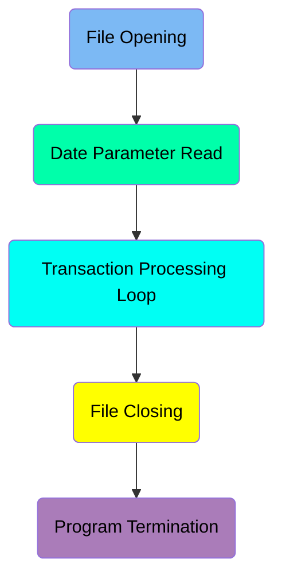
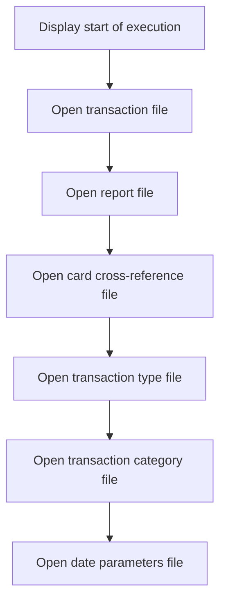
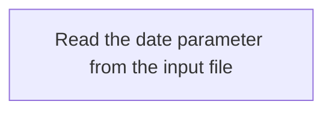
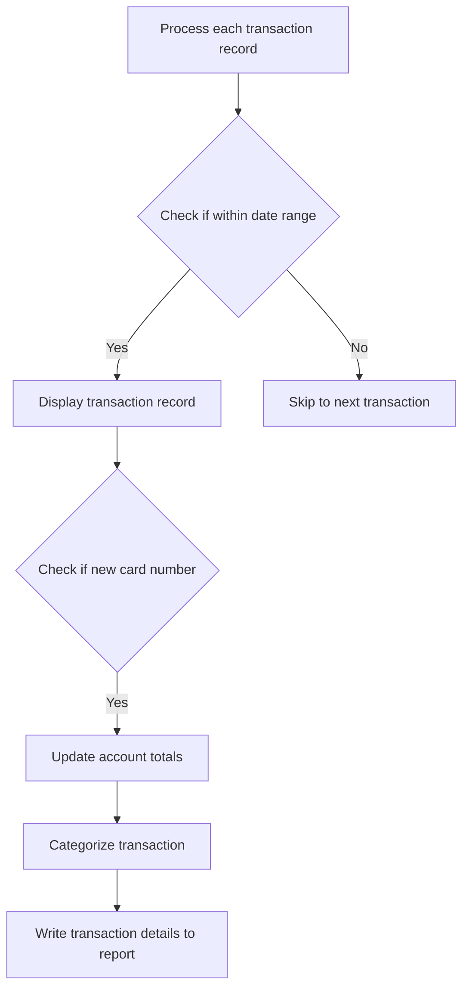
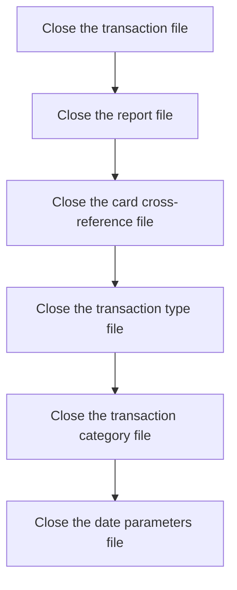
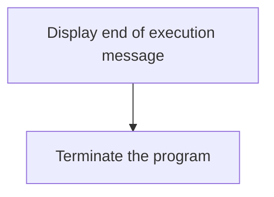

The document describes the process of printing a transaction detail report using the <SwmToken path="app/cbl/CBTRN03C.cbl" pos="161:14:14" line-data="           DISPLAY &#39;START OF EXECUTION OF PROGRAM CBTRN03C&#39;.                    ">`CBTRN03C`</SwmToken> program. This batch COBOL program reads, processes, and formats transaction data from various input files to generate a comprehensive report. The process involves opening necessary files, reading date parameters, processing each transaction, and finally closing the files and terminating the program.

The flow involves opening the required files, reading date parameters, processing transactions within the specified date range, updating account totals, categorizing transactions, writing transaction details to the report, and finally closing the files and terminating the program.

Here is a high level diagram of the program:



## File Opening

First, we'll zoom into this section of the flow:



<SwmSnippet path="/app/cbl/CBTRN03C.cbl" line="161">

---

The program begins by displaying a message indicating the start of execution. This helps in tracking the program's execution flow and is useful for debugging and monitoring purposes.

```cobol
           DISPLAY 'START OF EXECUTION OF PROGRAM CBTRN03C'.                    
```

---

</SwmSnippet>

<SwmSnippet path="/app/cbl/CBTRN03C.cbl" line="162">

---

Next, the program opens the transaction file for input. This file contains the transaction records that will be processed to generate the transaction detail report.

```cobol
           PERFORM 0000-TRANFILE-OPEN.                                          
```

---

</SwmSnippet>

<SwmSnippet path="/app/cbl/CBTRN03C.cbl" line="163">

---

The program then opens the report file for output. This file will store the generated transaction detail report.

```cobol
           PERFORM 0100-REPTFILE-OPEN.                                          
```

---

</SwmSnippet>

<SwmSnippet path="/app/cbl/CBTRN03C.cbl" line="164">

---

Following this, the program opens the card cross-reference file. This file is used to map card numbers to account IDs, which is essential for processing transactions.

```cobol
           PERFORM 0200-CARDXREF-OPEN.                                          
```

---

</SwmSnippet>

<SwmSnippet path="/app/cbl/CBTRN03C.cbl" line="165">

---

The program then opens the transaction type file. This file contains information about different transaction types, which is necessary for categorizing transactions in the report.

```cobol
           PERFORM 0300-TRANTYPE-OPEN.                                          
```

---

</SwmSnippet>

<SwmSnippet path="/app/cbl/CBTRN03C.cbl" line="166">

---

Next, the program opens the transaction category file. This file provides details about transaction categories, which are used to further classify transactions in the report.

```cobol
           PERFORM 0400-TRANCATG-OPEN.                                          
```

---

</SwmSnippet>

<SwmSnippet path="/app/cbl/CBTRN03C.cbl" line="167">

---

Finally, the program opens the date parameters file. This file contains date-related parameters that are used to filter transactions based on the reporting period.

```cobol
           PERFORM 0500-DATEPARM-OPEN.                                          
```

---

</SwmSnippet>

## Date Parameter Read

Now, lets zoom into this section of the flow:



## Transaction Processing Loop

Now, lets zoom into this section of the flow:



<SwmSnippet path="/app/cbl/CBTRN03C.cbl" line="171">

---

First, the program processes each transaction record until the end of the file is reached. This ensures that all transactions are considered for the report.

```cobol
           PERFORM UNTIL END-OF-FILE = 'Y'                                      
             IF END-OF-FILE = 'N'                                               
```

---

</SwmSnippet>

<SwmSnippet path="/app/cbl/CBTRN03C.cbl" line="174">

---

Next, it checks if the transaction date falls within the specified start and end dates. If the transaction is within the date range, it proceeds to display the transaction record.

```cobol
                IF TRAN-PROC-TS (1:10) >= WS-START-DATE                         
                   AND TRAN-PROC-TS (1:10) <= WS-END-DATE                       
                   CONTINUE                                                     
                ELSE                                                            
                   NEXT SENTENCE                                                
                END-IF                                                          
                IF END-OF-FILE = 'N'                                            
                   DISPLAY TRAN-RECORD                                          
```

---

</SwmSnippet>

<SwmSnippet path="/app/cbl/CBTRN03C.cbl" line="182">

---

Then, the program updates the account totals if a new card number is encountered and categorizes the transaction based on its type and category. Finally, it writes the transaction details to the report.

```cobol
                   IF WS-CURR-CARD-NUM NOT= TRAN-CARD-NUM                       
                     IF WS-FIRST-TIME = 'N'                                     
                       PERFORM 1120-WRITE-ACCOUNT-TOTALS                        
                     END-IF                                                     
                     MOVE TRAN-CARD-NUM TO WS-CURR-CARD-NUM                     
                     MOVE TRAN-CARD-NUM TO FD-XREF-CARD-NUM                     
                     PERFORM 1500-A-LOOKUP-XREF                                 
                   END-IF                                                       
                   MOVE TRAN-TYPE-CD OF TRAN-RECORD TO FD-TRAN-TYPE             
                   PERFORM 1500-B-LOOKUP-TRANTYPE                               
                   MOVE TRAN-TYPE-CD OF TRAN-RECORD                             
                     TO FD-TRAN-TYPE-CD OF FD-TRAN-CAT-KEY                      
                   MOVE TRAN-CAT-CD OF TRAN-RECORD                              
                     TO FD-TRAN-CAT-CD OF FD-TRAN-CAT-KEY                       
                   PERFORM 1500-C-LOOKUP-TRANCATG                               
                   PERFORM 1100-WRITE-TRANSACTION-REPORT                        
```

---

</SwmSnippet>

## File Closing

Now, lets zoom into this section of the flow:



<SwmSnippet path="/app/cbl/CBTRN03C.cbl" line="209">

---

The final steps in the MAIN function involve closing various files that were used during the generation of the transaction detail report. This ensures that all file operations are properly terminated and resources are released. The transaction file, report file, card cross-reference file, transaction type file, transaction category file, and date parameters file are all closed in sequence to maintain data integrity and prevent any potential file handling issues.

```cobol
           PERFORM 9000-TRANFILE-CLOSE.                                         
           PERFORM 9100-REPTFILE-CLOSE.                                         
           PERFORM 9200-CARDXREF-CLOSE.                                         
           PERFORM 9300-TRANTYPE-CLOSE.                                         
           PERFORM 9400-TRANCATG-CLOSE.                                         
           PERFORM 9500-DATEPARM-CLOSE.                                         
```

---

</SwmSnippet>

## Program Termination

This is the next section of the flow.



<SwmSnippet path="/app/cbl/CBTRN03C.cbl" line="216">

---

The program displays a message indicating the end of execution for the transaction detail report generation. This message serves as a confirmation that the report generation process has completed successfully.

```cobol
           DISPLAY 'END OF EXECUTION OF PROGRAM CBTRN03C'.                      
```

---

</SwmSnippet>

<SwmSnippet path="/app/cbl/CBTRN03C.cbl" line="218">

---

After displaying the end of execution message, the program terminates. This step ensures that all resources are released and the program ends gracefully.

```cobol
           GOBACK.                                                              
```

---

</SwmSnippet>

&nbsp;

*This is an auto-generated document by Swimm 🌊 and has not yet been verified by a human*

<SwmMeta version="3.0.0" repo-id="Z2l0aHViJTNBJTNBa3luZHJ5bC1hd3MtbWFpbmZyYW1lLW1vZGVybml6YXRpb24tY2FyZGRlbW8lM0ElM0FTd2ltbS1EZW1v" repo-name="kyndryl-aws-mainframe-modernization-carddemo"><sup>Powered by [Swimm](/)</sup></SwmMeta>
