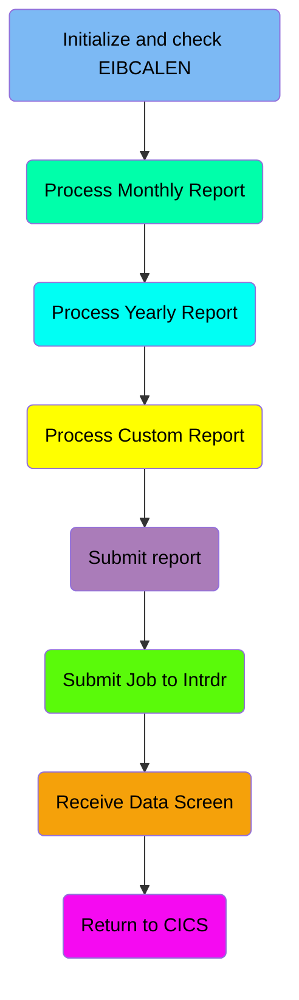
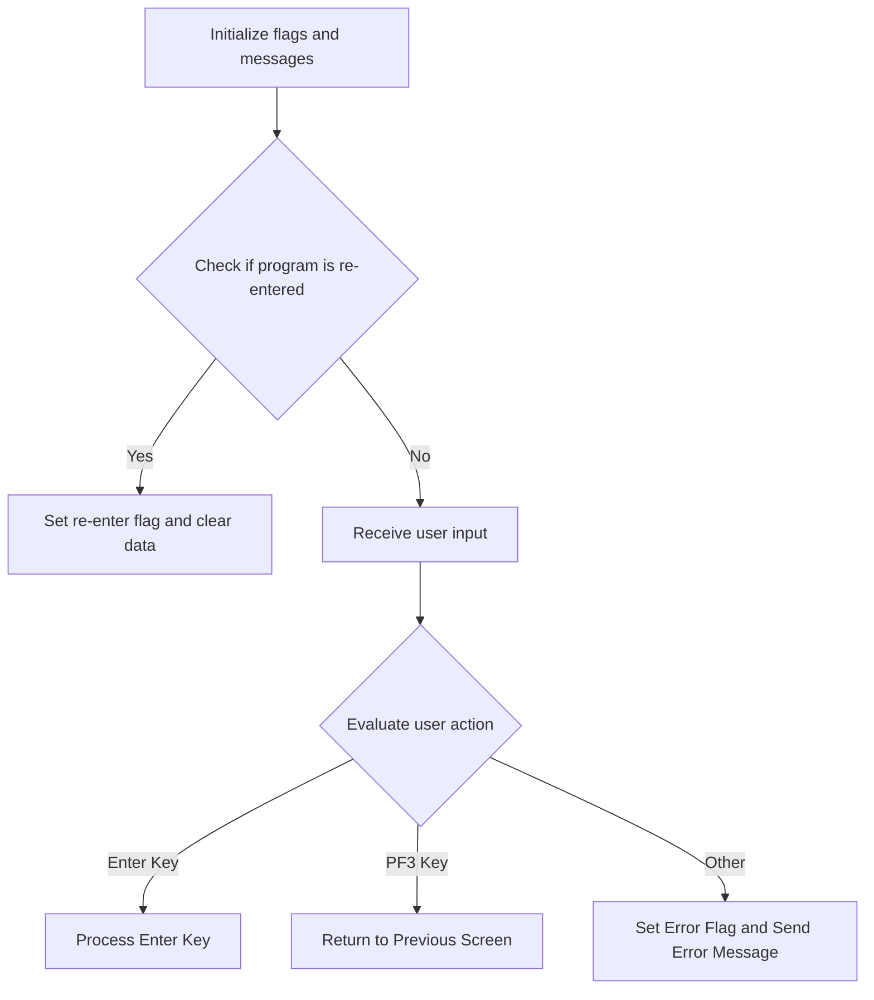
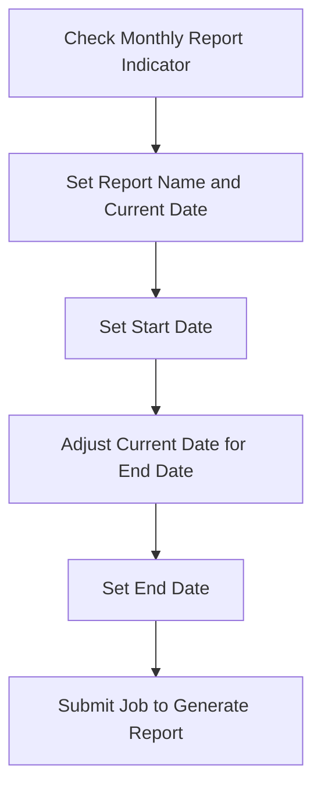
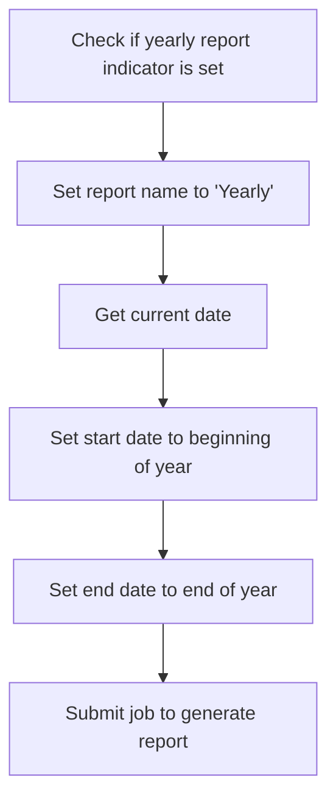
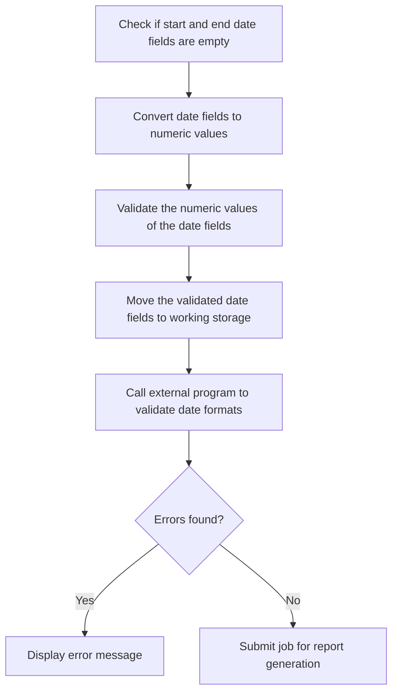
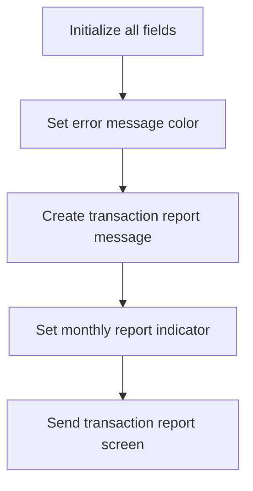
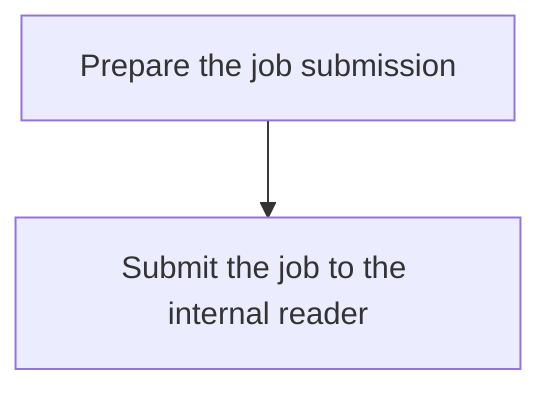
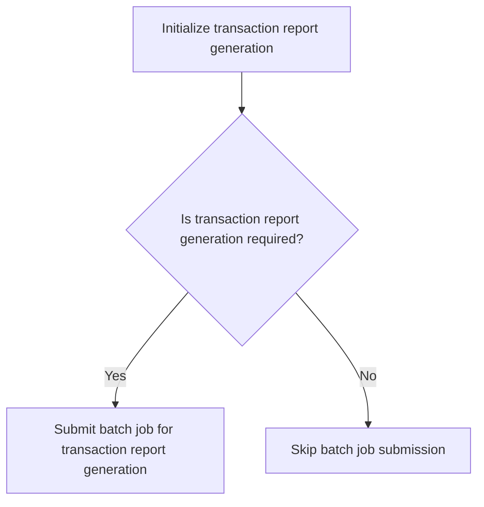
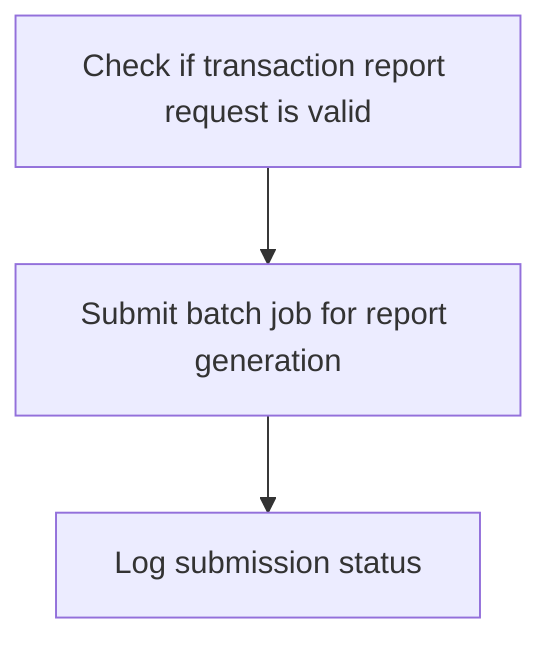

The document describes the process of printing transaction reports using the <SwmToken path="app/cbl/CORPT00C.cbl" pos="2:7:7" line-data="      * Program     : CORPT00C.CBL">`CORPT00C`</SwmToken> program. This program is part of the <SwmToken path="app/cbl/CORPT00C.cbl" pos="3:7:7" line-data="      * Application : CardDemo">`CardDemo`</SwmToken> application and is a CICS COBOL program designed to generate transaction reports by submitting batch jobs from an online interface using extra partition TDQ. The flow involves initializing and checking various parameters, processing different types of reports (monthly, yearly, and custom), submitting the report, and handling the job submission to the internal reader.

The flow starts with initializing and checking parameters, followed by processing monthly, yearly, and custom reports. Each report type has specific steps for setting dates and submitting jobs. The process concludes with submitting the report and handling the job submission to the internal reader.

Here is a high level diagram of the program:



## Initialize and check EIBCALEN

First, we'll zoom into this section of the flow:



<SwmSnippet path="/app/cbl/CORPT00C.cbl" line="163">

---

First, the program initializes several flags and messages to their default states. This includes setting the error flag (<SwmToken path="app/cbl/CORPT00C.cbl" pos="165:3:7" line-data="           SET ERR-FLG-OFF TO TRUE">`ERR-FLG-OFF`</SwmToken>), transaction not end-of-file flag (<SwmToken path="app/cbl/CORPT00C.cbl" pos="166:3:7" line-data="           SET TRANSACT-NOT-EOF TO TRUE">`TRANSACT-NOT-EOF`</SwmToken>), and the send erase flag (<SwmToken path="app/cbl/CORPT00C.cbl" pos="167:3:7" line-data="           SET SEND-ERASE-YES TO TRUE">`SEND-ERASE-YES`</SwmToken>) to indicate no errors, more transactions to process, and that the screen should be erased when sent, respectively.

```cobol
       MAIN-PARA SECTION.

           SET ERR-FLG-OFF TO TRUE
           SET TRANSACT-NOT-EOF TO TRUE
           SET SEND-ERASE-YES TO TRUE
```

---

</SwmSnippet>

<SwmSnippet path="/app/cbl/CORPT00C.cbl" line="172">

---

Moving to the next step, the program checks if it is being re-entered by evaluating the length of the communication area (<SwmToken path="app/cbl/CORPT00C.cbl" pos="172:3:3" line-data="           IF EIBCALEN = 0">`EIBCALEN`</SwmToken>). If it is zero, it means the program is not being re-entered, and control is returned to the previous screen. Otherwise, the communication area is moved to <SwmToken path="app/cbl/CORPT00C.cbl" pos="176:12:14" line-data="               MOVE DFHCOMMAREA(1:EIBCALEN) TO CARDDEMO-COMMAREA">`CARDDEMO-COMMAREA`</SwmToken>, and the re-enter flag (<SwmToken path="app/cbl/CORPT00C.cbl" pos="177:5:9" line-data="               IF NOT CDEMO-PGM-REENTER">`CDEMO-PGM-REENTER`</SwmToken>) is set to true, indicating that the program is being re-entered.

```cobol
           IF EIBCALEN = 0
               MOVE 'COSGN00C' TO CDEMO-TO-PROGRAM
               PERFORM RETURN-TO-PREV-SCREEN
           ELSE
               MOVE DFHCOMMAREA(1:EIBCALEN) TO CARDDEMO-COMMAREA
               IF NOT CDEMO-PGM-REENTER
                   SET CDEMO-PGM-REENTER    TO TRUE
```

---

</SwmSnippet>

<SwmSnippet path="/app/cbl/CORPT00C.cbl" line="184">

---

Next, the program handles user input by evaluating the action identifier (<SwmToken path="app/cbl/CORPT00C.cbl" pos="184:3:3" line-data="                   EVALUATE EIBAID">`EIBAID`</SwmToken>). If the Enter key is pressed, it processes the Enter key action, which involves generating reports based on user input. If the PF3 key is pressed, control is returned to the previous screen. For any other key, an error flag is set, and an error message is sent to the user, indicating an invalid key press.

```cobol
                   EVALUATE EIBAID
                       WHEN DFHENTER
                           PERFORM PROCESS-ENTER-KEY
                       WHEN DFHPF3
                           MOVE 'COMEN01C' TO CDEMO-TO-PROGRAM
                           PERFORM RETURN-TO-PREV-SCREEN
                       WHEN OTHER
                           MOVE 'Y'                       TO WS-ERR-FLG
                           MOVE -1       TO MONTHLYL OF CORPT0AI
                           MOVE CCDA-MSG-INVALID-KEY      TO WS-MESSAGE
                           PERFORM SEND-TRNRPT-SCREEN
```

---

</SwmSnippet>

## Process Monthly Report

Now, lets zoom into this section of the flow:



<SwmSnippet path="/app/cbl/CORPT00C.cbl" line="213">

---

First, the system checks if the monthly report indicator is set by evaluating if <SwmToken path="app/cbl/CORPT00C.cbl" pos="213:3:3" line-data="               WHEN MONTHLYI OF CORPT0AI NOT = SPACES AND LOW-VALUES">`MONTHLYI`</SwmToken> is not equal to spaces and low-values.

```cobol
               WHEN MONTHLYI OF CORPT0AI NOT = SPACES AND LOW-VALUES
```

---

</SwmSnippet>

<SwmSnippet path="/app/cbl/CORPT00C.cbl" line="214">

---

Next, it sets the report name to 'Monthly' and retrieves the current date using the <SwmToken path="app/cbl/CORPT00C.cbl" pos="215:5:7" line-data="                   MOVE FUNCTION CURRENT-DATE  TO WS-CURDATE-DATA">`CURRENT-DATE`</SwmToken> function, storing it in <SwmToken path="app/cbl/CORPT00C.cbl" pos="215:11:15" line-data="                   MOVE FUNCTION CURRENT-DATE  TO WS-CURDATE-DATA">`WS-CURDATE-DATA`</SwmToken>.

```cobol
                   MOVE 'Monthly'   TO WS-REPORT-NAME
                   MOVE FUNCTION CURRENT-DATE  TO WS-CURDATE-DATA
```

---

</SwmSnippet>

<SwmSnippet path="/app/cbl/CORPT00C.cbl" line="217">

---

Then, the start date for the report is set by moving the current year, month, and the first day of the month into <SwmToken path="app/cbl/CORPT00C.cbl" pos="217:11:15" line-data="                   MOVE WS-CURDATE-YEAR     TO WS-START-DATE-YYYY">`WS-START-DATE`</SwmToken> and subsequently into <SwmToken path="app/cbl/CORPT00C.cbl" pos="220:11:17" line-data="                   MOVE WS-START-DATE       TO PARM-START-DATE-1">`PARM-START-DATE-1`</SwmToken> and <SwmToken path="app/cbl/CORPT00C.cbl" pos="221:1:7" line-data="                                               PARM-START-DATE-2">`PARM-START-DATE-2`</SwmToken>.

```cobol
                   MOVE WS-CURDATE-YEAR     TO WS-START-DATE-YYYY
                   MOVE WS-CURDATE-MONTH    TO WS-START-DATE-MM
                   MOVE '01'                TO WS-START-DATE-DD
                   MOVE WS-START-DATE       TO PARM-START-DATE-1
                                               PARM-START-DATE-2

```

---

</SwmSnippet>

<SwmSnippet path="/app/cbl/CORPT00C.cbl" line="223">

---

Moving to the next step, the current date is adjusted for the end date by incrementing the month and, if necessary, the year. This ensures the end date is set to the last day of the current month.

```cobol
                   MOVE 1              TO WS-CURDATE-DAY
                   ADD 1               TO WS-CURDATE-MONTH
                   IF WS-CURDATE-MONTH > 12
                       ADD 1           TO WS-CURDATE-YEAR
                       MOVE 1          TO WS-CURDATE-MONTH
                   END-IF
                   COMPUTE WS-CURDATE-N = FUNCTION DATE-OF-INTEGER(
                           FUNCTION INTEGER-OF-DATE(WS-CURDATE-N) - 1)

```

---

</SwmSnippet>

<SwmSnippet path="/app/cbl/CORPT00C.cbl" line="232">

---

The end date for the report is then set by moving the adjusted year, month, and day into <SwmToken path="app/cbl/CORPT00C.cbl" pos="232:11:15" line-data="                   MOVE WS-CURDATE-YEAR     TO WS-END-DATE-YYYY">`WS-END-DATE`</SwmToken> and subsequently into <SwmToken path="app/cbl/CORPT00C.cbl" pos="235:11:17" line-data="                   MOVE WS-END-DATE         TO PARM-END-DATE-1">`PARM-END-DATE-1`</SwmToken> and <SwmToken path="app/cbl/CORPT00C.cbl" pos="236:1:7" line-data="                                               PARM-END-DATE-2">`PARM-END-DATE-2`</SwmToken>.

```cobol
                   MOVE WS-CURDATE-YEAR     TO WS-END-DATE-YYYY
                   MOVE WS-CURDATE-MONTH    TO WS-END-DATE-MM
                   MOVE WS-CURDATE-DAY      TO WS-END-DATE-DD
                   MOVE WS-END-DATE         TO PARM-END-DATE-1
                                               PARM-END-DATE-2
```

---

</SwmSnippet>

<SwmSnippet path="/app/cbl/CORPT00C.cbl" line="238">

---

Finally, the job to generate the report is submitted by performing the <SwmToken path="app/cbl/CORPT00C.cbl" pos="238:3:9" line-data="                   PERFORM SUBMIT-JOB-TO-INTRDR">`SUBMIT-JOB-TO-INTRDR`</SwmToken> routine.

```cobol
                   PERFORM SUBMIT-JOB-TO-INTRDR
```

---

</SwmSnippet>

## Process Yearly Report

Now, lets zoom into this section of the flow:



First, we check if the yearly report indicator is set by verifying that <SwmToken path="app/cbl/CORPT00C.cbl" pos="239:3:7" line-data="               WHEN YEARLYI OF CORPT0AI NOT = SPACES AND LOW-VALUES">`YEARLYI OF CORPT0AI`</SwmToken> is not equal to spaces and low values. This ensures that the yearly report generation is required.

Next, we set the report name to 'Yearly' by moving the string 'Yearly' to <SwmToken path="app/cbl/CORPT00C.cbl" pos="214:9:13" line-data="                   MOVE &#39;Monthly&#39;   TO WS-REPORT-NAME">`WS-REPORT-NAME`</SwmToken>. This helps in identifying the type of report being generated.

Then, we get the current date by moving the result of the <SwmToken path="app/cbl/CORPT00C.cbl" pos="215:5:7" line-data="                   MOVE FUNCTION CURRENT-DATE  TO WS-CURDATE-DATA">`CURRENT-DATE`</SwmToken> function to <SwmToken path="app/cbl/CORPT00C.cbl" pos="215:11:15" line-data="                   MOVE FUNCTION CURRENT-DATE  TO WS-CURDATE-DATA">`WS-CURDATE-DATA`</SwmToken>. This provides the necessary date context for the report.

Moving to setting the start date, we set the year part of the start date to the current year and the month and day parts to '01' and '01' respectively. This sets the start date to the beginning of the year.

Next, we set the end date by setting the year part to the current year and the month and day parts to '12' and '31' respectively. This sets the end date to the end of the year.

## Process Custom Report

Now, lets zoom into this section of the flow:



<SwmSnippet path="/app/cbl/CORPT00C.cbl" line="256">

---

### Check if the start and end date fields are empty

First, the function checks if the start and end date fields are empty. If any of these fields are empty, an error message is set, and the user is notified to provide the missing information.

```cobol
               WHEN CUSTOMI OF CORPT0AI NOT = SPACES AND LOW-VALUES

                   EVALUATE TRUE
                       WHEN SDTMMI OF CORPT0AI = SPACES OR
                                                   LOW-VALUES
                           MOVE 'Start Date - Month can NOT be empty...'
                             TO WS-MESSAGE
                           MOVE 'Y'     TO WS-ERR-FLG
                           MOVE -1       TO SDTMML OF CORPT0AI
                           PERFORM SEND-TRNRPT-SCREEN
                       WHEN SDTDDI OF CORPT0AI = SPACES OR
                                                   LOW-VALUES
                           MOVE 'Start Date - Day can NOT be empty...'
                             TO WS-MESSAGE
                           MOVE 'Y'     TO WS-ERR-FLG
                           MOVE -1       TO SDTDDL OF CORPT0AI
                           PERFORM SEND-TRNRPT-SCREEN
                       WHEN SDTYYYYI OF CORPT0AI = SPACES OR
                                                   LOW-VALUES
                           MOVE 'Start Date - Year can NOT be empty...'
                             TO WS-MESSAGE
```

---

</SwmSnippet>

## Interim Summary

So far, we saw how the program processes custom reports by checking if the start and end date fields are empty, converting date fields to numeric values, validating these values, and calling an external program to validate date formats. If any errors are found, an error message is displayed; otherwise, the job for report generation is submitted. Now, we will focus on the submission of the report, where the program initializes all fields, sets the error message color, creates a transaction report message, sets the monthly report indicator, and sends the transaction report screen.

## Submit report

Now, lets zoom into this section of the flow:



<SwmSnippet path="/app/cbl/CORPT00C.cbl" line="447">

---

First, all fields are initialized to ensure that the data structures are in a clean state before processing the transaction report.

```cobol
               PERFORM INITIALIZE-ALL-FIELDS
```

---

</SwmSnippet>

<SwmSnippet path="/app/cbl/CORPT00C.cbl" line="448">

---

Next, the error message color is set to green, indicating that the process is proceeding without errors. Then, a message indicating that the report has been submitted for printing is created and stored in <SwmToken path="app/cbl/CORPT00C.cbl" pos="452:3:5" line-data="                 INTO WS-MESSAGE">`WS-MESSAGE`</SwmToken> (a working storage variable for handling messages). The monthly report indicator is set to -1 to signify that a monthly report is being processed. Finally, the transaction report screen is sent to the user interface.

```cobol
               MOVE DFHGREEN           TO ERRMSGC  OF CORPT0AO
               STRING WS-REPORT-NAME   DELIMITED BY SPACE
                 ' report submitted for printing ...'
                                       DELIMITED BY SIZE
                 INTO WS-MESSAGE
               MOVE -1       TO MONTHLYL OF CORPT0AI
               PERFORM SEND-TRNRPT-SCREEN
```

---

</SwmSnippet>

## Submit Job to Intrdr

Now, lets zoom into this section of the flow:



<SwmSnippet path="/app/cbl/CORPT00C.cbl" line="462">

---

The function <SwmToken path="app/cbl/CORPT00C.cbl" pos="163:1:3" line-data="       MAIN-PARA SECTION.">`MAIN-PARA`</SwmToken> is responsible for submitting batch jobs to print transaction reports. This process begins by preparing the job submission, ensuring that all necessary data and parameters are set correctly. Once the job is prepared, it is submitted to the internal reader, which handles the execution of the batch job. This mechanism allows the application to offload the task of printing transaction reports to a batch process, improving efficiency and resource management.

```cobol
       SUBMIT-JOB-TO-INTRDR.

           IF CONFIRMI OF CORPT0AI = SPACES OR LOW-VALUES
               STRING
                 'Please confirm to print the '
                                   DELIMITED BY SIZE
                 WS-REPORT-NAME    DELIMITED BY SPACE
                 ' report...'      DELIMITED BY SIZE
                 INTO WS-MESSAGE
               MOVE 'Y'     TO WS-ERR-FLG
               MOVE -1       TO CONFIRML OF CORPT0AI
               PERFORM SEND-TRNRPT-SCREEN
           END-IF

           IF NOT ERR-FLG-ON
               EVALUATE TRUE
                   WHEN CONFIRMI OF CORPT0AI = 'Y' OR 'y'
                       CONTINUE
                   WHEN CONFIRMI OF CORPT0AI = 'N' OR 'n'
                       PERFORM INITIALIZE-ALL-FIELDS
                       MOVE 'Y'     TO WS-ERR-FLG
```

---

</SwmSnippet>

## Receive Data Screen

This is the next section of the flow.



<SwmSnippet path="/app/cbl/CORPT00C.cbl" line="596">

---

### Generating and submitting transaction reports

The function begins by initializing the transaction report generation process. It then checks if the transaction report generation is required. If it is, the function proceeds to submit the batch job for transaction report generation. If not, the batch job submission is skipped.

```cobol
       RECEIVE-TRNRPT-SCREEN.

           EXEC CICS RECEIVE
                     MAP('CORPT0A')
                     MAPSET('CORPT00')
                     INTO(CORPT0AI)
                     RESP(WS-RESP-CD)
                     RESP2(WS-REAS-CD)
           END-EXEC.

      *----------------------------------------------------------------*
      *                      POPULATE-HEADER-INFO
      *----------------------------------------------------------------*
       POPULATE-HEADER-INFO.

           MOVE FUNCTION CURRENT-DATE  TO WS-CURDATE-DATA

           MOVE CCDA-TITLE01           TO TITLE01O OF CORPT0AO
           MOVE CCDA-TITLE02           TO TITLE02O OF CORPT0AO
           MOVE WS-TRANID              TO TRNNAMEO OF CORPT0AO
           MOVE WS-PGMNAME             TO PGMNAMEO OF CORPT0AO
```

---

</SwmSnippet>

## Return to CICS

This is the next section of the flow.



<SwmSnippet path="/app/cbl/CORPT00C.cbl" line="633">

---

The function <SwmToken path="app/cbl/CORPT00C.cbl" pos="163:1:3" line-data="       MAIN-PARA SECTION.">`MAIN-PARA`</SwmToken> is responsible for handling the submission of batch jobs for generating transaction reports. It first checks if the transaction report request is valid, ensuring that all necessary conditions are met for the report generation. Once validated, it proceeds to submit the batch job for generating the report. Finally, it logs the submission status to keep track of the operation's success or failure.

```cobol
       INITIALIZE-ALL-FIELDS.

           MOVE -1              TO MONTHLYL OF CORPT0AI
           INITIALIZE              MONTHLYI OF CORPT0AI
                                   YEARLYI  OF CORPT0AI
                                   CUSTOMI  OF CORPT0AI
                                   SDTMMI   OF CORPT0AI
                                   SDTDDI   OF CORPT0AI
                                   SDTYYYYI OF CORPT0AI
                                   EDTMMI   OF CORPT0AI
                                   EDTDDI   OF CORPT0AI
                                   EDTYYYYI OF CORPT0AI
                                   CONFIRMI OF CORPT0AI
                                   WS-MESSAGE.
```

---

</SwmSnippet>

&nbsp;

*This is an auto-generated document by Swimm 🌊 and has not yet been verified by a human*

<SwmMeta version="3.0.0" repo-id="Z2l0aHViJTNBJTNBa3luZHJ5bC1hd3MtbWFpbmZyYW1lLW1vZGVybml6YXRpb24tY2FyZGRlbW8lM0ElM0FTd2ltbS1EZW1v" repo-name="kyndryl-aws-mainframe-modernization-carddemo"><sup>Powered by [Swimm](/)</sup></SwmMeta>
