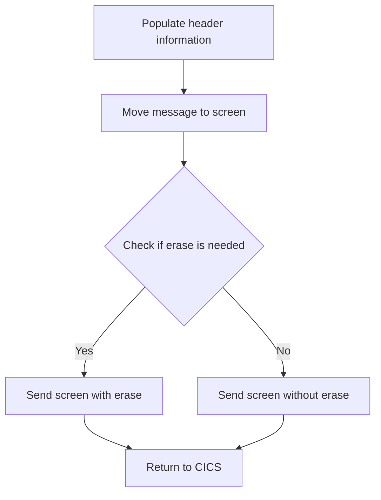

```mermaid
graph TD
  A[Initialize flags and messages] --> B{Check if EIBCALEN is 0}
  B -- Yes --> C[Set next program to COSGN00C]
  C --> D[Return to previous screen]
  B -- No --> E[Move DFHCOMMAREA to CARDDEMO-COMMAREA]
  E --> F{Check if CDEMO-PGM-REENTER is not set}
  F -- Yes --> G[Set CDEMO-PGM-REENTER to TRUE]
  G --> H[Initialize CORPT0AO and MONTHLYL]
  H --> I[Send transaction report screen]
  F -- No --> J[Receive transaction report screen]
  J --> K{Evaluate EIBAID}
  K -- DFHENTER --> L[Process enter key]
  K -- DFHPF3 --> M[Set next program to COMEN01C]
  M --> N[Return to previous screen]
  K -- Other --> O[Set error flag and message]
  O --> P[Send transaction report screen]

%% Swimm:
%% graph TD
%%   A[Initialize flags and messages] --> B{Check if EIBCALEN is 0}
%%   B -- Yes --> C[Set next program to <SwmToken path="app/cbl/CORPT00C.cbl" pos="173:4:4" line-data="               MOVE &#39;COSGN00C&#39; TO CDEMO-TO-PROGRAM">`COSGN00C`</SwmToken>]
%%   C --> D[Return to previous screen]
%%   B -- No --> E[Move DFHCOMMAREA to <SwmToken path="app/cbl/CORPT00C.cbl" pos="176:12:14" line-data="               MOVE DFHCOMMAREA(1:EIBCALEN) TO CARDDEMO-COMMAREA">`CARDDEMO-COMMAREA`</SwmToken>]
%%   E --> F{Check if <SwmToken path="app/cbl/CORPT00C.cbl" pos="177:5:9" line-data="               IF NOT CDEMO-PGM-REENTER">`CDEMO-PGM-REENTER`</SwmToken> is not set}
%%   F -- Yes --> G[Set <SwmToken path="app/cbl/CORPT00C.cbl" pos="177:5:9" line-data="               IF NOT CDEMO-PGM-REENTER">`CDEMO-PGM-REENTER`</SwmToken> to TRUE]
%%   G --> H[Initialize <SwmToken path="app/cbl/CORPT00C.cbl" pos="170:5:5" line-data="                          ERRMSGO OF CORPT0AO">`CORPT0AO`</SwmToken> and MONTHLYL]
%%   H --> I[Send transaction report screen]
%%   F -- No --> J[Receive transaction report screen]
%%   J --> K{Evaluate EIBAID}
%%   K -- DFHENTER --> L[Process enter key]
%%   K -- <SwmToken path="app/cbl/CORPT00C.cbl" pos="187:3:3" line-data="                       WHEN DFHPF3">`DFHPF3`</SwmToken> --> M[Set next program to <SwmToken path="app/cbl/CORPT00C.cbl" pos="188:4:4" line-data="                           MOVE &#39;COMEN01C&#39; TO CDEMO-TO-PROGRAM">`COMEN01C`</SwmToken>]
%%   M --> N[Return to previous screen]
%%   K -- Other --> O[Set error flag and message]
%%   O --> P[Send transaction report screen]
```

The <SwmToken path="app/cbl/CORPT00C.cbl" pos="2:7:7" line-data="      * Program     : CORPT00C.CBL">`CORPT00C`</SwmToken> program is a CICS COBOL program designed to print transaction reports by submitting batch jobs from an online interface using an extra partition TDQ. This document details the initialization of screens and flags, handling initial program calls, processing transaction report logic, and transitioning between screens.

For instance, when a user requests a transaction report, the program initializes necessary flags and messages, processes the communication area data, and evaluates user input to determine the next steps, such as processing the enter key or setting an error flag.

# Handle Screens and Flags Initialization (<SwmToken path="app/cbl/CORPT00C.cbl" pos="163:1:3" line-data="       MAIN-PARA.">`MAIN-PARA`</SwmToken>)

Lets' zoom into the program flow:



<SwmSnippet path="/app/cbl/CORPT00C.cbl" line="163">

---

### Initializing flags and messages

Going into the <SwmToken path="app/cbl/CORPT00C.cbl" pos="163:1:3" line-data="       MAIN-PARA.">`MAIN-PARA`</SwmToken> function, the initial steps involve setting various flags to their default states and clearing the message workspace.

```cobol
       MAIN-PARA.

           SET ERR-FLG-OFF TO TRUE
           SET TRANSACT-NOT-EOF TO TRUE
           SET SEND-ERASE-YES TO TRUE

           MOVE SPACES TO WS-MESSAGE
                          ERRMSGO OF CORPT0AO
```

---

</SwmSnippet>

<SwmSnippet path="/app/cbl/CORPT00C.cbl" line="172">

---

### Handling initial program call

Next, the function checks if the initial call length is zero. If it is, it sets the next program to handle sign-on operations and returns to the previous screen.

```cobol
           IF EIBCALEN = 0
               MOVE 'COSGN00C' TO CDEMO-TO-PROGRAM
               PERFORM RETURN-TO-PREV-SCREEN
```

---

</SwmSnippet>

<SwmSnippet path="/app/cbl/CORPT00C.cbl" line="175">

---

### Processing transaction report logic

Then, if the initial call length is not zero, the function processes the communication area data and checks if the program re-enter flag is not set. If it is not set, it initializes certain fields and sends the transaction report screen. Otherwise, it receives the transaction report screen and evaluates the user input. Depending on the input, it either processes the enter key, sets the next program to the main menu, or sets an error flag and message before sending the transaction report screen again.

```cobol
           ELSE
               MOVE DFHCOMMAREA(1:EIBCALEN) TO CARDDEMO-COMMAREA
               IF NOT CDEMO-PGM-REENTER
                   SET CDEMO-PGM-REENTER    TO TRUE
                   MOVE LOW-VALUES          TO CORPT0AO
                   MOVE -1       TO MONTHLYL OF CORPT0AI
                   PERFORM SEND-TRNRPT-SCREEN
               ELSE
                   PERFORM RECEIVE-TRNRPT-SCREEN
                   EVALUATE EIBAID
                       WHEN DFHENTER
                           PERFORM PROCESS-ENTER-KEY
                       WHEN DFHPF3
                           MOVE 'COMEN01C' TO CDEMO-TO-PROGRAM
                           PERFORM RETURN-TO-PREV-SCREEN
                       WHEN OTHER
                           MOVE 'Y'                       TO WS-ERR-FLG
                           MOVE -1       TO MONTHLYL OF CORPT0AI
                           MOVE CCDA-MSG-INVALID-KEY      TO WS-MESSAGE
                           PERFORM SEND-TRNRPT-SCREEN
                   END-EVALUATE
               END-IF
```

---

</SwmSnippet>

# Return to Previous Screen (<SwmToken path="app/cbl/CORPT00C.cbl" pos="174:3:9" line-data="               PERFORM RETURN-TO-PREV-SCREEN">`RETURN-TO-PREV-SCREEN`</SwmToken>)

<SwmSnippet path="/app/cbl/CORPT00C.cbl" line="540">

---

### Setting the Next Program

Going into the first snippet, the code checks if <SwmToken path="app/cbl/CORPT00C.cbl" pos="542:3:7" line-data="           IF CDEMO-TO-PROGRAM = LOW-VALUES OR SPACES">`CDEMO-TO-PROGRAM`</SwmToken> (which holds the name of the next program to be executed) is either uninitialized or empty. If it is, it sets <SwmToken path="app/cbl/CORPT00C.cbl" pos="542:3:7" line-data="           IF CDEMO-TO-PROGRAM = LOW-VALUES OR SPACES">`CDEMO-TO-PROGRAM`</SwmToken> to <SwmToken path="app/cbl/CORPT00C.cbl" pos="543:4:4" line-data="               MOVE &#39;COSGN00C&#39; TO CDEMO-TO-PROGRAM">`COSGN00C`</SwmToken>, which refers to the sign-on operations program.

```cobol
       RETURN-TO-PREV-SCREEN.

           IF CDEMO-TO-PROGRAM = LOW-VALUES OR SPACES
               MOVE 'COSGN00C' TO CDEMO-TO-PROGRAM
           END-IF
```

---

</SwmSnippet>

<SwmSnippet path="/app/cbl/CORPT00C.cbl" line="545">

---

### Executing the Transition

Next, the second snippet sets up the transition to the next program. It assigns the current transaction ID and program name to <SwmToken path="app/cbl/CORPT00C.cbl" pos="545:9:13" line-data="           MOVE WS-TRANID    TO CDEMO-FROM-TRANID">`CDEMO-FROM-TRANID`</SwmToken> and <SwmToken path="app/cbl/CORPT00C.cbl" pos="546:9:13" line-data="           MOVE WS-PGMNAME   TO CDEMO-FROM-PROGRAM">`CDEMO-FROM-PROGRAM`</SwmToken> respectively. It then resets the program context by setting <SwmToken path="app/cbl/CORPT00C.cbl" pos="547:7:11" line-data="           MOVE ZEROS        TO CDEMO-PGM-CONTEXT">`CDEMO-PGM-CONTEXT`</SwmToken> to zero. Finally, it executes the transition to the program specified in <SwmToken path="app/cbl/CORPT00C.cbl" pos="549:5:9" line-data="               XCTL PROGRAM(CDEMO-TO-PROGRAM)">`CDEMO-TO-PROGRAM`</SwmToken> using the <SwmToken path="app/cbl/CORPT00C.cbl" pos="549:1:1" line-data="               XCTL PROGRAM(CDEMO-TO-PROGRAM)">`XCTL`</SwmToken> command, passing along the communication area <SwmToken path="app/cbl/CORPT00C.cbl" pos="550:3:5" line-data="               COMMAREA(CARDDEMO-COMMAREA)">`CARDDEMO-COMMAREA`</SwmToken>.

```cobol
           MOVE WS-TRANID    TO CDEMO-FROM-TRANID
           MOVE WS-PGMNAME   TO CDEMO-FROM-PROGRAM
           MOVE ZEROS        TO CDEMO-PGM-CONTEXT
           EXEC CICS
               XCTL PROGRAM(CDEMO-TO-PROGRAM)
               COMMAREA(CARDDEMO-COMMAREA)
           END-EXEC.
```

---

</SwmSnippet>

# Send Transaction Report Screen (<SwmToken path="app/cbl/CORPT00C.cbl" pos="181:3:7" line-data="                   PERFORM SEND-TRNRPT-SCREEN">`SEND-TRNRPT-SCREEN`</SwmToken>)

Lets' zoom into the program flow:



<SwmSnippet path="/app/cbl/CORPT00C.cbl" line="556">

---

### Populating header information

Going into the first snippet, the code populates the header information with the current date and time data, ensuring that the transaction report screen displays the most up-to-date information to the user.

```cobol
       SEND-TRNRPT-SCREEN.

           PERFORM POPULATE-HEADER-INFO
```

---

</SwmSnippet>

<SwmSnippet path="/app/cbl/CORPT00C.cbl" line="560">

---

### Sending the transaction report screen

Next, the code moves the message to the screen output area. It then checks if the erase flag is set. If it is, the screen is sent with the erase option, clearing any previous data. If the flag is not set, the screen is sent without erasing the previous data. Finally, control is returned to CICS.

```cobol
           MOVE WS-MESSAGE TO ERRMSGO OF CORPT0AO

           IF SEND-ERASE-YES
               EXEC CICS SEND
                         MAP('CORPT0A')
                         MAPSET('CORPT00')
                         FROM(CORPT0AO)
                         ERASE
                         CURSOR
               END-EXEC
           ELSE
               EXEC CICS SEND
                         MAP('CORPT0A')
                         MAPSET('CORPT00')
                         FROM(CORPT0AO)
      *                  ERASE
                         CURSOR
               END-EXEC
           END-IF.

           GO TO RETURN-TO-CICS.
```

---

</SwmSnippet>

# Populate Header (<SwmToken path="app/cbl/CORPT00C.cbl" pos="558:3:7" line-data="           PERFORM POPULATE-HEADER-INFO">`POPULATE-HEADER-INFO`</SwmToken>)

<SwmSnippet path="/app/cbl/CORPT00C.cbl" line="609">

---

### Populating Header Information

Going into the <SwmToken path="app/cbl/CORPT00C.cbl" pos="609:1:5" line-data="       POPULATE-HEADER-INFO.">`POPULATE-HEADER-INFO`</SwmToken> function, it starts by setting the current date and time. Then, it sets the titles and transaction details for the report header. The function formats the current date and time and assigns them to the appropriate fields in the report header.

```cobol
       POPULATE-HEADER-INFO.

           MOVE FUNCTION CURRENT-DATE  TO WS-CURDATE-DATA

           MOVE CCDA-TITLE01           TO TITLE01O OF CORPT0AO
           MOVE CCDA-TITLE02           TO TITLE02O OF CORPT0AO
           MOVE WS-TRANID              TO TRNNAMEO OF CORPT0AO
           MOVE WS-PGMNAME             TO PGMNAMEO OF CORPT0AO

           MOVE WS-CURDATE-MONTH       TO WS-CURDATE-MM
           MOVE WS-CURDATE-DAY         TO WS-CURDATE-DD
           MOVE WS-CURDATE-YEAR(3:2)   TO WS-CURDATE-YY

           MOVE WS-CURDATE-MM-DD-YY    TO CURDATEO OF CORPT0AO

           MOVE WS-CURTIME-HOURS       TO WS-CURTIME-HH
           MOVE WS-CURTIME-MINUTE      TO WS-CURTIME-MM
           MOVE WS-CURTIME-SECOND      TO WS-CURTIME-SS

           MOVE WS-CURTIME-HH-MM-SS    TO CURTIMEO OF CORPT0AO.
```

---

</SwmSnippet>

# Return to CICS (<SwmToken path="app/cbl/CORPT00C.cbl" pos="580:5:9" line-data="           GO TO RETURN-TO-CICS.">`RETURN-TO-CICS`</SwmToken>)

<SwmSnippet path="/app/cbl/CORPT00C.cbl" line="585">

---

### Returning control to CICS

The <SwmToken path="app/cbl/CORPT00C.cbl" pos="585:1:5" line-data="       RETURN-TO-CICS.">`RETURN-TO-CICS`</SwmToken> function is responsible for returning control to the CICS transaction. It uses the <SwmToken path="app/cbl/CORPT00C.cbl" pos="587:1:5" line-data="           EXEC CICS RETURN">`EXEC CICS RETURN`</SwmToken> command to pass control back to CICS, specifying the transaction ID and communication area.

```cobol
       RETURN-TO-CICS.

           EXEC CICS RETURN
                     TRANSID (WS-TRANID)
                     COMMAREA (CARDDEMO-COMMAREA)
      *              LENGTH(LENGTH OF CARDDEMO-COMMAREA)
           END-EXEC.
```

---

</SwmSnippet>

# Receive Transaction Report (<SwmToken path="app/cbl/CORPT00C.cbl" pos="183:3:7" line-data="                   PERFORM RECEIVE-TRNRPT-SCREEN">`RECEIVE-TRNRPT-SCREEN`</SwmToken>)

<SwmSnippet path="/app/cbl/CORPT00C.cbl" line="596">

---

### Receiving transaction report screen data

Going into the <SwmToken path="app/cbl/CORPT00C.cbl" pos="596:1:5" line-data="       RECEIVE-TRNRPT-SCREEN.">`RECEIVE-TRNRPT-SCREEN`</SwmToken> function, the application receives the transaction report screen data. The map <SwmToken path="app/cbl/CORPT00C.cbl" pos="599:4:4" line-data="                     MAP(&#39;CORPT0A&#39;)">`CORPT0A`</SwmToken> from the mapset <SwmToken path="app/cbl/CORPT00C.cbl" pos="600:4:4" line-data="                     MAPSET(&#39;CORPT00&#39;)">`CORPT00`</SwmToken> is received into the designated area, and response codes are used to handle any potential issues during the receive operation.

```cobol
       RECEIVE-TRNRPT-SCREEN.

           EXEC CICS RECEIVE
                     MAP('CORPT0A')
                     MAPSET('CORPT00')
                     INTO(CORPT0AI)
                     RESP(WS-RESP-CD)
                     RESP2(WS-REAS-CD)
           END-EXEC.
```

---

</SwmSnippet>

&nbsp;

*This is an auto-generated document by Swimm 🌊 and has not yet been verified by a human*

<SwmMeta version="3.0.0" repo-id="Z2l0aHViJTNBJTNBa3luZHJ5bC1hd3MtbWFpbmZyYW1lLW1vZGVybml6YXRpb24tY2FyZGRlbW8lM0ElM0FTd2ltbS1EZW1v" repo-name="kyndryl-aws-mainframe-modernization-carddemo"><sup>Powered by [Swimm](/)</sup></SwmMeta>
