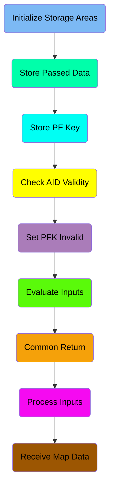
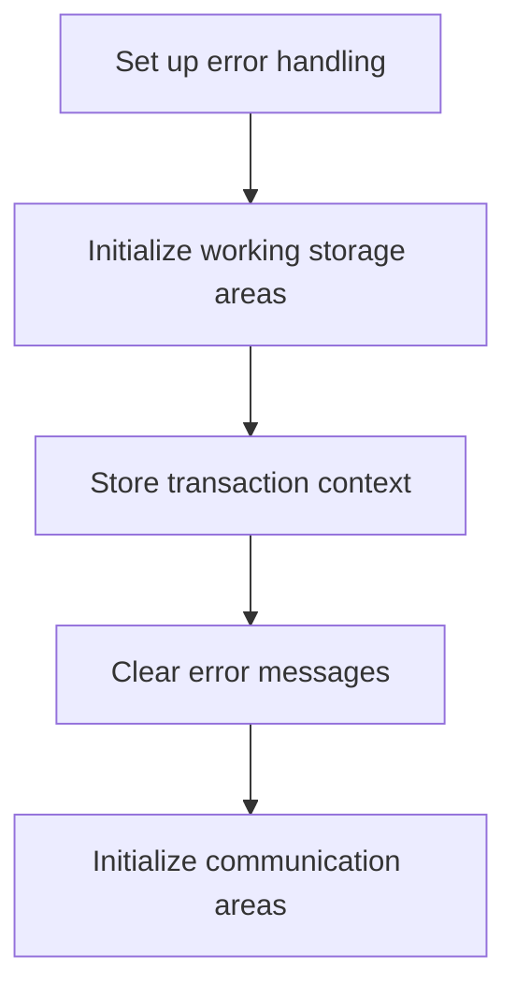
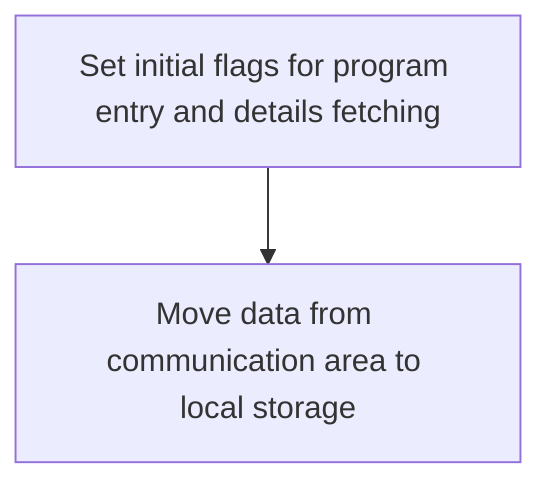
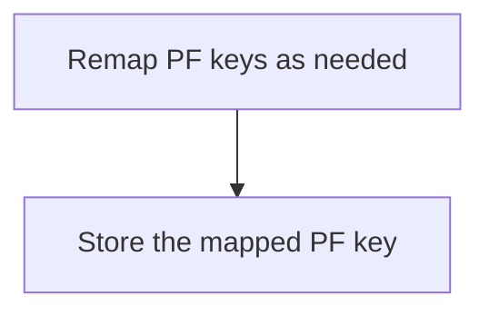
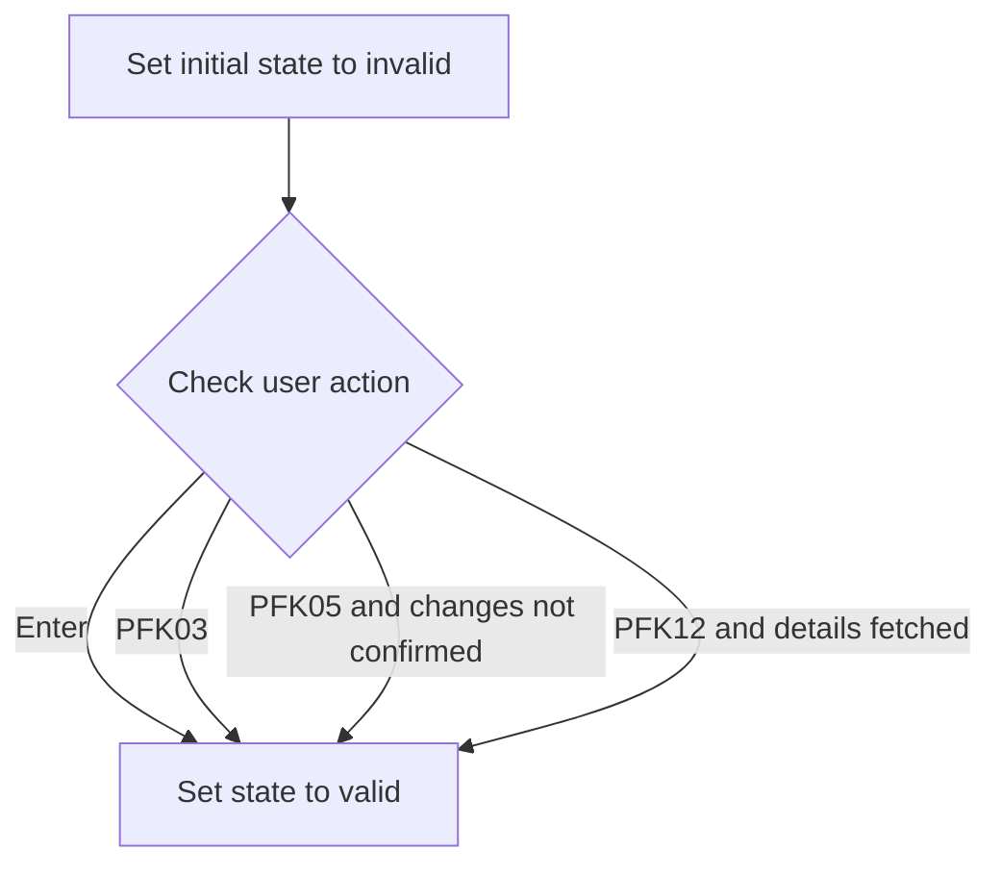
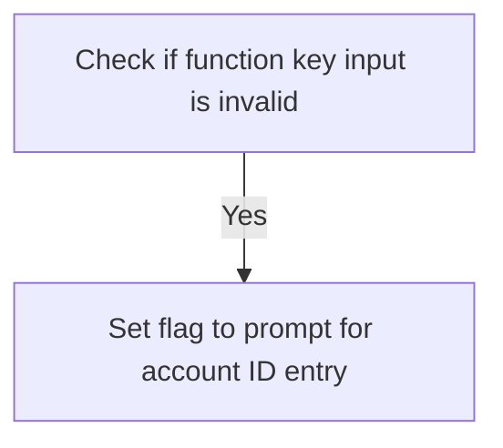
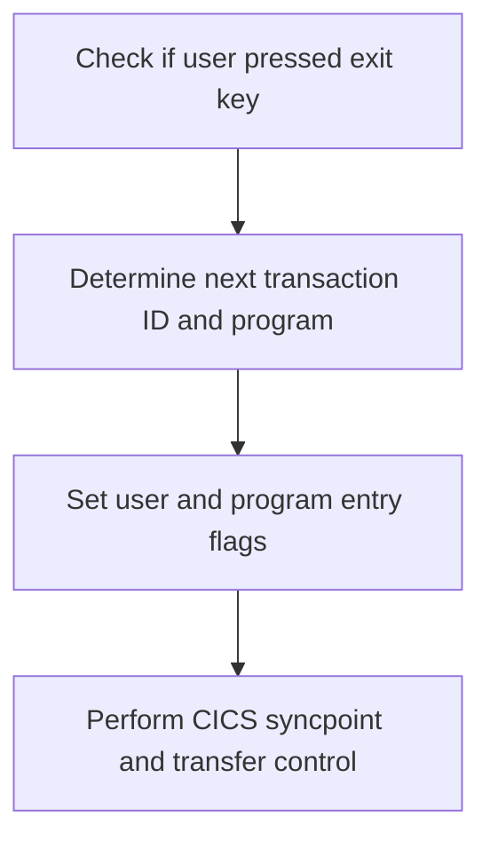
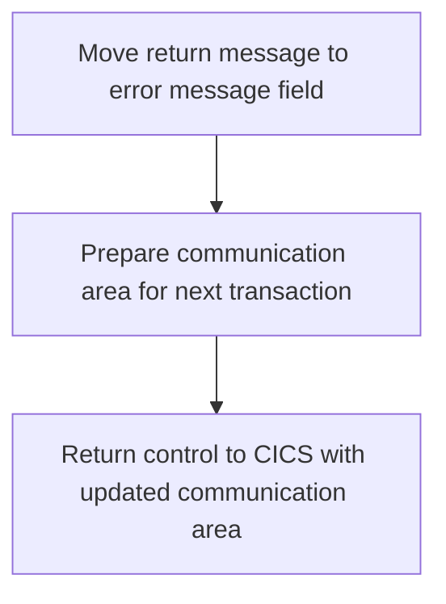
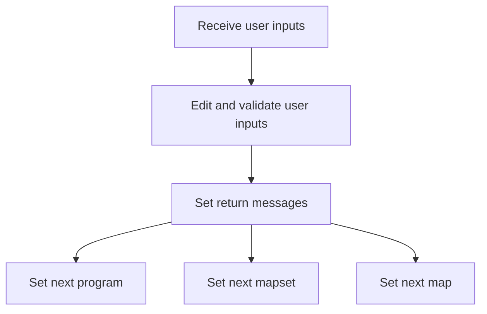
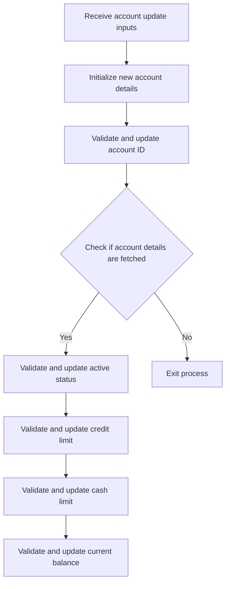

The document describes the process of updating account details using the COACTUPC program. This involves accepting user inputs, validating the data, and updating the account information in the system. The program ensures data integrity and provides appropriate prompts and confirmations to the user throughout the process.

The flow involves accepting user inputs, validating the data, and updating the account information in the system. The program ensures data integrity and provides appropriate prompts and confirmations to the user throughout the process.

Here is a high level diagram of the program:



## Initialize Storage Areas

First, we'll zoom into this section of the flow:



<SwmSnippet path="/app/cbl/COACTUPC.cbl" line="862">

---

First, the flow sets up error handling to manage any abnormal terminations that may occur during the account update process.

```cobol
           EXEC CICS HANDLE ABEND
                     LABEL(ABEND-ROUTINE)
```

---

</SwmSnippet>

## Store Passed Data

This is the next section of the flow.



<SwmSnippet path="/app/cbl/COACTUPC.cbl" line="885">

---

First, we set the initial flags to indicate that the program has entered and that the account details have not yet been fetched. This ensures that the subsequent logic knows the current state of the process.

```cobol
              SET CDEMO-PGM-ENTER TO TRUE
              SET ACUP-DETAILS-NOT-FETCHED TO TRUE
```

---

</SwmSnippet>

<SwmSnippet path="/app/cbl/COACTUPC.cbl" line="888">

---

Next, we move the data from the communication area to local storage. This step is crucial as it transfers the necessary data for processing the account update, ensuring that the program has access to the relevant information.

```cobol
              MOVE DFHCOMMAREA (1:LENGTH OF CARDDEMO-COMMAREA)  TO
                                CARDDEMO-COMMAREA
              MOVE DFHCOMMAREA(LENGTH OF CARDDEMO-COMMAREA + 1:
                               LENGTH OF WS-THIS-PROGCOMMAREA ) TO
                                WS-THIS-PROGCOMMAREA
```

---

</SwmSnippet>

## Store PF Key

This is the next section of the flow.



<SwmSnippet path="/app/cbl/COACTUPC.cbl" line="895">

---

The section involves remapping the PF keys as needed to ensure that the correct function keys are used during the account update process. This is crucial for maintaining the integrity of user inputs and ensuring that the correct operations are performed based on the user's actions. The mapped PF key is then stored, which allows the system to recognize and respond to the user's key presses accurately during the account update process.

```cobol
      * Remap PFkeys as needed.
      * Store the Mapped PF Key
      *****************************************************************
           PERFORM YYYY-STORE-PFKEY
              THRU YYYY-STORE-PFKEY-EXIT
```

---

</SwmSnippet>

## Check AID Validity

This is the next section of the flow.



<SwmSnippet path="/app/cbl/COACTUPC.cbl" line="905">

---

Initially, the state is set to invalid to ensure that no unauthorized actions are processed.

```cobol
           SET PFK-INVALID TO TRUE
```

---

</SwmSnippet>

<SwmSnippet path="/app/cbl/COACTUPC.cbl" line="906">

---

The program then checks if the user action is valid by evaluating specific conditions such as if the user pressed Enter, <SwmToken path="app/cbl/COACTUPC.cbl" pos="902:3:3" line-data="      * F3 - Exit">`F3`</SwmToken>, <SwmToken path="app/cbl/COACTUPC.cbl" pos="473:8:8" line-data="               &#39;Changes validated.Press F5 to save&#39;.">`F5`</SwmToken> with unconfirmed changes, or F12 with fetched details.

```cobol
           IF CCARD-AID-ENTER OR
              CCARD-AID-PFK03 OR
              (CCARD-AID-PFK05 AND ACUP-CHANGES-OK-NOT-CONFIRMED)
                              OR
              (CCARD-AID-PFK12 AND NOT ACUP-DETAILS-NOT-FETCHED)
```

---

</SwmSnippet>

<SwmSnippet path="/app/cbl/COACTUPC.cbl" line="911">

---

If any of these conditions are met, the state is updated to valid, allowing the account update process to proceed.

```cobol
              SET PFK-VALID TO TRUE
```

---

</SwmSnippet>

## Set PFK Invalid

This is the next section of the flow.



<SwmSnippet path="/app/cbl/COACTUPC.cbl" line="914">

---

The code checks if the function key input is invalid (<SwmToken path="app/cbl/COACTUPC.cbl" pos="914:3:5" line-data="           IF PFK-INVALID">`PFK-INVALID`</SwmToken>). If the input is invalid, it sets the flag (<SwmToken path="app/cbl/COACTUPC.cbl" pos="915:3:7" line-data="              SET CCARD-AID-ENTER TO TRUE">`CCARD-AID-ENTER`</SwmToken>) to prompt the user to enter the account ID again. This ensures that the user is guided to correct their input, maintaining the integrity of the account update process.

```cobol
           IF PFK-INVALID
              SET CCARD-AID-ENTER TO TRUE
           END-IF
```

---

</SwmSnippet>

## Evaluate Inputs

Now, lets zoom into this section of the flow:



<SwmSnippet path="/app/cbl/COACTUPC.cbl" line="927">

---

### Check if the user pressed the exit key

First, the program checks if the user pressed the exit key (<SwmToken path="app/cbl/COACTUPC.cbl" pos="482:2:2" line-data="               &#39;PF03 pressed.Exiting              &#39;.">`PF03`</SwmToken>) or completed the update process. This is done to determine if the user intends to exit the current operation.

```cobol
              WHEN CCARD-AID-PFK03
                   SET CCARD-AID-PFK03     TO TRUE
```

---

</SwmSnippet>

<SwmSnippet path="/app/cbl/COACTUPC.cbl" line="930">

---

### Determine the next transaction ID and program

Next, the program determines the next transaction ID and program to transfer control to. If the current transaction ID or program is not set, it defaults to the main menu transaction ID and program.

```cobol
                   IF CDEMO-FROM-TRANID    EQUAL LOW-VALUES
                   OR CDEMO-FROM-TRANID    EQUAL SPACES
                      MOVE LIT-MENUTRANID  TO CDEMO-TO-TRANID
                   ELSE
                      MOVE CDEMO-FROM-TRANID  TO CDEMO-TO-TRANID
                   END-IF

                   IF CDEMO-FROM-PROGRAM   EQUAL LOW-VALUES
                   OR CDEMO-FROM-PROGRAM   EQUAL SPACES
                      MOVE LIT-MENUPGM     TO CDEMO-TO-PROGRAM
                   ELSE
                      MOVE CDEMO-FROM-PROGRAM TO CDEMO-TO-PROGRAM
                   END-IF
```

---

</SwmSnippet>

<SwmSnippet path="/app/cbl/COACTUPC.cbl" line="947">

---

### Set user and program entry flags

Then, the program sets flags indicating that the user is entering the program and that the program should be entered. This ensures that the next program understands the context of the user's actions.

```cobol
                   SET  CDEMO-USRTYP-USER  TO TRUE
                   SET  CDEMO-PGM-ENTER    TO TRUE
```

---

</SwmSnippet>

<SwmSnippet path="/app/cbl/COACTUPC.cbl" line="952">

---

### Perform a CICS syncpoint and transfer control

Finally, the program performs a CICS syncpoint to ensure data consistency and then transfers control to the next program using the XCTL command. This completes the user's exit or update process.

```cobol
                   EXEC CICS
                        SYNCPOINT
                   END-EXEC
      *
                   EXEC CICS XCTL
                        PROGRAM (CDEMO-TO-PROGRAM)
                        COMMAREA(CARDDEMO-COMMAREA)
                   END-EXEC
```

---

</SwmSnippet>

## Common Return

This is the next section of the flow.



<SwmSnippet path="/app/cbl/COACTUPC.cbl" line="1007">

---

First, the return message is moved to the error message field. This ensures that any error messages generated during the account update process are properly stored and can be communicated back to the user.

```cobol
       COMMON-RETURN.
           MOVE WS-RETURN-MSG     TO CCARD-ERROR-MSG
```

---

</SwmSnippet>

<SwmSnippet path="/app/cbl/COACTUPC.cbl" line="1010">

---

Next, the communication area is prepared for the next transaction. This involves moving the current communication area to a working storage area and then appending additional data specific to this program. This step ensures that all necessary information is carried forward to the next transaction.

```cobol
           MOVE  CARDDEMO-COMMAREA    TO WS-COMMAREA
           MOVE  WS-THIS-PROGCOMMAREA TO
                  WS-COMMAREA(LENGTH OF CARDDEMO-COMMAREA + 1:
                               LENGTH OF WS-THIS-PROGCOMMAREA )
```

---

</SwmSnippet>

<SwmSnippet path="/app/cbl/COACTUPC.cbl" line="1015">

---

Then, control is returned to CICS with the updated communication area. This step involves executing a CICS RETURN command, which passes control back to the CICS system along with the updated communication area and its length. This ensures that the system can continue processing with the most up-to-date information.

```cobol
           EXEC CICS RETURN
                TRANSID (LIT-THISTRANID)
                COMMAREA (WS-COMMAREA)
                LENGTH(LENGTH OF WS-COMMAREA)
           END-EXEC
```

---

</SwmSnippet>

## Process Inputs

Now, lets zoom into this section of the flow:



<SwmSnippet path="/app/cbl/COACTUPC.cbl" line="1026">

---

The first step is to receive user inputs, which involves capturing the data entered by the user for updating account details.

```cobol
           PERFORM 1100-RECEIVE-MAP
              THRU 1100-RECEIVE-MAP-EXIT
```

---

</SwmSnippet>

<SwmSnippet path="/app/cbl/COACTUPC.cbl" line="1028">

---

Next, the user inputs are edited and validated to ensure they meet the required criteria. This step checks for any errors or inconsistencies in the data provided.

```cobol
           PERFORM 1200-EDIT-MAP-INPUTS
              THRU 1200-EDIT-MAP-INPUTS-EXIT
```

---

</SwmSnippet>

<SwmSnippet path="/app/cbl/COACTUPC.cbl" line="1030">

---

After validation, the return message is set to provide feedback to the user about the status of their input.

```cobol
           MOVE WS-RETURN-MSG  TO CCARD-ERROR-MSG
```

---

</SwmSnippet>

<SwmSnippet path="/app/cbl/COACTUPC.cbl" line="1031">

---

Finally, the next program, mapset, and map are set to determine the subsequent steps in the account update process.

```cobol
           MOVE LIT-THISPGM    TO CCARD-NEXT-PROG
           MOVE LIT-THISMAPSET TO CCARD-NEXT-MAPSET
           MOVE LIT-THISMAP    TO CCARD-NEXT-MAP
```

---

</SwmSnippet>

## Receive Map Data

Now, lets zoom into this section of the flow:



<SwmSnippet path="/app/cbl/COACTUPC.cbl" line="1039">

---

### Receive account update inputs

First, the system receives the account update inputs from the user interface. This is done using the <SwmToken path="app/cbl/COACTUPC.cbl" pos="1040:1:7" line-data="           EXEC CICS RECEIVE MAP(LIT-THISMAP)">`EXEC CICS RECEIVE MAP`</SwmToken> command, which captures the input data into the <SwmToken path="app/cbl/COACTUPC.cbl" pos="1042:3:3" line-data="                     INTO(CACTUPAI)">`CACTUPAI`</SwmToken> structure.

```cobol
       1100-RECEIVE-MAP.
           EXEC CICS RECEIVE MAP(LIT-THISMAP)
                     MAPSET(LIT-THISMAPSET)
                     INTO(CACTUPAI)
                     RESP(WS-RESP-CD)
                     RESP2(WS-REAS-CD)
           END-EXEC
```

---

</SwmSnippet>

&nbsp;

*This is an auto-generated document by Swimm 🌊 and has not yet been verified by a human*

<SwmMeta version="3.0.0" repo-id="Z2l0aHViJTNBJTNBa3luZHJ5bC1hd3MtbWFpbmZyYW1lLW1vZGVybml6YXRpb24tY2FyZGRlbW8lM0ElM0FTd2ltbS1EZW1v" repo-name="kyndryl-aws-mainframe-modernization-carddemo"><sup>Powered by [Swimm](https://staging.swimm.cloud/)</sup></SwmMeta>
