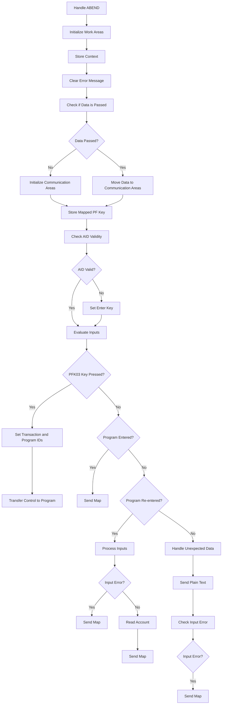
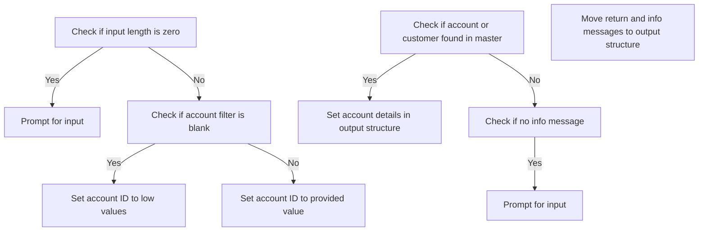
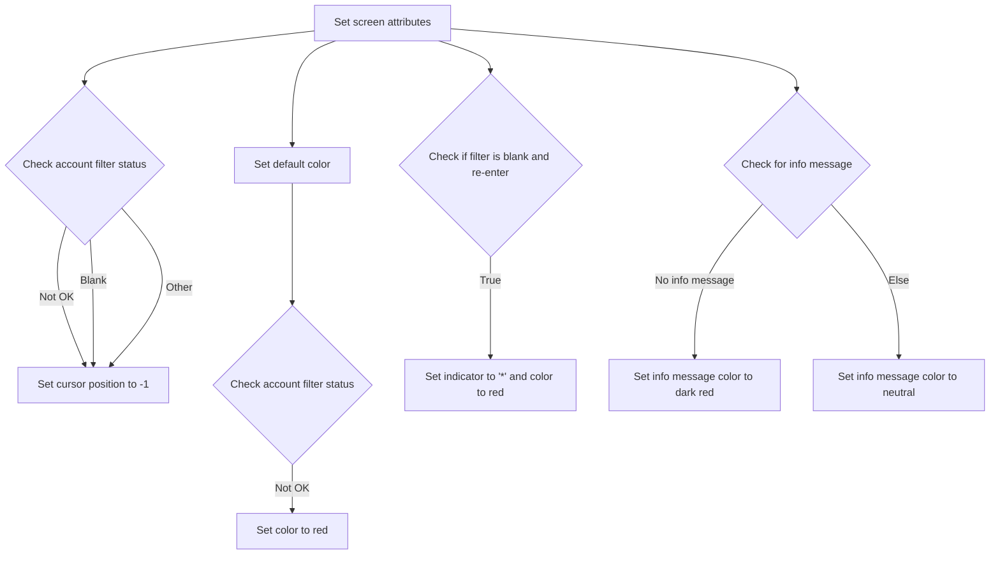

The Mainframe initialization (<SwmToken path="app/cbl/COACTVWC.cbl" pos="262:1:3" line-data="       0000-MAIN.                                                               ">`0000-MAIN`</SwmToken>) document describes the initialization process of the mainframe application. This process involves handling ABENDs, initializing work areas, storing context, and managing user inputs. The program ensures that the environment is correctly set up before processing any user requests.

For instance, if a user accesses the application from the main menu, the program initializes the communication areas and prepares the screen for user interaction. If the user inputs data, the program validates the input and processes it accordingly.

# Mainframe initialization (<SwmToken path="app/cbl/COACTVWC.cbl" pos="262:1:3" line-data="       0000-MAIN.                                                               ">`0000-MAIN`</SwmToken>)

Lets' zoom into the program flow:



<SwmSnippet path="/app/cbl/COACTVWC.cbl" line="262">

---

Going into the first snippet, the code sets up an error handling routine to manage unexpected errors during execution.

```cobol
       0000-MAIN.                                                               
                                                                                
           EXEC CICS HANDLE ABEND                                               
                     LABEL(ABEND-ROUTINE)                                       
           END-EXEC                                                             
```

---

</SwmSnippet>

<SwmSnippet path="/app/cbl/COACTVWC.cbl" line="268">

---

Now, the code prepares the necessary work areas and clears any previous error messages to ensure a clean start.

```cobol
           INITIALIZE CC-WORK-AREA                                              
                      WS-MISC-STORAGE                                           
                      WS-COMMAREA                                               
      *****************************************************************         
      * Store our context                                                       
      *****************************************************************         
           MOVE LIT-THISTRANID       TO WS-TRANID                               
      *****************************************************************         
      * Ensure error message is cleared                               *         
      *****************************************************************         
           SET WS-RETURN-MSG-OFF  TO TRUE                                       
```

---

</SwmSnippet>

<SwmSnippet path="/app/cbl/COACTVWC.cbl" line="282">

---

Next, the code checks if any data has been passed to the program. If no data is passed or if accessed from the main menu, it initializes the communication areas. Otherwise, it moves the passed data to the appropriate areas.

```cobol
           IF EIBCALEN IS EQUAL TO 0                                            
               OR (CDEMO-FROM-PROGRAM = LIT-MENUPGM                             
               AND NOT CDEMO-PGM-REENTER)                                       
              INITIALIZE CARDDEMO-COMMAREA                                      
                         WS-THIS-PROGCOMMAREA                                   
           ELSE                                                                 
              MOVE DFHCOMMAREA (1:LENGTH OF CARDDEMO-COMMAREA)  TO              
                                CARDDEMO-COMMAREA                               
              MOVE DFHCOMMAREA(LENGTH OF CARDDEMO-COMMAREA + 1:                 
                               LENGTH OF WS-THIS-PROGCOMMAREA ) TO              
                                WS-THIS-PROGCOMMAREA                            
           END-IF                                                               
```

---

</SwmSnippet>

<SwmSnippet path="/app/cbl/COACTVWC.cbl" line="299">

---

Then, the code performs a routine to store the mapped function key for handling user inputs.

```cobol
           PERFORM YYYY-STORE-PFKEY                                             
              THRU YYYY-STORE-PFKEY-EXIT                                        
```

---

</SwmSnippet>

<SwmSnippet path="/app/cbl/COACTVWC.cbl" line="306">

---

Moving to the next snippet, the code checks if the user input is valid. If the Enter key or PF3 key is pressed, it sets the validity flag to true.

```cobol
           SET PFK-INVALID TO TRUE                                              
           IF CCARD-AID-ENTER OR                                                
              CCARD-AID-PFK03                                                   
              SET PFK-VALID TO TRUE                                             
           END-IF                                                               
```

---

</SwmSnippet>

<SwmSnippet path="/app/cbl/COACTVWC.cbl" line="312">

---

Next, if the input is invalid, the code sets the Enter key to true to ensure the screen is displayed again.

```cobol
           IF PFK-INVALID                                                       
              SET CCARD-AID-ENTER TO TRUE                                       
           END-IF                                                               
```

---

</SwmSnippet>

<SwmSnippet path="/app/cbl/COACTVWC.cbl" line="323">

---

Then, the code evaluates the user inputs. If the PF3 key is pressed, it sets the transaction and program IDs for the main menu or calling program.

```cobol
           EVALUATE TRUE                                                        
              WHEN CCARD-AID-PFK03                                              
      ******************************************************************        
      *            XCTL TO CALLING PROGRAM OR MAIN MENU                         
      ******************************************************************        
                   IF CDEMO-FROM-TRANID    EQUAL LOW-VALUES                     
                   OR CDEMO-FROM-TRANID    EQUAL SPACES                         
                      MOVE LIT-MENUTRANID  TO CDEMO-TO-TRANID                   
                   ELSE                                                         
                      MOVE CDEMO-FROM-TRANID  TO CDEMO-TO-TRANID                
                   END-IF                                                       
```

---

</SwmSnippet>

<SwmSnippet path="/app/cbl/COACTVWC.cbl" line="334">

---

Next, the code sets the program ID for the main menu or calling program based on the input values.

```cobol
                   IF CDEMO-FROM-PROGRAM   EQUAL LOW-VALUES                     
                   OR CDEMO-FROM-PROGRAM   EQUAL SPACES                         
                      MOVE LIT-MENUPGM     TO CDEMO-TO-PROGRAM                  
                   ELSE                                                         
                      MOVE CDEMO-FROM-PROGRAM TO CDEMO-TO-PROGRAM               
                   END-IF                                                       
```

---

</SwmSnippet>

<SwmSnippet path="/app/cbl/COACTVWC.cbl" line="341">

---

Then, the code sets various flags and transfers control to the specified program with the communication area data.

```cobol
                   MOVE LIT-THISTRANID     TO CDEMO-FROM-TRANID                 
                   MOVE LIT-THISPGM        TO CDEMO-FROM-PROGRAM                
                                                                                
                   SET  CDEMO-USRTYP-USER  TO TRUE                              
                   SET  CDEMO-PGM-ENTER    TO TRUE                              
                   MOVE LIT-THISMAPSET     TO CDEMO-LAST-MAPSET                 
                   MOVE LIT-THISMAP        TO CDEMO-LAST-MAP                    
      *                                                                         
                   EXEC CICS XCTL                                               
                             PROGRAM (CDEMO-TO-PROGRAM)                         
                             COMMAREA(CARDDEMO-COMMAREA)                        
                   END-EXEC                                                     
```

---

</SwmSnippet>

<SwmSnippet path="/app/cbl/COACTVWC.cbl" line="353">

---

Moving to the next snippet, if the program is entered from another context, the code sends the map and returns control.

```cobol
              WHEN CDEMO-PGM-ENTER                                              
      ******************************************************************        
      *            COMING FROM SOME OTHER CONTEXT                               
      *            SELECTION CRITERIA TO BE GATHERED                            
      ******************************************************************        
                   PERFORM 1000-SEND-MAP THRU                                   
                           1000-SEND-MAP-EXIT                                   
                   GO TO COMMON-RETURN                                          
```

---

</SwmSnippet>

<SwmSnippet path="/app/cbl/COACTVWC.cbl" line="361">

---

Next, if the program is re-entered, the code processes the inputs. If there is an input error, it sends the map and returns control. Otherwise, it reads the account data, sends the map, and returns control.

```cobol
              WHEN CDEMO-PGM-REENTER                                            
                   PERFORM 2000-PROCESS-INPUTS                                  
                      THRU 2000-PROCESS-INPUTS-EXIT                             
                   IF INPUT-ERROR                                               
                      PERFORM 1000-SEND-MAP                                     
                         THRU 1000-SEND-MAP-EXIT                                
                      GO TO COMMON-RETURN                                       
                   ELSE                                                         
                      PERFORM 9000-READ-ACCT                                    
                         THRU 9000-READ-ACCT-EXIT                               
                      PERFORM 1000-SEND-MAP                                     
                         THRU 1000-SEND-MAP-EXIT                                
                      GO TO COMMON-RETURN                                       
                   END-IF                                                       
```

---

</SwmSnippet>

<SwmSnippet path="/app/cbl/COACTVWC.cbl" line="375">

---

Then, for any other cases, the code handles unexpected data scenarios by setting appropriate error messages and sending a plain text message.

```cobol
             WHEN OTHER                                                         
                   MOVE LIT-THISPGM    TO ABEND-CULPRIT                         
                   MOVE '0001'         TO ABEND-CODE                            
                   MOVE SPACES         TO ABEND-REASON                          
                   MOVE 'UNEXPECTED DATA SCENARIO'                              
                                       TO WS-RETURN-MSG                         
                   PERFORM SEND-PLAIN-TEXT                                      
                      THRU SEND-PLAIN-TEXT-EXIT                                 
           END-EVALUATE                                                         
```

---

</SwmSnippet>

<SwmSnippet path="/app/cbl/COACTVWC.cbl" line="387">

---

Finally, if there is an input error, the code sends the map with the error message and returns control.

```cobol
           IF INPUT-ERROR                                                       
              MOVE WS-RETURN-MSG  TO CCARD-ERROR-MSG                            
              PERFORM 1000-SEND-MAP                                             
                 THRU 1000-SEND-MAP-EXIT                                        
              GO TO COMMON-RETURN                                               
           END-IF                                                               
```

---

</SwmSnippet>

# Send Screen (<SwmToken path="app/cbl/COACTVWC.cbl" pos="358:3:7" line-data="                   PERFORM 1000-SEND-MAP THRU                                   ">`1000-SEND-MAP`</SwmToken>)

<SwmSnippet path="/app/cbl/COACTVWC.cbl" line="416">

---

### Sending the map

Going into the <SwmToken path="app/cbl/COACTVWC.cbl" pos="416:1:5" line-data="       1000-SEND-MAP.                                                           ">`1000-SEND-MAP`</SwmToken> function, it starts by initializing the screen information with the current date and time. Next, it sets up the account and customer data for display, including formatting the customer's SSN. Then, it sets up the screen attributes based on context, conditions, and flags for the account view requests, determining message coloring based on conditions. Finally, it sends the mapset and map to the user screen.

```cobol
       1000-SEND-MAP.                                                           
           PERFORM 1100-SCREEN-INIT                                             
              THRU 1100-SCREEN-INIT-EXIT                                        
           PERFORM 1200-SETUP-SCREEN-VARS                                       
              THRU 1200-SETUP-SCREEN-VARS-EXIT                                  
           PERFORM 1300-SETUP-SCREEN-ATTRS                                      
              THRU 1300-SETUP-SCREEN-ATTRS-EXIT                                 
           PERFORM 1400-SEND-SCREEN                                             
              THRU 1400-SEND-SCREEN-EXIT                                        
```

---

</SwmSnippet>

# Initialize Screen and Date/Time (<SwmToken path="app/cbl/COACTVWC.cbl" pos="417:3:7" line-data="           PERFORM 1100-SCREEN-INIT                                             ">`1100-SCREEN-INIT`</SwmToken>)

<SwmSnippet path="/app/cbl/COACTVWC.cbl" line="431">

---

### Initializing Screen Data

Going into the <SwmToken path="app/cbl/COACTVWC.cbl" pos="431:1:5" line-data="       1100-SCREEN-INIT.                                                        ">`1100-SCREEN-INIT`</SwmToken> function, it starts by setting up the screen with initial values. The current date and time are fetched and formatted appropriately. Titles and program identifiers are also set up for display. This ensures that the screen shows the correct date, time, and relevant titles when it is first initialized.

```cobol
       1100-SCREEN-INIT.                                                        
           MOVE LOW-VALUES             TO CACTVWAO                              
                                                                                
           MOVE FUNCTION CURRENT-DATE  TO WS-CURDATE-DATA                       
                                                                                
           MOVE CCDA-TITLE01           TO TITLE01O OF CACTVWAO                  
           MOVE CCDA-TITLE02           TO TITLE02O OF CACTVWAO                  
           MOVE LIT-THISTRANID         TO TRNNAMEO OF CACTVWAO                  
           MOVE LIT-THISPGM            TO PGMNAMEO OF CACTVWAO                  
                                                                                
           MOVE FUNCTION CURRENT-DATE  TO WS-CURDATE-DATA                       
                                                                                
           MOVE WS-CURDATE-MONTH       TO WS-CURDATE-MM                         
           MOVE WS-CURDATE-DAY         TO WS-CURDATE-DD                         
           MOVE WS-CURDATE-YEAR(3:2)   TO WS-CURDATE-YY                         
                                                                                
           MOVE WS-CURDATE-MM-DD-YY    TO CURDATEO OF CACTVWAO                  
                                                                                
           MOVE WS-CURTIME-HOURS       TO WS-CURTIME-HH                         
           MOVE WS-CURTIME-MINUTE      TO WS-CURTIME-MM                         
           MOVE WS-CURTIME-SECOND      TO WS-CURTIME-SS                         
                                                                                
           MOVE WS-CURTIME-HH-MM-SS    TO CURTIMEO OF CACTVWAO                  
                                                                                
           .                                                                    
```

---

</SwmSnippet>

# Set Up Account and Customer Data (<SwmToken path="app/cbl/COACTVWC.cbl" pos="419:3:9" line-data="           PERFORM 1200-SETUP-SCREEN-VARS                                       ">`1200-SETUP-SCREEN-VARS`</SwmToken>)

Lets' zoom into the program flow:



<SwmSnippet path="/app/cbl/COACTVWC.cbl" line="460">

---

### Initializing Search Criteria

Going into the first snippet, the code checks if the input length is zero. If it is, the application prompts the user for input. Otherwise, it checks if the account filter is blank. If the filter is blank, it sets the account ID to low values; otherwise, it sets the account ID to the provided value.

```cobol
       1200-SETUP-SCREEN-VARS.                                                  
      *    INITIALIZE SEARCH CRITERIA                                           
           IF EIBCALEN = 0                                                      
              SET  WS-PROMPT-FOR-INPUT TO TRUE                                  
           ELSE
              IF FLG-ACCTFILTER-BLANK  
                 MOVE LOW-VALUES   TO ACCTSIDO OF CACTVWAO                      
              ELSE                                                              
                 MOVE CC-ACCT-ID   TO ACCTSIDO OF CACTVWAO                      
              END-IF                                                            
```

---

</SwmSnippet>

<SwmSnippet path="/app/cbl/COACTVWC.cbl" line="471">

---

### Setting Account Details

Next, the code checks if an account or customer is found in the master file. If found, it sets various account details such as active status, current balance, credit limit, cash credit limit, current cycle credit, current cycle debit, open date, expiration date, reissue date, and group ID in the output structure.

```cobol
              IF FOUND-ACCT-IN-MASTER                                           
              OR FOUND-CUST-IN-MASTER                                           
                 MOVE ACCT-ACTIVE-STATUS  TO ACSTTUSO OF CACTVWAO               
                                                                                
                 MOVE ACCT-CURR-BAL       TO ACURBALO OF CACTVWAO               
                                                                                
                 MOVE ACCT-CREDIT-LIMIT   TO ACRDLIMO OF CACTVWAO               
                                                                                
                 MOVE ACCT-CASH-CREDIT-LIMIT
                                          TO ACSHLIMO OF CACTVWAO               
                                                                                
                 MOVE ACCT-CURR-CYC-CREDIT          
                                          TO ACRCYCRO OF CACTVWAO               
                                                                                
                 MOVE ACCT-CURR-CYC-DEBIT TO ACRCYDBO OF CACTVWAO               
                                                                                
                 MOVE ACCT-OPEN-DATE      TO ADTOPENO OF CACTVWAO               
                 MOVE ACCT-EXPIRAION-DATE TO AEXPDTO  OF CACTVWAO               
                 MOVE ACCT-REISSUE-DATE   TO AREISDTO OF CACTVWAO               
                 MOVE ACCT-GROUP-ID       TO AADDGRPO OF CACTVWAO               
              END-IF                                                            
```

---

</SwmSnippet>

<SwmSnippet path="/app/cbl/COACTVWC.cbl" line="494">

---

### Setting Customer Details

Then, if a customer is found in the master file, the code sets customer details such as customer ID, social security number, FICO credit score, date of birth, first name, middle name, last name, address lines, state code, ZIP code, country code, phone numbers, government-issued ID, EFT account ID, and primary card holder indicator in the output structure.

```cobol
                MOVE CUST-ID              TO ACSTNUMO OF CACTVWAO               
      *         MOVE CUST-SSN             TO ACSTSSNO OF CACTVWAO       
                STRING 
                    CUST-SSN(1:3)
                    '-'                 
                    CUST-SSN(4:2)
                    '-'
                    CUST-SSN(6:4)
                    DELIMITED BY SIZE
                    INTO ACSTSSNO OF CACTVWAO
                END-STRING                                                      
                MOVE CUST-FICO-CREDIT-SCORE                                     
                                          TO ACSTFCOO OF CACTVWAO               
                MOVE CUST-DOB-YYYY-MM-DD  TO ACSTDOBO OF CACTVWAO               
                MOVE CUST-FIRST-NAME      TO ACSFNAMO OF CACTVWAO               
                MOVE CUST-MIDDLE-NAME     TO ACSMNAMO OF CACTVWAO               
                MOVE CUST-LAST-NAME       TO ACSLNAMO OF CACTVWAO               
                MOVE CUST-ADDR-LINE-1     TO ACSADL1O OF CACTVWAO               
                MOVE CUST-ADDR-LINE-2     TO ACSADL2O OF CACTVWAO               
                MOVE CUST-ADDR-LINE-3     TO ACSCITYO OF CACTVWAO               
                MOVE CUST-ADDR-STATE-CD   TO ACSSTTEO OF CACTVWAO               
                MOVE CUST-ADDR-ZIP        TO ACSZIPCO OF CACTVWAO               
                MOVE CUST-ADDR-COUNTRY-CD TO ACSCTRYO OF CACTVWAO               
                MOVE CUST-PHONE-NUM-1     TO ACSPHN1O OF CACTVWAO               
                MOVE CUST-PHONE-NUM-2     TO ACSPHN2O OF CACTVWAO               
                MOVE CUST-GOVT-ISSUED-ID  TO ACSGOVTO OF CACTVWAO               
                MOVE CUST-EFT-ACCOUNT-ID  TO ACSEFTCO OF CACTVWAO               
                MOVE CUST-PRI-CARD-HOLDER-IND                                   
                                          TO ACSPFLGO OF CACTVWAO               
              END-IF                                                            
                                                                                
            END-IF                                                              
```

---

</SwmSnippet>

<SwmSnippet path="/app/cbl/COACTVWC.cbl" line="528">

---

### Prompting for Input

Moving to the next snippet, if there is no information message, the application prompts the user for input.

```cobol
           IF WS-NO-INFO-MESSAGE                                                
             SET WS-PROMPT-FOR-INPUT TO TRUE                                    
           END-IF                                                               
```

---

</SwmSnippet>

<SwmSnippet path="/app/cbl/COACTVWC.cbl" line="532">

---

### Setting Messages

Finally, the code moves the return message and information message to the output structure.

```cobol
           MOVE WS-RETURN-MSG          TO ERRMSGO OF CACTVWAO                   
                                                                                
           MOVE WS-INFO-MSG            TO INFOMSGO OF CACTVWAO                  
           .                                                                    
```

---

</SwmSnippet>

# Setup Screen Attributes (<SwmToken path="app/cbl/COACTVWC.cbl" pos="421:3:9" line-data="           PERFORM 1300-SETUP-SCREEN-ATTRS                                      ">`1300-SETUP-SCREEN-ATTRS`</SwmToken>)

Lets' zoom into the program flow:



<SwmSnippet path="/app/cbl/COACTVWC.cbl" line="541">

---

### Setting cursor position based on account filter status

Going into the first snippet, the code sets up the screen attributes by determining the cursor position based on the account filter status. If the account filter is not okay or blank, the cursor position is set to -1.

```cobol
       1300-SETUP-SCREEN-ATTRS.                                                 
      *    PROTECT OR UNPROTECT BASED ON CONTEXT                                
           MOVE DFHBMFSE               TO ACCTSIDA OF CACTVWAI                  
                                                                                
      *    POSITION CURSOR                                                      
           EVALUATE TRUE                                                        
              WHEN FLG-ACCTFILTER-NOT-OK                                        
              WHEN FLG-ACCTFILTER-BLANK                                         
                   MOVE -1             TO ACCTSIDL OF CACTVWAI                  
              WHEN OTHER                                                        
                   MOVE -1             TO ACCTSIDL OF CACTVWAI                  
           END-EVALUATE                                                         
```

---

</SwmSnippet>

<SwmSnippet path="/app/cbl/COACTVWC.cbl" line="555">

---

### Setting default and conditional colors

Next, the code sets the default color for the screen attributes. If the account filter is not okay, the color is changed to red.

```cobol
           MOVE DFHDFCOL               TO ACCTSIDC OF CACTVWAO                  
                                                                                
           IF FLG-ACCTFILTER-NOT-OK                                             
              MOVE DFHRED              TO ACCTSIDC OF CACTVWAO                  
           END-IF                                                               
```

---

</SwmSnippet>

<SwmSnippet path="/app/cbl/COACTVWC.cbl" line="561">

---

### Handling blank account filter and re-enter condition

Moving to the next snippet, if the account filter is blank and the program is re-entered, the indicator is set to '\*' and the color is set to red.

```cobol
           IF  FLG-ACCTFILTER-BLANK                                             
           AND CDEMO-PGM-REENTER                                                
               MOVE '*'                TO ACCTSIDO OF CACTVWAO                  
               MOVE DFHRED             TO ACCTSIDC OF CACTVWAO                  
           END-IF                                                               
```

---

</SwmSnippet>

<SwmSnippet path="/app/cbl/COACTVWC.cbl" line="567">

---

### Setting information message color

Finally, the code sets the color of the information message based on whether there is an information message or not. If there is no information message, the color is set to dark red; otherwise, it is set to neutral.

```cobol
           IF  WS-NO-INFO-MESSAGE                                               
               MOVE DFHBMDAR           TO INFOMSGC OF CACTVWAO                  
           ELSE                                                                 
               MOVE DFHNEUTR           TO INFOMSGC OF CACTVWAO                  
           END-IF                                                               
```

---

</SwmSnippet>

# Return Control to CICS (<SwmToken path="app/cbl/COACTVWC.cbl" pos="360:5:7" line-data="                   GO TO COMMON-RETURN                                          ">`COMMON-RETURN`</SwmToken>)

<SwmSnippet path="/app/cbl/COACTVWC.cbl" line="394">

---

### Returning control to the calling program

Going into the <SwmToken path="app/cbl/COACTVWC.cbl" pos="394:1:3" line-data="       COMMON-RETURN.                                                           ">`COMMON-RETURN`</SwmToken> function, the first step is to move the return message to the error message field. This ensures that any status or result of the operation is communicated back. Next, the communication area is prepared by combining the main communication area with the program-specific communication area. Finally, the control is returned to the calling program with the prepared communication area and the transaction ID.

```cobol
       COMMON-RETURN.                                                           
           MOVE WS-RETURN-MSG     TO CCARD-ERROR-MSG                            
                                                                                
           MOVE  CARDDEMO-COMMAREA    TO WS-COMMAREA                            
           MOVE  WS-THIS-PROGCOMMAREA TO                                        
                  WS-COMMAREA(LENGTH OF CARDDEMO-COMMAREA + 1:                  
                               LENGTH OF WS-THIS-PROGCOMMAREA )                 
                                                                                
           EXEC CICS RETURN                                                     
                TRANSID (LIT-THISTRANID)                                        
                COMMAREA (WS-COMMAREA)                                          
                LENGTH(LENGTH OF WS-COMMAREA)                                   
           END-EXEC                                                             
```

---

</SwmSnippet>

# Process Account View Input (<SwmToken path="app/cbl/COACTVWC.cbl" pos="362:3:7" line-data="                   PERFORM 2000-PROCESS-INPUTS                                  ">`2000-PROCESS-INPUTS`</SwmToken>)

<SwmSnippet path="/app/cbl/COACTVWC.cbl" line="596">

---

Going into the <SwmToken path="app/cbl/COACTVWC.cbl" pos="596:1:5" line-data="       2000-PROCESS-INPUTS.                                                     ">`2000-PROCESS-INPUTS`</SwmToken> function, the first step is to receive the input data. This ensures that the input data is correctly captured for further processing. Next, the inputs are validated and edited to ensure that the account identifier is not blank or invalid.

```cobol
       2000-PROCESS-INPUTS.                                                     
           PERFORM 2100-RECEIVE-MAP                                             
              THRU 2100-RECEIVE-MAP-EXIT                                        
           PERFORM 2200-EDIT-MAP-INPUTS                                         
              THRU 2200-EDIT-MAP-INPUTS-EXIT                                    
```

---

</SwmSnippet>

<SwmSnippet path="/app/cbl/COACTVWC.cbl" line="601">

---

Next, the function sets the return message to indicate the status or result of the operation. It also sets the next program, mapset, and map to be used for further processing.

```cobol
           MOVE WS-RETURN-MSG  TO CCARD-ERROR-MSG                               
           MOVE LIT-THISPGM    TO CCARD-NEXT-PROG                               
           MOVE LIT-THISMAPSET TO CCARD-NEXT-MAPSET                             
           MOVE LIT-THISMAP    TO CCARD-NEXT-MAP                                
           .                                                                    
```

---

</SwmSnippet>

# Receive Input (<SwmToken path="app/cbl/COACTVWC.cbl" pos="597:3:7" line-data="           PERFORM 2100-RECEIVE-MAP                                             ">`2100-RECEIVE-MAP`</SwmToken>)

<SwmSnippet path="/app/cbl/COACTVWC.cbl" line="610">

---

### Receiving user input

The <SwmToken path="app/cbl/COACTVWC.cbl" pos="610:1:5" line-data="       2100-RECEIVE-MAP.                                                        ">`2100-RECEIVE-MAP`</SwmToken> function is responsible for receiving user input from the screen. It uses the <SwmToken path="app/cbl/COACTVWC.cbl" pos="611:1:7" line-data="           EXEC CICS RECEIVE MAP(LIT-THISMAP)                                   ">`EXEC CICS RECEIVE MAP`</SwmToken> command to capture the data entered by the user into the specified map and mapset. The received data is then stored in the <SwmToken path="app/cbl/COACTVWC.cbl" pos="613:3:3" line-data="                     INTO(CACTVWAI)                                             ">`CACTVWAI`</SwmToken> area for further processing. The response codes <SwmToken path="app/cbl/COACTVWC.cbl" pos="614:3:7" line-data="                     RESP(WS-RESP-CD)                                           ">`WS-RESP-CD`</SwmToken> and <SwmToken path="app/cbl/COACTVWC.cbl" pos="615:3:7" line-data="                     RESP2(WS-REAS-CD)                                          ">`WS-REAS-CD`</SwmToken> are used to handle any potential errors during the receive operation.

```cobol
       2100-RECEIVE-MAP.                                                        
           EXEC CICS RECEIVE MAP(LIT-THISMAP)                                   
                     MAPSET(LIT-THISMAPSET)                                     
                     INTO(CACTVWAI)                                             
                     RESP(WS-RESP-CD)                                           
                     RESP2(WS-REAS-CD)                                          
           END-EXEC                                                             
```

---

</SwmSnippet>

&nbsp;

*This is an auto-generated document by Swimm 🌊 and has not yet been verified by a human*

<SwmMeta version="3.0.0" repo-id="Z2l0aHViJTNBJTNBa3luZHJ5bC1hd3MtbWFpbmZyYW1lLW1vZGVybml6YXRpb24tY2FyZGRlbW8lM0ElM0FTd2ltbS1EZW1v" repo-name="kyndryl-aws-mainframe-modernization-carddemo"><sup>Powered by [Swimm](/)</sup></SwmMeta>
