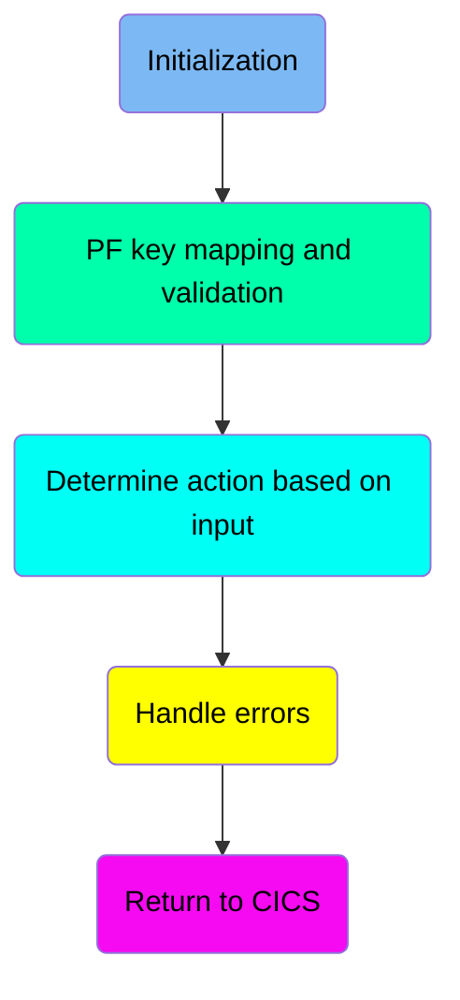
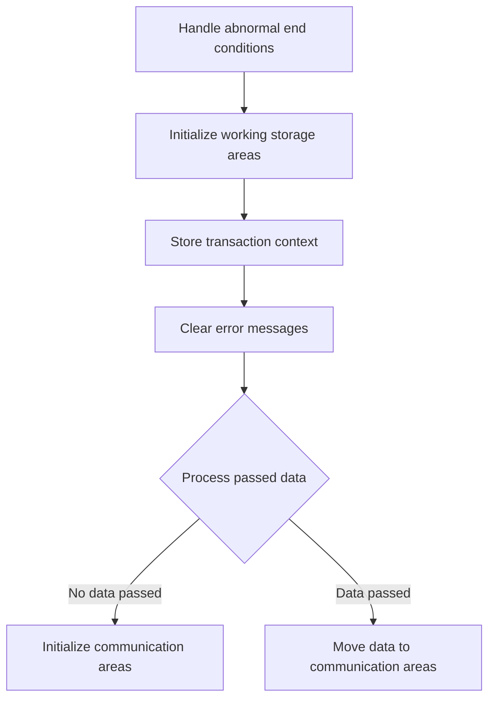
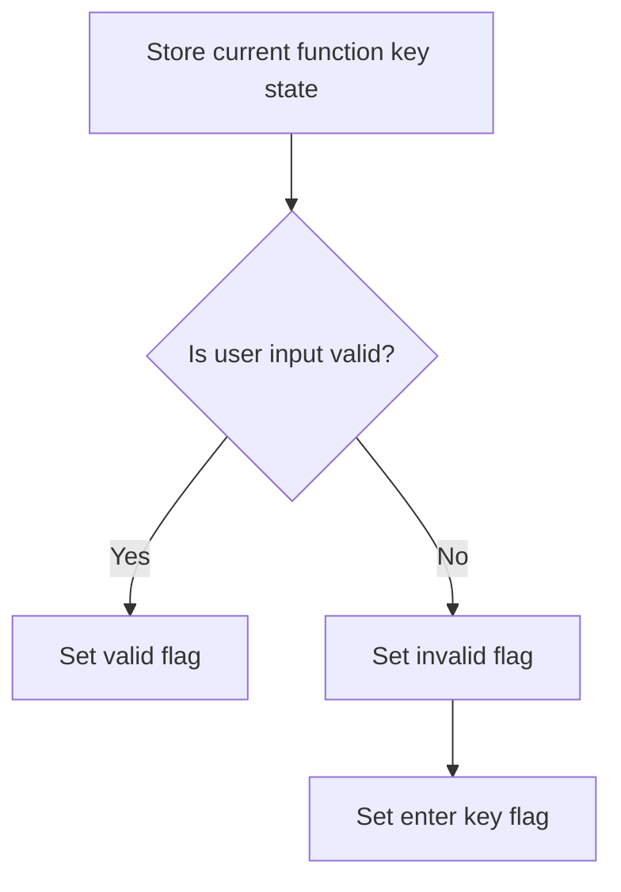
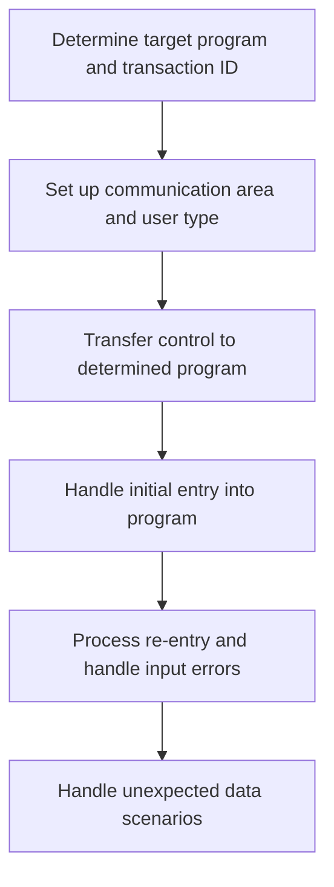
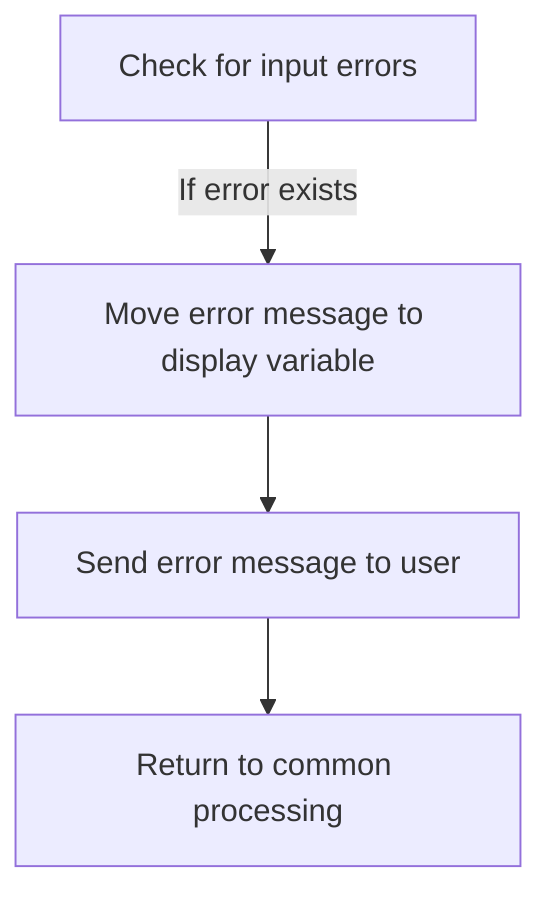

The Processing Account View Requests (COACTVWC) document describes the role of the COACTVWC program in the CardDemo application. This program is responsible for accepting and processing account view requests. It achieves this by initializing necessary storage areas, validating user inputs, determining actions based on the inputs, and handling any errors that may occur during the process.

The flow begins with initializing storage areas and setting up the environment. It then validates user inputs and determines the appropriate actions based on these inputs. If any errors occur, the program handles them and provides feedback to the user.

Here is a high level diagram of the program:



## Initialization

First, we'll zoom into this section of the flow:



<SwmSnippet path="/app/cbl/COACTVWC.cbl" line="264">

---

First, the function handles abnormal end conditions by setting up an exception handler to manage any unexpected terminations, ensuring the program can recover gracefully.

```cobol
           EXEC CICS HANDLE ABEND                                               
                     LABEL(ABEND-ROUTINE)                                       
           END-EXEC                                                             
```

---

</SwmSnippet>

<SwmSnippet path="/app/cbl/COACTVWC.cbl" line="268">

---

Next, it initializes various working storage areas, including <SwmToken path="app/cbl/COACTVWC.cbl" pos="268:3:7" line-data="           INITIALIZE CC-WORK-AREA                                              ">`CC-WORK-AREA`</SwmToken>, <SwmToken path="app/cbl/COACTVWC.cbl" pos="269:1:5" line-data="                      WS-MISC-STORAGE                                           ">`WS-MISC-STORAGE`</SwmToken>, and <SwmToken path="app/cbl/COACTVWC.cbl" pos="270:1:3" line-data="                      WS-COMMAREA                                               ">`WS-COMMAREA`</SwmToken>, to prepare the environment for processing the account view request.

```cobol
           INITIALIZE CC-WORK-AREA                                              
                      WS-MISC-STORAGE                                           
                      WS-COMMAREA                                               
```

---

</SwmSnippet>

## PF key mapping and validation

This is the next section of the flow.



<SwmSnippet path="/app/cbl/COACTVWC.cbl" line="299">

---

First, we store the current function key state to keep track of the user's actions.

```cobol
           PERFORM YYYY-STORE-PFKEY                                             
              THRU YYYY-STORE-PFKEY-EXIT                                        
```

---

</SwmSnippet>

<SwmSnippet path="/app/cbl/COACTVWC.cbl" line="307">

---

Moving to the next step, we check if the user input is valid by evaluating if the user pressed the Enter key or the <SwmToken path="app/cbl/COACTVWC.cbl" pos="303:3:3" line-data="      * F3 - Exit                                                               ">`F3`</SwmToken> key.

```cobol
           IF CCARD-AID-ENTER OR                                                
              CCARD-AID-PFK03                                                   
              SET PFK-VALID TO TRUE                                             
           END-IF                                                               
```

---

</SwmSnippet>

<SwmSnippet path="/app/cbl/COACTVWC.cbl" line="312">

---

Then, if the input is invalid, we set the Enter key flag to true to prompt the user to re-enter their input.

```cobol
           IF PFK-INVALID                                                       
              SET CCARD-AID-ENTER TO TRUE                                       
           END-IF                                                               
```

---

</SwmSnippet>

## Determine action based on input

Now, lets zoom into this section of the flow:



<SwmSnippet path="/app/cbl/COACTVWC.cbl" line="328">

---

### Determine the target program and transaction ID

First, the program checks if the <SwmToken path="app/cbl/COACTVWC.cbl" pos="328:3:7" line-data="                   IF CDEMO-FROM-TRANID    EQUAL LOW-VALUES                     ">`CDEMO-FROM-TRANID`</SwmToken> (the transaction ID from which the user navigated) and <SwmToken path="app/cbl/COACTVWC.cbl" pos="334:3:7" line-data="                   IF CDEMO-FROM-PROGRAM   EQUAL LOW-VALUES                     ">`CDEMO-FROM-PROGRAM`</SwmToken> (the program from which the user navigated) are either low-values or spaces. If they are, it sets default values for the target transaction ID and program. Otherwise, it uses the provided values.

```cobol
                   IF CDEMO-FROM-TRANID    EQUAL LOW-VALUES                     
                   OR CDEMO-FROM-TRANID    EQUAL SPACES                         
                      MOVE LIT-MENUTRANID  TO CDEMO-TO-TRANID                   
                   ELSE                                                         
                      MOVE CDEMO-FROM-TRANID  TO CDEMO-TO-TRANID                
                   END-IF                                                       
                   IF CDEMO-FROM-PROGRAM   EQUAL LOW-VALUES                     
                   OR CDEMO-FROM-PROGRAM   EQUAL SPACES                         
                      MOVE LIT-MENUPGM     TO CDEMO-TO-PROGRAM                  
                   ELSE                                                         
                      MOVE CDEMO-FROM-PROGRAM TO CDEMO-TO-PROGRAM               
                   END-IF                                                       
```

---

</SwmSnippet>

<SwmSnippet path="/app/cbl/COACTVWC.cbl" line="341">

---

### Set up the communication area and user type

Moving to the next step, the program sets up the communication area by assigning the current transaction ID and program to <SwmToken path="app/cbl/COACTVWC.cbl" pos="341:9:13" line-data="                   MOVE LIT-THISTRANID     TO CDEMO-FROM-TRANID                 ">`CDEMO-FROM-TRANID`</SwmToken> and <SwmToken path="app/cbl/COACTVWC.cbl" pos="342:9:13" line-data="                   MOVE LIT-THISPGM        TO CDEMO-FROM-PROGRAM                ">`CDEMO-FROM-PROGRAM`</SwmToken>. It also sets the user type to 'USER' and indicates that the program has been entered.

```cobol
                   MOVE LIT-THISTRANID     TO CDEMO-FROM-TRANID                 
                   MOVE LIT-THISPGM        TO CDEMO-FROM-PROGRAM                
                                                                                
                   SET  CDEMO-USRTYP-USER  TO TRUE                              
                   SET  CDEMO-PGM-ENTER    TO TRUE                              
```

---

</SwmSnippet>

<SwmSnippet path="/app/cbl/COACTVWC.cbl" line="349">

---

### Transfer control to the determined program

Next, the program transfers control to the determined target program using the CICS <SwmToken path="app/cbl/COACTVWC.cbl" pos="349:5:5" line-data="                   EXEC CICS XCTL                                               ">`XCTL`</SwmToken> command, passing the communication area <SwmToken path="app/cbl/COACTVWC.cbl" pos="351:3:5" line-data="                             COMMAREA(CARDDEMO-COMMAREA)                        ">`CARDDEMO-COMMAREA`</SwmToken>.

```cobol
                   EXEC CICS XCTL                                               
                             PROGRAM (CDEMO-TO-PROGRAM)                         
                             COMMAREA(CARDDEMO-COMMAREA)                        
                   END-EXEC                                                     
```

---

</SwmSnippet>

<SwmSnippet path="/app/cbl/COACTVWC.cbl" line="358">

---

### Handle initial entry into the program

Then, if the user is entering the program for the first time, the program performs the <SwmToken path="app/cbl/COACTVWC.cbl" pos="358:3:7" line-data="                   PERFORM 1000-SEND-MAP THRU                                   ">`1000-SEND-MAP`</SwmToken> routine to gather selection criteria and then returns to the common return point.

```cobol
                   PERFORM 1000-SEND-MAP THRU                                   
                           1000-SEND-MAP-EXIT                                   
                   GO TO COMMON-RETURN                                          
```

---

</SwmSnippet>

<SwmSnippet path="/app/cbl/COACTVWC.cbl" line="362">

---

### Process re-entry and handle input errors

Next, if the user is re-entering the program, it processes the inputs through the <SwmToken path="app/cbl/COACTVWC.cbl" pos="362:3:7" line-data="                   PERFORM 2000-PROCESS-INPUTS                                  ">`2000-PROCESS-INPUTS`</SwmToken> routine. If there are input errors, it sends the map again and returns. Otherwise, it reads the account data and sends the map again before returning.

```cobol
                   PERFORM 2000-PROCESS-INPUTS                                  
                      THRU 2000-PROCESS-INPUTS-EXIT                             
                   IF INPUT-ERROR                                               
                      PERFORM 1000-SEND-MAP                                     
                         THRU 1000-SEND-MAP-EXIT                                
                      GO TO COMMON-RETURN                                       
                   ELSE                                                         
                      PERFORM 9000-READ-ACCT                                    
                         THRU 9000-READ-ACCT-EXIT                               
                      PERFORM 1000-SEND-MAP                                     
                         THRU 1000-SEND-MAP-EXIT                                
                      GO TO COMMON-RETURN                                       
```

---

</SwmSnippet>

<SwmSnippet path="/app/cbl/COACTVWC.cbl" line="376">

---

### Handle unexpected data scenarios

Finally, if an unexpected data scenario occurs, the program sets the appropriate error messages and performs the <SwmToken path="app/cbl/COACTVWC.cbl" pos="381:3:7" line-data="                   PERFORM SEND-PLAIN-TEXT                                      ">`SEND-PLAIN-TEXT`</SwmToken> routine to notify the user.

```cobol
                   MOVE LIT-THISPGM    TO ABEND-CULPRIT                         
                   MOVE '0001'         TO ABEND-CODE                            
                   MOVE SPACES         TO ABEND-REASON                          
                   MOVE 'UNEXPECTED DATA SCENARIO'                              
                                       TO WS-RETURN-MSG                         
                   PERFORM SEND-PLAIN-TEXT                                      
                      THRU SEND-PLAIN-TEXT-EXIT                                 
```

---

</SwmSnippet>

## Handle errors

Now, lets zoom into this section of the flow:



<SwmSnippet path="/app/cbl/COACTVWC.cbl" line="387">

---

The function first checks if there is an input error by evaluating <SwmToken path="app/cbl/COACTVWC.cbl" pos="387:3:5" line-data="           IF INPUT-ERROR                                                       ">`INPUT-ERROR`</SwmToken>. If an error is detected, it moves the error message from <SwmToken path="app/cbl/COACTVWC.cbl" pos="388:3:7" line-data="              MOVE WS-RETURN-MSG  TO CCARD-ERROR-MSG                            ">`WS-RETURN-MSG`</SwmToken> to <SwmToken path="app/cbl/COACTVWC.cbl" pos="388:11:15" line-data="              MOVE WS-RETURN-MSG  TO CCARD-ERROR-MSG                            ">`CCARD-ERROR-MSG`</SwmToken> to prepare it for display. Then, it performs the <SwmToken path="app/cbl/COACTVWC.cbl" pos="389:3:7" line-data="              PERFORM 1000-SEND-MAP                                             ">`1000-SEND-MAP`</SwmToken> routine to send the error message to the user interface, ensuring the user is informed of the issue. Finally, it returns to the common processing routine by executing <SwmToken path="app/cbl/COACTVWC.cbl" pos="391:1:7" line-data="              GO TO COMMON-RETURN                                               ">`GO TO COMMON-RETURN`</SwmToken>, which handles the next steps in the workflow.

```cobol
           IF INPUT-ERROR                                                       
              MOVE WS-RETURN-MSG  TO CCARD-ERROR-MSG                            
              PERFORM 1000-SEND-MAP                                             
                 THRU 1000-SEND-MAP-EXIT                                        
              GO TO COMMON-RETURN                                               
           END-IF                                                               
```

---

</SwmSnippet>

&nbsp;

*This is an auto-generated document by Swimm 🌊 and has not yet been verified by a human*

<SwmMeta version="3.0.0" repo-id="Z2l0aHViJTNBJTNBa3luZHJ5bC1hd3MtbWFpbmZyYW1lLW1vZGVybml6YXRpb24tY2FyZGRlbW8lM0ElM0FTd2ltbS1EZW1v" repo-name="kyndryl-aws-mainframe-modernization-carddemo"><sup>Powered by [Swimm](https://staging.swimm.cloud/)</sup></SwmMeta>
