Processing Bill Payments (<SwmToken path="app/cbl/COBIL00C.cbl" pos="2:7:7" line-data="      * Program     : COBIL00C.CBL">`COBIL00C`</SwmToken>) describes the flow for handling bill payments within the <SwmToken path="app/cbl/COBIL00C.cbl" pos="3:7:7" line-data="      * Application : CardDemo">`CardDemo`</SwmToken> application. This program, identified by <SwmToken path="app/cbl/COBIL00C.cbl" pos="2:7:7" line-data="      * Program     : COBIL00C.CBL">`COBIL00C`</SwmToken>, facilitates the payment of account balances in full through an online transaction. The process involves several steps, including initializing variables, validating account IDs, confirming payment actions, and updating account balances.

The flow for processing bill payments starts with initializing necessary variables and checking the communication area length. It then sets the re-enter program state and handles user actions based on their input. The program manages errors effectively and finalizes the process by returning control to CICS. It validates the account ID and confirms the payment action before processing the transaction. Finally, it updates the account balance and sends the bill payment screen to the user.

Here is a high level diagram of the program:

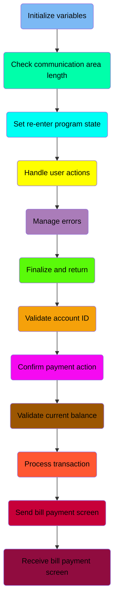

## Initialize variables

First, we'll zoom into this section of the flow:

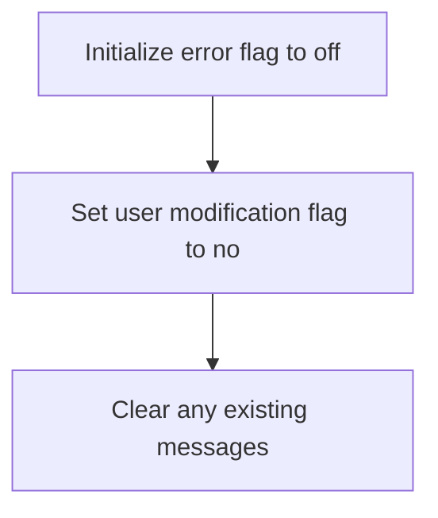

<SwmSnippet path="/app/cbl/COBIL00C.cbl" line="101">

---

First, the error flag is initialized to off, ensuring that no previous errors are carried over into the current operation.

```cobol
           SET ERR-FLG-OFF     TO TRUE
```

---

</SwmSnippet>

<SwmSnippet path="/app/cbl/COBIL00C.cbl" line="102">

---

Next, the user modification flag is set to no, indicating that no user modifications have been made yet.

```cobol
           SET USR-MODIFIED-NO TO TRUE
```

---

</SwmSnippet>

## Check communication area length

Now, lets zoom into this section of the flow:

```mermaid
graph TD
  A[Check if communication area length is zero] -->|Yes| B[Set next program to COSGN00C]
  B --> C[Return to previous screen]
  A -->|No| D[Continue with other processing]

%% Swimm:
%% graph TD
%%   A[Check if communication area length is zero] -->|Yes| B[Set next program to <SwmToken path="app/cbl/COBIL00C.cbl" pos="108:4:4" line-data="               MOVE &#39;COSGN00C&#39; TO CDEMO-TO-PROGRAM">`COSGN00C`</SwmToken>]
%%   B --> C[Return to previous screen]
%%   A -->|No| D[Continue with other processing]
```

<SwmSnippet path="/app/cbl/COBIL00C.cbl" line="107">

---

The first step is to check if the communication area length (<SwmToken path="app/cbl/COBIL00C.cbl" pos="107:3:3" line-data="           IF EIBCALEN = 0">`EIBCALEN`</SwmToken>) is zero. If it is, we set the next program to <SwmToken path="app/cbl/COBIL00C.cbl" pos="108:4:4" line-data="               MOVE &#39;COSGN00C&#39; TO CDEMO-TO-PROGRAM">`COSGN00C`</SwmToken> by moving this value to <SwmToken path="app/cbl/COBIL00C.cbl" pos="108:9:13" line-data="               MOVE &#39;COSGN00C&#39; TO CDEMO-TO-PROGRAM">`CDEMO-TO-PROGRAM`</SwmToken> (which holds the name of the program to which control should be transferred next). This ensures that the application knows which program to execute next when there is no data in the communication area.

```cobol
           IF EIBCALEN = 0
               MOVE 'COSGN00C' TO CDEMO-TO-PROGRAM
               PERFORM RETURN-TO-PREV-SCREEN
           ELSE
```

---

</SwmSnippet>

## Set re-enter program state

Now, lets zoom into this section of the flow:

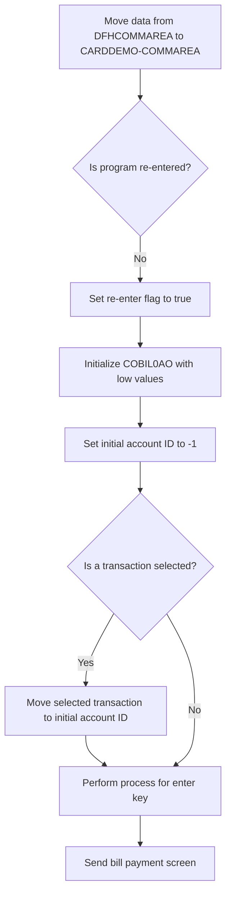

The function begins by moving data from <SwmToken path="app/cbl/COBIL00C.cbl" pos="91:3:3" line-data="       01  DFHCOMMAREA.">`DFHCOMMAREA`</SwmToken> to <SwmToken path="app/cbl/COBIL00C.cbl" pos="111:12:14" line-data="               MOVE DFHCOMMAREA(1:EIBCALEN) TO CARDDEMO-COMMAREA">`CARDDEMO-COMMAREA`</SwmToken>, which sets up the necessary data for processing the bill payment screen.

Next, it checks if the program is being re-entered by evaluating the <SwmToken path="app/cbl/COBIL00C.cbl" pos="112:5:9" line-data="               IF NOT CDEMO-PGM-REENTER">`CDEMO-PGM-REENTER`</SwmToken> flag. If the program is not being re-entered, it sets this flag to true to indicate that the program has been entered.

The function then initializes <SwmToken path="app/cbl/COBIL00C.cbl" pos="293:13:13" line-data="           MOVE WS-MESSAGE TO ERRMSGO OF COBIL0AO">`COBIL0AO`</SwmToken> with low values to reset any previous data and sets the initial account ID (<SwmToken path="app/cbl/COBIL00C.cbl" pos="163:8:8" line-data="                   MOVE -1       TO ACTIDINL OF COBIL0AI">`ACTIDINL`</SwmToken> of <SwmToken path="app/cbl/COBIL00C.cbl" pos="159:7:7" line-data="               WHEN ACTIDINI OF COBIL0AI = SPACES OR LOW-VALUES">`COBIL0AI`</SwmToken>) to -1, preparing for a new transaction.

It checks if a transaction has been selected by evaluating <SwmToken path="app/cbl/COBIL00C.cbl" pos="72:3:9" line-data="             10 CDEMO-CB00-TRN-SELECTED    PIC X(16).">`CDEMO-CB00-TRN-SELECTED`</SwmToken>. If a transaction is selected, it moves this transaction to the initial account ID (<SwmToken path="app/cbl/COBIL00C.cbl" pos="159:3:3" line-data="               WHEN ACTIDINI OF COBIL0AI = SPACES OR LOW-VALUES">`ACTIDINI`</SwmToken> of <SwmToken path="app/cbl/COBIL00C.cbl" pos="159:7:7" line-data="               WHEN ACTIDINI OF COBIL0AI = SPACES OR LOW-VALUES">`COBIL0AI`</SwmToken>).

The function then performs the process associated with the enter key, which likely involves further processing of the transaction data.

## Handle user actions

Now, lets zoom into this section of the flow:

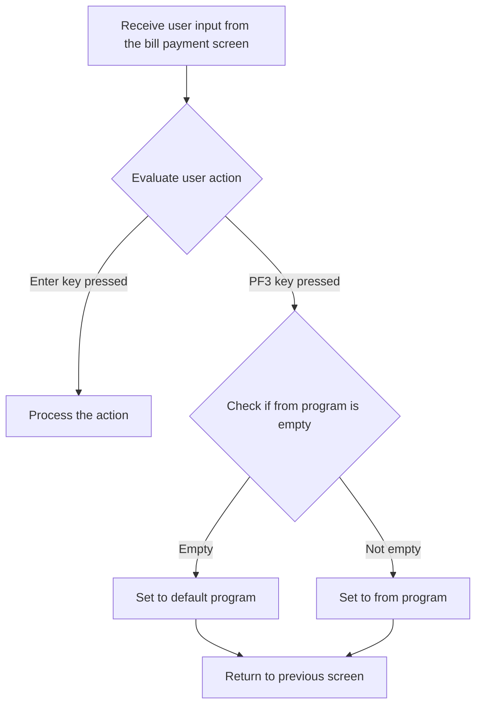

The function begins by receiving user input from the bill payment screen. This step is crucial as it captures the user's action on the interface.

Next, the function evaluates the user action based on the input received. This involves checking which key the user has pressed.

If the Enter key is pressed, the function processes the action associated with the Enter key. This typically involves confirming the bill payment.

If the PF3 key is pressed, the function checks if the <SwmToken path="app/cbl/COBIL00C.cbl" pos="129:3:7" line-data="                           IF CDEMO-FROM-PROGRAM = SPACES OR LOW-VALUES">`CDEMO-FROM-PROGRAM`</SwmToken> (the program from which the user navigated) is empty or contains low values. If it is empty, it sets the <SwmToken path="app/cbl/COBIL00C.cbl" pos="108:9:13" line-data="               MOVE &#39;COSGN00C&#39; TO CDEMO-TO-PROGRAM">`CDEMO-TO-PROGRAM`</SwmToken> to a default program <SwmToken path="app/cbl/COBIL00C.cbl" pos="130:4:4" line-data="                               MOVE &#39;COMEN01C&#39; TO CDEMO-TO-PROGRAM">`COMEN01C`</SwmToken>. Otherwise, it sets the <SwmToken path="app/cbl/COBIL00C.cbl" pos="108:9:13" line-data="               MOVE &#39;COSGN00C&#39; TO CDEMO-TO-PROGRAM">`CDEMO-TO-PROGRAM`</SwmToken> to the value of <SwmToken path="app/cbl/COBIL00C.cbl" pos="129:3:7" line-data="                           IF CDEMO-FROM-PROGRAM = SPACES OR LOW-VALUES">`CDEMO-FROM-PROGRAM`</SwmToken>.

## Manage errors

Now, lets zoom into this section of the flow:

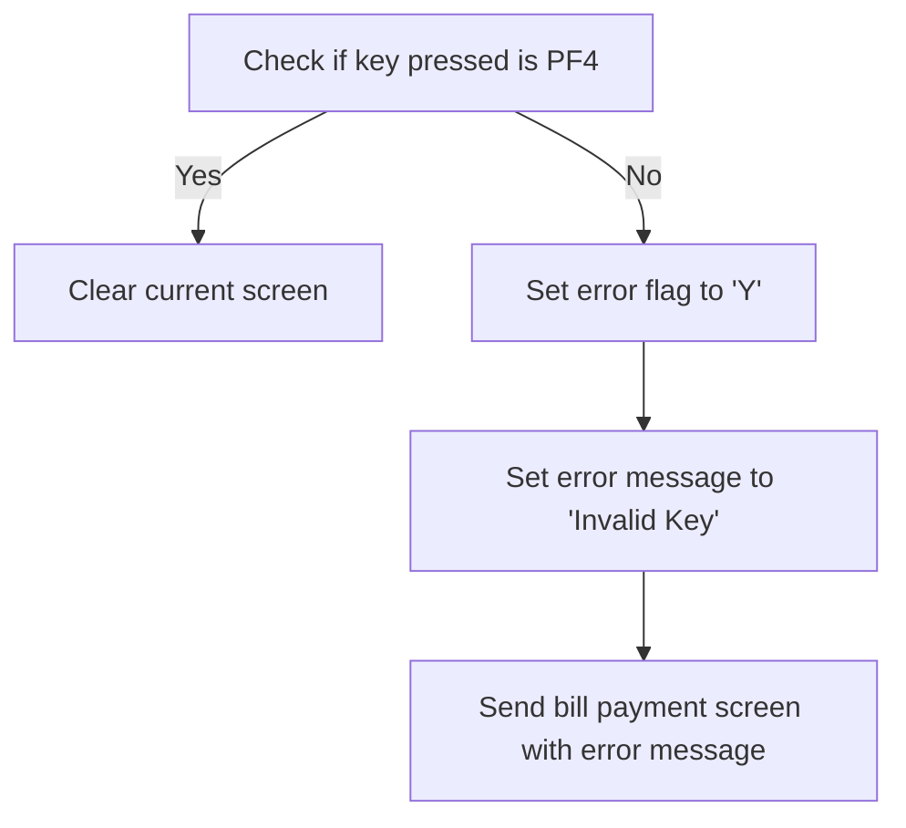

<SwmSnippet path="/app/cbl/COBIL00C.cbl" line="136">

---

First, we check if the key pressed is PF4. If it is, we proceed to clear the current screen.

```cobol
                       WHEN DFHPF4
                           PERFORM CLEAR-CURRENT-SCREEN
```

---

</SwmSnippet>

<SwmSnippet path="/app/cbl/COBIL00C.cbl" line="138">

---

Next, if the key pressed is not PF4, we set the error flag to 'Y' and set the error message to indicate an invalid key entry. Finally, we send the bill payment screen with the error message to inform the user of the invalid key entry.

```cobol
                       WHEN OTHER
                           MOVE 'Y'                       TO WS-ERR-FLG
                           MOVE CCDA-MSG-INVALID-KEY      TO WS-MESSAGE
                           PERFORM SEND-BILLPAY-SCREEN
```

---

</SwmSnippet>

## Finalize and return

This is the next section of the flow.

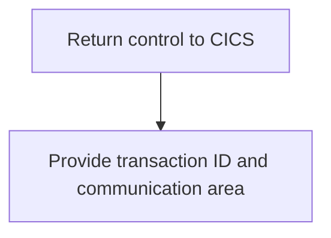

First, the control is returned to CICS, which signifies the end of the current processing and hands over control back to the CICS environment.

## Interim Summary

So far, we saw how the program handles user actions, manages errors, and finalizes the process by returning control to CICS. These steps ensure that user inputs are processed correctly, errors are communicated effectively, and control is handed back to the CICS environment after processing. Now, we will focus on validating the account ID, which is crucial for ensuring that the bill payment process proceeds with a valid account.

## Validate account ID

Now, lets zoom into this section of the flow:

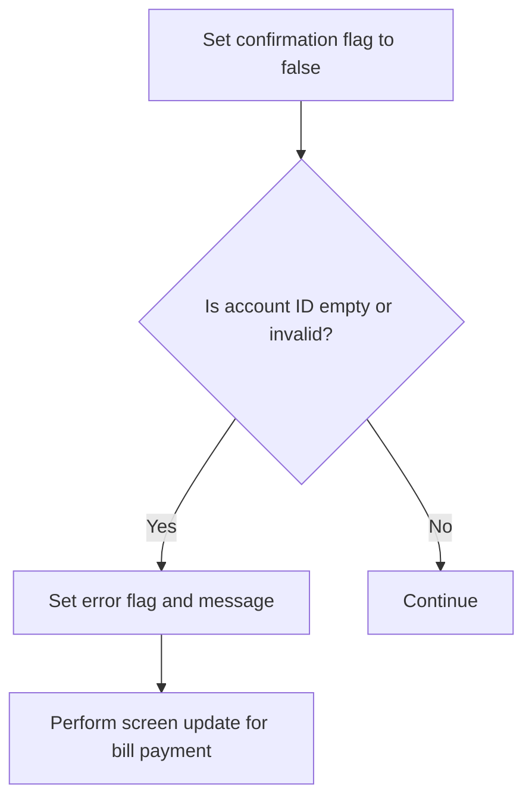

<SwmSnippet path="/app/cbl/COBIL00C.cbl" line="156">

---

First, the confirmation flag is set to false to indicate that the bill payment process has not been confirmed yet.

```cobol
           SET CONF-PAY-NO TO TRUE
```

---

</SwmSnippet>

<SwmSnippet path="/app/cbl/COBIL00C.cbl" line="158">

---

Next, we check if the account ID is empty or contains invalid values. If it is, we set an error flag and display an appropriate error message to the user. This ensures that users are aware of the issue and can correct the account ID before proceeding.

```cobol
           EVALUATE TRUE
               WHEN ACTIDINI OF COBIL0AI = SPACES OR LOW-VALUES
                   MOVE 'Y'     TO WS-ERR-FLG
                   MOVE 'Acct ID can NOT be empty...' TO
                                   WS-MESSAGE
                   MOVE -1       TO ACTIDINL OF COBIL0AI
```

---

</SwmSnippet>

## Confirm payment action

Now, lets zoom into this section of the flow:

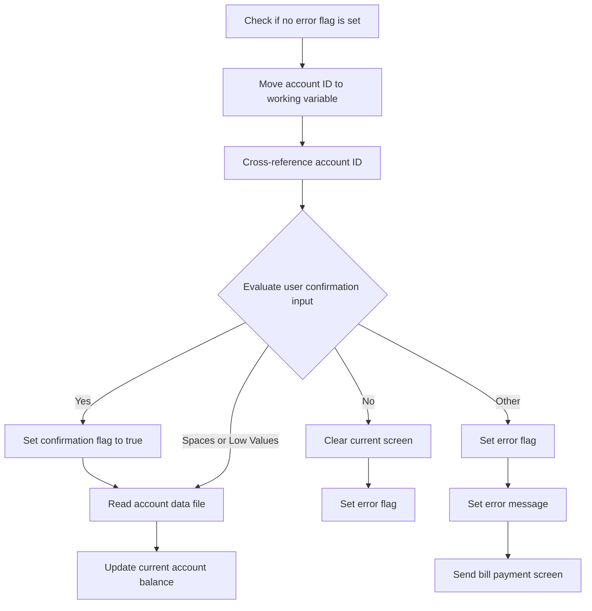

<SwmSnippet path="/app/cbl/COBIL00C.cbl" line="169">

---

First, the program checks if there is no error flag set (<SwmToken path="app/cbl/COBIL00C.cbl" pos="169:5:9" line-data="           IF NOT ERR-FLG-ON">`ERR-FLG-ON`</SwmToken>). If the error flag is not set, it proceeds to the next steps.

```cobol
           IF NOT ERR-FLG-ON
```

---

</SwmSnippet>

<SwmSnippet path="/app/cbl/COBIL00C.cbl" line="170">

---

Next, the account ID is moved to a working variable (<SwmToken path="app/cbl/COBIL00C.cbl" pos="170:11:13" line-data="               MOVE ACTIDINI  OF COBIL0AI TO ACCT-ID">`ACCT-ID`</SwmToken>) and cross-referenced to ensure it is valid.

```cobol
               MOVE ACTIDINI  OF COBIL0AI TO ACCT-ID
                                             XREF-ACCT-ID
```

---

</SwmSnippet>

<SwmSnippet path="/app/cbl/COBIL00C.cbl" line="173">

---

Then, the program evaluates the user's confirmation input (<SwmToken path="app/cbl/COBIL00C.cbl" pos="173:3:3" line-data="               EVALUATE CONFIRMI OF COBIL0AI">`CONFIRMI`</SwmToken>). If the input is 'Y' or 'y', it sets the confirmation flag to true and reads the account data file. If the input is 'N' or 'n', it clears the current screen and sets the error flag. If the input is spaces or low values, it reads the account data file. For any other input, it sets the error flag, sets an error message, and sends the bill payment screen.

```cobol
               EVALUATE CONFIRMI OF COBIL0AI
                   WHEN 'Y'
                   WHEN 'y'
                       SET CONF-PAY-YES TO TRUE
                       PERFORM READ-ACCTDAT-FILE
                   WHEN 'N'
                   WHEN 'n'
                       PERFORM CLEAR-CURRENT-SCREEN
                       MOVE 'Y'     TO WS-ERR-FLG
                   WHEN SPACES
                   WHEN LOW-VALUES
                       PERFORM READ-ACCTDAT-FILE
                   WHEN OTHER
                       MOVE 'Y'     TO WS-ERR-FLG
                       MOVE 'Invalid value. Valid values are (Y/N)...'
                                    TO WS-MESSAGE
                       MOVE -1      TO CONFIRML OF COBIL0AI
                       PERFORM SEND-BILLPAY-SCREEN
```

---

</SwmSnippet>

<SwmSnippet path="/app/cbl/COBIL00C.cbl" line="193">

---

Finally, the current account balance is updated by moving the current balance to a working variable and then to the account information structure.

```cobol
               MOVE ACCT-CURR-BAL TO WS-CURR-BAL
               MOVE WS-CURR-BAL   TO CURBALI    OF COBIL0AI
```

---

</SwmSnippet>

## Validate current balance

Now, lets zoom into this section of the flow:

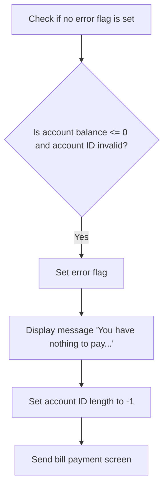

<SwmSnippet path="/app/cbl/COBIL00C.cbl" line="197">

---

First, we check if there is no error flag set (<SwmToken path="app/cbl/COBIL00C.cbl" pos="197:5:9" line-data="           IF NOT ERR-FLG-ON">`ERR-FLG-ON`</SwmToken>). If the error flag is not set, we then evaluate if the account balance (<SwmToken path="app/cbl/COBIL00C.cbl" pos="198:3:7" line-data="               IF ACCT-CURR-BAL &lt;= ZEROS AND">`ACCT-CURR-BAL`</SwmToken>) is zero or negative and if the account ID (<SwmToken path="app/cbl/COBIL00C.cbl" pos="199:1:5" line-data="                  ACTIDINI OF COBIL0AI NOT = SPACES AND LOW-VALUES">`ACTIDINI OF COBIL0AI`</SwmToken>) is not valid (not equal to spaces and low-values). If both conditions are met, we set an error flag (<SwmToken path="app/cbl/COBIL00C.cbl" pos="200:9:13" line-data="                   MOVE &#39;Y&#39;     TO WS-ERR-FLG">`WS-ERR-FLG`</SwmToken>) to 'Y' and display a message (<SwmToken path="app/cbl/COBIL00C.cbl" pos="202:1:3" line-data="                                   WS-MESSAGE">`WS-MESSAGE`</SwmToken>) saying 'You have nothing to pay...'. Additionally, we set the account ID length (<SwmToken path="app/cbl/COBIL00C.cbl" pos="203:8:12" line-data="                   MOVE -1       TO ACTIDINL OF COBIL0AI">`ACTIDINL OF COBIL0AI`</SwmToken>) to -1 to indicate an invalid account ID. Finally, we perform the action to send the bill payment screen (<SwmToken path="app/cbl/COBIL00C.cbl" pos="204:3:7" line-data="                   PERFORM SEND-BILLPAY-SCREEN">`SEND-BILLPAY-SCREEN`</SwmToken>).

```cobol
           IF NOT ERR-FLG-ON
               IF ACCT-CURR-BAL <= ZEROS AND
                  ACTIDINI OF COBIL0AI NOT = SPACES AND LOW-VALUES
                   MOVE 'Y'     TO WS-ERR-FLG
                   MOVE 'You have nothing to pay...' TO
                                   WS-MESSAGE
                   MOVE -1       TO ACTIDINL OF COBIL0AI
                   PERFORM SEND-BILLPAY-SCREEN
               END-IF
```

---

</SwmSnippet>

## Process transaction

Now, lets zoom into this section of the flow:

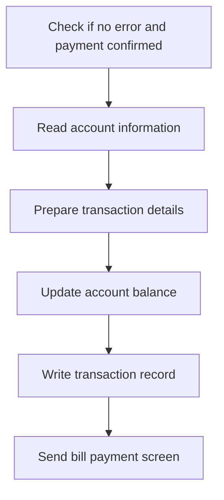

<SwmSnippet path="/app/cbl/COBIL00C.cbl" line="208">

---

### Checking for errors and payment confirmation

First, we check if there is no error (<SwmToken path="app/cbl/COBIL00C.cbl" pos="208:5:9" line-data="           IF NOT ERR-FLG-ON">`ERR-FLG-ON`</SwmToken> is not set) and if the payment is confirmed (<SwmToken path="app/cbl/COBIL00C.cbl" pos="210:3:7" line-data="               IF CONF-PAY-YES">`CONF-PAY-YES`</SwmToken> is set). If both conditions are met, we proceed with the bill payment process.

```cobol
           IF NOT ERR-FLG-ON

               IF CONF-PAY-YES
```

---

</SwmSnippet>

<SwmSnippet path="/app/cbl/COBIL00C.cbl" line="211">

---

### Reading account information and preparing transaction details

Moving to the next step, we read the account information by performing the <SwmToken path="app/cbl/COBIL00C.cbl" pos="211:3:7" line-data="                   PERFORM READ-CXACAIX-FILE">`READ-CXACAIX-FILE`</SwmToken> operation. We then prepare the transaction details by initializing the transaction record, setting the transaction ID, type, category, source, description, amount, card number, merchant details, and timestamps.

```cobol
                   PERFORM READ-CXACAIX-FILE
                   MOVE HIGH-VALUES TO TRAN-ID
                   PERFORM STARTBR-TRANSACT-FILE
                   PERFORM READPREV-TRANSACT-FILE
                   PERFORM ENDBR-TRANSACT-FILE
                   MOVE TRAN-ID     TO WS-TRAN-ID-NUM
                   ADD 1 TO WS-TRAN-ID-NUM
                   INITIALIZE TRAN-RECORD
                   MOVE WS-TRAN-ID-NUM       TO TRAN-ID
                   MOVE '02'                 TO TRAN-TYPE-CD
                   MOVE 2                    TO TRAN-CAT-CD
                   MOVE 'POS TERM'           TO TRAN-SOURCE
                   MOVE 'BILL PAYMENT - ONLINE' TO TRAN-DESC
                   MOVE ACCT-CURR-BAL        TO TRAN-AMT
                   MOVE XREF-CARD-NUM        TO TRAN-CARD-NUM
                   MOVE 999999999            TO TRAN-MERCHANT-ID
                   MOVE 'BILL PAYMENT'       TO TRAN-MERCHANT-NAME
                   MOVE 'N/A'                TO TRAN-MERCHANT-CITY
                   MOVE 'N/A'                TO TRAN-MERCHANT-ZIP
                   PERFORM GET-CURRENT-TIMESTAMP
                   MOVE WS-TIMESTAMP         TO TRAN-ORIG-TS
```

---

</SwmSnippet>

<SwmSnippet path="/app/cbl/COBIL00C.cbl" line="233">

---

### Updating account balance and writing transaction record

Next, we update the account balance by subtracting the transaction amount from the current balance. We then write the transaction record to the transaction file and update the account data file. Finally, we send the bill payment screen to the user.

```cobol
                   PERFORM WRITE-TRANSACT-FILE
                   COMPUTE ACCT-CURR-BAL = ACCT-CURR-BAL - TRAN-AMT
                   PERFORM UPDATE-ACCTDAT-FILE
               ELSE
                   MOVE 'Confirm to make a bill payment...' TO
                                   WS-MESSAGE
                   MOVE -1       TO CONFIRML OF COBIL0AI
               END-IF

               PERFORM SEND-BILLPAY-SCREEN
```

---

</SwmSnippet>

## Send bill payment screen

Now, lets zoom into this section of the flow:

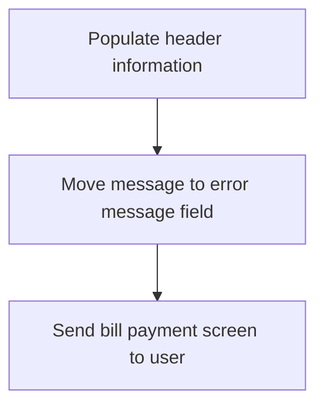

<SwmSnippet path="/app/cbl/COBIL00C.cbl" line="291">

---

First, we populate the header information to ensure that all necessary details are included in the bill payment screen.

```cobol
           PERFORM POPULATE-HEADER-INFO
```

---

</SwmSnippet>

<SwmSnippet path="/app/cbl/COBIL00C.cbl" line="293">

---

Next, we move the message to the error message field to display any relevant messages to the user.

```cobol
           MOVE WS-MESSAGE TO ERRMSGO OF COBIL0AO
```

---

</SwmSnippet>

## Receive bill payment screen

Now, lets zoom into this section of the flow:

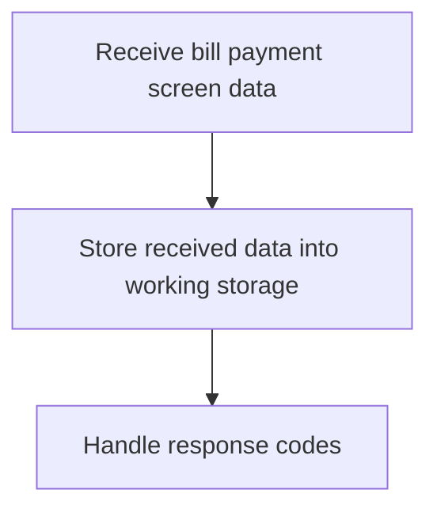

&nbsp;

*This is an auto-generated document by Swimm 🌊 and has not yet been verified by a human*

<SwmMeta version="3.0.0" repo-id="Z2l0aHViJTNBJTNBa3luZHJ5bC1hd3MtbWFpbmZyYW1lLW1vZGVybml6YXRpb24tY2FyZGRlbW8lM0ElM0FTd2ltbS1EZW1v" repo-name="kyndryl-aws-mainframe-modernization-carddemo"><sup>Powered by [Swimm](https://staging.swimm.cloud/)</sup></SwmMeta>
