The document describes the role of the COCRDSLC program in processing credit card detail requests. The program handles the acceptance and processing of these requests by validating inputs, managing data flow, and interacting with data storage to retrieve and display the requested credit card details.

The flow involves accepting a credit card detail request, validating the input data, retrieving the relevant credit card information from storage, and displaying the details to the user. The program ensures that all necessary data structures are properly initialized and that any errors are handled gracefully.

# Where is this program used?

This program is used multiple times in the codebase as represented in the following diagram:

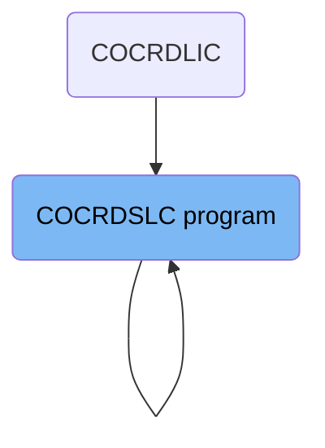

Here is a high level diagram of the program:

```mermaid
graph TD
e6r00("Initializing variables"):::a2096dce6  --> 
wd8cs("Setting context and clearing error message"):::aa75f4b05  --> 
bq174("Handling commarea data and initialization"):::aab308c48  --> 
wkelb("Mapping PF keys"):::a94bd8330  --> 
b9gce("Checking AID validation"):::a56ba8144  --> 
micle("Handling PF03 (XCTL) and setting transaction context"):::a7b2752ba  --> 
26vzm("Processing CDEMO-PGM-ENTER and reading data"):::a8f048abd  --> 
dmftf("Sending map for other contexts"):::a28930103  --> 
hnqaq("Processing CDEMO-PGM-REENTER inputs"):::a526cce84  --> 
jlkm3("Handling unexpected data scenarios"):::ae18cc4c1  --> 
w0ytx("Displaying error message on input error"):::a9cd7ff21  --> 
30e97("Returning control to CICS"):::a4bfce7a8 
classDef a2096dce6 color:#000000,fill:#7CB9F4
classDef aa75f4b05 color:#000000,fill:#00FFAA
classDef aab308c48 color:#000000,fill:#00FFF4
classDef a94bd8330 color:#000000,fill:#FFFF00
classDef a56ba8144 color:#000000,fill:#AA7CB9
classDef a7b2752ba color:#000000,fill:#5afa0a
classDef a8f048abd color:#000000,fill:#f5a10a
classDef a28930103 color:#000000,fill:#f50af1
classDef a526cce84 color:#000000,fill:#9c5602
classDef ae18cc4c1 color:#000000,fill:#FF5733
classDef a9cd7ff21 color:#000000,fill:#C70039
classDef a4bfce7a8 color:#000000,fill:#900C3F

%% Swimm:
%% graph TD
%% e6r00("Initializing variables"):::a2096dce6  --> 
%% wd8cs("Setting context and clearing error message"):::aa75f4b05  --> 
%% bq174("Handling commarea data and initialization"):::aab308c48  --> 
%% wkelb("Mapping PF keys"):::a94bd8330  --> 
%% b9gce("Checking AID validation"):::a56ba8144  --> 
%% micle("Handling <SwmToken path="app/cbl/COCRDSLC.cbl" pos="137:2:2" line-data="               &#39;PF03 pressed.Exiting              &#39;.                            ">`PF03`</SwmToken> (XCTL) and setting transaction context"):::a7b2752ba  --> 
%% 26vzm("Processing <SwmToken path="app/cbl/COCRDSLC.cbl" pos="339:3:7" line-data="              WHEN CDEMO-PGM-ENTER                                              ">`CDEMO-PGM-ENTER`</SwmToken> and reading data"):::a8f048abd  --> 
%% dmftf("Sending map for other contexts"):::a28930103  --> 
%% hnqaq("Processing <SwmToken path="app/cbl/COCRDSLC.cbl" pos="270:5:9" line-data="               AND NOT CDEMO-PGM-REENTER)                               ">`CDEMO-PGM-REENTER`</SwmToken> inputs"):::a526cce84  --> 
%% jlkm3("Handling unexpected data scenarios"):::ae18cc4c1  --> 
%% w0ytx("Displaying error message on input error"):::a9cd7ff21  --> 
%% 30e97("Returning control to CICS"):::a4bfce7a8 
%% classDef a2096dce6 color:#000000,fill:#7CB9F4
%% classDef aa75f4b05 color:#000000,fill:#00FFAA
%% classDef aab308c48 color:#000000,fill:#00FFF4
%% classDef a94bd8330 color:#000000,fill:#FFFF00
%% classDef a56ba8144 color:#000000,fill:#AA7CB9
%% classDef a7b2752ba color:#000000,fill:#5afa0a
%% classDef a8f048abd color:#000000,fill:#f5a10a
%% classDef a28930103 color:#000000,fill:#f50af1
%% classDef a526cce84 color:#000000,fill:#9c5602
%% classDef ae18cc4c1 color:#000000,fill:#FF5733
%% classDef a9cd7ff21 color:#000000,fill:#C70039
%% classDef a4bfce7a8 color:#000000,fill:#900C3F
```

## Initializing variables

First, we'll zoom into this section of the flow:

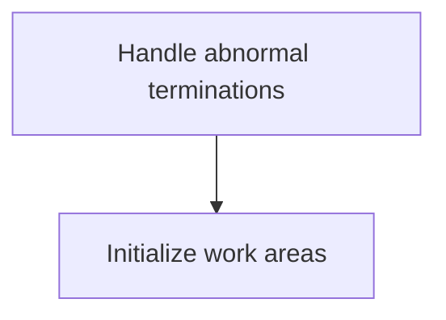

<SwmSnippet path="/app/cbl/COCRDSLC.cbl" line="250">

---

The first step is to handle any abnormal terminations that might occur during the processing of credit card detail requests. This ensures that if an unexpected error happens, the program can gracefully manage the situation and execute the <SwmToken path="app/cbl/COCRDSLC.cbl" pos="251:3:5" line-data="                     LABEL(ABEND-ROUTINE)                                       ">`ABEND-ROUTINE`</SwmToken> to handle the error appropriately.

```cobol
      * Licensed under the Apache License, Version 2.0 (the "License"). 
      * You may not use this file except in compliance with the License.
      * You may obtain a copy of the License at                         
```

---

</SwmSnippet>

<SwmSnippet path="/app/cbl/COCRDSLC.cbl" line="254">

---

Next, the program initializes various work areas, including <SwmToken path="app/cbl/COCRDSLC.cbl" pos="254:3:7" line-data="           INITIALIZE CC-WORK-AREA                                              ">`CC-WORK-AREA`</SwmToken>, <SwmToken path="app/cbl/COCRDSLC.cbl" pos="255:1:5" line-data="                      WS-MISC-STORAGE                                           ">`WS-MISC-STORAGE`</SwmToken>, and <SwmToken path="app/cbl/COCRDSLC.cbl" pos="256:1:3" line-data="                      WS-COMMAREA                                               ">`WS-COMMAREA`</SwmToken>. This step is crucial as it sets up the necessary storage and context for processing the credit card detail requests, ensuring that all required data structures are properly prepared for subsequent operations.

```cobol
      *    http://www.apache.org/licenses/LICENSE-2.0                   
      *                                                                 
      * Unless required by applicable law or agreed to in writing,      
```

---

</SwmSnippet>

## Setting context and clearing error message

This is the next section of the flow.

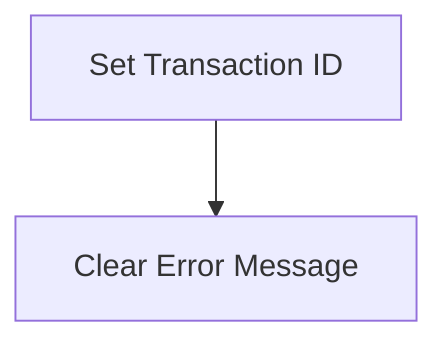

<SwmSnippet path="/app/cbl/COCRDSLC.cbl" line="260">

---

First, we set the transaction ID for the current operation. This ensures that the system correctly identifies and processes the specific transaction being handled.

```cobol
      * language governing permissions and limitations under the License
```

---

</SwmSnippet>

<SwmSnippet path="/app/cbl/COCRDSLC.cbl" line="264">

---

Next, we ensure that any previous error messages are cleared. This step is crucial to avoid displaying outdated or irrelevant error information to the user, ensuring a clean state for the current transaction.

```cobol
             10 CDEMO-FROM-TRANID             PIC X(04).
```

---

</SwmSnippet>

## Handling commarea data and initialization

This is the next section of the flow.

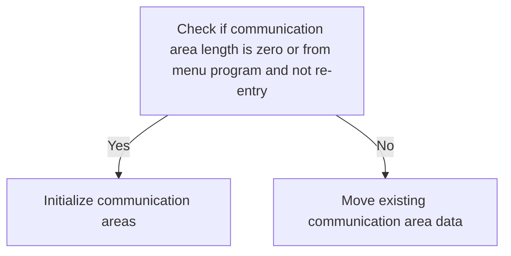

<SwmSnippet path="/app/cbl/COCRDSLC.cbl" line="268">

---

The first step is to check if the communication area length (<SwmToken path="app/cbl/COCRDSLC.cbl" pos="268:3:3" line-data="           IF EIBCALEN IS EQUAL TO 0                                            ">`EIBCALEN`</SwmToken>) is zero or if the request is from the menu program (<SwmToken path="app/cbl/COCRDSLC.cbl" pos="269:4:14" line-data="               OR (CDEMO-FROM-PROGRAM = LIT-MENUPGM">`CDEMO-FROM-PROGRAM = LIT-MENUPGM`</SwmToken>) and not a re-entry (<SwmToken path="app/cbl/COCRDSLC.cbl" pos="270:3:9" line-data="               AND NOT CDEMO-PGM-REENTER)                               ">`NOT CDEMO-PGM-REENTER`</SwmToken>). This ensures that the program initializes the communication areas only when necessary, such as during the first entry or when coming from the menu program.

```cobol
             10 CDEMO-USER-ID                 PIC X(08).
             10 CDEMO-USER-TYPE               PIC X(01).
                88 CDEMO-USRTYP-ADMIN         VALUE 'A'.
```

---

</SwmSnippet>

<SwmSnippet path="/app/cbl/COCRDSLC.cbl" line="271">

---

If the conditions are met, the program initializes the communication areas (<SwmToken path="app/cbl/COCRDSLC.cbl" pos="271:3:5" line-data="              INITIALIZE CARDDEMO-COMMAREA                                      ">`CARDDEMO-COMMAREA`</SwmToken> and <SwmToken path="app/cbl/COCRDSLC.cbl" pos="272:1:5" line-data="                         WS-THIS-PROGCOMMAREA                                   ">`WS-THIS-PROGCOMMAREA`</SwmToken>). This step is crucial for setting up the necessary data structures to handle the credit card detail request.

```cobol
                88 CDEMO-USRTYP-USER          VALUE 'U'.
             10 CDEMO-PGM-CONTEXT             PIC 9(01).
```

---

</SwmSnippet>

<SwmSnippet path="/app/cbl/COCRDSLC.cbl" line="274">

---

If the conditions are not met, the program moves the existing communication area data (<SwmToken path="app/cbl/COCRDSLC.cbl" pos="274:3:3" line-data="              MOVE DFHCOMMAREA (1:LENGTH OF CARDDEMO-COMMAREA)  TO              ">`DFHCOMMAREA`</SwmToken>) to the current program's communication areas (<SwmToken path="app/cbl/COCRDSLC.cbl" pos="274:12:14" line-data="              MOVE DFHCOMMAREA (1:LENGTH OF CARDDEMO-COMMAREA)  TO              ">`CARDDEMO-COMMAREA`</SwmToken> and <SwmToken path="app/cbl/COCRDSLC.cbl" pos="277:5:9" line-data="                               LENGTH OF WS-THIS-PROGCOMMAREA ) TO              ">`WS-THIS-PROGCOMMAREA`</SwmToken>). This ensures that any existing data is preserved and used in the current processing context.

```cobol
                88 CDEMO-PGM-REENTER          VALUE 1.
          05 CDEMO-CUSTOMER-INFO.
             10 CDEMO-CUST-ID                 PIC 9(09).
             10 CDEMO-CUST-FNAME              PIC X(25).
             10 CDEMO-CUST-MNAME              PIC X(25).
```

---

</SwmSnippet>

## Mapping PF keys

This is the next section of the flow.

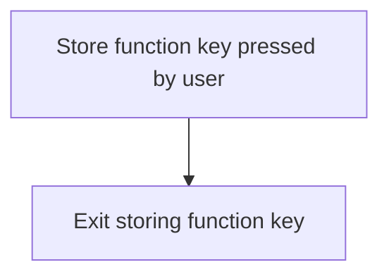

## Checking AID validation

This is the next section of the flow.

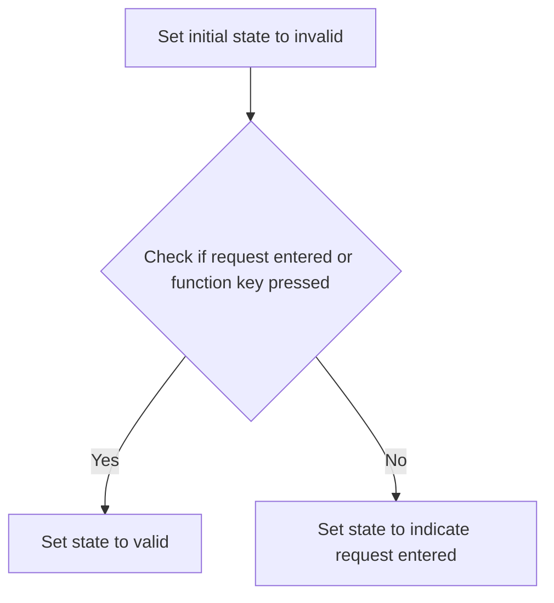

<SwmSnippet path="/app/cbl/COCRDSLC.cbl" line="291">

---

The initial state of the function is set to invalid, indicating that no valid credit card detail request has been entered yet.

```cobol

```

---

</SwmSnippet>

<SwmSnippet path="/app/cbl/COCRDSLC.cbl" line="292">

---

We then check if the user has entered a credit card detail request or pressed a specific function key. If either condition is met, the state is set to valid, indicating that a valid request has been made.

```cobol
                                                                                
       01 WS-THIS-PROGCOMMAREA.                                                 
          05 CA-CALL-CONTEXT.                                                   
             10 CA-FROM-PROGRAM                    PIC X(08).                   
```

---

</SwmSnippet>

<SwmSnippet path="/app/cbl/COCRDSLC.cbl" line="297">

---

If the state remains invalid after the initial check, it is then set to indicate that a request has been entered, ensuring that the function can proceed with processing the request.

```cobol
                                                                                
       01  WS-COMMAREA                             PIC X(2000).                 
                                                                                
```

---

</SwmSnippet>

## Handling <SwmToken path="app/cbl/COCRDSLC.cbl" pos="137:2:2" line-data="               &#39;PF03 pressed.Exiting              &#39;.                            ">`PF03`</SwmToken> (XCTL) and setting transaction context

This is the next section of the flow.

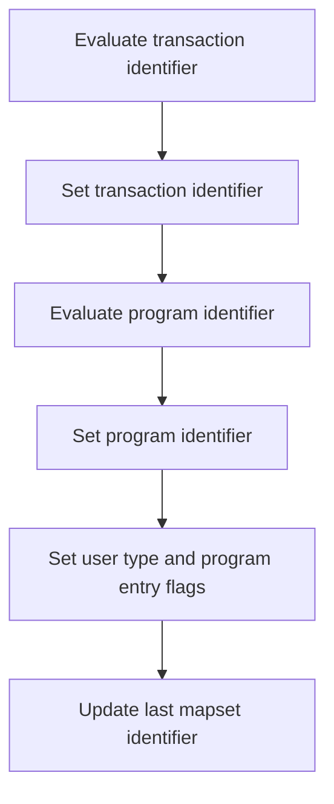

First, the transaction identifier is evaluated to determine if it is either empty or contains low-values. If it is, the transaction identifier is set to the main menu transaction identifier.

Next, the program identifier is evaluated in a similar manner. If it is empty or contains low-values, it is set to the main menu program identifier.

Then, the user type is set to 'user' and the program entry flag is set to true, indicating that the user is entering the program.

## Interim Summary

So far, we saw how the transaction identifier and program identifier are evaluated and set, and how the user type and program entry flags are updated. We also observed the update of the last mapset identifier. Now, we will focus on processing the <SwmToken path="app/cbl/COCRDSLC.cbl" pos="339:3:7" line-data="              WHEN CDEMO-PGM-ENTER                                              ">`CDEMO-PGM-ENTER`</SwmToken> and reading data.

## Processing <SwmToken path="app/cbl/COCRDSLC.cbl" pos="339:3:7" line-data="              WHEN CDEMO-PGM-ENTER                                              ">`CDEMO-PGM-ENTER`</SwmToken> and reading data

Now, lets zoom into this section of the flow:

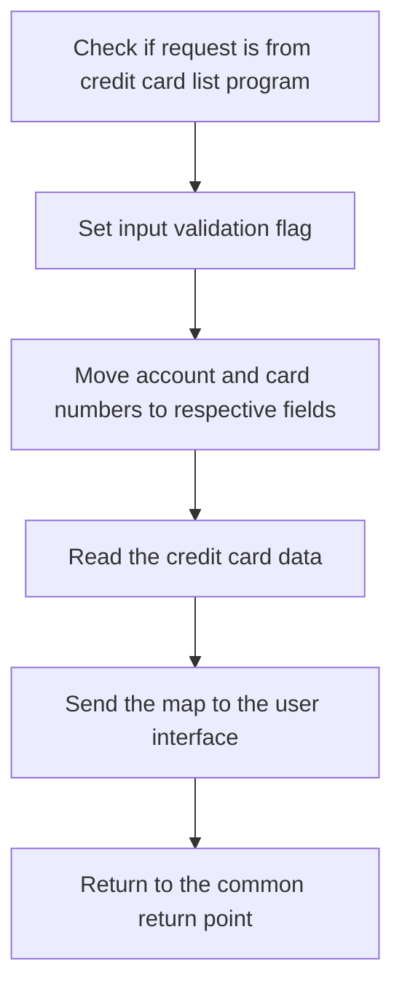

<SwmSnippet path="/app/cbl/COCRDSLC.cbl" line="339">

---

The function first checks if the request is coming from the credit card list program by evaluating the <SwmToken path="app/cbl/COCRDSLC.cbl" pos="340:3:7" line-data="               AND CDEMO-FROM-PROGRAM  EQUAL LIT-CCLISTPGM                      ">`CDEMO-FROM-PROGRAM`</SwmToken> variable. If the condition is met, it sets the input validation flag to true, indicating that the input is valid for further processing.

```cobol
      * Copyright Amazon.com, Inc. or its affiliates.                   
      * All Rights Reserved.                                            
      *                                                                 
```

---

</SwmSnippet>

<SwmSnippet path="/app/cbl/COCRDSLC.cbl" line="342">

---

Next, the function moves the account ID and card number from the input fields (<SwmToken path="app/cbl/COCRDSLC.cbl" pos="342:3:7" line-data="                   MOVE CDEMO-ACCT-ID       TO CC-ACCT-ID-N                     ">`CDEMO-ACCT-ID`</SwmToken> and <SwmToken path="app/cbl/COCRDSLC.cbl" pos="343:3:7" line-data="                   MOVE CDEMO-CARD-NUM      TO CC-CARD-NUM-N                    ">`CDEMO-CARD-NUM`</SwmToken>) to the respective fields (<SwmToken path="app/cbl/COCRDSLC.cbl" pos="342:11:17" line-data="                   MOVE CDEMO-ACCT-ID       TO CC-ACCT-ID-N                     ">`CC-ACCT-ID-N`</SwmToken> and <SwmToken path="app/cbl/COCRDSLC.cbl" pos="343:11:17" line-data="                   MOVE CDEMO-CARD-NUM      TO CC-CARD-NUM-N                    ">`CC-CARD-NUM-N`</SwmToken>). This step prepares the data for the subsequent read operation.

```cobol
      * Licensed under the Apache License, Version 2.0 (the "License"). 
      * You may not use this file except in compliance with the License.
```

---

</SwmSnippet>

<SwmSnippet path="/app/cbl/COCRDSLC.cbl" line="344">

---

The function then performs the read operation by calling the <SwmToken path="app/cbl/COCRDSLC.cbl" pos="344:3:7" line-data="                   PERFORM 9000-READ-DATA                                       ">`9000-READ-DATA`</SwmToken> section, which retrieves the credit card data based on the provided account and card numbers.

```cobol
      * You may obtain a copy of the License at                         
      *                                                                 
```

---

</SwmSnippet>

<SwmSnippet path="/app/cbl/COCRDSLC.cbl" line="346">

---

After reading the data, the function sends the map to the user interface by calling the <SwmToken path="app/cbl/COCRDSLC.cbl" pos="346:3:7" line-data="                   PERFORM 1000-SEND-MAP                                        ">`1000-SEND-MAP`</SwmToken> section. This step ensures that the retrieved credit card details are displayed to the user.

```cobol
      *    http://www.apache.org/licenses/LICENSE-2.0                   
      *                                                                 
```

---

</SwmSnippet>

<SwmSnippet path="/app/cbl/COCRDSLC.cbl" line="348">

---

Finally, the function returns to the common return point, completing the processing of the credit card detail request.

```cobol
      * Unless required by applicable law or agreed to in writing,      
```

---

</SwmSnippet>

## Sending map for other contexts

Now, lets zoom into this section of the flow:

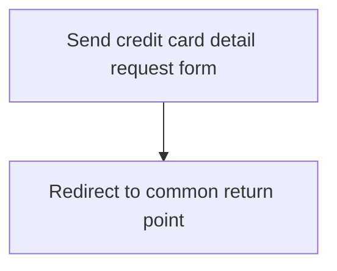

<SwmSnippet path="/app/cbl/COCRDSLC.cbl" line="354">

---

The first step is to send the credit card detail request form to the user. This involves displaying the form where the user can input the necessary details for their credit card request.

```cobol
       01 WS-DATE-TIME.
         05 WS-CURDATE-DATA.
```

---

</SwmSnippet>

<SwmSnippet path="/app/cbl/COCRDSLC.cbl" line="356">

---

After sending the form, the flow redirects to a common return point. This ensures that the program can handle the next steps in processing the user's input in a standardized manner.

```cobol
           10  WS-CURDATE.
```

---

</SwmSnippet>

## Processing <SwmToken path="app/cbl/COCRDSLC.cbl" pos="270:5:9" line-data="               AND NOT CDEMO-PGM-REENTER)                               ">`CDEMO-PGM-REENTER`</SwmToken> inputs

Now, lets zoom into this section of the flow:

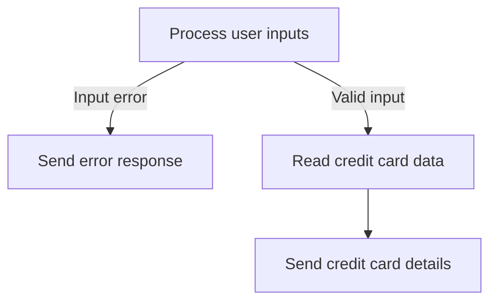

<SwmSnippet path="/app/cbl/COCRDSLC.cbl" line="358">

---

The first step is to process the user inputs. This involves validating the input data to ensure it meets the required criteria.

```cobol
                   PERFORM 2000-PROCESS-INPUTS                                  
                      THRU 2000-PROCESS-INPUTS-EXIT                             
```

---

</SwmSnippet>

<SwmSnippet path="/app/cbl/COCRDSLC.cbl" line="360">

---

If there is an input error, the system sends an error response to the user. This ensures that the user is informed about the issue and can correct the input data.

```cobol
                   IF INPUT-ERROR                                               
                      PERFORM 1000-SEND-MAP                                     
                         THRU 1000-SEND-MAP-EXIT                                
                      GO TO COMMON-RETURN                                       
```

---

</SwmSnippet>

<SwmSnippet path="/app/cbl/COCRDSLC.cbl" line="364">

---

If the input data is valid, the system proceeds to read the credit card data from the database. This step retrieves the necessary information based on the user's request.

```cobol
                   ELSE                                                         
                      PERFORM 9000-READ-DATA                                    
                         THRU 9000-READ-DATA-EXIT                               
```

---

</SwmSnippet>

<SwmSnippet path="/app/cbl/COCRDSLC.cbl" line="367">

---

Finally, the system sends the credit card details back to the user. This provides the user with the requested information in a timely manner.

```cobol
                      PERFORM 1000-SEND-MAP                                     
                         THRU 1000-SEND-MAP-EXIT                                
                      GO TO COMMON-RETURN                                       
```

---

</SwmSnippet>

## Handling unexpected data scenarios

Now, lets zoom into this section of the flow:

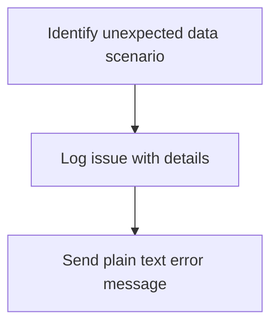

<SwmSnippet path="/app/cbl/COCRDSLC.cbl" line="373">

---

First, the system identifies an unexpected data scenario, which indicates that the data received does not match the expected format or values.

```cobol
              WHEN OTHER                                                        
```

---

</SwmSnippet>

<SwmSnippet path="/app/cbl/COCRDSLC.cbl" line="374">

---

Next, the system logs the issue by setting the <SwmToken path="app/cbl/COCRDSLC.cbl" pos="374:9:11" line-data="                   MOVE LIT-THISPGM    TO ABEND-CULPRIT                         ">`ABEND-CULPRIT`</SwmToken> to the current program identifier, <SwmToken path="app/cbl/COCRDSLC.cbl" pos="375:9:11" line-data="                   MOVE &#39;0001&#39;         TO ABEND-CODE                            ">`ABEND-CODE`</SwmToken> to '0001', and <SwmToken path="app/cbl/COCRDSLC.cbl" pos="376:7:9" line-data="                   MOVE SPACES         TO ABEND-REASON                          ">`ABEND-REASON`</SwmToken> to spaces, indicating no specific reason provided. It also sets <SwmToken path="app/cbl/COCRDSLC.cbl" pos="378:3:7" line-data="                                       TO WS-RETURN-MSG                         ">`WS-RETURN-MSG`</SwmToken> to 'UNEXPECTED DATA SCENARIO' to describe the error.

```cobol
                   MOVE LIT-THISPGM    TO ABEND-CULPRIT                         
                   MOVE '0001'         TO ABEND-CODE                            
                   MOVE SPACES         TO ABEND-REASON                          
                   MOVE 'UNEXPECTED DATA SCENARIO'                              
                                       TO WS-RETURN-MSG                         
```

---

</SwmSnippet>

<SwmSnippet path="/app/cbl/COCRDSLC.cbl" line="379">

---

Finally, the system sends a plain text message to notify the relevant parties about the unexpected data scenario, ensuring that the issue is communicated clearly.

```cobol
                   PERFORM SEND-PLAIN-TEXT                                      
                      THRU SEND-PLAIN-TEXT-EXIT                                 
```

---

</SwmSnippet>

## Displaying error message on input error

Now, lets zoom into this section of the flow:

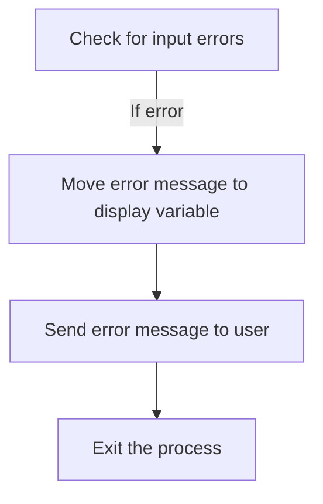

<SwmSnippet path="/app/cbl/COCRDSLC.cbl" line="386">

---

The first step is to check if there are any input errors (<SwmToken path="app/cbl/COCRDSLC.cbl" pos="386:3:5" line-data="           IF INPUT-ERROR                                                       ">`INPUT-ERROR`</SwmToken>). If an error is detected, the error message is moved to the display variable (<SwmToken path="app/cbl/COCRDSLC.cbl" pos="387:3:7" line-data="              MOVE WS-RETURN-MSG  TO CCARD-ERROR-MSG                            ">`WS-RETURN-MSG`</SwmToken> to <SwmToken path="app/cbl/COCRDSLC.cbl" pos="387:11:15" line-data="              MOVE WS-RETURN-MSG  TO CCARD-ERROR-MSG                            ">`CCARD-ERROR-MSG`</SwmToken>). This ensures that the appropriate error message is prepared for the user. Next, the error message is sent to the user by performing the <SwmToken path="app/cbl/COCRDSLC.cbl" pos="388:3:7" line-data="              PERFORM 1000-SEND-MAP                                             ">`1000-SEND-MAP`</SwmToken> routine. Finally, the process exits by going to the <SwmToken path="app/cbl/COCRDSLC.cbl" pos="390:5:7" line-data="              GO TO COMMON-RETURN                                               ">`COMMON-RETURN`</SwmToken> section, effectively halting further processing due to the detected input error.

```cobol
           IF INPUT-ERROR                                                       
              MOVE WS-RETURN-MSG  TO CCARD-ERROR-MSG                            
              PERFORM 1000-SEND-MAP                                             
                 THRU 1000-SEND-MAP-EXIT                                        
              GO TO COMMON-RETURN                                               
           END-IF                                                               
```

---

</SwmSnippet>

## Returning control to CICS

Now, lets zoom into this section of the flow:

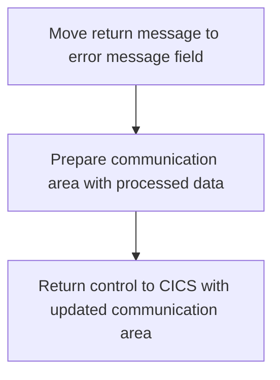

<SwmSnippet path="/app/cbl/COCRDSLC.cbl" line="394">

---

First, we move the return message stored in <SwmToken path="app/cbl/COCRDSLC.cbl" pos="395:3:7" line-data="           MOVE WS-RETURN-MSG     TO CCARD-ERROR-MSG                            ">`WS-RETURN-MSG`</SwmToken> (which holds the return message) to <SwmToken path="app/cbl/COCRDSLC.cbl" pos="395:11:15" line-data="           MOVE WS-RETURN-MSG     TO CCARD-ERROR-MSG                            ">`CCARD-ERROR-MSG`</SwmToken> (the error message field). This ensures that any error messages generated during the processing are available for the user.

```cobol
       COMMON-RETURN.                                                           
           MOVE WS-RETURN-MSG     TO CCARD-ERROR-MSG                            
```

---

</SwmSnippet>

<SwmSnippet path="/app/cbl/COCRDSLC.cbl" line="397">

---

Next, we prepare the communication area by moving <SwmToken path="app/cbl/COCRDSLC.cbl" pos="397:3:5" line-data="           MOVE  CARDDEMO-COMMAREA    TO WS-COMMAREA                            ">`CARDDEMO-COMMAREA`</SwmToken> (the main communication area) to <SwmToken path="app/cbl/COCRDSLC.cbl" pos="397:9:11" line-data="           MOVE  CARDDEMO-COMMAREA    TO WS-COMMAREA                            ">`WS-COMMAREA`</SwmToken> (the working storage communication area). This is followed by appending <SwmToken path="app/cbl/COCRDSLC.cbl" pos="398:3:7" line-data="           MOVE  WS-THIS-PROGCOMMAREA TO                                        ">`WS-THIS-PROGCOMMAREA`</SwmToken> (the current program's communication area) to <SwmToken path="app/cbl/COCRDSLC.cbl" pos="397:9:11" line-data="           MOVE  CARDDEMO-COMMAREA    TO WS-COMMAREA                            ">`WS-COMMAREA`</SwmToken>, ensuring that all relevant data is included. Finally, we return control to the CICS with the updated communication area, allowing the system to continue processing with the new data.

```cobol
           MOVE  CARDDEMO-COMMAREA    TO WS-COMMAREA                            
           MOVE  WS-THIS-PROGCOMMAREA TO                                        
                  WS-COMMAREA(LENGTH OF CARDDEMO-COMMAREA + 1:                  
                               LENGTH OF WS-THIS-PROGCOMMAREA )                 
                                                                                
           EXEC CICS RETURN                                                     
                TRANSID (LIT-THISTRANID)                                        
                COMMAREA (WS-COMMAREA)                                          
                LENGTH(LENGTH OF WS-COMMAREA)                                   
           END-EXEC                                                             
```

---

</SwmSnippet>

&nbsp;

*This is an auto-generated document by Swimm 🌊 and has not yet been verified by a human*

<SwmMeta version="3.0.0" repo-id="Z2l0aHViJTNBJTNBa3luZHJ5bC1hd3MtbWFpbmZyYW1lLW1vZGVybml6YXRpb24tY2FyZGRlbW8lM0ElM0FTd2ltbS1EZW1v" repo-name="kyndryl-aws-mainframe-modernization-carddemo"><sup>Powered by [Swimm](/)</sup></SwmMeta>
