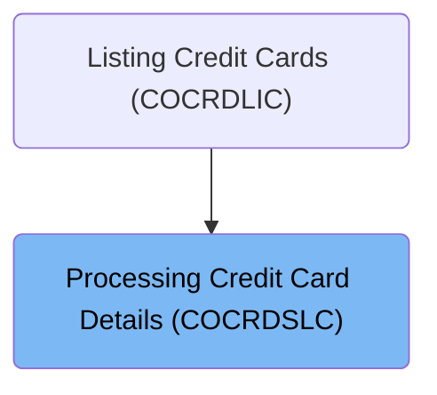
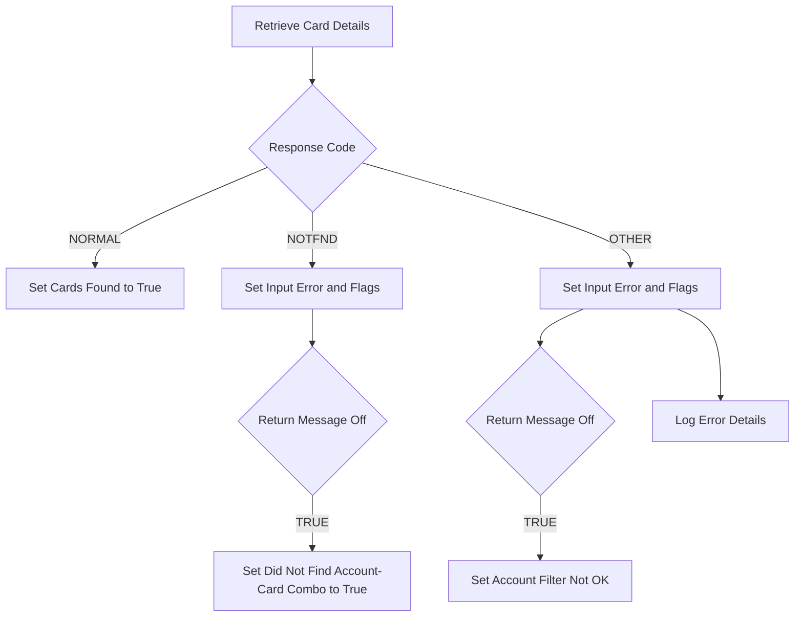
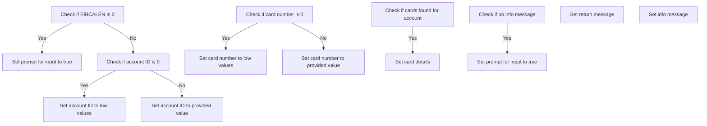

```mermaid
graph TD
  A[Check if EIBCALEN is 0 or from main menu] -->|Yes| B[Initialize communication areas]
  A -->|No| C[Move data from DFHCOMMAREA to local areas]
  D[Evaluate AID] -->|Enter or PF03| E[Set PFK-VALID to TRUE]
  D -->|Invalid| F[Set CCARD-AID-ENTER to TRUE]
  G[Evaluate TRUE] -->|PFK03| H[Set transaction and program IDs]
  H --> I[Transfer control to another program]
  G -->|PGM-ENTER from credit card list| J[Read data and send map]
  G -->|PGM-ENTER from other context| K[Send map]
  G -->|PGM-REENTER| L[Process inputs]
  L -->|Input error| M[Send map]
  L -->|No error| N[Read data and send map]
  G -->|Other| O[Handle unexpected data scenario]

%% Swimm:
%% graph TD
%%   A[Check if EIBCALEN is 0 or from main menu] -->|Yes| B[Initialize communication areas]
%%   A -->|No| C[Move data from DFHCOMMAREA to local areas]
%%   D[Evaluate AID] -->|Enter or <SwmToken path="app/cbl/COCRDSLC.cbl" pos="137:2:2" line-data="               &#39;PF03 pressed.Exiting              &#39;.                            ">`PF03`</SwmToken>| E[Set <SwmToken path="app/cbl/COCRDSLC.cbl" pos="294:3:5" line-data="              SET PFK-VALID TO TRUE                                             ">`PFK-VALID`</SwmToken> to TRUE]
%%   D -->|Invalid| F[Set <SwmToken path="app/cbl/COCRDSLC.cbl" pos="292:3:7" line-data="           IF CCARD-AID-ENTER OR                                                ">`CCARD-AID-ENTER`</SwmToken> to TRUE]
%%   G[Evaluate TRUE] -->|<SwmToken path="app/cbl/COCRDSLC.cbl" pos="293:5:5" line-data="              CCARD-AID-PFK03                                                   ">`PFK03`</SwmToken>| H[Set transaction and program IDs]
%%   H --> I[Transfer control to another program]
%%   G -->|<SwmToken path="app/cbl/COCRDSLC.cbl" pos="327:5:7" line-data="                   SET  CDEMO-PGM-ENTER    TO TRUE                              ">`PGM-ENTER`</SwmToken> from credit card list| J[Read data and send map]
%%   G -->|<SwmToken path="app/cbl/COCRDSLC.cbl" pos="327:5:7" line-data="                   SET  CDEMO-PGM-ENTER    TO TRUE                              ">`PGM-ENTER`</SwmToken> from other context| K[Send map]
%%   G -->|<SwmToken path="app/cbl/COCRDSLC.cbl" pos="270:7:9" line-data="               AND NOT CDEMO-PGM-REENTER)                               ">`PGM-REENTER`</SwmToken>| L[Process inputs]
%%   L -->|Input error| M[Send map]
%%   L -->|No error| N[Read data and send map]
%%   G -->|Other| O[Handle unexpected data scenario]
```

The COCRDSLC program is responsible for accepting and processing credit card detail requests. This program is part of the business logic layer and is used to handle the detailed processing of credit card information. It is invoked in a flow that starts from the COCRDLIC program, which lists credit cards.

For example, when a user requests details for a specific credit card, the COCRDSLC program processes this request by reading the card data, validating inputs, and sending the appropriate response back to the user interface.

# Where is this program used?

This program is used once, in a flow starting from <SwmToken path="app/cbl/COCRDSLC.cbl" pos="172:4:4" line-data="                                                   VALUE &#39;COCRDLIC&#39;.            ">`COCRDLIC`</SwmToken> as represented in the following diagram:



# Process credit card (<SwmToken path="app/cbl/COCRDSLC.cbl" pos="248:1:3" line-data="       0000-MAIN.                                                               ">`0000-MAIN`</SwmToken>)

Lets' zoom into the program flow:



<SwmSnippet path="/app/cbl/COCRDSLC.cbl" line="248">

---

### Handling Abends

Going into the first snippet, the code ensures that if an abnormal termination occurs, it is properly handled.

```cobol
       0000-MAIN.                                                               
                                                                                
           EXEC CICS HANDLE ABEND                                               
                     LABEL(ABEND-ROUTINE)                                       
           END-EXEC                                                             
```

---

</SwmSnippet>

<SwmSnippet path="/app/cbl/COCRDSLC.cbl" line="254">

---

### Initializing Work Areas

Now, the code prepares the necessary work areas and clears any previous error messages.

```cobol
           INITIALIZE CC-WORK-AREA                                              
                      WS-MISC-STORAGE                                           
                      WS-COMMAREA                                               
      *****************************************************************         
      * Store our context                                                       
      *****************************************************************         
           MOVE LIT-THISTRANID       TO WS-TRANID                               
      *****************************************************************         
      * Ensure error message is cleared                               *         
      *****************************************************************         
           SET WS-RETURN-MSG-OFF  TO TRUE                                       
```

---

</SwmSnippet>

<SwmSnippet path="/app/cbl/COCRDSLC.cbl" line="268">

---

### Handling Communication Area

Next, the code checks if there is any data passed from a previous transaction. If not, it initializes the communication areas. Otherwise, it moves the data to local storage.

```cobol
           IF EIBCALEN IS EQUAL TO 0                                            
               OR (CDEMO-FROM-PROGRAM = LIT-MENUPGM
               AND NOT CDEMO-PGM-REENTER)                               
              INITIALIZE CARDDEMO-COMMAREA                                      
                         WS-THIS-PROGCOMMAREA                                   
           ELSE                                                                 
              MOVE DFHCOMMAREA (1:LENGTH OF CARDDEMO-COMMAREA)  TO              
                                CARDDEMO-COMMAREA                               
              MOVE DFHCOMMAREA(LENGTH OF CARDDEMO-COMMAREA + 1:                 
                               LENGTH OF WS-THIS-PROGCOMMAREA ) TO              
                                WS-THIS-PROGCOMMAREA                            
           END-IF                                                               
```

---

</SwmSnippet>

<SwmSnippet path="/app/cbl/COCRDSLC.cbl" line="284">

---

### Storing PF Key

Then, the code performs a routine to store the PF key for handling user inputs.

```cobol
           PERFORM YYYY-STORE-PFKEY                                             
              THRU YYYY-STORE-PFKEY-EXIT                                        
```

---

</SwmSnippet>

<SwmSnippet path="/app/cbl/COCRDSLC.cbl" line="291">

---

### Validating AID

Moving to the next snippet, the code sets a flag to indicate an invalid AID. It then checks if the AID is either 'Enter' or <SwmToken path="app/cbl/COCRDSLC.cbl" pos="137:2:2" line-data="               &#39;PF03 pressed.Exiting              &#39;.                            ">`PF03`</SwmToken> and sets the flag to valid if true.

```cobol
           SET PFK-INVALID TO TRUE                                              
           IF CCARD-AID-ENTER OR                                                
              CCARD-AID-PFK03                                                   
              SET PFK-VALID TO TRUE                                             
           END-IF                                                               
```

---

</SwmSnippet>

<SwmSnippet path="/app/cbl/COCRDSLC.cbl" line="297">

---

### Handling Invalid AID

Next, the code checks if the AID is invalid and sets the 'Enter' AID to true if it is.

```cobol
           IF PFK-INVALID                                                       
              SET CCARD-AID-ENTER TO TRUE                                       
           END-IF                                                               
```

---

</SwmSnippet>

<SwmSnippet path="/app/cbl/COCRDSLC.cbl" line="304">

---

### Evaluating Inputs

Then, the code evaluates the inputs received. If the AID is <SwmToken path="app/cbl/COCRDSLC.cbl" pos="137:2:2" line-data="               &#39;PF03 pressed.Exiting              &#39;.                            ">`PF03`</SwmToken>, it sets the transaction and program IDs based on the source transaction and program.

```cobol
           EVALUATE TRUE                                                        
              WHEN CCARD-AID-PFK03                                              
      ******************************************************************        
      *            XCTL TO CALLING PROGRAM OR MAIN MENU                         
      ******************************************************************        
                   IF CDEMO-FROM-TRANID    EQUAL LOW-VALUES                     
                   OR CDEMO-FROM-TRANID    EQUAL SPACES                         
                      MOVE LIT-MENUTRANID  TO CDEMO-TO-TRANID                   
                   ELSE                                                         
                      MOVE CDEMO-FROM-TRANID  TO CDEMO-TO-TRANID                
                   END-IF                                                       
```

---

</SwmSnippet>

<SwmSnippet path="/app/cbl/COCRDSLC.cbl" line="316">

---

### Setting Program ID

Next, the code checks if the source program ID is empty and sets it to the main menu program if it is.

```cobol
                   IF CDEMO-FROM-PROGRAM   EQUAL LOW-VALUES                     
                   OR CDEMO-FROM-PROGRAM   EQUAL SPACES                         
                      MOVE LIT-MENUPGM     TO CDEMO-TO-PROGRAM                  
                   ELSE                                                         
                      MOVE CDEMO-FROM-PROGRAM TO CDEMO-TO-PROGRAM               
                   END-IF                                                       
```

---

</SwmSnippet>

<SwmSnippet path="/app/cbl/COCRDSLC.cbl" line="323">

---

### Transferring Control

Then, the code sets various flags and transfers control to the next program using the communication area.

```cobol
                   MOVE LIT-THISTRANID     TO CDEMO-FROM-TRANID                 
                   MOVE LIT-THISPGM        TO CDEMO-FROM-PROGRAM                
                                                                                
                   SET  CDEMO-USRTYP-USER  TO TRUE                              
                   SET  CDEMO-PGM-ENTER    TO TRUE                              
                   MOVE LIT-THISMAPSET     TO CDEMO-LAST-MAPSET                 
                   MOVE LIT-THISMAP        TO CDEMO-LAST-MAP                    
      *                                                                         
                   EXEC CICS XCTL                                               
                             PROGRAM (CDEMO-TO-PROGRAM)                         
                             COMMAREA(CARDDEMO-COMMAREA)                        
                   END-EXEC                                                     
```

---

</SwmSnippet>

<SwmSnippet path="/app/cbl/COCRDSLC.cbl" line="339">

---

### Handling Credit Card List Screen

Next, the code checks if the program is entered from the credit card list screen. If so, it reads the data and sends the map.

```cobol
              WHEN CDEMO-PGM-ENTER                                              
               AND CDEMO-FROM-PROGRAM  EQUAL LIT-CCLISTPGM                      
                   SET INPUT-OK TO TRUE                                         
                   MOVE CDEMO-ACCT-ID       TO CC-ACCT-ID-N                     
                   MOVE CDEMO-CARD-NUM      TO CC-CARD-NUM-N                    
                   PERFORM 9000-READ-DATA                                       
                      THRU 9000-READ-DATA-EXIT                                  
                   PERFORM 1000-SEND-MAP                                        
                     THRU 1000-SEND-MAP-EXIT                                    
                   GO TO COMMON-RETURN                                          
```

---

</SwmSnippet>

<SwmSnippet path="/app/cbl/COCRDSLC.cbl" line="349">

---

### Handling Other Contexts

Then, the code checks if the program is entered from some other context and sends the map.

```cobol
              WHEN CDEMO-PGM-ENTER                                              
      ******************************************************************        
      *            COMING FROM SOME OTHER CONTEXT                               
      *            SELECTION CRITERIA TO BE GATHERED                            
      ******************************************************************        
                   PERFORM 1000-SEND-MAP THRU                                   
                           1000-SEND-MAP-EXIT                                   
                   GO TO COMMON-RETURN                                          
```

---

</SwmSnippet>

<SwmSnippet path="/app/cbl/COCRDSLC.cbl" line="357">

---

### Re-entering Program

Next, the code checks if the program is re-entered. If so, it processes the inputs and handles any input errors by sending the map again. If there are no errors, it reads the data and sends the map.

```cobol
              WHEN CDEMO-PGM-REENTER                                            
                   PERFORM 2000-PROCESS-INPUTS                                  
                      THRU 2000-PROCESS-INPUTS-EXIT                             
                   IF INPUT-ERROR                                               
                      PERFORM 1000-SEND-MAP                                     
                         THRU 1000-SEND-MAP-EXIT                                
                      GO TO COMMON-RETURN                                       
                   ELSE                                                         
                      PERFORM 9000-READ-DATA                                    
                         THRU 9000-READ-DATA-EXIT                               
                      PERFORM 1000-SEND-MAP                                     
                         THRU 1000-SEND-MAP-EXIT                                
                      GO TO COMMON-RETURN                                       
                                                                                
                   END-IF                                                       
```

---

</SwmSnippet>

<SwmSnippet path="/app/cbl/COCRDSLC.cbl" line="373">

---

### Handling Unexpected Data

Finally, the code handles any unexpected data scenarios by setting appropriate error messages and sending a plain text message to the user interface.

```cobol
              WHEN OTHER                                                        
                   MOVE LIT-THISPGM    TO ABEND-CULPRIT                         
                   MOVE '0001'         TO ABEND-CODE                            
                   MOVE SPACES         TO ABEND-REASON                          
                   MOVE 'UNEXPECTED DATA SCENARIO'                              
                                       TO WS-RETURN-MSG                         
                   PERFORM SEND-PLAIN-TEXT                                      
                      THRU SEND-PLAIN-TEXT-EXIT                                 
           END-EVALUATE                                                         
```

---

</SwmSnippet>

# Read Data (<SwmToken path="app/cbl/COCRDSLC.cbl" pos="344:3:7" line-data="                   PERFORM 9000-READ-DATA                                       ">`9000-READ-DATA`</SwmToken>)

<SwmSnippet path="/app/cbl/COCRDSLC.cbl" line="726">

---

### Reading Card Data

Going into the <SwmToken path="app/cbl/COCRDSLC.cbl" pos="726:1:5" line-data="       9000-READ-DATA.                                                          ">`9000-READ-DATA`</SwmToken> function, it performs the <SwmToken path="app/cbl/COCRDSLC.cbl" pos="728:3:7" line-data="           PERFORM 9100-GETCARD-BYACCTCARD                                      ">`9100-GETCARD-BYACCTCARD`</SwmToken> function. This function reads the card record using the account and card number details. The outcome of this operation determines the next steps in processing the credit card detail request.

```cobol
       9000-READ-DATA.                                                          
                                                                                
           PERFORM 9100-GETCARD-BYACCTCARD                                      
              THRU 9100-GETCARD-BYACCTCARD-EXIT                                 
           .                                                                    
```

---

</SwmSnippet>

# Read Card Record (<SwmToken path="app/cbl/COCRDSLC.cbl" pos="728:3:7" line-data="           PERFORM 9100-GETCARD-BYACCTCARD                                      ">`9100-GETCARD-BYACCTCARD`</SwmToken>)

Lets' zoom into the program flow:



<SwmSnippet path="/app/cbl/COCRDSLC.cbl" line="736">

---

### Reading Card File

Going into the first snippet, the code reads the card file based on the provided account and card number. It fetches the card details from the file and stores the response codes for further evaluation.

```cobol
       9100-GETCARD-BYACCTCARD.                                                 
      *    Read the Card file                                                   
      *                                                                         
      *    MOVE CC-ACCT-ID-N      TO WS-CARD-RID-ACCT-ID                        
           MOVE CC-CARD-NUM       TO WS-CARD-RID-CARDNUM                        
                                                                                
           EXEC CICS READ                                                       
                FILE      (LIT-CARDFILENAME)                                    
                RIDFLD    (WS-CARD-RID-CARDNUM)                                 
                KEYLENGTH (LENGTH OF WS-CARD-RID-CARDNUM)                       
                INTO      (CARD-RECORD)                                         
                LENGTH    (LENGTH OF CARD-RECORD)                               
                RESP      (WS-RESP-CD)                                          
                RESP2     (WS-REAS-CD)                                          
           END-EXEC                                                             
```

---

</SwmSnippet>

<SwmSnippet path="/app/cbl/COCRDSLC.cbl" line="752">

---

### Evaluating Normal Response

Now, the code evaluates the response code. If the response is normal, it sets a flag indicating that cards were found for the account.

```cobol
           EVALUATE WS-RESP-CD                                                  
               WHEN DFHRESP(NORMAL)                                             
                  SET FOUND-CARDS-FOR-ACCOUNT TO TRUE                           
```

---

</SwmSnippet>

<SwmSnippet path="/app/cbl/COCRDSLC.cbl" line="755">

---

### Handling Not Found Response

Next, if the response is not found, the code sets several flags to indicate an input error and issues with the account and card filters. Additionally, if message processing is turned off, it sets a flag indicating that the account-card combination was not found.

```cobol
               WHEN DFHRESP(NOTFND)                                             
                  SET INPUT-ERROR                    TO TRUE                    
                  SET FLG-ACCTFILTER-NOT-OK          TO TRUE                    
                  SET FLG-CARDFILTER-NOT-OK          TO TRUE                    
                  IF  WS-RETURN-MSG-OFF                                         
                      SET DID-NOT-FIND-ACCTCARD-COMBO TO TRUE                   
                  END-IF                                                        
```

---

</SwmSnippet>

<SwmSnippet path="/app/cbl/COCRDSLC.cbl" line="762">

---

### Handling Other Responses

Then, for any other response, the code sets an input error flag. If message processing is turned off, it sets a flag indicating an issue with the account filter. It also logs the error details, including the operation name, file name, and response codes.

```cobol
               WHEN OTHER                                                       
                  SET INPUT-ERROR                    TO TRUE                    
                  IF  WS-RETURN-MSG-OFF                                         
                      SET FLG-ACCTFILTER-NOT-OK      TO TRUE                    
                  END-IF                                                        
                  MOVE 'READ'                        TO ERROR-OPNAME            
                  MOVE LIT-CARDFILENAME                TO ERROR-FILE            
                  MOVE WS-RESP-CD                    TO ERROR-RESP              
                  MOVE WS-REAS-CD                    TO ERROR-RESP2             
                  MOVE WS-FILE-ERROR-MESSAGE         TO WS-RETURN-MSG           
           END-EVALUATE                                                         
```

---

</SwmSnippet>

# Send Screen Steps (<SwmToken path="app/cbl/COCRDSLC.cbl" pos="346:3:7" line-data="                   PERFORM 1000-SEND-MAP                                        ">`1000-SEND-MAP`</SwmToken>)

<SwmSnippet path="/app/cbl/COCRDSLC.cbl" line="412">

---

### Sending the formatted screen

Going into the <SwmToken path="app/cbl/COCRDSLC.cbl" pos="412:1:5" line-data="       1000-SEND-MAP.                                                           ">`1000-SEND-MAP`</SwmToken> function, it starts by initializing the screen with the current date, time, titles, and program/transaction names. Next, it sets up the screen variables necessary for processing credit card details. Then, it configures the screen attributes, such as protecting fields, positioning the cursor, setting up colors, and managing informational messages. Finally, it sends the screen to the user by setting the next screen and map variables, and invoking the CICS send command.

```cobol
       1000-SEND-MAP.                                                           
           PERFORM 1100-SCREEN-INIT                                             
              THRU 1100-SCREEN-INIT-EXIT                                        
           PERFORM 1200-SETUP-SCREEN-VARS                                       
              THRU 1200-SETUP-SCREEN-VARS-EXIT                                  
           PERFORM 1300-SETUP-SCREEN-ATTRS                                      
              THRU 1300-SETUP-SCREEN-ATTRS-EXIT                                 
           PERFORM 1400-SEND-SCREEN                                             
              THRU 1400-SEND-SCREEN-EXIT                                        
```

---

</SwmSnippet>

# Initialize Screen (<SwmToken path="app/cbl/COCRDSLC.cbl" pos="413:3:7" line-data="           PERFORM 1100-SCREEN-INIT                                             ">`1100-SCREEN-INIT`</SwmToken>)

<SwmSnippet path="/app/cbl/COCRDSLC.cbl" line="427">

---

### Initializing screen with current date and time

The <SwmToken path="app/cbl/COCRDSLC.cbl" pos="427:1:5" line-data="       1100-SCREEN-INIT.                                                        ">`1100-SCREEN-INIT`</SwmToken> function initializes the screen by setting up various fields with the current date and time details. It starts by clearing any residual data, retrieves the current date and time, and formats these values into separate components such as month, day, year, hours, minutes, and seconds. These formatted values are then moved to the corresponding fields to ensure that the screen displays the correct current date and time information.

```cobol
       1100-SCREEN-INIT.                                                        
           MOVE LOW-VALUES TO CCRDSLAO                                          
                                                                                
           MOVE FUNCTION CURRENT-DATE  TO WS-CURDATE-DATA                       
                                                                                
           MOVE CCDA-TITLE01           TO TITLE01O OF CCRDSLAO                  
           MOVE CCDA-TITLE02           TO TITLE02O OF CCRDSLAO                  
           MOVE LIT-THISTRANID         TO TRNNAMEO OF CCRDSLAO                  
           MOVE LIT-THISPGM            TO PGMNAMEO OF CCRDSLAO                  
                                                                                
           MOVE FUNCTION CURRENT-DATE  TO WS-CURDATE-DATA                       
                                                                                
           MOVE WS-CURDATE-MONTH       TO WS-CURDATE-MM                         
           MOVE WS-CURDATE-DAY         TO WS-CURDATE-DD                         
           MOVE WS-CURDATE-YEAR(3:2)   TO WS-CURDATE-YY                         
                                                                                
           MOVE WS-CURDATE-MM-DD-YY    TO CURDATEO OF CCRDSLAO                  
                                                                                
           MOVE WS-CURTIME-HOURS       TO WS-CURTIME-HH                         
           MOVE WS-CURTIME-MINUTE      TO WS-CURTIME-MM                         
           MOVE WS-CURTIME-SECOND      TO WS-CURTIME-SS                         
                                                                                
           MOVE WS-CURTIME-HH-MM-SS    TO CURTIMEO OF CCRDSLAO                  
                                                                                
           .                                                                    
```

---

</SwmSnippet>

# Setup Screen Variables (<SwmToken path="app/cbl/COCRDSLC.cbl" pos="415:3:9" line-data="           PERFORM 1200-SETUP-SCREEN-VARS                                       ">`1200-SETUP-SCREEN-VARS`</SwmToken>)

Lets' zoom into the program flow:



<SwmSnippet path="/app/cbl/COCRDSLC.cbl" line="457">

---

### Initializing search criteria

Going into the first snippet, the code checks if the communication area length is 0. If it is, the program prompts the user for input. Otherwise, it checks if the account identifier is 0. If the account ID is 0, it sets the account ID to low values; otherwise, it sets the account ID to the provided value.

```cobol
       1200-SETUP-SCREEN-VARS.                                                  
      *    INITIALIZE SEARCH CRITERIA                                           
           IF EIBCALEN = 0                                                      
              SET  WS-PROMPT-FOR-INPUT TO TRUE                                  
           ELSE                                                                 
              IF CDEMO-ACCT-ID = 0                                              
                 MOVE LOW-VALUES   TO ACCTSIDO OF CCRDSLAO                      
              ELSE                                                              
                 MOVE CC-ACCT-ID   TO ACCTSIDO OF CCRDSLAO                      
              END-IF                                                            
```

---

</SwmSnippet>

<SwmSnippet path="/app/cbl/COCRDSLC.cbl" line="468">

---

### Setting card number

Now, the code checks if the card number is 0. If it is, it sets the card number to low values; otherwise, it sets the card number to the provided value.

```cobol
              IF CDEMO-CARD-NUM = 0                                             
                MOVE LOW-VALUES   TO CARDSIDO OF CCRDSLAO                       
              ELSE                                                              
                MOVE CC-CARD-NUM  TO CARDSIDO OF CCRDSLAO                       
              END-IF                                                            
```

---

</SwmSnippet>

<SwmSnippet path="/app/cbl/COCRDSLC.cbl" line="474">

---

### Setting card details

Next, if cards are found for the account, the code sets various card details such as the embossed name, expiration date, expiry month, expiry year, and active status.

```cobol
              IF FOUND-CARDS-FOR-ACCOUNT                                        
                 MOVE CARD-EMBOSSED-NAME                                        
                                        TO CRDNAMEO OF CCRDSLAO                 
                 MOVE CARD-EXPIRAION-DATE                                       
                                        TO CARD-EXPIRAION-DATE-X                
                                                                                
                 MOVE CARD-EXPIRY-MONTH TO EXPMONO  OF CCRDSLAO                 
                                                                                
                 MOVE CARD-EXPIRY-YEAR  TO EXPYEARO OF CCRDSLAO                 
                                                                                
                 MOVE CARD-ACTIVE-STATUS TO CRDSTCDO OF CCRDSLAO                
              END-IF                                                            
```

---

</SwmSnippet>

<SwmSnippet path="/app/cbl/COCRDSLC.cbl" line="486">

---

### Setting up message

Then, the code checks if there is no informational message. If there is no informational message, the program prompts the user for input.

```cobol
            END-IF                                                              
                                                                                
                                                                                
      *    SETUP MESSAGE                                                        
           IF WS-NO-INFO-MESSAGE                                                
             SET WS-PROMPT-FOR-INPUT TO TRUE                                    
           END-IF                                                               
```

---

</SwmSnippet>

<SwmSnippet path="/app/cbl/COCRDSLC.cbl" line="494">

---

### Setting return and info messages

Finally, the code sets the return message and the informational message to their respective fields.

```cobol
           MOVE WS-RETURN-MSG          TO ERRMSGO OF CCRDSLAO                   
                                                                                
           MOVE WS-INFO-MSG            TO INFOMSGO OF CCRDSLAO                  
           .                                                                    
```

---

</SwmSnippet>

# Handle Credit Card Requests (<SwmToken path="app/cbl/COCRDSLC.cbl" pos="348:5:7" line-data="                   GO TO COMMON-RETURN                                          ">`COMMON-RETURN`</SwmToken>)

<SwmSnippet path="/app/cbl/COCRDSLC.cbl" line="394">

---

### Returning control to the calling program

The <SwmToken path="app/cbl/COCRDSLC.cbl" pos="394:1:3" line-data="       COMMON-RETURN.                                                           ">`COMMON-RETURN`</SwmToken> function prepares the return message and communication area, then returns control to the calling program with the necessary data.

```cobol
       COMMON-RETURN.                                                           
           MOVE WS-RETURN-MSG     TO CCARD-ERROR-MSG                            
                                                                                
           MOVE  CARDDEMO-COMMAREA    TO WS-COMMAREA                            
           MOVE  WS-THIS-PROGCOMMAREA TO                                        
                  WS-COMMAREA(LENGTH OF CARDDEMO-COMMAREA + 1:                  
                               LENGTH OF WS-THIS-PROGCOMMAREA )                 
                                                                                
           EXEC CICS RETURN                                                     
                TRANSID (LIT-THISTRANID)                                        
                COMMAREA (WS-COMMAREA)                                          
                LENGTH(LENGTH OF WS-COMMAREA)                                   
           END-EXEC                                                             
```

---

</SwmSnippet>

&nbsp;

*This is an auto-generated document by Swimm 🌊 and has not yet been verified by a human*

<SwmMeta version="3.0.0" repo-id="Z2l0aHViJTNBJTNBa3luZHJ5bC1hd3MtbWFpbmZyYW1lLW1vZGVybml6YXRpb24tY2FyZGRlbW8lM0ElM0FTd2ltbS1EZW1v" repo-name="kyndryl-aws-mainframe-modernization-carddemo"><sup>Powered by [Swimm](/)</sup></SwmMeta>
