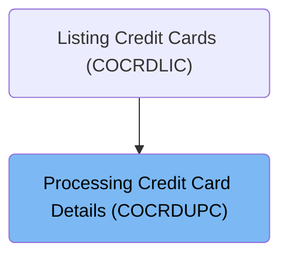
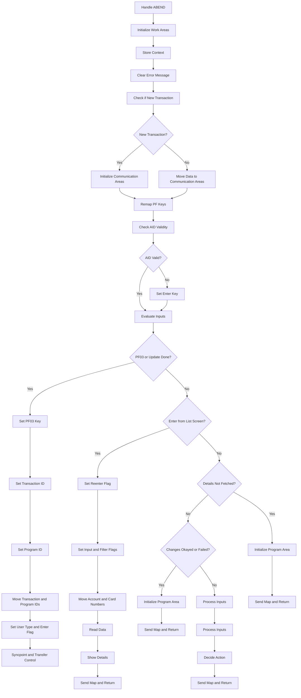
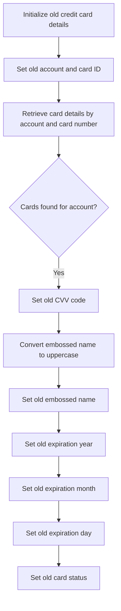
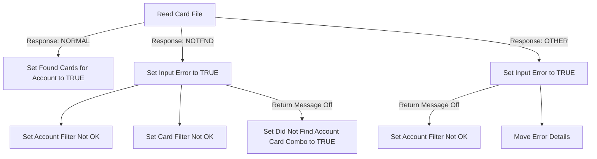
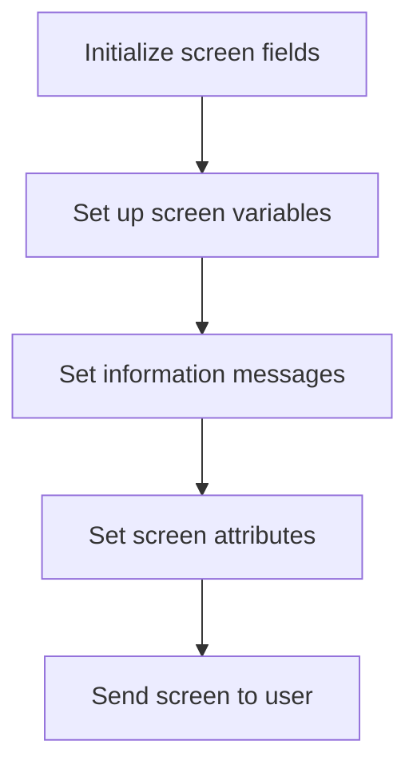
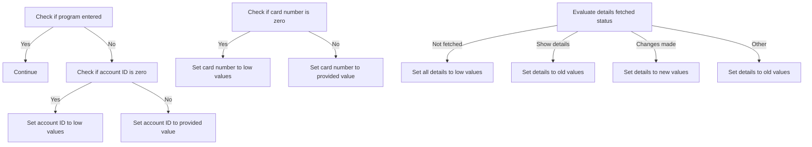

The COCRDUPC program is responsible for accepting and processing credit card detail requests. This program is part of the business logic layer and is used to handle various operations related to credit card details, such as initializing work areas, storing context, and evaluating inputs.

For example, when a user requests to view or update their credit card details, the COCRDUPC program processes this request by checking the validity of the inputs, retrieving the necessary data, and sending the updated information back to the user interface.

# Where is this program used?

This program is used once, in a flow starting from <SwmToken path="app/cbl/COCRDUPC.cbl" pos="228:4:4" line-data="                                                   VALUE &#39;COCRDLIC&#39;.            ">`COCRDLIC`</SwmToken> as represented in the following diagram:



# Process credit card details (<SwmToken path="app/cbl/COCRDUPC.cbl" pos="367:1:3" line-data="       0000-MAIN.                                                               ">`0000-MAIN`</SwmToken>)

Lets' zoom into the program flow:



<SwmSnippet path="/app/cbl/COCRDUPC.cbl" line="367">

---

### Handling ABEND

Going into the first snippet, the code sets up a mechanism to handle unexpected program terminations, ensuring that any issues are managed gracefully.

```cobol
       0000-MAIN.                                                               
                                                                                
                                                                                
           EXEC CICS HANDLE ABEND                                               
                     LABEL(ABEND-ROUTINE)                                       
           END-EXEC                                                             
```

---

</SwmSnippet>

<SwmSnippet path="/app/cbl/COCRDUPC.cbl" line="374">

---

### Initializing Work Areas

Now, the code initializes various work areas to prepare the necessary storage for processing credit card detail requests.

```cobol
           INITIALIZE CC-WORK-AREA                                              
                      WS-MISC-STORAGE                                           
                      WS-COMMAREA                                               
      *****************************************************************         
      * Store our context                                                       
      *****************************************************************         
           MOVE LIT-THISTRANID       TO WS-TRANID                               
      *****************************************************************         
      * Ensure error message is cleared                               *         
      *****************************************************************         
           SET WS-RETURN-MSG-OFF  TO TRUE                                       
```

---

</SwmSnippet>

<SwmSnippet path="/app/cbl/COCRDUPC.cbl" line="374">

---

### Storing Context and Clearing Error Messages

Next, the code stores the transaction context and ensures that any error messages are cleared.

```cobol
           INITIALIZE CC-WORK-AREA                                              
                      WS-MISC-STORAGE                                           
                      WS-COMMAREA                                               
      *****************************************************************         
      * Store our context                                                       
      *****************************************************************         
           MOVE LIT-THISTRANID       TO WS-TRANID                               
      *****************************************************************         
      * Ensure error message is cleared                               *         
      *****************************************************************         
           SET WS-RETURN-MSG-OFF  TO TRUE                                       
```

---

</SwmSnippet>

<SwmSnippet path="/app/cbl/COCRDUPC.cbl" line="388">

---

### Checking for New Transaction

Diving into the next snippet, the code checks if this is a new transaction. If it is, it initializes the communication areas and sets relevant flags.

```cobol
           IF EIBCALEN IS EQUAL TO 0                                            
               OR (CDEMO-FROM-PROGRAM = LIT-MENUPGM                             
               AND NOT CDEMO-PGM-REENTER)                                       
              INITIALIZE CARDDEMO-COMMAREA                                      
                         WS-THIS-PROGCOMMAREA                                   
              SET CDEMO-PGM-ENTER TO TRUE                                       
              SET CCUP-DETAILS-NOT-FETCHED TO TRUE                              
           ELSE                                                                 
              MOVE DFHCOMMAREA (1:LENGTH OF CARDDEMO-COMMAREA)  TO              
                                CARDDEMO-COMMAREA                               
              MOVE DFHCOMMAREA(LENGTH OF CARDDEMO-COMMAREA + 1:                 
                               LENGTH OF WS-THIS-PROGCOMMAREA ) TO              
                                WS-THIS-PROGCOMMAREA                            
           END-IF                                                               
```

---

</SwmSnippet>

<SwmSnippet path="/app/cbl/COCRDUPC.cbl" line="406">

---

### Remapping PF Keys

Moving to the next snippet, the code performs a routine to remap function keys as needed, ensuring that user inputs are correctly interpreted.

```cobol
           PERFORM YYYY-STORE-PFKEY                                             
              THRU YYYY-STORE-PFKEY-EXIT                                        
```

---

</SwmSnippet>

<SwmSnippet path="/app/cbl/COCRDUPC.cbl" line="413">

---

### Checking AID Validity

Next, the code sets an initial state indicating that the function key input is invalid and then checks various conditions to determine if the input is valid.

```cobol
           SET PFK-INVALID TO TRUE                                              
           IF CCARD-AID-ENTER OR                                                
              CCARD-AID-PFK03 OR                                                
              (CCARD-AID-PFK05 AND CCUP-CHANGES-OK-NOT-CONFIRMED)               
                              OR                                                
              (CCARD-AID-PFK12 AND NOT CCUP-DETAILS-NOT-FETCHED)                
              SET PFK-VALID TO TRUE                                             
           END-IF                                                               
```

---

</SwmSnippet>

<SwmSnippet path="/app/cbl/COCRDUPC.cbl" line="422">

---

### Setting Enter Key

Then, if the function key input is still invalid, the code sets the enter key to true to ensure the user can proceed.

```cobol
           IF PFK-INVALID                                                       
              SET CCARD-AID-ENTER TO TRUE                                       
           END-IF                                                               
```

---

</SwmSnippet>

<SwmSnippet path="/app/cbl/COCRDUPC.cbl" line="429">

---

### Evaluating Inputs

Going into the next snippet, the code evaluates the inputs received. It checks if the user pressed the exit key or if the update is done, and sets the appropriate flags and values.

```cobol
           EVALUATE TRUE                                                        
      ******************************************************************        
      *       USER PRESSES PF03 TO EXIT                                         
      *  OR   USER IS DONE WITH UPDATE                                          
      *            XCTL TO CALLING PROGRAM OR MAIN MENU                         
      ******************************************************************        
              WHEN CCARD-AID-PFK03                                              
              WHEN (CCUP-CHANGES-OKAYED-AND-DONE                                
               AND  CDEMO-LAST-MAPSET   EQUAL LIT-CCLISTMAPSET)                 
              WHEN (CCUP-CHANGES-FAILED                                         
               AND  CDEMO-LAST-MAPSET   EQUAL LIT-CCLISTMAPSET)                 
                   SET CCARD-AID-PFK03     TO TRUE                              
                                                                                
                   IF CDEMO-FROM-TRANID    EQUAL LOW-VALUES                     
                   OR CDEMO-FROM-TRANID    EQUAL SPACES                         
                      MOVE LIT-MENUTRANID  TO CDEMO-TO-TRANID                   
                   ELSE                                                         
                      MOVE CDEMO-FROM-TRANID  TO CDEMO-TO-TRANID                
                   END-IF                                                       
```

---

</SwmSnippet>

<SwmSnippet path="/app/cbl/COCRDUPC.cbl" line="449">

---

### Setting Transaction and Program IDs

Next, the code sets the transaction and program IDs based on whether the user is returning to the main menu or another program.

```cobol
                   IF CDEMO-FROM-PROGRAM   EQUAL LOW-VALUES                     
                   OR CDEMO-FROM-PROGRAM   EQUAL SPACES                         
                      MOVE LIT-MENUPGM     TO CDEMO-TO-PROGRAM                  
                   ELSE                                                         
                      MOVE CDEMO-FROM-PROGRAM TO CDEMO-TO-PROGRAM               
                   END-IF                                                       
```

---

</SwmSnippet>

<SwmSnippet path="/app/cbl/COCRDUPC.cbl" line="456">

---

### Moving Transaction and Program IDs

Then, the code updates the transaction and program IDs to reflect the current context, ensuring proper tracking and control flow.

```cobol
                   MOVE LIT-THISTRANID     TO CDEMO-FROM-TRANID                 
                   MOVE LIT-THISPGM        TO CDEMO-FROM-PROGRAM                
                                                                                
                   IF CDEMO-LAST-MAPSET    EQUAL LIT-CCLISTMAPSET               
                       MOVE ZEROS          TO CDEMO-ACCT-ID                     
                                              CDEMO-CARD-NUM                    
                   END-IF                                                       
```

---

</SwmSnippet>

<SwmSnippet path="/app/cbl/COCRDUPC.cbl" line="464">

---

### Setting User Type and Enter Flag

Next, the code sets the user type to regular user and sets the enter flag to true. It also updates the mapset and map values.

```cobol
                   SET  CDEMO-USRTYP-USER  TO TRUE                              
                   SET  CDEMO-PGM-ENTER    TO TRUE                              
                   MOVE LIT-THISMAPSET     TO CDEMO-LAST-MAPSET                 
                   MOVE LIT-THISMAP        TO CDEMO-LAST-MAP                    
                                                                                
                   EXEC CICS                                                    
                        SYNCPOINT                                               
                   END-EXEC                                                     
```

---

</SwmSnippet>

# Process Old Credit Card Details (<SwmToken path="app/cbl/COCRDUPC.cbl" pos="1343:1:5" line-data="       9000-READ-DATA.                                                          ">`9000-READ-DATA`</SwmToken>)

Lets' zoom into the program flow:



<SwmSnippet path="/app/cbl/COCRDUPC.cbl" line="1343">

---

### Initializing and retrieving card details

Going into the <SwmToken path="app/cbl/COCRDUPC.cbl" pos="1343:1:5" line-data="       9000-READ-DATA.                                                          ">`9000-READ-DATA`</SwmToken> function, the code initializes the old credit card details and sets the old account and card ID. It then retrieves the card details by account and card number to ensure that the correct card information is being processed.

```cobol
       9000-READ-DATA.                                                          
                                                                                
           INITIALIZE CCUP-OLD-DETAILS                                          
           MOVE CC-ACCT-ID              TO CCUP-OLD-ACCTID                      
           MOVE CC-CARD-NUM             TO CCUP-OLD-CARDID                      
                                                                                
           PERFORM 9100-GETCARD-BYACCTCARD                                      
              THRU 9100-GETCARD-BYACCTCARD-EXIT                                 
```

---

</SwmSnippet>

<SwmSnippet path="/app/cbl/COCRDUPC.cbl" line="1352">

---

### Processing found card details

Now, if cards are found for the account, the code sets the old CVV code, converts the embossed name to uppercase, and sets the old embossed name. It also sets the old expiration year, month, and day, as well as the old card status to ensure that all relevant card details are accurately captured for further processing.

```cobol
           IF FOUND-CARDS-FOR-ACCOUNT                                           
                                                                                
              MOVE CARD-CVV-CD          TO CCUP-OLD-CVV-CD                      
                                                                                
              INSPECT CARD-EMBOSSED-NAME                                        
              CONVERTING LIT-LOWER                                              
                      TO LIT-UPPER                                              
                                                                                
              MOVE CARD-EMBOSSED-NAME   TO CCUP-OLD-CRDNAME                     
              MOVE CARD-EXPIRAION-DATE(1:4)                                     
                                        TO CCUP-OLD-EXPYEAR                     
              MOVE CARD-EXPIRAION-DATE(6:2)                                     
                                        TO CCUP-OLD-EXPMON                      
              MOVE CARD-EXPIRAION-DATE(9:2)                                     
                                        TO CCUP-OLD-EXPDAY                      
              MOVE CARD-ACTIVE-STATUS   TO CCUP-OLD-CRDSTCD                     
                                                                                
           END-IF                                                               
```

---

</SwmSnippet>

# Read Card Details (<SwmToken path="app/cbl/COCRDUPC.cbl" pos="1349:3:7" line-data="           PERFORM 9100-GETCARD-BYACCTCARD                                      ">`9100-GETCARD-BYACCTCARD`</SwmToken>)

Lets' zoom into the program flow:



<SwmSnippet path="/app/cbl/COCRDUPC.cbl" line="1376">

---

### Reading the Card File

Going into the <SwmToken path="app/cbl/COCRDUPC.cbl" pos="1376:1:5" line-data="       9100-GETCARD-BYACCTCARD.                                                 ">`9100-GETCARD-BYACCTCARD`</SwmToken> function, the code reads the card file to retrieve the card details associated with the given account and card number.

```cobol
       9100-GETCARD-BYACCTCARD.                                                 
      *    Read the Card file                                                   
      *                                                                         
      *    MOVE CC-ACCT-ID-N            TO WS-CARD-RID-ACCT-ID                  
           MOVE CC-CARD-NUM             TO WS-CARD-RID-CARDNUM                  
                                                                                
           EXEC CICS READ                                                       
                FILE      (LIT-CARDFILENAME)                                    
                RIDFLD    (WS-CARD-RID-CARDNUM)                                 
                KEYLENGTH (LENGTH OF WS-CARD-RID-CARDNUM)                       
                INTO      (CARD-RECORD)                                         
                LENGTH    (LENGTH OF CARD-RECORD)                               
                RESP      (WS-RESP-CD)                                          
                RESP2     (WS-REAS-CD)                                          
           END-EXEC                                                             
```

---

</SwmSnippet>

<SwmSnippet path="/app/cbl/COCRDUPC.cbl" line="1392">

---

### Handling Normal Response

Next, the code evaluates the response code. If the response is normal, it sets a flag to indicate that cards were found for the specified account.

```cobol
           EVALUATE WS-RESP-CD                                                  
               WHEN DFHRESP(NORMAL)                                             
                  SET FOUND-CARDS-FOR-ACCOUNT TO TRUE                           
```

---

</SwmSnippet>

<SwmSnippet path="/app/cbl/COCRDUPC.cbl" line="1395">

---

### Handling Not Found Response

Then, if the response indicates that the card was not found, it sets several flags to indicate an input error and that the account and card filters are not okay. Additionally, if return messages are turned off, it sets a flag to indicate that the account-card combination was not found.

```cobol
               WHEN DFHRESP(NOTFND)                                             
                  SET INPUT-ERROR                    TO TRUE                    
                  SET FLG-ACCTFILTER-NOT-OK          TO TRUE                    
                  SET FLG-CARDFILTER-NOT-OK          TO TRUE                    
                  IF  WS-RETURN-MSG-OFF                                         
                     SET DID-NOT-FIND-ACCTCARD-COMBO TO TRUE                    
                  END-IF                                                        
```

---

</SwmSnippet>

<SwmSnippet path="/app/cbl/COCRDUPC.cbl" line="1402">

---

### Handling Other Responses

Finally, for any other response, it sets an input error flag. If return messages are turned off, it sets the account filter to not okay. It also logs the error details for further investigation.

```cobol
               WHEN OTHER                                                       
                  SET INPUT-ERROR                    TO TRUE                    
                  IF  WS-RETURN-MSG-OFF                                         
                      SET FLG-ACCTFILTER-NOT-OK      TO TRUE                    
                  END-IF                                                        
                  MOVE 'READ'                        TO ERROR-OPNAME            
                  MOVE LIT-CARDFILENAME              TO ERROR-FILE              
                  MOVE WS-RESP-CD                    TO ERROR-RESP              
                  MOVE WS-REAS-CD                    TO ERROR-RESP2             
                  MOVE WS-FILE-ERROR-MESSAGE         TO WS-RETURN-MSG           
           END-EVALUATE                                                         
```

---

</SwmSnippet>

# Send Credit Card Detail Screen (<SwmToken path="app/cbl/COCRDUPC.cbl" pos="1035:1:5" line-data="       3000-SEND-MAP.                                                           ">`3000-SEND-MAP`</SwmToken>)

Lets' zoom into the program flow:



<SwmSnippet path="/app/cbl/COCRDUPC.cbl" line="1035">

---

### Sending the user interface screen

Diving into the <SwmToken path="app/cbl/COCRDUPC.cbl" pos="1035:1:5" line-data="       3000-SEND-MAP.                                                           ">`3000-SEND-MAP`</SwmToken> function, it starts by initializing the screen fields with the current date and time. Next, it sets up the user interface variables based on the search criteria for account and card details. Then, it sets various prompt and information message flags based on the current state or status within the credit card detail processing program. After that, it sets up the screen attributes for processing the credit card detail request. Finally, it sends the screen to the user.

```cobol
       3000-SEND-MAP.                                                           
           PERFORM 3100-SCREEN-INIT                                             
              THRU 3100-SCREEN-INIT-EXIT                                        
           PERFORM 3200-SETUP-SCREEN-VARS                                       
              THRU 3200-SETUP-SCREEN-VARS-EXIT                                  
           PERFORM 3250-SETUP-INFOMSG                                           
              THRU 3250-SETUP-INFOMSG-EXIT                                      
           PERFORM 3300-SETUP-SCREEN-ATTRS                                      
              THRU 3300-SETUP-SCREEN-ATTRS-EXIT                                 
           PERFORM 3400-SEND-SCREEN                                             
              THRU 3400-SEND-SCREEN-EXIT                                        
```

---

</SwmSnippet>

# Initialize Screen Fields (<SwmToken path="app/cbl/COCRDUPC.cbl" pos="1036:3:7" line-data="           PERFORM 3100-SCREEN-INIT                                             ">`3100-SCREEN-INIT`</SwmToken>)

<SwmSnippet path="/app/cbl/COCRDUPC.cbl" line="1052">

---

### Initializing screen details

The code snippet initializes the screen by setting up various fields with default values and the current date and time. It sets up credit card attributes, retrieves and formats the current date and time, and sets titles and program names for display purposes.

```cobol
       3100-SCREEN-INIT.                                                        
           MOVE LOW-VALUES TO CCRDUPAO                                          
                                                                                
           MOVE FUNCTION CURRENT-DATE     TO WS-CURDATE-DATA                    
                                                                                
           MOVE CCDA-TITLE01              TO TITLE01O OF CCRDUPAO               
           MOVE CCDA-TITLE02              TO TITLE02O OF CCRDUPAO               
           MOVE LIT-THISTRANID            TO TRNNAMEO OF CCRDUPAO               
           MOVE LIT-THISPGM               TO PGMNAMEO OF CCRDUPAO               
                                                                                
           MOVE FUNCTION CURRENT-DATE     TO WS-CURDATE-DATA                    
                                                                                
           MOVE WS-CURDATE-MONTH          TO WS-CURDATE-MM                      
           MOVE WS-CURDATE-DAY            TO WS-CURDATE-DD                      
           MOVE WS-CURDATE-YEAR(3:2)      TO WS-CURDATE-YY                      
                                                                                
           MOVE WS-CURDATE-MM-DD-YY       TO CURDATEO OF CCRDUPAO               
                                                                                
           MOVE WS-CURTIME-HOURS          TO WS-CURTIME-HH                      
           MOVE WS-CURTIME-MINUTE         TO WS-CURTIME-MM                      
           MOVE WS-CURTIME-SECOND         TO WS-CURTIME-SS                      
                                                                                
           MOVE WS-CURTIME-HH-MM-SS       TO CURTIMEO OF CCRDUPAO               
                                                                                
           .                                                                    
```

---

</SwmSnippet>

# Setup screen vars (<SwmToken path="app/cbl/COCRDUPC.cbl" pos="1038:3:9" line-data="           PERFORM 3200-SETUP-SCREEN-VARS                                       ">`3200-SETUP-SCREEN-VARS`</SwmToken>)

Lets' zoom into the program flow:



<SwmSnippet path="/app/cbl/COCRDUPC.cbl" line="1082">

---

### Setting Account ID

Going into the first snippet, the code checks if the program has been entered. If it has, it continues without making changes. Otherwise, it checks if the account ID is zero. If the account ID is zero, it sets the account ID to a default value; otherwise, it sets the account ID to the provided value.

```cobol
       3200-SETUP-SCREEN-VARS.                                                  
      *    INITIALIZE SEARCH CRITERIA                                           
           IF CDEMO-PGM-ENTER                                                   
              CONTINUE                                                          
           ELSE                                                                 
              IF CC-ACCT-ID-N = 0                                               
                 MOVE LOW-VALUES          TO ACCTSIDO OF CCRDUPAO               
              ELSE                                                              
                 MOVE CC-ACCT-ID          TO ACCTSIDO OF CCRDUPAO               
              END-IF                                                            
```

---

</SwmSnippet>

<SwmSnippet path="/app/cbl/COCRDUPC.cbl" line="1093">

---

### Setting Card Number

Now, the second snippet checks if the card number is zero. If the card number is zero, it sets the card number to a default value; otherwise, it sets the card number to the provided value.

```cobol
              IF CC-CARD-NUM-N = 0                                              
                MOVE LOW-VALUES           TO CARDSIDO OF CCRDUPAO               
              ELSE                                                              
                MOVE CC-CARD-NUM          TO CARDSIDO OF CCRDUPAO               
              END-IF                                                            
```

---

</SwmSnippet>

<SwmSnippet path="/app/cbl/COCRDUPC.cbl" line="1099">

---

### Evaluating Details Fetched Status

Moving to the third snippet, the code evaluates the status of the details fetched. If the details have not been fetched, it sets all the credit card details to default values.

```cobol
              EVALUATE TRUE                                                     
                  WHEN CCUP-DETAILS-NOT-FETCHED                                 
                       MOVE LOW-VALUES         TO CRDNAMEO OF CCRDUPAO          
                                                  CRDNAMEO OF CCRDUPAO          
                                                  CRDSTCDO OF CCRDUPAO          
                                                  EXPDAYO  OF CCRDUPAO          
                                                  EXPMONO  OF CCRDUPAO          
                                                  EXPYEARO OF CCRDUPAO          
```

---

</SwmSnippet>

<SwmSnippet path="/app/cbl/COCRDUPC.cbl" line="1107">

---

### Showing Old Details

Next, the fourth snippet checks if the details should be shown. If so, it sets the credit card details to the old values.

```cobol
                  WHEN CCUP-SHOW-DETAILS                                        
                      MOVE CCUP-OLD-CRDNAME    TO CRDNAMEO OF CCRDUPAO          
                      MOVE CCUP-OLD-CRDSTCD    TO CRDSTCDO OF CCRDUPAO          
                      MOVE CCUP-OLD-EXPDAY     TO EXPDAYO  OF CCRDUPAO          
                      MOVE CCUP-OLD-EXPMON     TO EXPMONO  OF CCRDUPAO          
                      MOVE CCUP-OLD-EXPYEAR    TO EXPYEARO OF CCRDUPAO          
```

---

</SwmSnippet>

<SwmSnippet path="/app/cbl/COCRDUPC.cbl" line="1113">

---

### Applying New Changes

Then, the fifth snippet checks if changes have been made. If changes have been made, it sets the credit card details to the new values. Additionally, it ensures that certain fields that are not allowed to be changed retain their old values.

```cobol
                  WHEN CCUP-CHANGES-MADE                                        
                      MOVE CCUP-NEW-CRDNAME    TO CRDNAMEO OF CCRDUPAO          
                      MOVE CCUP-NEW-CRDSTCD    TO CRDSTCDO OF CCRDUPAO          
                      MOVE CCUP-NEW-EXPMON     TO EXPMONO  OF CCRDUPAO          
                      MOVE CCUP-NEW-EXPYEAR    TO EXPYEARO OF CCRDUPAO          
      ******************************************************************        
      *               MOVE OLD VALUES TO NON-DISPLAY FIELDS                     
      *               THAT WE ARE NOT ALLOWING USER TO CHANGE(FOR NOW)          
      *****************************************************************         
      *               MOVE CCUP-NEW-EXPDAY     TO EXPDAYO  OF CCRDUPAO          
                      MOVE CCUP-OLD-EXPDAY     TO EXPDAYO  OF CCRDUPAO          
```

---

</SwmSnippet>

<SwmSnippet path="/app/cbl/COCRDUPC.cbl" line="1124">

---

### Handling Other Cases

Finally, the last snippet handles any other cases by setting the credit card details to the old values.

```cobol
                  WHEN OTHER                                                    
                      MOVE CCUP-OLD-CRDNAME    TO CRDNAMEO OF CCRDUPAO          
                      MOVE CCUP-OLD-CRDSTCD    TO CRDSTCDO OF CCRDUPAO          
                      MOVE CCUP-OLD-EXPDAY     TO EXPDAYO  OF CCRDUPAO          
                      MOVE CCUP-OLD-EXPMON     TO EXPMONO  OF CCRDUPAO          
                      MOVE CCUP-OLD-EXPYEAR    TO EXPYEARO OF CCRDUPAO          
              END-EVALUATE                                                      
                                                                                
                                                                                
            END-IF                                                              
           .                                                                    
```

---

</SwmSnippet>

# Handle Return Process (<SwmToken path="app/cbl/COCRDUPC.cbl" pos="546:1:3" line-data="       COMMON-RETURN.                                                           ">`COMMON-RETURN`</SwmToken>)

<SwmSnippet path="/app/cbl/COCRDUPC.cbl" line="546">

---

### Returning control to the calling program

The <SwmToken path="app/cbl/COCRDUPC.cbl" pos="546:1:3" line-data="       COMMON-RETURN.                                                           ">`COMMON-RETURN`</SwmToken> function is responsible for returning control to the calling program. It sets the return message, prepares the communication area, and executes the CICS RETURN command, passing the transaction ID and the prepared communication area to the calling program.

```cobol
       COMMON-RETURN.                                                           
           MOVE WS-RETURN-MSG     TO CCARD-ERROR-MSG                            
                                                                                
           MOVE  CARDDEMO-COMMAREA    TO WS-COMMAREA                            
           MOVE  WS-THIS-PROGCOMMAREA TO                                        
                  WS-COMMAREA(LENGTH OF CARDDEMO-COMMAREA + 1:                  
                               LENGTH OF WS-THIS-PROGCOMMAREA )                 
                                                                                
           EXEC CICS RETURN                                                     
                TRANSID (LIT-THISTRANID)                                        
                COMMAREA (WS-COMMAREA)                                          
                LENGTH(LENGTH OF WS-COMMAREA)                                   
           END-EXEC                                                             
```

---

</SwmSnippet>

&nbsp;

*This is an auto-generated document by Swimm 🌊 and has not yet been verified by a human*

<SwmMeta version="3.0.0" repo-id="Z2l0aHViJTNBJTNBa3luZHJ5bC1hd3MtbWFpbmZyYW1lLW1vZGVybml6YXRpb24tY2FyZGRlbW8lM0ElM0FTd2ltbS1EZW1v" repo-name="kyndryl-aws-mainframe-modernization-carddemo"><sup>Powered by [Swimm](/)</sup></SwmMeta>
