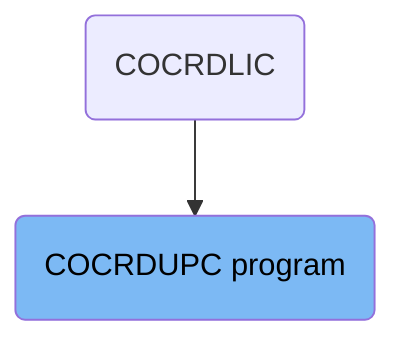
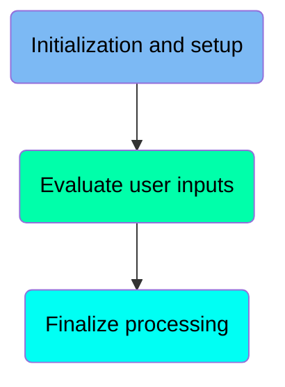
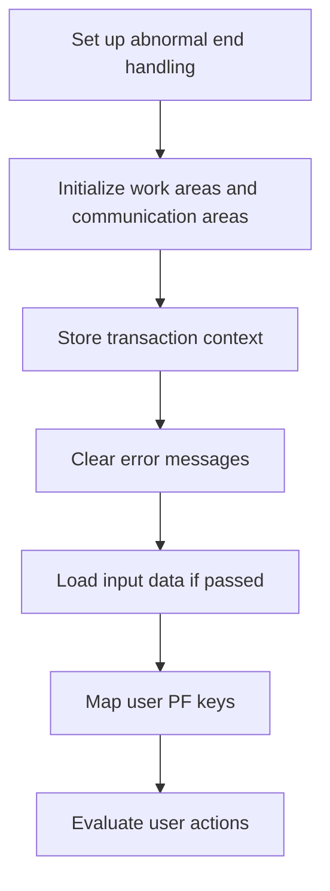
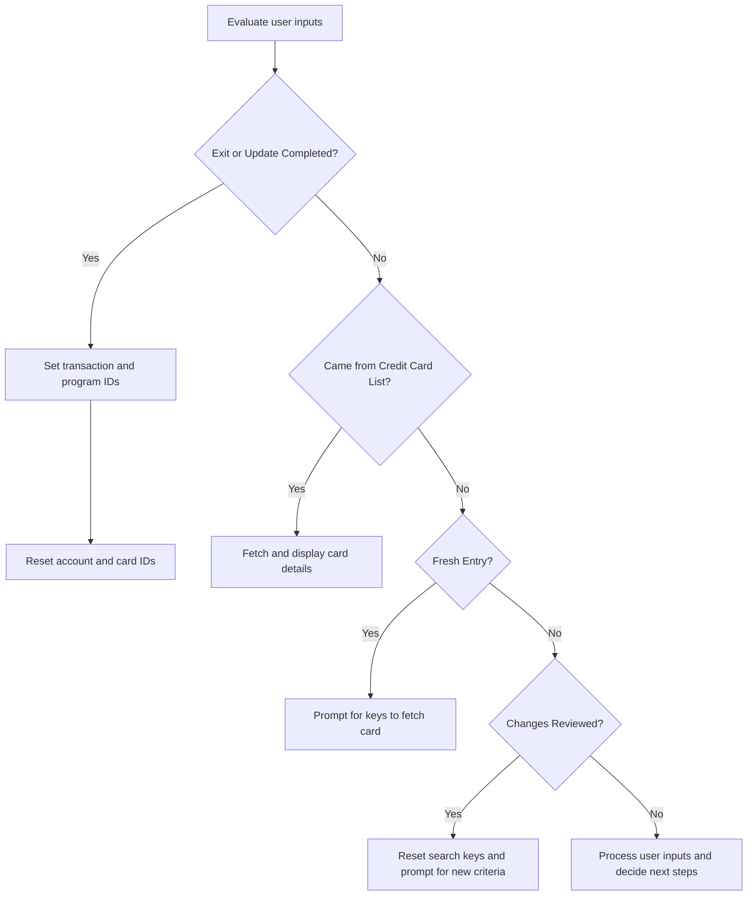
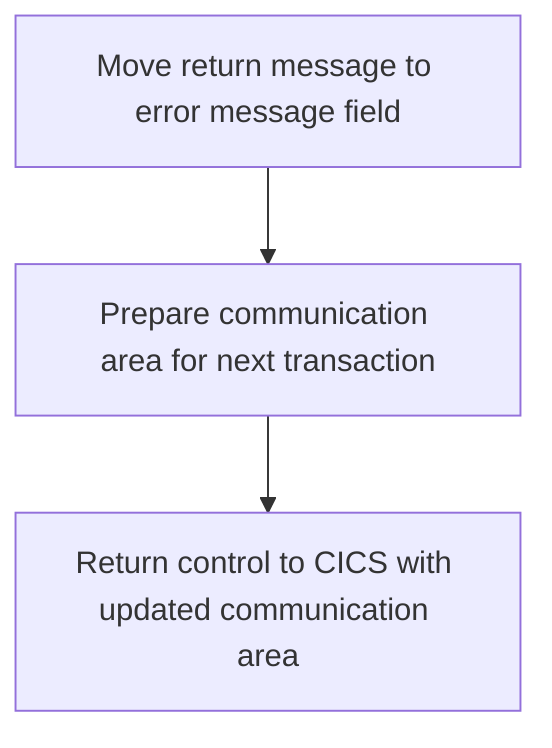

The document titled 'Processing Credit Card Updates (COCRDUPC)' describes the role of the COCRDUPC program in the system. This program is responsible for accepting and processing credit card detail requests. It achieves this by validating the input data, fetching the associated card details, and presenting them to the user for review or update.

The COCRDUPC program handles credit card detail requests by first validating the input data. It then fetches the relevant card details and presents them to the user. The user can review or update these details, and the program ensures that the data is accurate and up-to-date throughout the process.

# Where is this program used?

This program is used multiple times in the codebase as represented in the following diagram:



Here is a high level diagram of the program:



## Initialization and setup

First, we'll zoom into this section of the flow:



<SwmSnippet path="/app/cbl/COCRDUPC.cbl" line="370">

---

First, the system sets up abnormal end handling to ensure that any unexpected terminations are properly managed.

```cobol
           EXEC CICS HANDLE ABEND                                               
                     LABEL(ABEND-ROUTINE)                                       
           END-EXEC                                                             
```

---

</SwmSnippet>

<SwmSnippet path="/app/cbl/COCRDUPC.cbl" line="374">

---

Moving to the next step, the system initializes various work areas and communication areas to prepare for processing the credit card detail request.

```cobol
           INITIALIZE CC-WORK-AREA                                              
                      WS-MISC-STORAGE                                           
                      WS-COMMAREA                                               
```

---

</SwmSnippet>

<SwmSnippet path="/app/cbl/COCRDUPC.cbl" line="380">

---

Next, the transaction context is stored to maintain the state and flow of the transaction.

```cobol
           MOVE LIT-THISTRANID       TO WS-TRANID                               
```

---

</SwmSnippet>

<SwmSnippet path="/app/cbl/COCRDUPC.cbl" line="384">

---

Then, the system ensures that any previous error messages are cleared to avoid confusion during the current transaction.

```cobol
           SET WS-RETURN-MSG-OFF  TO TRUE                                       
```

---

</SwmSnippet>

<SwmSnippet path="/app/cbl/COCRDUPC.cbl" line="388">

---

Going into the next step, the system checks if any input data has been passed and loads it accordingly. If no data is passed, it initializes the communication areas.

```cobol
           IF EIBCALEN IS EQUAL TO 0                                            
               OR (CDEMO-FROM-PROGRAM = LIT-MENUPGM                             
               AND NOT CDEMO-PGM-REENTER)                                       
              INITIALIZE CARDDEMO-COMMAREA                                      
                         WS-THIS-PROGCOMMAREA                                   
              SET CDEMO-PGM-ENTER TO TRUE                                       
              SET CCUP-DETAILS-NOT-FETCHED TO TRUE                              
           ELSE                                                                 
              MOVE DFHCOMMAREA (1:LENGTH OF CARDDEMO-COMMAREA)  TO              
                                CARDDEMO-COMMAREA                               
              MOVE DFHCOMMAREA(LENGTH OF CARDDEMO-COMMAREA + 1:                 
                               LENGTH OF WS-THIS-PROGCOMMAREA ) TO              
                                WS-THIS-PROGCOMMAREA                            
           END-IF                                                               
```

---

</SwmSnippet>

## Evaluate user inputs

Now, lets zoom into this section of the flow:



<SwmSnippet path="/app/cbl/COCRDUPC.cbl" line="429">

---

### Evaluate user inputs

First, the program evaluates the user inputs to determine the appropriate action based on the received inputs. This is done using the <SwmToken path="app/cbl/COCRDUPC.cbl" pos="429:1:3" line-data="           EVALUATE TRUE                                                        ">`EVALUATE TRUE`</SwmToken> statement which checks various conditions to decide the next steps.

```cobol
           EVALUATE TRUE                                                        
```

---

</SwmSnippet>

<SwmSnippet path="/app/cbl/COCRDUPC.cbl" line="435">

---

### Handle exit or completion of updates

Next, if the user presses <SwmToken path="app/cbl/COCRDUPC.cbl" pos="176:2:2" line-data="               &#39;PF03 pressed.Exiting              &#39;.                            ">`PF03`</SwmToken> to exit or if the update process is completed, the program sets the transaction and program IDs for the next action. It also resets the account and card IDs if necessary.

```cobol
              WHEN CCARD-AID-PFK03                                              
              WHEN (CCUP-CHANGES-OKAYED-AND-DONE                                
               AND  CDEMO-LAST-MAPSET   EQUAL LIT-CCLISTMAPSET)                 
              WHEN (CCUP-CHANGES-FAILED                                         
               AND  CDEMO-LAST-MAPSET   EQUAL LIT-CCLISTMAPSET)                 
                   SET CCARD-AID-PFK03     TO TRUE                              
                                                                                
                   IF CDEMO-FROM-TRANID    EQUAL LOW-VALUES                     
                   OR CDEMO-FROM-TRANID    EQUAL SPACES                         
                      MOVE LIT-MENUTRANID  TO CDEMO-TO-TRANID                   
                   ELSE                                                         
                      MOVE CDEMO-FROM-TRANID  TO CDEMO-TO-TRANID                
                   END-IF                                                       
                                                                                
                   IF CDEMO-FROM-PROGRAM   EQUAL LOW-VALUES                     
                   OR CDEMO-FROM-PROGRAM   EQUAL SPACES                         
                      MOVE LIT-MENUPGM     TO CDEMO-TO-PROGRAM                  
                   ELSE                                                         
                      MOVE CDEMO-FROM-PROGRAM TO CDEMO-TO-PROGRAM               
                   END-IF                                                       
                                                                                
```

---

</SwmSnippet>

<SwmSnippet path="/app/cbl/COCRDUPC.cbl" line="482">

---

### Fetch and display card details

If the user came from the credit card list screen, the program fetches the associated card details for update. It sets various flags to indicate valid filters and performs the read data operation to fetch the card details.

```cobol
              WHEN CDEMO-PGM-ENTER                                              
               AND CDEMO-FROM-PROGRAM  EQUAL LIT-CCLISTPGM                      
              WHEN CCARD-AID-PFK12                                              
               AND CDEMO-FROM-PROGRAM  EQUAL LIT-CCLISTPGM                      
                   SET CDEMO-PGM-REENTER    TO TRUE                             
                   SET INPUT-OK             TO TRUE                             
                   SET FLG-ACCTFILTER-ISVALID  TO TRUE                          
                   SET FLG-CARDFILTER-ISVALID  TO TRUE                          
                   MOVE CDEMO-ACCT-ID       TO CC-ACCT-ID-N                     
                   MOVE CDEMO-CARD-NUM      TO CC-CARD-NUM-N                    
                   PERFORM 9000-READ-DATA                                       
                      THRU 9000-READ-DATA-EXIT                                  
                   SET CCUP-SHOW-DETAILS TO TRUE                                
```

---

</SwmSnippet>

<SwmSnippet path="/app/cbl/COCRDUPC.cbl" line="502">

---

### Prompt for keys to fetch card details

For a fresh entry into the program, the user is prompted to provide the keys to fetch the card details that need to be updated. The program initializes the necessary communication areas and sends the map to the user.

```cobol
              WHEN CCUP-DETAILS-NOT-FETCHED                                     
               AND CDEMO-PGM-ENTER                                              
              WHEN CDEMO-FROM-PROGRAM   EQUAL LIT-MENUPGM                       
               AND NOT CDEMO-PGM-REENTER                                        
                   INITIALIZE WS-THIS-PROGCOMMAREA                              
                   PERFORM 3000-SEND-MAP THRU                                   
                           3000-SEND-MAP-EXIT                                   
                   SET CDEMO-PGM-REENTER        TO TRUE                         
                   SET CCUP-DETAILS-NOT-FETCHED TO TRUE                         
                   GO TO COMMON-RETURN                                          
```

---

</SwmSnippet>

<SwmSnippet path="/app/cbl/COCRDUPC.cbl" line="517">

---

### Reset search keys and prompt for new criteria

If the card data changes have been reviewed and accepted or if the changes failed, the program resets the search keys and prompts the user for new search criteria. This ensures that the user can start a new search with fresh criteria.

```cobol
              WHEN CCUP-CHANGES-OKAYED-AND-DONE                                 
              WHEN CCUP-CHANGES-FAILED                                          
                   INITIALIZE WS-THIS-PROGCOMMAREA                              
                              WS-MISC-STORAGE                                   
                              CDEMO-ACCT-ID                                     
                              CDEMO-CARD-NUM                                    
                   SET CDEMO-PGM-ENTER            TO TRUE                       
                   PERFORM 3000-SEND-MAP THRU                                   
                           3000-SEND-MAP-EXIT                                   
                   SET CDEMO-PGM-REENTER          TO TRUE                       
                   SET CCUP-DETAILS-NOT-FETCHED   TO TRUE                       
                   GO TO COMMON-RETURN                                          
```

---

</SwmSnippet>

<SwmSnippet path="/app/cbl/COCRDUPC.cbl" line="535">

---

### Process user inputs and decide next steps

Finally, if none of the specific conditions are met, the program processes the user inputs and decides the next steps. It performs the necessary actions based on the processed inputs and sends the map to the user for further interaction.

```cobol
              WHEN OTHER                                                        
                   PERFORM 1000-PROCESS-INPUTS                                  
                      THRU 1000-PROCESS-INPUTS-EXIT                             
                   PERFORM 2000-DECIDE-ACTION                                   
                      THRU 2000-DECIDE-ACTION-EXIT                              
                   PERFORM 3000-SEND-MAP                                        
                      THRU 3000-SEND-MAP-EXIT                                   
                   GO TO COMMON-RETURN                                          
```

---

</SwmSnippet>

## Finalize processing

Now, lets zoom into this section of the flow:



<SwmSnippet path="/app/cbl/COCRDUPC.cbl" line="547">

---

First, the return message is moved to the error message field (<SwmToken path="app/cbl/COCRDUPC.cbl" pos="547:11:15" line-data="           MOVE WS-RETURN-MSG     TO CCARD-ERROR-MSG                            ">`CCARD-ERROR-MSG`</SwmToken>). This ensures that any error messages generated during the processing of the credit card detail request are properly communicated to the user.

```cobol
           MOVE WS-RETURN-MSG     TO CCARD-ERROR-MSG                            
```

---

</SwmSnippet>

<SwmSnippet path="/app/cbl/COCRDUPC.cbl" line="549">

---

Next, the communication area is prepared for the next transaction. This involves moving the current communication area (<SwmToken path="app/cbl/COCRDUPC.cbl" pos="549:3:5" line-data="           MOVE  CARDDEMO-COMMAREA    TO WS-COMMAREA                            ">`CARDDEMO-COMMAREA`</SwmToken>) and the program-specific communication area (<SwmToken path="app/cbl/COCRDUPC.cbl" pos="550:3:7" line-data="           MOVE  WS-THIS-PROGCOMMAREA TO                                        ">`WS-THIS-PROGCOMMAREA`</SwmToken>) into a workspace communication area (<SwmToken path="app/cbl/COCRDUPC.cbl" pos="549:9:11" line-data="           MOVE  CARDDEMO-COMMAREA    TO WS-COMMAREA                            ">`WS-COMMAREA`</SwmToken>). This step ensures that all necessary data is carried over to the next transaction.

```cobol
           MOVE  CARDDEMO-COMMAREA    TO WS-COMMAREA                            
           MOVE  WS-THIS-PROGCOMMAREA TO                                        
                  WS-COMMAREA(LENGTH OF CARDDEMO-COMMAREA + 1:                  
                               LENGTH OF WS-THIS-PROGCOMMAREA )                 
```

---

</SwmSnippet>

<SwmSnippet path="/app/cbl/COCRDUPC.cbl" line="554">

---

Finally, control is returned to CICS with the updated communication area. This is done using the <SwmToken path="app/cbl/COCRDUPC.cbl" pos="554:1:5" line-data="           EXEC CICS RETURN                                                     ">`EXEC CICS RETURN`</SwmToken> command, which specifies the transaction ID (<SwmToken path="app/cbl/COCRDUPC.cbl" pos="555:4:6" line-data="                TRANSID (LIT-THISTRANID)                                        ">`LIT-THISTRANID`</SwmToken>) and the communication area (<SwmToken path="app/cbl/COCRDUPC.cbl" pos="556:4:6" line-data="                COMMAREA (WS-COMMAREA)                                          ">`WS-COMMAREA`</SwmToken>). This step completes the transaction and allows CICS to continue processing with the updated data.

```cobol
           EXEC CICS RETURN                                                     
                TRANSID (LIT-THISTRANID)                                        
                COMMAREA (WS-COMMAREA)                                          
                LENGTH(LENGTH OF WS-COMMAREA)                                   
           END-EXEC                                                             
```

---

</SwmSnippet>

&nbsp;

*This is an auto-generated document by Swimm 🌊 and has not yet been verified by a human*

<SwmMeta version="3.0.0" repo-id="Z2l0aHViJTNBJTNBa3luZHJ5bC1hd3MtbWFpbmZyYW1lLW1vZGVybml6YXRpb24tY2FyZGRlbW8lM0ElM0FTd2ltbS1EZW1v" repo-name="kyndryl-aws-mainframe-modernization-carddemo"><sup>Powered by [Swimm](https://staging.swimm.cloud/)</sup></SwmMeta>
