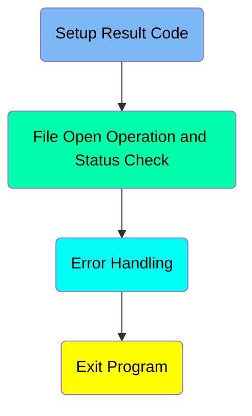
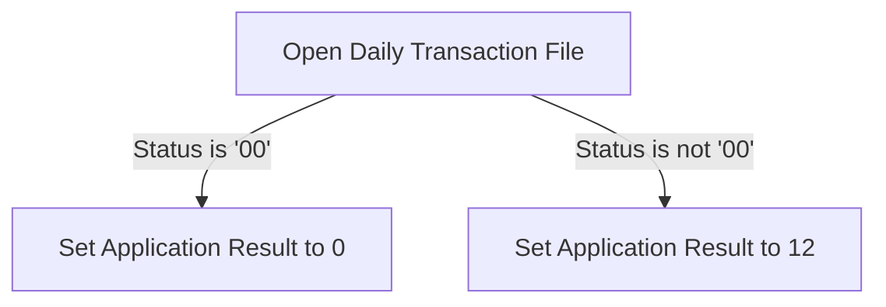
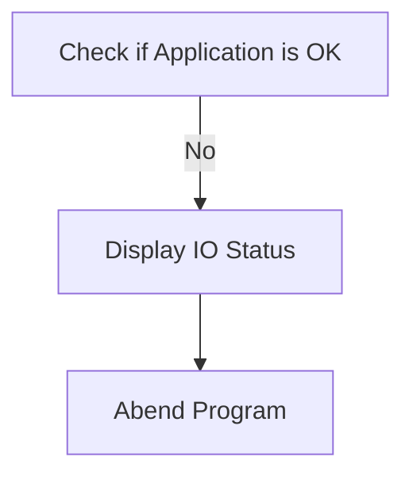
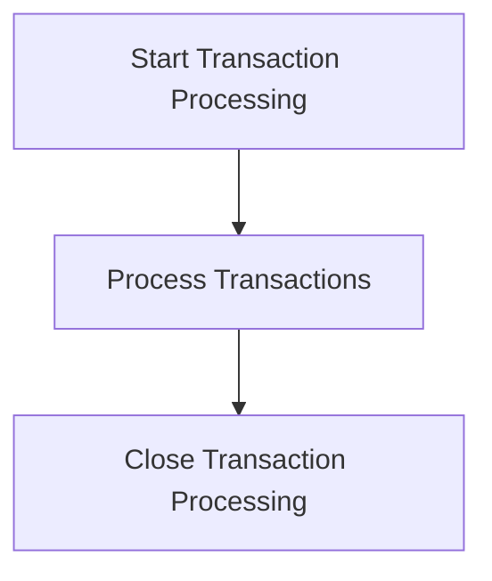

The <SwmToken path="app/cbl/CBTRN02C.cbl" pos="2:7:7" line-data="      * Program     : CBTRN02C.CBL                                      ">`CBTRN02C`</SwmToken> program is responsible for opening and processing the daily transaction file in the system. It sets an initial application result, attempts to open the transaction file, checks the file status, and handles any errors that occur during the process. The program ensures that the daily transactions are ready for processing by verifying the file's status and performing necessary error handling routines if the file cannot be opened successfully.

The <SwmToken path="app/cbl/CBTRN02C.cbl" pos="2:7:7" line-data="      * Program     : CBTRN02C.CBL                                      ">`CBTRN02C`</SwmToken> program starts by setting an initial application result to indicate a default error state. It then attempts to open the daily transaction file. If the file opens successfully, the application result is updated to indicate success. If the file does not open successfully, the application result is updated to indicate an error, and the program performs error handling routines, including displaying an error message and abnormally ending the program if necessary.

Here is a high level diagram of the program:



# Setup Result Code

```mermaid
graph TD
  A[Start 0000-DALYTRAN-OPEN] --> B[Set APPL-RESULT to 8]
  B --> C[Open DALYTRAN-FILE]
  C --> D{DALYTRAN-STATUS = '00'}
  D -->|Yes| E[Set APPL-RESULT to 0]
  D -->|No| F[Set APPL-RESULT to 12]
  E --> G{APPL-AOK}
  F --> G{APPL-AOK}
  G -->|Yes| H[Continue]
  G -->|No| I[Display 'ERROR OPENING DALYTRAN']
  I --> J[Move DALYTRAN-STATUS to IO-STATUS]
  J --> K[Perform 9910-DISPLAY-IO-STATUS]
  K --> L[Perform 9999-ABEND-PROGRAM]
  L --> M[Exit]

%% Swimm:
%% graph TD
%%   A[Start 0000-DALYTRAN-OPEN] --> B[Set <SwmToken path="app/cbl/CBTRN02C.cbl" pos="237:7:9" line-data="           MOVE 8 TO APPL-RESULT.                                               ">`APPL-RESULT`</SwmToken> to 8]
%%   B --> C[Open DALYTRAN-FILE]
%%   C --> D{DALYTRAN-STATUS = '00'}
%%   D -->|Yes| E[Set <SwmToken path="app/cbl/CBTRN02C.cbl" pos="237:7:9" line-data="           MOVE 8 TO APPL-RESULT.                                               ">`APPL-RESULT`</SwmToken> to 0]
%%   D -->|No| F[Set <SwmToken path="app/cbl/CBTRN02C.cbl" pos="237:7:9" line-data="           MOVE 8 TO APPL-RESULT.                                               ">`APPL-RESULT`</SwmToken> to 12]
%%   E --> G{APPL-AOK}
%%   F --> G{APPL-AOK}
%%   G -->|Yes| H[Continue]
%%   G -->|No| I[Display 'ERROR OPENING DALYTRAN']
%%   I --> J[Move <SwmToken path="app/cbl/CBTRN02C.cbl" pos="239:3:5" line-data="           IF  DALYTRAN-STATUS = &#39;00&#39;                                           ">`DALYTRAN-STATUS`</SwmToken> to IO-STATUS]
%%   J --> K[Perform 9910-DISPLAY-IO-STATUS]
%%   K --> L[Perform 9999-ABEND-PROGRAM]
%%   L --> M[Exit]
```



<SwmSnippet path="/app/cbl/CBTRN02C.cbl" line="237">

---

## Setting Initial Application Result

First, the program sets the initial application result to 8, indicating a default error state before attempting to open the daily transaction file.

```cobol
           MOVE 8 TO APPL-RESULT.                                               
           OPEN INPUT DALYTRAN-FILE                                             
```

---

</SwmSnippet>

<SwmSnippet path="/app/cbl/CBTRN02C.cbl" line="239">

---

## Opening the Daily Transaction File

Next, the program attempts to open the daily transaction file for input. This is a critical step as it prepares the file for reading transactions.

```cobol
           IF  DALYTRAN-STATUS = '00'                                           
```

---

</SwmSnippet>

<SwmSnippet path="/app/cbl/CBTRN02C.cbl" line="240">

---

## Checking File Status

Then, the program checks if the file status is '00', which indicates a successful open operation. If the status is '00', it sets the application result to 0, indicating success. Otherwise, it sets the application result to 12, indicating an error.

```cobol
               MOVE 0 TO APPL-RESULT                                            
           ELSE                                                                 
               MOVE 12 TO APPL-RESULT                                           
           END-IF                                                               
           IF  APPL-AOK                                                         
```

---

</SwmSnippet>

<SwmSnippet path="/app/cbl/CBTRN02C.cbl" line="245">

---

## Handling Application Result

Moving to the next step, the program checks if the application result is okay (<SwmToken path="app/cbl/CBTRN02C.cbl" pos="244:3:5" line-data="           IF  APPL-AOK                                                         ">`APPL-AOK`</SwmToken>). If it is, the program continues. If not, it displays an error message, moves the file status to <SwmToken path="app/cbl/CBTRN02C.cbl" pos="248:9:11" line-data="               MOVE DALYTRAN-STATUS TO IO-STATUS                                ">`IO-STATUS`</SwmToken>, and performs error handling routines <SwmToken path="app/cbl/CBTRN02C.cbl" pos="249:3:9" line-data="               PERFORM 9910-DISPLAY-IO-STATUS                                   ">`9910-DISPLAY-IO-STATUS`</SwmToken> and <SwmToken path="app/cbl/CBTRN02C.cbl" pos="250:3:7" line-data="               PERFORM 9999-ABEND-PROGRAM                                       ">`9999-ABEND-PROGRAM`</SwmToken>.

```cobol
               CONTINUE                                                         
           ELSE                                                                 
               DISPLAY 'ERROR OPENING DALYTRAN'                                 
               MOVE DALYTRAN-STATUS TO IO-STATUS                                
               PERFORM 9910-DISPLAY-IO-STATUS                                   
               PERFORM 9999-ABEND-PROGRAM                                       
           END-IF                                                               
           EXIT.                                                                
```

---

</SwmSnippet>

<SwmSnippet path="/app/cbl/CBTRN02C.cbl" line="235">

---

## Exiting the Program

Finally, the program exits, completing the <SwmToken path="app/cbl/CBTRN02C.cbl" pos="195:3:7" line-data="           PERFORM 0000-DALYTRAN-OPEN.                                          ">`0000-DALYTRAN-OPEN`</SwmToken> function.

```cobol
      *---------------------------------------------------------------*         
```

---

</SwmSnippet>

# File Open Operation and Status Check

This is the next section of the flow.



<SwmSnippet path="/app/cbl/CBTRN02C.cbl" line="239">

---

## Opening the Daily Transaction File

First, the daily transaction file is opened using the <SwmToken path="app/cbl/CBTRN02C.cbl" pos="238:1:7" line-data="           OPEN INPUT DALYTRAN-FILE                                             ">`OPEN INPUT DALYTRAN-FILE`</SwmToken> statement. This step is crucial as it attempts to access the file containing the daily transactions that need to be processed.

```cobol
           IF  DALYTRAN-STATUS = '00'                                           
```

---

</SwmSnippet>

<SwmSnippet path="/app/cbl/CBTRN02C.cbl" line="240">

---

## Checking the File Status

Next, the status of the file is checked using the condition `IF `<SwmToken path="app/cbl/CBTRN02C.cbl" pos="239:3:5" line-data="           IF  DALYTRAN-STATUS = &#39;00&#39;                                           ">`DALYTRAN-STATUS`</SwmToken>`=`<SwmToken path="app/cbl/CBTRN02C.cbl" pos="239:10:10" line-data="           IF  DALYTRAN-STATUS = &#39;00&#39;                                           ">`00`</SwmToken>. This condition verifies if the file was opened successfully. A status of '00' indicates a successful open operation.

```cobol
               MOVE 0 TO APPL-RESULT                                            
```

---

</SwmSnippet>

<SwmSnippet path="/app/cbl/CBTRN02C.cbl" line="241">

---

## Setting Application Result for Successful Open

If the file status is '00', the application result is set to 0 using <SwmToken path="app/cbl/CBTRN02C.cbl" pos="240:1:9" line-data="               MOVE 0 TO APPL-RESULT                                            ">`MOVE 0 TO APPL-RESULT`</SwmToken>. This indicates that the file was opened successfully and the application can proceed with processing the transactions.

```cobol
           ELSE                                                                 
```

---

</SwmSnippet>

<SwmSnippet path="/app/cbl/CBTRN02C.cbl" line="242">

---

## Setting Application Result for Unsuccessful Open

If the file status is not '00', the application result is set to 12 using <SwmToken path="app/cbl/CBTRN02C.cbl" pos="242:1:9" line-data="               MOVE 12 TO APPL-RESULT                                           ">`MOVE 12 TO APPL-RESULT`</SwmToken>. This indicates that there was an issue opening the file and the application cannot proceed with processing the transactions.

```cobol
               MOVE 12 TO APPL-RESULT                                           
           END-IF                                                               
```

---

</SwmSnippet>

## Interim Summary

So far, we saw the setup of the initial application result, the opening of the daily transaction file, and the subsequent status check to determine if the file was opened successfully. Now, we will focus on the error handling procedures that are triggered if the application status is not okay.

# Error Handling



<SwmSnippet path="/app/cbl/CBTRN02C.cbl" line="245">

---

## Checking Application Status

First, the code checks if the application status <SwmToken path="app/cbl/CBTRN02C.cbl" pos="244:3:5" line-data="           IF  APPL-AOK                                                         ">`APPL-AOK`</SwmToken> is true. If it is, the program continues without any interruption.

```cobol
               CONTINUE                                                         
           ELSE                                                                 
```

---

</SwmSnippet>

<SwmSnippet path="/app/cbl/CBTRN02C.cbl" line="247">

---

## Handling Error

Next, if the application status <SwmToken path="app/cbl/CBTRN02C.cbl" pos="244:3:5" line-data="           IF  APPL-AOK                                                         ">`APPL-AOK`</SwmToken> is false, it displays an error message 'ERROR OPENING DALYTRAN' to inform the user that there was an issue opening the daily transaction file.

```cobol
               DISPLAY 'ERROR OPENING DALYTRAN'                                 
               MOVE DALYTRAN-STATUS TO IO-STATUS                                
```

---

</SwmSnippet>

<SwmSnippet path="/app/cbl/CBTRN02C.cbl" line="249">

---

## Moving Status

Then, the code moves the status of <SwmToken path="app/cbl/CBTRN02C.cbl" pos="239:3:5" line-data="           IF  DALYTRAN-STATUS = &#39;00&#39;                                           ">`DALYTRAN-STATUS`</SwmToken> to <SwmToken path="app/cbl/CBTRN02C.cbl" pos="249:7:9" line-data="               PERFORM 9910-DISPLAY-IO-STATUS                                   ">`IO-STATUS`</SwmToken> to keep track of the error status.

```cobol
               PERFORM 9910-DISPLAY-IO-STATUS                                   
```

---

</SwmSnippet>

<SwmSnippet path="/app/cbl/CBTRN02C.cbl" line="250">

---

## Displaying IO Status

Next, it performs the <SwmToken path="app/cbl/CBTRN02C.cbl" pos="249:3:9" line-data="               PERFORM 9910-DISPLAY-IO-STATUS                                   ">`9910-DISPLAY-IO-STATUS`</SwmToken> function to display the IO status. This function checks if <SwmToken path="app/cbl/CBTRN02C.cbl" pos="248:9:11" line-data="               MOVE DALYTRAN-STATUS TO IO-STATUS                                ">`IO-STATUS`</SwmToken> is numeric or if <SwmToken path="app/cbl/CBTRN02C.cbl" pos="132:3:5" line-data="           05  IO-STAT1            PIC X.                                       ">`IO-STAT1`</SwmToken> is '9', and then displays the appropriate file status.

```cobol
               PERFORM 9999-ABEND-PROGRAM                                       
```

---

</SwmSnippet>

<SwmSnippet path="/app/cbl/CBTRN02C.cbl" line="231">

---

## Abending Program

Finally, it performs the <SwmToken path="app/cbl/CBTRN02C.cbl" pos="250:3:7" line-data="               PERFORM 9999-ABEND-PROGRAM                                       ">`9999-ABEND-PROGRAM`</SwmToken> function to abend (abnormally end) the program. This function displays 'ABENDING PROGRAM' and calls <SwmToken path="app/cbl/CBTRN02C.cbl" pos="711:4:4" line-data="           CALL &#39;CEE3ABD&#39;.                                                      ">`CEE3ABD`</SwmToken> to terminate the program.

```cobol
           END-IF                                                               
```

---

</SwmSnippet>

# Exit Program

This is the next section of the flow.



<SwmSnippet path="/app/cbl/CBTRN02C.cbl" line="253">

---

## Closing Transaction Processing

The <SwmToken path="app/cbl/CBTRN02C.cbl" pos="252:1:1" line-data="           EXIT.                                                                ">`EXIT`</SwmToken> statement is used to close the transaction processing. This marks the end of the transaction processing logic, ensuring that all operations are completed and the program can safely exit.

```cobol
      *---------------------------------------------------------------*         
       0100-TRANFILE-OPEN.                                                      
```

---

</SwmSnippet>

&nbsp;

*This is an auto-generated document by Swimm 🌊 and has not yet been verified by a human*

<SwmMeta version="3.0.0" repo-id="Z2l0aHViJTNBJTNBa3luZHJ5bC1hd3MtbWFpbmZyYW1lLW1vZGVybml6YXRpb24tY2FyZGRlbW8lM0ElM0FTd2ltbS1EZW1v" repo-name="kyndryl-aws-mainframe-modernization-carddemo"><sup>Powered by [Swimm](https://staging.swimm.cloud/)</sup></SwmMeta>
