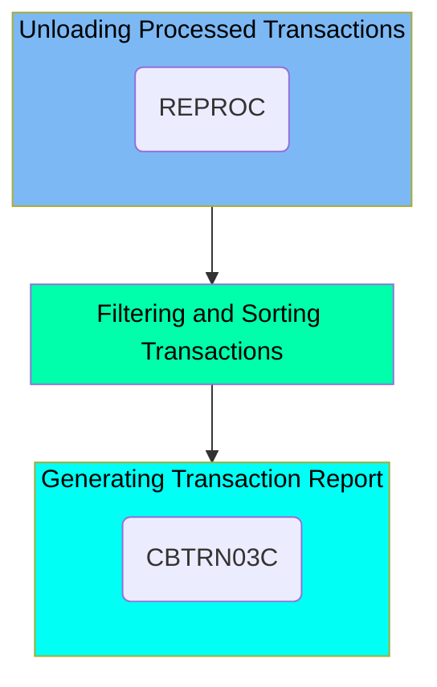

The REPROC job is responsible for managing the processing of transaction data within the application. It involves unloading processed transactions, filtering and sorting them based on specific criteria, and generating a detailed transaction report. This ensures that transaction data is properly backed up, relevant transactions are identified and organized, and a comprehensive report is produced for further analysis.

For example, the job filters transactions within a specified date range and sorts them by card number, ensuring that only relevant transactions are included in the final report.

Here is a high level diagram of the file:



## Unloading Processed Transactions

Steps in this section: <SwmToken path="app/proc/TRANREPT.prc" pos="21:1:1" line-data="//STEP01R EXEC PROC=REPROC,                                                     ">`STEP01R`</SwmToken>.

This section is responsible for unloading processed transaction data from the VSAM dataset and storing it as a new backup dataset. It ensures that the transaction data is properly backed up for future reference and processing.

## Filtering and Sorting Transactions

Steps in this section: <SwmToken path="app/proc/TRANREPT.prc" pos="35:1:1" line-data="//STEP05R  EXEC PGM=SORT                                                        ">`STEP05R`</SwmToken>.

This section is responsible for filtering transaction records within a specified date range and sorting them by card number. It ensures that only relevant transactions are processed further by applying date-based conditions and arranging the data in a specific order.

## Generating Transaction Report

Steps in this section: <SwmToken path="app/proc/TRANREPT.prc" pos="57:1:1" line-data="//STEP10R EXEC PGM=CBTRN03C                                                     ">`STEP10R`</SwmToken>.

This section is responsible for generating a formatted report for processed transactions. It involves executing a program that reads various input files containing transaction data, cross-references, and categorization details, and then produces a detailed transaction report.

<SwmSnippet path="/app/proc/TRANREPT.prc" line="55">

---

Here we call the <SwmToken path="app/proc/TRANREPT.prc" pos="57:7:7" line-data="//STEP10R EXEC PGM=CBTRN03C                                                     ">`CBTRN03C`</SwmToken> program.

More about <SwmToken path="app/proc/TRANREPT.prc" pos="57:7:7" line-data="//STEP10R EXEC PGM=CBTRN03C                                                     ">`CBTRN03C`</SwmToken>: <SwmLink doc-title="Printing Transaction Detail Reports (CBTRN03C)">[Printing Transaction Detail Reports (CBTRN03C)](/.swm/printing-transaction-detail-reports-cbtrn03c.umd6qzfy.sw.md)</SwmLink>

```sql
//* Produce a formatted report for processed transactions                       
//* *******************************************************************         
//STEP10R EXEC PGM=CBTRN03C                                                     
```

---

</SwmSnippet>

&nbsp;

*This is an auto-generated document by Swimm 🌊 and has not yet been verified by a human*

<SwmMeta version="3.0.0" repo-id="Z2l0aHViJTNBJTNBa3luZHJ5bC1hd3MtbWFpbmZyYW1lLW1vZGVybml6YXRpb24tY2FyZGRlbW8lM0ElM0FTd2ltbS1EZW1v" repo-name="kyndryl-aws-mainframe-modernization-carddemo"><sup>Powered by [Swimm](/)</sup></SwmMeta>
