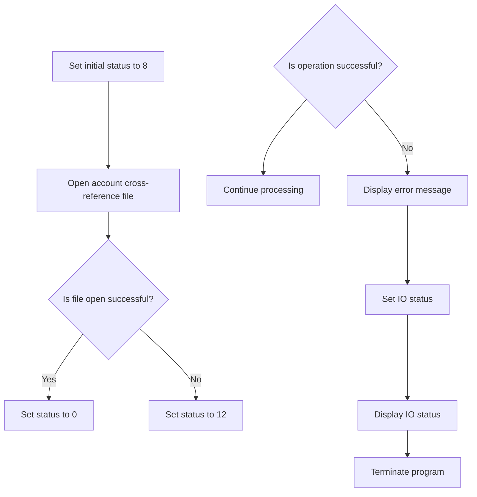
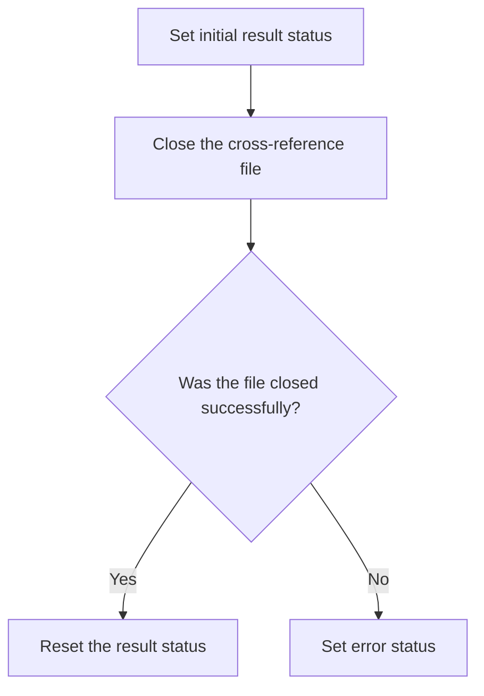

```mermaid
graph TD
  A[Read next record from XREFFILE] -->|Status 00| B[Set APPL-RESULT to 0 and display record]
  A -->|Status 10| C[Set APPL-RESULT to 16]
  A -->|Other status| D[Set APPL-RESULT to 12]
  E[Check APPL-AOK] -->|True| F[Continue processing]
  E -->|False| G[Check APPL-EOF] -->|True| H[Set END-OF-FILE to Y]
  G -->|False| I[Display error and perform error handling]

%% Swimm:
%% graph TD
%%   A[Read next record from XREFFILE] -->|Status 00| B[Set <SwmToken path="app/cbl/CBACT03C.cbl" pos="95:7:9" line-data="               MOVE 0 TO APPL-RESULT                                            ">`APPL-RESULT`</SwmToken> to 0 and display record]
%%   A -->|Status 10| C[Set <SwmToken path="app/cbl/CBACT03C.cbl" pos="95:7:9" line-data="               MOVE 0 TO APPL-RESULT                                            ">`APPL-RESULT`</SwmToken> to 16]
%%   A -->|Other status| D[Set <SwmToken path="app/cbl/CBACT03C.cbl" pos="95:7:9" line-data="               MOVE 0 TO APPL-RESULT                                            ">`APPL-RESULT`</SwmToken> to 12]
%%   E[Check <SwmToken path="app/cbl/CBACT03C.cbl" pos="104:3:5" line-data="           IF  APPL-AOK                                                         ">`APPL-AOK`</SwmToken>] -->|True| F[Continue processing]
%%   E -->|False| G[Check <SwmToken path="app/cbl/CBACT03C.cbl" pos="107:3:5" line-data="               IF  APPL-EOF                                                     ">`APPL-EOF`</SwmToken>] -->|True| H[Set <SwmToken path="app/cbl/CBACT03C.cbl" pos="74:5:9" line-data="           PERFORM UNTIL END-OF-FILE = &#39;Y&#39;                                      ">`END-OF-FILE`</SwmToken> to Y]
%%   G -->|False| I[Display error and perform error handling]
```

The <SwmToken path="app/cbl/CBACT03C.cbl" pos="71:14:14" line-data="           DISPLAY &#39;START OF EXECUTION OF PROGRAM CBACT03C&#39;.                    ">`CBACT03C`</SwmToken> program is a batch COBOL program designed to read and print the account cross-reference data file. This program is used once in a flow starting from `READXREF`, where it processes records from the account cross-reference data file, displays them, and handles any errors that occur during the file operations.

For example, the program starts by opening the account cross-reference data file, then enters a loop to read and display each record until the end of the file is reached. If an error occurs while opening or reading the file, the program displays an error message and terminates to ensure data integrity.

# Where is this program used?

This program is used once, in a flow starting from `READXREF` as represented in the following diagram:

```mermaid
graph TD
READXREF("READXREF") --> CBACT03C("Reading and Printing Account Cross-Reference Data (CBACT03C)"):::currentEntity
  classDef currentEntity color:#000000,fill:#7CB9F4

%% Swimm:
%% graph TD
%% READXREF("READXREF") --> <SwmToken path="app/cbl/CBACT03C.cbl" pos="71:14:14" line-data="           DISPLAY &#39;START OF EXECUTION OF PROGRAM CBACT03C&#39;.                    ">`CBACT03C`</SwmToken>("Reading and Printing Account Cross-Reference Data (<SwmToken path="app/cbl/CBACT03C.cbl" pos="71:14:14" line-data="           DISPLAY &#39;START OF EXECUTION OF PROGRAM CBACT03C&#39;.                    ">`CBACT03C`</SwmToken>)"):::currentEntity
%%   classDef currentEntity color:#000000,fill:#7CB9F4
```



# Read and Display Records (PROCEDURE-DIVISION)

<SwmSnippet path="/app/cbl/CBACT03C.cbl" line="70">

---

### Starting the Program

Going into the first snippet, the program starts by displaying a message indicating the beginning of its execution. It then opens the account cross-reference data file.

```cobol
       PROCEDURE DIVISION.                                                      
           DISPLAY 'START OF EXECUTION OF PROGRAM CBACT03C'.                    
           PERFORM 0000-XREFFILE-OPEN.                                          
```

---

</SwmSnippet>

<SwmSnippet path="/app/cbl/CBACT03C.cbl" line="74">

---

### Processing Records

Next, the program enters a loop that continues until the end of the file is reached. Within the loop, it checks if the end of the file has not been reached. If not, it reads the next record from the account cross-reference data file and displays the record.

```cobol
           PERFORM UNTIL END-OF-FILE = 'Y'                                      
               IF  END-OF-FILE = 'N'                                            
                   PERFORM 1000-XREFFILE-GET-NEXT                               
                   IF  END-OF-FILE = 'N'                                        
                       DISPLAY CARD-XREF-RECORD                                 
                   END-IF                                                       
               END-IF                                                           
```

---

</SwmSnippet>

<SwmSnippet path="/app/cbl/CBACT03C.cbl" line="81">

---

### Ending the Program

Then, the program exits the loop and closes the account cross-reference data file. Finally, it displays a message indicating the end of its execution and returns control to the operating system.

```cobol
           END-PERFORM.                                                         
                                                                                
           PERFORM 9000-XREFFILE-CLOSE.                                         
                                                                                
           DISPLAY 'END OF EXECUTION OF PROGRAM CBACT03C'.                      
                                                                                
           GOBACK.                                                              
```

---

</SwmSnippet>

# Open Data File (<SwmToken path="app/cbl/CBACT03C.cbl" pos="72:3:7" line-data="           PERFORM 0000-XREFFILE-OPEN.                                          ">`0000-XREFFILE-OPEN`</SwmToken>)

Lets' zoom into the program flow:



<SwmSnippet path="/app/cbl/CBACT03C.cbl" line="118">

---

### Opening the account cross-reference file

Going into the first snippet, the code sets an initial status to indicate the operation is starting. It then attempts to open the account cross-reference file. If the file opens successfully, the status is updated to indicate success. Otherwise, the status is set to indicate an error.

```cobol
       0000-XREFFILE-OPEN.                                                      
           MOVE 8 TO APPL-RESULT.                                               
           OPEN INPUT XREFFILE-FILE                                             
           IF  XREFFILE-STATUS = '00'                                           
               MOVE 0 TO APPL-RESULT                                            
           ELSE                                                                 
               MOVE 12 TO APPL-RESULT                                           
           END-IF                                                               
```

---

</SwmSnippet>

<SwmSnippet path="/app/cbl/CBACT03C.cbl" line="126">

---

### Handling file open errors

Now, in the second snippet, the code checks if the operation was successful. If it was, the process continues. If not, an error message is displayed, the file operation status is set, and the program displays the IO status and terminates to prevent further processing.

```cobol
           IF  APPL-AOK                                                         
               CONTINUE                                                         
           ELSE                                                                 
               DISPLAY 'ERROR OPENING XREFFILE'                                 
               MOVE XREFFILE-STATUS TO IO-STATUS                                
               PERFORM 9910-DISPLAY-IO-STATUS                                   
               PERFORM 9999-ABEND-PROGRAM                                       
           END-IF                                                               
           EXIT.                                                                
```

---

</SwmSnippet>

# Display Status (<SwmToken path="app/cbl/CBACT03C.cbl" pos="112:3:9" line-data="                   PERFORM 9910-DISPLAY-IO-STATUS                               ">`9910-DISPLAY-IO-STATUS`</SwmToken>)

Lets' zoom into the program flow:

```mermaid
graph TD
  A[Check if IO-STATUS is numeric] -->|No| B[Check if IO-STAT1 is '9']
  B -->|Yes| C[Set IO-STATUS-04 to IO-STAT1]
  C --> D[Set TWO-BYTES-BINARY to 0]
  D --> E[Set TWO-BYTES-RIGHT to IO-STAT2]
  E --> F[Set IO-STATUS-0403 to TWO-BYTES-BINARY]
  F --> G[Display 'FILE STATUS IS: NNNN' with IO-STATUS-04]
  B -->|No| H[Set IO-STATUS-04 to '0000']
  H --> I[Set IO-STATUS-04(3:2) to IO-STATUS]
  I --> G
  A -->|Yes| H

%% Swimm:
%% graph TD
%%   A[Check if <SwmToken path="app/cbl/CBACT03C.cbl" pos="111:9:11" line-data="                   MOVE XREFFILE-STATUS TO IO-STATUS                            ">`IO-STATUS`</SwmToken> is numeric] -->|No| B[Check if <SwmToken path="app/cbl/CBACT03C.cbl" pos="163:3:5" line-data="           OR  IO-STAT1 = &#39;9&#39;                                                   ">`IO-STAT1`</SwmToken> is '9']
%%   B -->|Yes| C[Set <SwmToken path="app/cbl/CBACT03C.cbl" pos="164:9:13" line-data="               MOVE IO-STAT1 TO IO-STATUS-04(1:1)                               ">`IO-STATUS-04`</SwmToken> to <SwmToken path="app/cbl/CBACT03C.cbl" pos="163:3:5" line-data="           OR  IO-STAT1 = &#39;9&#39;                                                   ">`IO-STAT1`</SwmToken>]
%%   C --> D[Set <SwmToken path="app/cbl/CBACT03C.cbl" pos="165:7:11" line-data="               MOVE 0        TO TWO-BYTES-BINARY                                ">`TWO-BYTES-BINARY`</SwmToken> to 0]
%%   D --> E[Set <SwmToken path="app/cbl/CBACT03C.cbl" pos="166:9:13" line-data="               MOVE IO-STAT2 TO TWO-BYTES-RIGHT                                 ">`TWO-BYTES-RIGHT`</SwmToken> to <SwmToken path="app/cbl/CBACT03C.cbl" pos="166:3:5" line-data="               MOVE IO-STAT2 TO TWO-BYTES-RIGHT                                 ">`IO-STAT2`</SwmToken>]
%%   E --> F[Set <SwmToken path="app/cbl/CBACT03C.cbl" pos="167:11:15" line-data="               MOVE TWO-BYTES-BINARY TO IO-STATUS-0403                          ">`IO-STATUS-0403`</SwmToken> to <SwmToken path="app/cbl/CBACT03C.cbl" pos="165:7:11" line-data="               MOVE 0        TO TWO-BYTES-BINARY                                ">`TWO-BYTES-BINARY`</SwmToken>]
%%   F --> G[Display 'FILE STATUS IS: NNNN' with <SwmToken path="app/cbl/CBACT03C.cbl" pos="164:9:13" line-data="               MOVE IO-STAT1 TO IO-STATUS-04(1:1)                               ">`IO-STATUS-04`</SwmToken>]
%%   B -->|No| H[Set <SwmToken path="app/cbl/CBACT03C.cbl" pos="164:9:13" line-data="               MOVE IO-STAT1 TO IO-STATUS-04(1:1)                               ">`IO-STATUS-04`</SwmToken> to '0000']
%%   H --> I[Set <SwmToken path="app/cbl/CBACT03C.cbl" pos="164:9:13" line-data="               MOVE IO-STAT1 TO IO-STATUS-04(1:1)                               ">`IO-STATUS-04`</SwmToken>(3:2) to <SwmToken path="app/cbl/CBACT03C.cbl" pos="111:9:11" line-data="                   MOVE XREFFILE-STATUS TO IO-STATUS                            ">`IO-STATUS`</SwmToken>]
%%   I --> G
%%   A -->|Yes| H
```

<SwmSnippet path="/app/cbl/CBACT03C.cbl" line="161">

---

### Displaying IO Status

Going into the <SwmToken path="app/cbl/CBACT03C.cbl" pos="161:1:7" line-data="       9910-DISPLAY-IO-STATUS.                                                  ">`9910-DISPLAY-IO-STATUS`</SwmToken> function, it first checks if the status of the file operation is valid or if there is a specific error condition. If either condition is true, it prepares and displays a detailed status message indicating the specific error. If neither condition is met, it prepares and displays a generic success message.

```cobol
       9910-DISPLAY-IO-STATUS.                                                  
           IF  IO-STATUS NOT NUMERIC                                            
           OR  IO-STAT1 = '9'                                                   
               MOVE IO-STAT1 TO IO-STATUS-04(1:1)                               
               MOVE 0        TO TWO-BYTES-BINARY                                
               MOVE IO-STAT2 TO TWO-BYTES-RIGHT                                 
               MOVE TWO-BYTES-BINARY TO IO-STATUS-0403                          
               DISPLAY 'FILE STATUS IS: NNNN' IO-STATUS-04                      
           ELSE                                                                 
               MOVE '0000' TO IO-STATUS-04                                      
               MOVE IO-STATUS TO IO-STATUS-04(3:2)                              
               DISPLAY 'FILE STATUS IS: NNNN' IO-STATUS-04                      
           END-IF                                                               
           EXIT.                                                                
```

---

</SwmSnippet>

# Read Next Record (<SwmToken path="app/cbl/CBACT03C.cbl" pos="76:3:9" line-data="                   PERFORM 1000-XREFFILE-GET-NEXT                               ">`1000-XREFFILE-GET-NEXT`</SwmToken>)

Lets' zoom into the program flow:



<SwmSnippet path="/app/cbl/CBACT03C.cbl" line="92">

---

Going into the first snippet, the function reads the next record from the account cross-reference data file. If the read operation is successful, it sets the result to indicate success and displays the record. If the end of the file is reached, it sets the result to indicate the end of the file. For any other status, it sets the result to indicate an error.

```cobol
       1000-XREFFILE-GET-NEXT.                                                  
           READ XREFFILE-FILE INTO CARD-XREF-RECORD.                            
           IF  XREFFILE-STATUS = '00'                                           
               MOVE 0 TO APPL-RESULT                                            
               DISPLAY CARD-XREF-RECORD                                         
           ELSE                                                                 
               IF  XREFFILE-STATUS = '10'                                       
                   MOVE 16 TO APPL-RESULT                                       
               ELSE                                                             
                   MOVE 12 TO APPL-RESULT                                       
               END-IF                                                           
```

---

</SwmSnippet>

<SwmSnippet path="/app/cbl/CBACT03C.cbl" line="103">

---

Next, the function checks if the operation was successful. If it is, the function continues processing. If not, it checks if the end of the file has been reached. If the end of the file is reached, it sets the end-of-file flag. Otherwise, it displays an error message, captures the status of the file operation, and performs error handling routines.

```cobol
           END-IF                                                               
           IF  APPL-AOK                                                         
               CONTINUE                                                         
           ELSE                                                                 
               IF  APPL-EOF                                                     
                   MOVE 'Y' TO END-OF-FILE                                      
               ELSE                                                             
                   DISPLAY 'ERROR READING XREFFILE'                             
                   MOVE XREFFILE-STATUS TO IO-STATUS                            
                   PERFORM 9910-DISPLAY-IO-STATUS                               
                   PERFORM 9999-ABEND-PROGRAM                                   
               END-IF                                                           
           END-IF                                                               
           EXIT.                                                                
```

---

</SwmSnippet>

# Close Account Cross Reference File (<SwmToken path="app/cbl/CBACT03C.cbl" pos="83:3:7" line-data="           PERFORM 9000-XREFFILE-CLOSE.                                         ">`9000-XREFFILE-CLOSE`</SwmToken>)

Lets' zoom into the program flow:



<SwmSnippet path="/app/cbl/CBACT03C.cbl" line="136">

---

### Setting initial result status and closing the file

Going into the first part of the function, the initial result status is set to indicate the start of the file closing process. The function then attempts to close the account cross-reference data file. If the file is closed successfully, the result status is reset to indicate success. Otherwise, the result status is updated to indicate an error in closing the file.

```cobol
       9000-XREFFILE-CLOSE.                                                     
           ADD 8 TO ZERO GIVING APPL-RESULT.                                    
           CLOSE XREFFILE-FILE                                                  
           IF  XREFFILE-STATUS = '00'                                           
               SUBTRACT APPL-RESULT FROM APPL-RESULT                            
           ELSE                                                                 
               ADD 12 TO ZERO GIVING APPL-RESULT                                
           END-IF                                                               
```

---

</SwmSnippet>

<SwmSnippet path="/app/cbl/CBACT03C.cbl" line="144">

---

### Handling the result of the file closing operation

Next, the function checks if the file closing operation was successful. If the operation was successful, the function continues without any issues. If there was an error, it displays an error message, updates the status of the file operation, and performs additional steps to display the status and terminate the program forcefully to ensure data integrity.

```cobol
           IF  APPL-AOK                                                         
               CONTINUE                                                         
           ELSE                                                                 
               DISPLAY 'ERROR CLOSING XREFFILE'                                 
               MOVE XREFFILE-STATUS TO IO-STATUS                                
               PERFORM 9910-DISPLAY-IO-STATUS                                   
               PERFORM 9999-ABEND-PROGRAM                                       
           END-IF                                                               
           EXIT.                                                                
```

---

</SwmSnippet>

&nbsp;

*This is an auto-generated document by Swimm 🌊 and has not yet been verified by a human*

<SwmMeta version="3.0.0" repo-id="Z2l0aHViJTNBJTNBa3luZHJ5bC1hd3MtbWFpbmZyYW1lLW1vZGVybml6YXRpb24tY2FyZGRlbW8lM0ElM0FTd2ltbS1EZW1v" repo-name="kyndryl-aws-mainframe-modernization-carddemo"><sup>Powered by [Swimm](/)</sup></SwmMeta>
