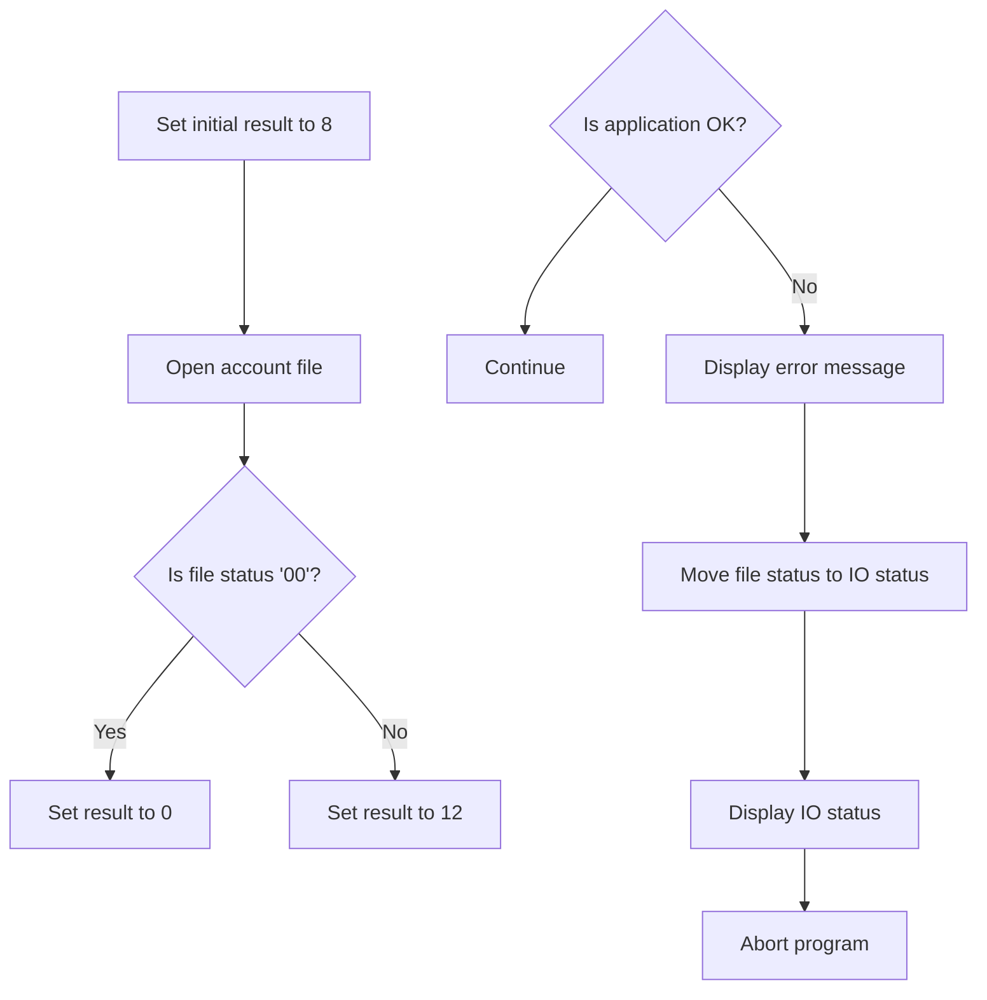
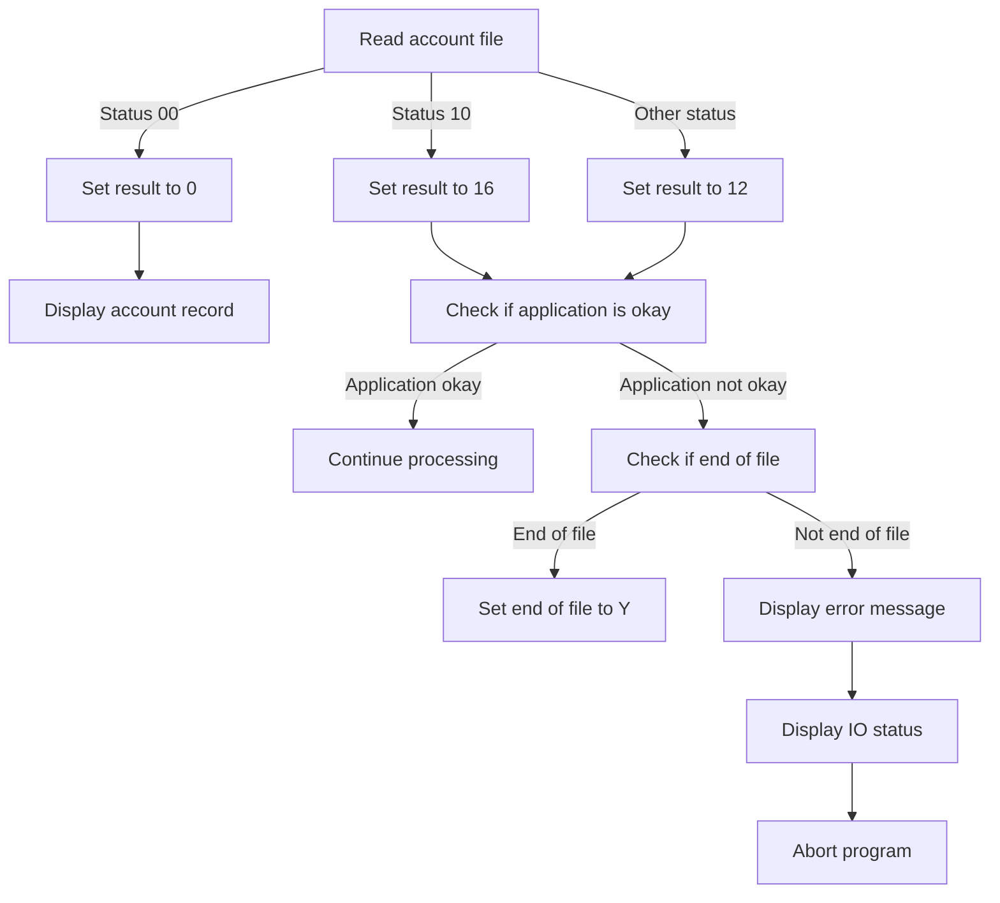
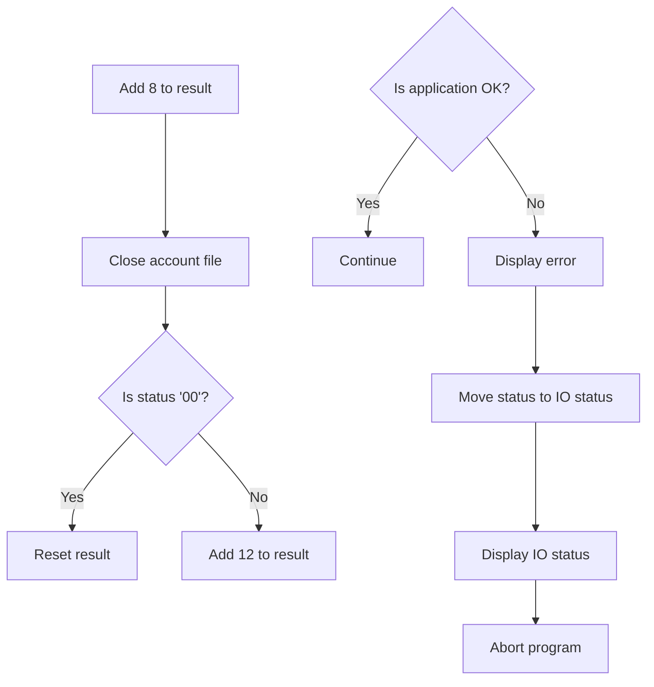

```mermaid
graph TD
  A[Check if IO-STATUS is numeric or IO-STAT1 is '9'] -->|Yes| B[Set IO-STATUS-04 based on IO-STAT1 and IO-STAT2]
  A -->|No| C[Set IO-STATUS-04 to '0000' and update with IO-STATUS]
  B --> D[Display 'FILE STATUS IS: NNNN' with IO-STATUS-04]
  C --> D

%% Swimm:
%% graph TD
%%   A[Check if <SwmToken path="app/cbl/CBACT01C.cbl" pos="111:9:11" line-data="                   MOVE ACCTFILE-STATUS TO IO-STATUS                            ">`IO-STATUS`</SwmToken> is numeric or <SwmToken path="app/cbl/CBACT01C.cbl" pos="178:3:5" line-data="           OR  IO-STAT1 = &#39;9&#39;                                                   ">`IO-STAT1`</SwmToken> is '9'] -->|Yes| B[Set <SwmToken path="app/cbl/CBACT01C.cbl" pos="179:9:13" line-data="               MOVE IO-STAT1 TO IO-STATUS-04(1:1)                               ">`IO-STATUS-04`</SwmToken> based on <SwmToken path="app/cbl/CBACT01C.cbl" pos="178:3:5" line-data="           OR  IO-STAT1 = &#39;9&#39;                                                   ">`IO-STAT1`</SwmToken> and <SwmToken path="app/cbl/CBACT01C.cbl" pos="181:3:5" line-data="               MOVE IO-STAT2 TO TWO-BYTES-RIGHT                                 ">`IO-STAT2`</SwmToken>]
%%   A -->|No| C[Set <SwmToken path="app/cbl/CBACT01C.cbl" pos="179:9:13" line-data="               MOVE IO-STAT1 TO IO-STATUS-04(1:1)                               ">`IO-STATUS-04`</SwmToken> to '0000' and update with <SwmToken path="app/cbl/CBACT01C.cbl" pos="111:9:11" line-data="                   MOVE ACCTFILE-STATUS TO IO-STATUS                            ">`IO-STATUS`</SwmToken>]
%%   B --> D[Display 'FILE STATUS IS: NNNN' with <SwmToken path="app/cbl/CBACT01C.cbl" pos="179:9:13" line-data="               MOVE IO-STAT1 TO IO-STATUS-04(1:1)                               ">`IO-STATUS-04`</SwmToken>]
%%   C --> D
```

The <SwmToken path="app/cbl/CBACT01C.cbl" pos="71:14:14" line-data="           DISPLAY &#39;START OF EXECUTION OF PROGRAM CBACT01C&#39;.                    ">`CBACT01C`</SwmToken> program is a batch COBOL program designed to read and print account data files. This program is used in a flow starting from `READACCT`, where it processes account records by opening the account data file, reading the records, and displaying the account information. The program ensures that the account data is accurately read and displayed, handling any errors that may occur during the file operations.

For instance, when the program reads an account file, it checks the status of the read operation. If successful, it displays the account record details such as account ID, balance, and credit limit. If an error occurs, it displays an appropriate error message and aborts the program.

# Where is this program used?

This program is used once, in a flow starting from `READACCT` as represented in the following diagram:

```mermaid
graph TD
READACCT("READACCT") --> CBACT01C("Reading and Printing Account Data (CBACT01C)"):::currentEntity
  classDef currentEntity color:#000000,fill:#7CB9F4

%% Swimm:
%% graph TD
%% READACCT("READACCT") --> <SwmToken path="app/cbl/CBACT01C.cbl" pos="71:14:14" line-data="           DISPLAY &#39;START OF EXECUTION OF PROGRAM CBACT01C&#39;.                    ">`CBACT01C`</SwmToken>("Reading and Printing Account Data (<SwmToken path="app/cbl/CBACT01C.cbl" pos="71:14:14" line-data="           DISPLAY &#39;START OF EXECUTION OF PROGRAM CBACT01C&#39;.                    ">`CBACT01C`</SwmToken>)"):::currentEntity
%%   classDef currentEntity color:#000000,fill:#7CB9F4
```



# Read Account Records (PROCEDURE-DIVISION)

<SwmSnippet path="/app/cbl/CBACT01C.cbl" line="70">

---

Going into the PROCEDURE-DIVISION, the program starts by indicating the start of execution. It then opens the account data file and sets the status.

```cobol
       PROCEDURE DIVISION.                                                      
           DISPLAY 'START OF EXECUTION OF PROGRAM CBACT01C'.                    
           PERFORM 0000-ACCTFILE-OPEN.                                          
```

---

</SwmSnippet>

<SwmSnippet path="/app/cbl/CBACT01C.cbl" line="74">

---

Next, the program enters a loop that continues until the end of the file is reached. Within the loop, it checks if the end of the file has not been reached. If not, it reads the next account data. If the end of the file is still not reached, it displays the account record.

```cobol
           PERFORM UNTIL END-OF-FILE = 'Y'                                      
               IF  END-OF-FILE = 'N'                                            
                   PERFORM 1000-ACCTFILE-GET-NEXT                               
                   IF  END-OF-FILE = 'N'                                        
                       DISPLAY ACCOUNT-RECORD                                   
                   END-IF                                                       
               END-IF                                                           
```

---

</SwmSnippet>

<SwmSnippet path="/app/cbl/CBACT01C.cbl" line="81">

---

Then, the program exits the loop and closes the account data file. Finally, it indicates the end of execution and returns control to the operating system.

```cobol
           END-PERFORM.                                                         
                                                                                
           PERFORM 9000-ACCTFILE-CLOSE.                                         
                                                                                
           DISPLAY 'END OF EXECUTION OF PROGRAM CBACT01C'.                      
                                                                                
           GOBACK.                                                              
```

---

</SwmSnippet>

# Open Account File (<SwmToken path="app/cbl/CBACT01C.cbl" pos="72:3:7" line-data="           PERFORM 0000-ACCTFILE-OPEN.                                          ">`0000-ACCTFILE-OPEN`</SwmToken>)

Lets' zoom into the program flow:



<SwmSnippet path="/app/cbl/CBACT01C.cbl" line="133">

---

### Opening the account file

Going into the <SwmToken path="app/cbl/CBACT01C.cbl" pos="133:1:5" line-data="       0000-ACCTFILE-OPEN.                                                      ">`0000-ACCTFILE-OPEN`</SwmToken> function, the initial step is to set the result to indicate an initial state. The account file is then opened. If the file status indicates a successful operation, the result is updated to reflect success. Otherwise, the result is updated to indicate failure.

```cobol
       0000-ACCTFILE-OPEN.                                                      
           MOVE 8 TO APPL-RESULT.                                               
           OPEN INPUT ACCTFILE-FILE                                             
           IF  ACCTFILE-STATUS = '00'                                           
               MOVE 0 TO APPL-RESULT                                            
           ELSE                                                                 
               MOVE 12 TO APPL-RESULT                                           
           END-IF                                                               
```

---

</SwmSnippet>

<SwmSnippet path="/app/cbl/CBACT01C.cbl" line="141">

---

### Handling the result of opening the account file

Next, the function checks if the application is in an OK state. If it is, the process continues. If not, an error message is displayed, the file status is updated, the IO status is displayed, and the program is aborted.

```cobol
           IF  APPL-AOK                                                         
               CONTINUE                                                         
           ELSE                                                                 
               DISPLAY 'ERROR OPENING ACCTFILE'                                 
               MOVE ACCTFILE-STATUS TO IO-STATUS                                
               PERFORM 9910-DISPLAY-IO-STATUS                                   
               PERFORM 9999-ABEND-PROGRAM                                       
           END-IF                                                               
           EXIT.                                                                
```

---

</SwmSnippet>

# Display File Status (<SwmToken path="app/cbl/CBACT01C.cbl" pos="112:3:9" line-data="                   PERFORM 9910-DISPLAY-IO-STATUS                               ">`9910-DISPLAY-IO-STATUS`</SwmToken>)

Lets' zoom into the program flow:



<SwmSnippet path="/app/cbl/CBACT01C.cbl" line="176">

---

### Displaying <SwmToken path="app/cbl/CBACT01C.cbl" pos="90:3:5" line-data="      * I/O ROUTINES TO ACCESS A KSDS, VSAM DATA SET...               *         ">`I/O`</SwmToken> Status

Going into the <SwmToken path="app/cbl/CBACT01C.cbl" pos="176:1:7" line-data="       9910-DISPLAY-IO-STATUS.                                                  ">`9910-DISPLAY-IO-STATUS`</SwmToken> function, it first checks if the status of the input/output operation is either non-numeric or indicates a specific error condition. If either condition is met, it formats the status message based on the error details and displays it. Otherwise, it sets a default success message and updates it with the current status, then displays the file status.

```cobol
       9910-DISPLAY-IO-STATUS.                                                  
           IF  IO-STATUS NOT NUMERIC                                            
           OR  IO-STAT1 = '9'                                                   
               MOVE IO-STAT1 TO IO-STATUS-04(1:1)                               
               MOVE 0        TO TWO-BYTES-BINARY                                
               MOVE IO-STAT2 TO TWO-BYTES-RIGHT                                 
               MOVE TWO-BYTES-BINARY TO IO-STATUS-0403                          
               DISPLAY 'FILE STATUS IS: NNNN' IO-STATUS-04                      
           ELSE                                                                 
               MOVE '0000' TO IO-STATUS-04                                      
               MOVE IO-STATUS TO IO-STATUS-04(3:2)                              
               DISPLAY 'FILE STATUS IS: NNNN' IO-STATUS-04                      
           END-IF                                                               
           EXIT.                                                                
```

---

</SwmSnippet>

# Read Account Data (<SwmToken path="app/cbl/CBACT01C.cbl" pos="76:3:9" line-data="                   PERFORM 1000-ACCTFILE-GET-NEXT                               ">`1000-ACCTFILE-GET-NEXT`</SwmToken>)

Lets' zoom into the program flow:



<SwmSnippet path="/app/cbl/CBACT01C.cbl" line="92">

---

### Reading account file

Going into the first snippet, the code reads the account file and checks the status of the read operation. If the read is successful, it sets the result to indicate success and displays the account record. If the read indicates the end of the file, it sets the result accordingly. For any other status, it sets the result to indicate an error.

```cobol
       1000-ACCTFILE-GET-NEXT.                                                  
           READ ACCTFILE-FILE INTO ACCOUNT-RECORD.                              
           IF  ACCTFILE-STATUS = '00'                                           
               MOVE 0 TO APPL-RESULT                                            
               PERFORM 1100-DISPLAY-ACCT-RECORD                                 
           ELSE                                                                 
               IF  ACCTFILE-STATUS = '10'                                       
                   MOVE 16 TO APPL-RESULT                                       
               ELSE                                                             
                   MOVE 12 TO APPL-RESULT                                       
               END-IF                                                           
```

---

</SwmSnippet>

<SwmSnippet path="/app/cbl/CBACT01C.cbl" line="103">

---

### Handling read results

Now, the second snippet checks if the application is in a state to continue processing. If it is, the processing continues. If not, it checks if the end of the file has been reached. If the end of the file is reached, it sets the end-of-file indicator. Otherwise, it displays an error message, shows the IO status, and aborts the program.

```cobol
           END-IF                                                               
           IF  APPL-AOK                                                         
               CONTINUE                                                         
           ELSE                                                                 
               IF  APPL-EOF                                                     
                   MOVE 'Y' TO END-OF-FILE                                      
               ELSE                                                             
                   DISPLAY 'ERROR READING ACCOUNT FILE'                         
                   MOVE ACCTFILE-STATUS TO IO-STATUS                            
                   PERFORM 9910-DISPLAY-IO-STATUS                               
                   PERFORM 9999-ABEND-PROGRAM                                   
               END-IF                                                           
           END-IF                                                               
           EXIT.                                                                
```

---

</SwmSnippet>

# Display Account Info (<SwmToken path="app/cbl/CBACT01C.cbl" pos="96:3:9" line-data="               PERFORM 1100-DISPLAY-ACCT-RECORD                                 ">`1100-DISPLAY-ACCT-RECORD`</SwmToken>)

<SwmSnippet path="/app/cbl/CBACT01C.cbl" line="118">

---

### Displaying Account Information

Going into the <SwmToken path="app/cbl/CBACT01C.cbl" pos="118:1:7" line-data="       1100-DISPLAY-ACCT-RECORD.                                                ">`1100-DISPLAY-ACCT-RECORD`</SwmToken> function, it displays various details of an account. It shows the account ID, active status, current balance, credit limit, cash credit limit, open date, expiration date, reissue date, current cycle credit, current cycle debit, and group ID. This information is crucial for users to view the current state and details of their accounts.

```cobol
       1100-DISPLAY-ACCT-RECORD.                                                
           DISPLAY 'ACCT-ID                 :'   ACCT-ID                        
           DISPLAY 'ACCT-ACTIVE-STATUS      :'   ACCT-ACTIVE-STATUS             
           DISPLAY 'ACCT-CURR-BAL           :'   ACCT-CURR-BAL                  
           DISPLAY 'ACCT-CREDIT-LIMIT       :'   ACCT-CREDIT-LIMIT              
           DISPLAY 'ACCT-CASH-CREDIT-LIMIT  :'   ACCT-CASH-CREDIT-LIMIT         
           DISPLAY 'ACCT-OPEN-DATE          :'   ACCT-OPEN-DATE                 
           DISPLAY 'ACCT-EXPIRAION-DATE     :'   ACCT-EXPIRAION-DATE            
           DISPLAY 'ACCT-REISSUE-DATE       :'   ACCT-REISSUE-DATE              
           DISPLAY 'ACCT-CURR-CYC-CREDIT    :'   ACCT-CURR-CYC-CREDIT           
           DISPLAY 'ACCT-CURR-CYC-DEBIT     :'   ACCT-CURR-CYC-DEBIT            
           DISPLAY 'ACCT-GROUP-ID           :'   ACCT-GROUP-ID                  
           DISPLAY '-------------------------------------------------'          
           EXIT.                                                                
```

---

</SwmSnippet>

# Close File (<SwmToken path="app/cbl/CBACT01C.cbl" pos="83:3:7" line-data="           PERFORM 9000-ACCTFILE-CLOSE.                                         ">`9000-ACCTFILE-CLOSE`</SwmToken>)

Lets' zoom into the program flow:



<SwmSnippet path="/app/cbl/CBACT01C.cbl" line="151">

---

Going into the <SwmToken path="app/cbl/CBACT01C.cbl" pos="151:1:5" line-data="       9000-ACCTFILE-CLOSE.                                                     ">`9000-ACCTFILE-CLOSE`</SwmToken> function, the first step is to prepare for closing the account file. The account file is then closed. If the file operation is successful, the result is reset. Otherwise, an error result is set.

```cobol
       9000-ACCTFILE-CLOSE.                                                     
           ADD 8 TO ZERO GIVING APPL-RESULT.                                    
           CLOSE ACCTFILE-FILE                                                  
           IF  ACCTFILE-STATUS = '00'                                           
               SUBTRACT APPL-RESULT FROM APPL-RESULT                            
           ELSE                                                                 
               ADD 12 TO ZERO GIVING APPL-RESULT                                
           END-IF                                                               
```

---

</SwmSnippet>

<SwmSnippet path="/app/cbl/CBACT01C.cbl" line="159">

---

Next, the function checks if the application is in an OK state. If it is, the function continues. Otherwise, an error message is displayed, the IO status is updated and displayed, and the program is aborted.

```cobol
           IF  APPL-AOK                                                         
               CONTINUE                                                         
           ELSE                                                                 
               DISPLAY 'ERROR CLOSING ACCOUNT FILE'                             
               MOVE ACCTFILE-STATUS TO IO-STATUS                                
               PERFORM 9910-DISPLAY-IO-STATUS                                   
               PERFORM 9999-ABEND-PROGRAM                                       
           END-IF                                                               
           EXIT.                                                                
```

---

</SwmSnippet>

&nbsp;

*This is an auto-generated document by Swimm 🌊 and has not yet been verified by a human*

<SwmMeta version="3.0.0" repo-id="Z2l0aHViJTNBJTNBa3luZHJ5bC1hd3MtbWFpbmZyYW1lLW1vZGVybml6YXRpb24tY2FyZGRlbW8lM0ElM0FTd2ltbS1EZW1v" repo-name="kyndryl-aws-mainframe-modernization-carddemo"><sup>Powered by [Swimm](/)</sup></SwmMeta>
