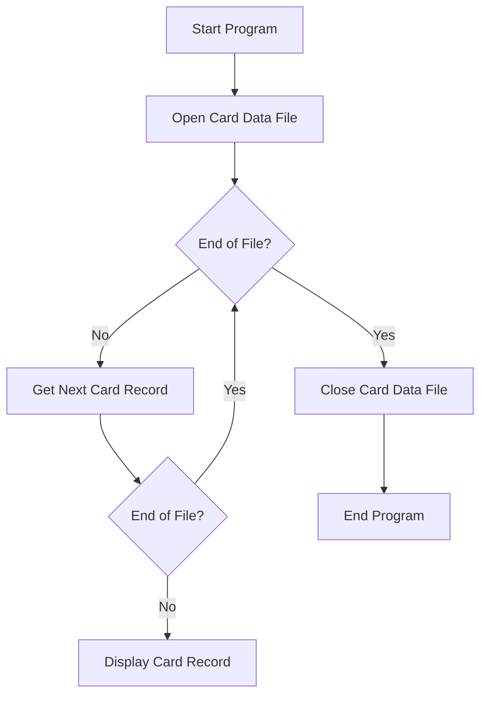
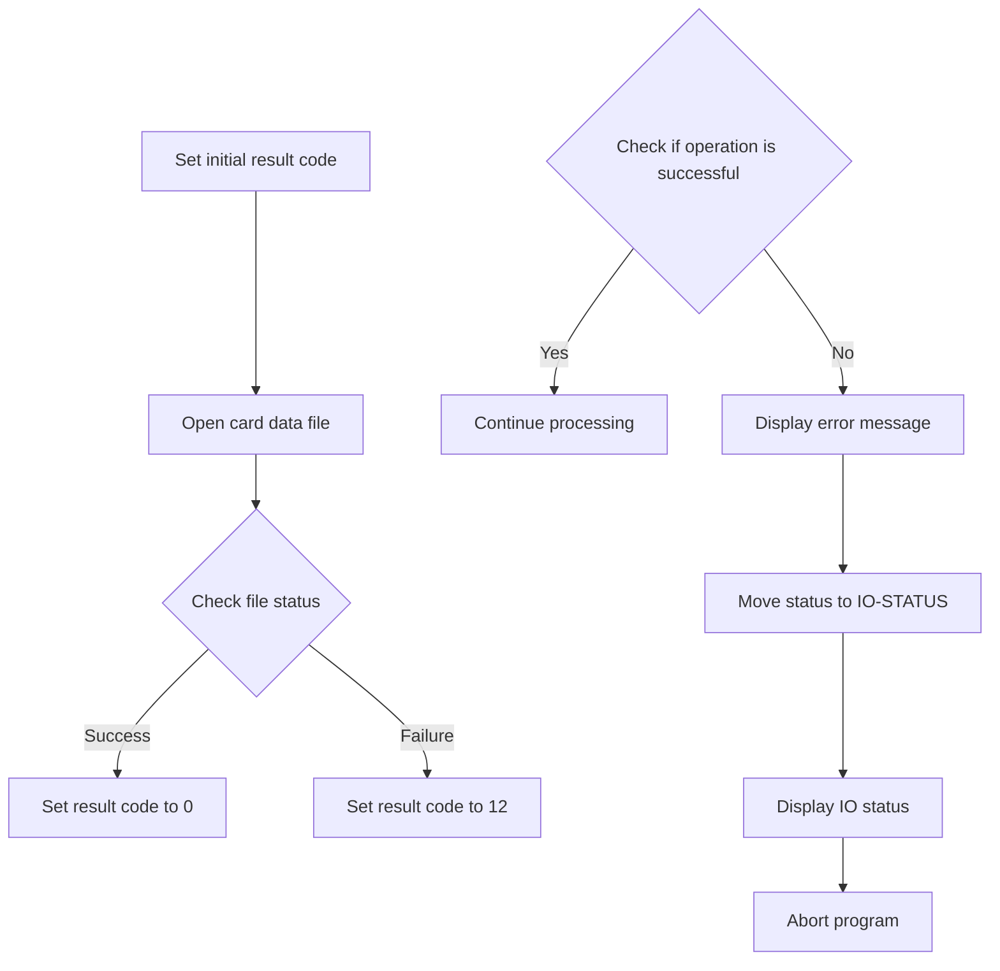
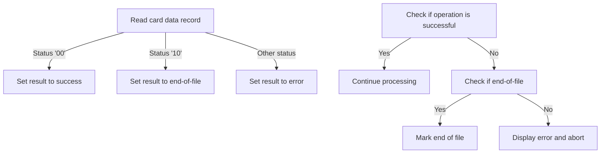
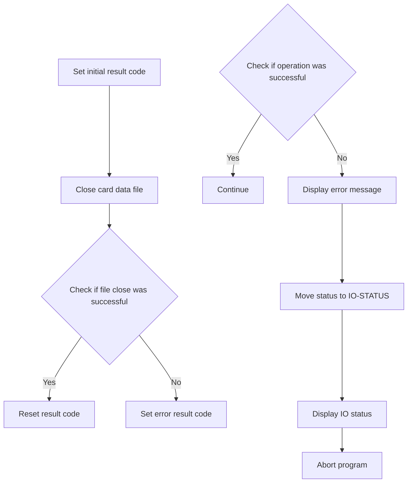

```mermaid
graph TD
  A[Check if IO-STATUS is numeric or IO-STAT1 is '9'] -->|Yes| B[Move IO-STAT1 to IO-STATUS-04]
  B --> C[Set TWO-BYTES-BINARY to 0]
  C --> D[Move IO-STAT2 to TWO-BYTES-RIGHT]
  D --> E[Move TWO-BYTES-BINARY to IO-STATUS-0403]
  E --> F[Display 'FILE STATUS IS: NNNN' with IO-STATUS-04]
  A -->|No| G[Set IO-STATUS-04 to '0000']
  G --> H[Move IO-STATUS to IO-STATUS-04]
  H --> F

%% Swimm:
%% graph TD
%%   A[Check if <SwmToken path="app/cbl/CBACT02C.cbl" pos="111:9:11" line-data="                   MOVE CARDFILE-STATUS TO IO-STATUS                            ">`IO-STATUS`</SwmToken> is numeric or <SwmToken path="app/cbl/CBACT02C.cbl" pos="163:3:5" line-data="           OR  IO-STAT1 = &#39;9&#39;                                                   ">`IO-STAT1`</SwmToken> is '9'] -->|Yes| B[Move <SwmToken path="app/cbl/CBACT02C.cbl" pos="163:3:5" line-data="           OR  IO-STAT1 = &#39;9&#39;                                                   ">`IO-STAT1`</SwmToken> to <SwmToken path="app/cbl/CBACT02C.cbl" pos="164:9:13" line-data="               MOVE IO-STAT1 TO IO-STATUS-04(1:1)                               ">`IO-STATUS-04`</SwmToken>]
%%   B --> C[Set <SwmToken path="app/cbl/CBACT02C.cbl" pos="165:7:11" line-data="               MOVE 0        TO TWO-BYTES-BINARY                                ">`TWO-BYTES-BINARY`</SwmToken> to 0]
%%   C --> D[Move <SwmToken path="app/cbl/CBACT02C.cbl" pos="166:3:5" line-data="               MOVE IO-STAT2 TO TWO-BYTES-RIGHT                                 ">`IO-STAT2`</SwmToken> to <SwmToken path="app/cbl/CBACT02C.cbl" pos="166:9:13" line-data="               MOVE IO-STAT2 TO TWO-BYTES-RIGHT                                 ">`TWO-BYTES-RIGHT`</SwmToken>]
%%   D --> E[Move <SwmToken path="app/cbl/CBACT02C.cbl" pos="165:7:11" line-data="               MOVE 0        TO TWO-BYTES-BINARY                                ">`TWO-BYTES-BINARY`</SwmToken> to <SwmToken path="app/cbl/CBACT02C.cbl" pos="167:11:15" line-data="               MOVE TWO-BYTES-BINARY TO IO-STATUS-0403                          ">`IO-STATUS-0403`</SwmToken>]
%%   E --> F[Display 'FILE STATUS IS: NNNN' with <SwmToken path="app/cbl/CBACT02C.cbl" pos="164:9:13" line-data="               MOVE IO-STAT1 TO IO-STATUS-04(1:1)                               ">`IO-STATUS-04`</SwmToken>]
%%   A -->|No| G[Set <SwmToken path="app/cbl/CBACT02C.cbl" pos="164:9:13" line-data="               MOVE IO-STAT1 TO IO-STATUS-04(1:1)                               ">`IO-STATUS-04`</SwmToken> to '0000']
%%   G --> H[Move <SwmToken path="app/cbl/CBACT02C.cbl" pos="111:9:11" line-data="                   MOVE CARDFILE-STATUS TO IO-STATUS                            ">`IO-STATUS`</SwmToken> to <SwmToken path="app/cbl/CBACT02C.cbl" pos="164:9:13" line-data="               MOVE IO-STAT1 TO IO-STATUS-04(1:1)                               ">`IO-STATUS-04`</SwmToken>]
%%   H --> F
```

The <SwmToken path="app/cbl/CBACT02C.cbl" pos="71:14:14" line-data="           DISPLAY &#39;START OF EXECUTION OF PROGRAM CBACT02C&#39;.                    ">`CBACT02C`</SwmToken> program is a batch COBOL program designed to read and print card data files. This program is used in a flow starting from `READCARD`, where it processes card data by opening the card data file, reading each record, and printing the card data until the end of the file is reached.

For example, when the program is executed, it will display a message indicating the start of execution, open the card data file, read each card record, display the card data, and finally close the file and display a message indicating the end of execution.

# Where is this program used?

This program is used once, in a flow starting from `READCARD` as represented in the following diagram:

```mermaid
graph TD
READCARD("READCARD") --> CBACT02C("Reading and Printing Card Data (CBACT02C)"):::currentEntity
  classDef currentEntity color:#000000,fill:#7CB9F4

%% Swimm:
%% graph TD
%% READCARD("READCARD") --> <SwmToken path="app/cbl/CBACT02C.cbl" pos="71:14:14" line-data="           DISPLAY &#39;START OF EXECUTION OF PROGRAM CBACT02C&#39;.                    ">`CBACT02C`</SwmToken>("Reading and Printing Card Data (<SwmToken path="app/cbl/CBACT02C.cbl" pos="71:14:14" line-data="           DISPLAY &#39;START OF EXECUTION OF PROGRAM CBACT02C&#39;.                    ">`CBACT02C`</SwmToken>)"):::currentEntity
%%   classDef currentEntity color:#000000,fill:#7CB9F4
```



# Read and Print File (PROCEDURE-DIVISION)

Lets' zoom into the program flow:



<SwmSnippet path="/app/cbl/CBACT02C.cbl" line="70">

---

### Starting the Program

Going into the PROCEDURE-DIVISION, the program starts by displaying a message indicating the start of execution. It then performs the operation to open the card data file.

```cobol
       PROCEDURE DIVISION.                                                      
           DISPLAY 'START OF EXECUTION OF PROGRAM CBACT02C'.                    
           PERFORM 0000-CARDFILE-OPEN.                                          
```

---

</SwmSnippet>

<SwmSnippet path="/app/cbl/CBACT02C.cbl" line="74">

---

### Reading Card Data Records

Next, the program enters a loop that continues until the end of the file is reached. Within the loop, it checks if the end of the file has not been reached and then performs the operation to get the next card record. If the end of the file is still not reached, it displays the card record.

```cobol
           PERFORM UNTIL END-OF-FILE = 'Y'                                      
               IF  END-OF-FILE = 'N'                                            
                   PERFORM 1000-CARDFILE-GET-NEXT                               
                   IF  END-OF-FILE = 'N'                                        
                       DISPLAY CARD-RECORD                                      
                   END-IF                                                       
               END-IF                                                           
```

---

</SwmSnippet>

<SwmSnippet path="/app/cbl/CBACT02C.cbl" line="81">

---

### Ending the Program

Finally, the program exits the loop, performs the operation to close the card data file, displays a message indicating the end of execution, and then terminates.

```cobol
           END-PERFORM.                                                         
                                                                                
           PERFORM 9000-CARDFILE-CLOSE.                                         
                                                                                
           DISPLAY 'END OF EXECUTION OF PROGRAM CBACT02C'.                      
                                                                                
           GOBACK.                                                              
```

---

</SwmSnippet>

# Open Card Data File (<SwmToken path="app/cbl/CBACT02C.cbl" pos="72:3:7" line-data="           PERFORM 0000-CARDFILE-OPEN.                                          ">`0000-CARDFILE-OPEN`</SwmToken>)

Lets' zoom into the program flow:



<SwmSnippet path="/app/cbl/CBACT02C.cbl" line="118">

---

### Opening the card data file

Going into the <SwmToken path="app/cbl/CBACT02C.cbl" pos="118:1:5" line-data="       0000-CARDFILE-OPEN.                                                      ">`0000-CARDFILE-OPEN`</SwmToken> function, the initial step is to set a default result code indicating a pending operation. The function then attempts to open the card data file for reading. If the file opens successfully, the result code is updated to indicate success. Otherwise, the result code is set to indicate a failure in opening the file.

```cobol
       0000-CARDFILE-OPEN.                                                      
           MOVE 8 TO APPL-RESULT.                                               
           OPEN INPUT CARDFILE-FILE                                             
           IF  CARDFILE-STATUS = '00'                                           
               MOVE 0 TO APPL-RESULT                                            
           ELSE                                                                 
               MOVE 12 TO APPL-RESULT                                           
           END-IF                                                               
```

---

</SwmSnippet>

<SwmSnippet path="/app/cbl/CBACT02C.cbl" line="126">

---

### Handling file open status

Next, the function checks if the operation was successful by evaluating the result code. If the operation was successful, it continues with the next steps. If not, it displays an error message indicating the failure to open the card data file, logs the status, and then aborts the program to prevent further processing.

```cobol
           IF  APPL-AOK                                                         
               CONTINUE                                                         
           ELSE                                                                 
               DISPLAY 'ERROR OPENING CARDFILE'                                 
               MOVE CARDFILE-STATUS TO IO-STATUS                                
               PERFORM 9910-DISPLAY-IO-STATUS                                   
               PERFORM 9999-ABEND-PROGRAM                                       
           END-IF                                                               
           EXIT.                                                                
```

---

</SwmSnippet>

# Display File Status (<SwmToken path="app/cbl/CBACT02C.cbl" pos="112:3:9" line-data="                   PERFORM 9910-DISPLAY-IO-STATUS                               ">`9910-DISPLAY-IO-STATUS`</SwmToken>)

Lets' zoom into the program flow:



<SwmSnippet path="/app/cbl/CBACT02C.cbl" line="161">

---

### Displaying File Operation Status

Going into the <SwmToken path="app/cbl/CBACT02C.cbl" pos="161:1:7" line-data="       9910-DISPLAY-IO-STATUS.                                                  ">`9910-DISPLAY-IO-STATUS`</SwmToken> function, it first checks if the file operation status is valid or if there is a specific error condition. If either condition is true, it processes the status and prepares it for display. Finally, it displays the file operation status. If neither condition is true, it sets a default status and then displays it.

```cobol
       9910-DISPLAY-IO-STATUS.                                                  
           IF  IO-STATUS NOT NUMERIC                                            
           OR  IO-STAT1 = '9'                                                   
               MOVE IO-STAT1 TO IO-STATUS-04(1:1)                               
               MOVE 0        TO TWO-BYTES-BINARY                                
               MOVE IO-STAT2 TO TWO-BYTES-RIGHT                                 
               MOVE TWO-BYTES-BINARY TO IO-STATUS-0403                          
               DISPLAY 'FILE STATUS IS: NNNN' IO-STATUS-04                      
           ELSE                                                                 
               MOVE '0000' TO IO-STATUS-04                                      
               MOVE IO-STATUS TO IO-STATUS-04(3:2)                              
               DISPLAY 'FILE STATUS IS: NNNN' IO-STATUS-04                      
           END-IF                                                               
           EXIT.                                                                
```

---

</SwmSnippet>

# Read Next Record (<SwmToken path="app/cbl/CBACT02C.cbl" pos="76:3:9" line-data="                   PERFORM 1000-CARDFILE-GET-NEXT                               ">`1000-CARDFILE-GET-NEXT`</SwmToken>)

Lets' zoom into the program flow:



<SwmSnippet path="/app/cbl/CBACT02C.cbl" line="92">

---

### Reading card data record

Going into the <SwmToken path="app/cbl/CBACT02C.cbl" pos="92:1:7" line-data="       1000-CARDFILE-GET-NEXT.                                                  ">`1000-CARDFILE-GET-NEXT`</SwmToken> function, the first step is to read a card data record from the file. If the read operation is successful, the result is set to success. If the end of the file is reached, the result is set to indicate the end of the file. For any other status, the result is set to an error state.

```cobol
       1000-CARDFILE-GET-NEXT.                                                  
           READ CARDFILE-FILE INTO CARD-RECORD.                                 
           IF  CARDFILE-STATUS = '00'                                           
               MOVE 0 TO APPL-RESULT                                            
      *        DISPLAY CARD-RECORD                                              
           ELSE                                                                 
               IF  CARDFILE-STATUS = '10'                                       
                   MOVE 16 TO APPL-RESULT                                       
               ELSE                                                             
                   MOVE 12 TO APPL-RESULT                                       
               END-IF                                                           
```

---

</SwmSnippet>

<SwmSnippet path="/app/cbl/CBACT02C.cbl" line="103">

---

### Processing read result

Next, the function checks if the operation was successful. If it was, processing continues. If not, it checks if the end of the file has been reached and marks it accordingly. If neither condition is met, an error message is displayed, the status is recorded, and the program is aborted to ensure data integrity.

```cobol
           END-IF                                                               
           IF  APPL-AOK                                                         
               CONTINUE                                                         
           ELSE                                                                 
               IF  APPL-EOF                                                     
                   MOVE 'Y' TO END-OF-FILE                                      
               ELSE                                                             
                   DISPLAY 'ERROR READING CARDFILE'                             
                   MOVE CARDFILE-STATUS TO IO-STATUS                            
                   PERFORM 9910-DISPLAY-IO-STATUS                               
                   PERFORM 9999-ABEND-PROGRAM                                   
               END-IF                                                           
           END-IF                                                               
           EXIT.                                                                
```

---

</SwmSnippet>

# Close Card File (<SwmToken path="app/cbl/CBACT02C.cbl" pos="83:3:7" line-data="           PERFORM 9000-CARDFILE-CLOSE.                                         ">`9000-CARDFILE-CLOSE`</SwmToken>)

Lets' zoom into the program flow:



<SwmSnippet path="/app/cbl/CBACT02C.cbl" line="136">

---

### Setting initial result code and closing the card data file

Going into the first part of the function, we start by setting an initial result code. Then, we attempt to close the card data file. If the file close operation is successful, we reset the result code. Otherwise, we set an error result code.

```cobol
       9000-CARDFILE-CLOSE.                                                     
           ADD 8 TO ZERO GIVING APPL-RESULT.                                    
           CLOSE CARDFILE-FILE                                                  
           IF  CARDFILE-STATUS = '00'                                           
               SUBTRACT APPL-RESULT FROM APPL-RESULT                            
           ELSE                                                                 
               ADD 12 TO ZERO GIVING APPL-RESULT                                
           END-IF                                                               
```

---

</SwmSnippet>

<SwmSnippet path="/app/cbl/CBACT02C.cbl" line="144">

---

### Handling the result of the file close operation

Next, we check if the operation was successful. If it was, we continue with the process. If not, we display an error message, move the file status to the IO status variable, display the IO status, and then abort the program.

```cobol
           IF  APPL-AOK                                                         
               CONTINUE                                                         
           ELSE                                                                 
               DISPLAY 'ERROR CLOSING CARDFILE'                                 
               MOVE CARDFILE-STATUS TO IO-STATUS                                
               PERFORM 9910-DISPLAY-IO-STATUS                                   
               PERFORM 9999-ABEND-PROGRAM                                       
           END-IF                                                               
           EXIT.                                                                
```

---

</SwmSnippet>

&nbsp;

*This is an auto-generated document by Swimm 🌊 and has not yet been verified by a human*

<SwmMeta version="3.0.0" repo-id="Z2l0aHViJTNBJTNBa3luZHJ5bC1hd3MtbWFpbmZyYW1lLW1vZGVybml6YXRpb24tY2FyZGRlbW8lM0ElM0FTd2ltbS1EZW1v" repo-name="kyndryl-aws-mainframe-modernization-carddemo"><sup>Powered by [Swimm](/)</sup></SwmMeta>
