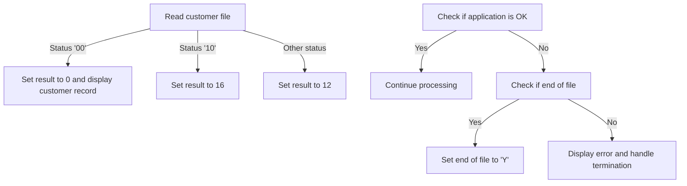
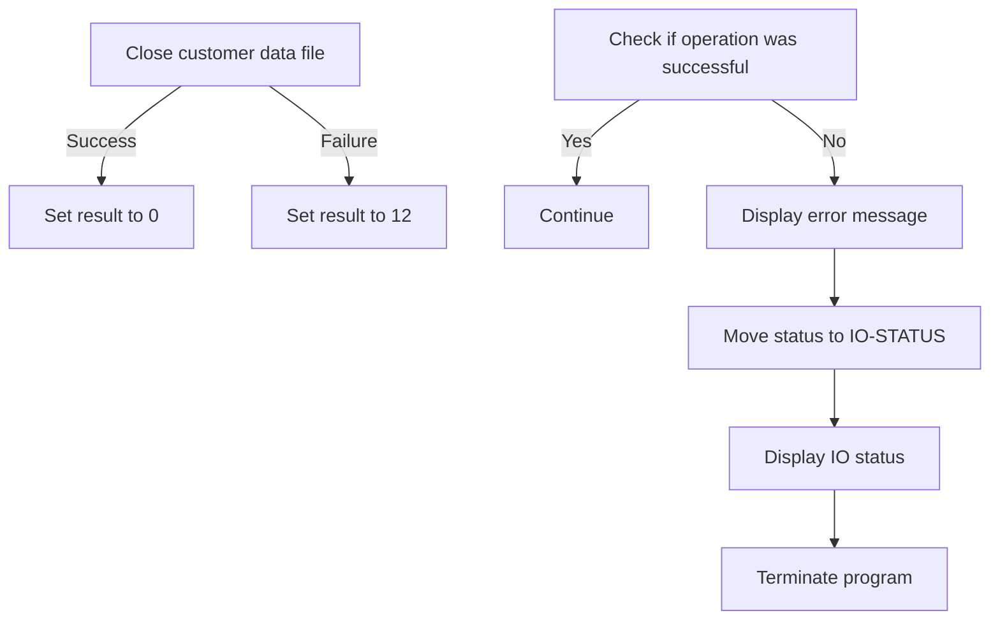

The <SwmToken path="app/cbl/CBCUS01C.cbl" pos="71:14:14" line-data="           DISPLAY &#39;START OF EXECUTION OF PROGRAM CBCUS01C&#39;.">`CBCUS01C`</SwmToken> program is a batch COBOL program designed to read and print customer data files. This program is initiated by the `READCUST` flow, which starts the process of reading customer data. The program opens the customer file, reads each customer record, displays the information, and then closes the file upon completion.

For example, when the program reads a customer record successfully, it displays the customer information. If the end of the file is reached, it sets the end-of-file indicator and terminates the process gracefully.

# Where is this program used?

This program is used once, in a flow starting from `READCUST` as represented in the following diagram:

```mermaid
graph TD
READCUST("READCUST") --> CBCUS01C("Reading and Printing Customer Data (CBCUS01C)"):::currentEntity
  classDef currentEntity color:#000000,fill:#7CB9F4

%% Swimm:
%% graph TD
%% READCUST("READCUST") --> <SwmToken path="app/cbl/CBCUS01C.cbl" pos="71:14:14" line-data="           DISPLAY &#39;START OF EXECUTION OF PROGRAM CBCUS01C&#39;.">`CBCUS01C`</SwmToken>("Reading and Printing Customer Data (<SwmToken path="app/cbl/CBCUS01C.cbl" pos="71:14:14" line-data="           DISPLAY &#39;START OF EXECUTION OF PROGRAM CBCUS01C&#39;.">`CBCUS01C`</SwmToken>)"):::currentEntity
%%   classDef currentEntity color:#000000,fill:#7CB9F4
```



# Read Customer Data (PROCEDURE-DIVISION)

<SwmSnippet path="/app/cbl/CBCUS01C.cbl" line="70">

---

### Starting the program

Going into the PROCEDURE-DIVISION, the program begins by displaying a message indicating the start of execution. It then opens the customer file to prepare for reading customer data.

```cobol
       PROCEDURE DIVISION.
           DISPLAY 'START OF EXECUTION OF PROGRAM CBCUS01C'.
           PERFORM 0000-CUSTFILE-OPEN.
```

---

</SwmSnippet>

<SwmSnippet path="/app/cbl/CBCUS01C.cbl" line="74">

---

### Reading customer data

Next, the program enters a loop that continues until the end of the file is reached. Within the loop, it checks if the end of the file has not been reached and then reads the next customer record. If a customer record is successfully read, it displays the customer information.

```cobol
           PERFORM UNTIL END-OF-FILE = 'Y'
               IF  END-OF-FILE = 'N'
                   PERFORM 1000-CUSTFILE-GET-NEXT
                   IF  END-OF-FILE = 'N'
                       DISPLAY CUSTOMER-RECORD 
                   END-IF
               END-IF
```

---

</SwmSnippet>

<SwmSnippet path="/app/cbl/CBCUS01C.cbl" line="81">

---

### Ending the program

Finally, the program closes the customer file, displays a message indicating the end of execution, and then terminates.

```cobol
           END-PERFORM.

           PERFORM 9000-CUSTFILE-CLOSE.

           DISPLAY 'END OF EXECUTION OF PROGRAM CBCUS01C'.

           GOBACK.
```

---

</SwmSnippet>

# Open Customer File (<SwmToken path="app/cbl/CBCUS01C.cbl" pos="72:3:7" line-data="           PERFORM 0000-CUSTFILE-OPEN.">`0000-CUSTFILE-OPEN`</SwmToken>)

<SwmSnippet path="/app/cbl/CBCUS01C.cbl" line="118">

---

Going into the <SwmToken path="app/cbl/CBCUS01C.cbl" pos="118:1:5" line-data="       0000-CUSTFILE-OPEN.">`0000-CUSTFILE-OPEN`</SwmToken> function, it starts by setting an initial result code to indicate a pending operation. The function then attempts to open the customer data file. If the file opens successfully, it updates the result code to indicate success. Otherwise, it sets the result code to indicate an error.

```cobol
       0000-CUSTFILE-OPEN.
           MOVE 8 TO APPL-RESULT.
           OPEN INPUT CUSTFILE-FILE
           IF  CUSTFILE-STATUS = '00'
               MOVE 0 TO APPL-RESULT
           ELSE
               MOVE 12 TO APPL-RESULT
           END-IF
```

---

</SwmSnippet>

<SwmSnippet path="/app/cbl/CBCUS01C.cbl" line="126">

---

Next, the function checks if the application is in a successful state. If it is, the function continues processing. If not, it displays an error message, logs the file operation status, and performs necessary termination routines to handle the error.

```cobol
           IF  APPL-AOK
               CONTINUE
           ELSE
               DISPLAY 'ERROR OPENING CUSTFILE'
               MOVE CUSTFILE-STATUS TO IO-STATUS
               PERFORM Z-DISPLAY-IO-STATUS
               PERFORM Z-ABEND-PROGRAM
           END-IF
           EXIT.
```

---

</SwmSnippet>

# Display File Status (<SwmToken path="app/cbl/CBCUS01C.cbl" pos="112:3:9" line-data="                   PERFORM Z-DISPLAY-IO-STATUS">`Z-DISPLAY-IO-STATUS`</SwmToken>)

<SwmSnippet path="/app/cbl/CBCUS01C.cbl" line="161">

---

Going into the <SwmToken path="app/cbl/CBCUS01C.cbl" pos="161:1:7" line-data="       Z-DISPLAY-IO-STATUS.">`Z-DISPLAY-IO-STATUS`</SwmToken> function, it first checks if the status of the file operation is not numeric or if the primary status code is '9'. If either condition is true, it updates the status display with specific values and displays the file status. If the conditions are not met, it sets the status display to '0000' and updates it with the current status, then displays the file status.

```cobol
       Z-DISPLAY-IO-STATUS.
           IF  IO-STATUS NOT NUMERIC
           OR  IO-STAT1 = '9'
               MOVE IO-STAT1 TO IO-STATUS-04(1:1)
               MOVE 0        TO TWO-BYTES-BINARY
               MOVE IO-STAT2 TO TWO-BYTES-RIGHT
               MOVE TWO-BYTES-BINARY TO IO-STATUS-0403
               DISPLAY 'FILE STATUS IS: NNNN' IO-STATUS-04 
           ELSE
               MOVE '0000' TO IO-STATUS-04
               MOVE IO-STATUS TO IO-STATUS-04(3:2)
               DISPLAY 'FILE STATUS IS: NNNN' IO-STATUS-04 
           END-IF
           EXIT.
```

---

</SwmSnippet>

# Read Next Customer Record (<SwmToken path="app/cbl/CBCUS01C.cbl" pos="76:3:9" line-data="                   PERFORM 1000-CUSTFILE-GET-NEXT">`1000-CUSTFILE-GET-NEXT`</SwmToken>)

Lets' zoom into the program flow:



<SwmSnippet path="/app/cbl/CBCUS01C.cbl" line="92">

---

### Reading customer file

Going into the first snippet, the code reads the customer file and checks the status of the read operation. If the status indicates a successful read, it sets the result to indicate success and displays the customer record. If the status indicates the end of the file, it sets the result to indicate the end of the file. For any other status, it sets the result to indicate an error.

```cobol
       1000-CUSTFILE-GET-NEXT.
           READ CUSTFILE-FILE INTO CUSTOMER-RECORD.
           IF  CUSTFILE-STATUS = '00'
               MOVE 0 TO APPL-RESULT
               DISPLAY CUSTOMER-RECORD 
           ELSE
               IF  CUSTFILE-STATUS = '10'
                   MOVE 16 TO APPL-RESULT
               ELSE
                   MOVE 12 TO APPL-RESULT
               END-IF
```

---

</SwmSnippet>

<SwmSnippet path="/app/cbl/CBCUS01C.cbl" line="103">

---

### Handling read results

Now, the second snippet checks if the application is in a successful state. If it is, the processing continues. If not, it checks if the end of the file has been reached. If the end of the file is reached, it sets the end-of-file indicator. Otherwise, it displays an error message, logs the status, and performs error handling routines.

```cobol
           END-IF
           IF  APPL-AOK
               CONTINUE
           ELSE
               IF  APPL-EOF
                   MOVE 'Y' TO END-OF-FILE
               ELSE
                   DISPLAY 'ERROR READING CUSTOMER FILE'
                   MOVE CUSTFILE-STATUS TO IO-STATUS
                   PERFORM Z-DISPLAY-IO-STATUS
                   PERFORM Z-ABEND-PROGRAM
               END-IF
           END-IF
           EXIT.
```

---

</SwmSnippet>

# Close Customer File (<SwmToken path="app/cbl/CBCUS01C.cbl" pos="83:3:7" line-data="           PERFORM 9000-CUSTFILE-CLOSE.">`9000-CUSTFILE-CLOSE`</SwmToken>)

Lets' zoom into the program flow:



<SwmSnippet path="/app/cbl/CBCUS01C.cbl" line="136">

---

### Closing the customer data file

Going into the <SwmToken path="app/cbl/CBCUS01C.cbl" pos="136:1:5" line-data="       9000-CUSTFILE-CLOSE.">`9000-CUSTFILE-CLOSE`</SwmToken> function, the first step is to close the customer data file. If the file closes successfully, the operation is considered successful. Otherwise, an error is indicated.

```cobol
       9000-CUSTFILE-CLOSE.
           ADD 8 TO ZERO GIVING APPL-RESULT.
           CLOSE CUSTFILE-FILE
           IF  CUSTFILE-STATUS = '00'
               SUBTRACT APPL-RESULT FROM APPL-RESULT
           ELSE
               ADD 12 TO ZERO GIVING APPL-RESULT
           END-IF
```

---

</SwmSnippet>

<SwmSnippet path="/app/cbl/CBCUS01C.cbl" line="144">

---

### Handling the file close result

Next, the function checks if the operation was successful. If it was, the process continues. If not, an error message is displayed, the status is recorded, and the program is terminated.

```cobol
           IF  APPL-AOK
               CONTINUE
           ELSE
               DISPLAY 'ERROR CLOSING CUSTOMER FILE'
               MOVE CUSTFILE-STATUS TO IO-STATUS
               PERFORM Z-DISPLAY-IO-STATUS
               PERFORM Z-ABEND-PROGRAM
           END-IF
           EXIT.
```

---

</SwmSnippet>

&nbsp;

*This is an auto-generated document by Swimm 🌊 and has not yet been verified by a human*

<SwmMeta version="3.0.0" repo-id="Z2l0aHViJTNBJTNBa3luZHJ5bC1hd3MtbWFpbmZyYW1lLW1vZGVybml6YXRpb24tY2FyZGRlbW8lM0ElM0FTd2ltbS1EZW1v" repo-name="kyndryl-aws-mainframe-modernization-carddemo"><sup>Powered by [Swimm](/)</sup></SwmMeta>
