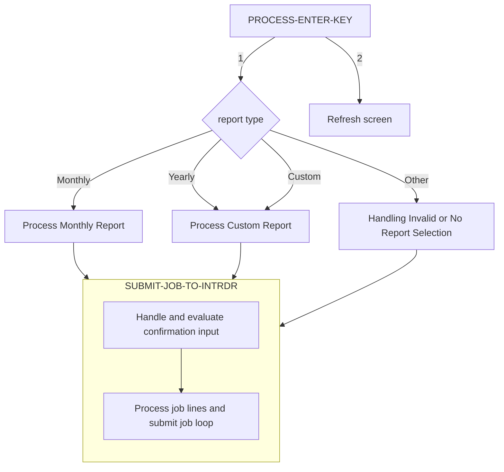

The document provides an explanation of the flow for processing transaction reports involves evaluating user input, submitting batch jobs, managing screen data, and transferring control between operations to print transaction reports.



## <SwmToken path="/app/cbl/CORPT00C.cbl" pos="186:3:7" line-data="                           PERFORM PROCESS-ENTER-KEY" repo-id="Z2l0aHViJTNBJTNBYXdzLW1haW5mcmFtZS1tb2Rlcm5pemF0aW9uLWNhcmRkZW1vJTNBJTNBU3dpbW0tRGVtbw==" repo-name="aws-mainframe-modernization-carddemo">`PROCESS-ENTER-KEY`</SwmToken>

The <SwmToken path="/app/cbl/CORPT00C.cbl" pos="186:3:7" line-data="                           PERFORM PROCESS-ENTER-KEY" repo-id="Z2l0aHViJTNBJTNBYXdzLW1haW5mcmFtZS1tb2Rlcm5pemF0aW9uLWNhcmRkZW1vJTNBJTNBU3dpbW0tRGVtbw==" repo-name="aws-mainframe-modernization-carddemo">`PROCESS-ENTER-KEY`</SwmToken> function is responsible for evaluating user input to determine the type of report to generate. It is either, monthly, yearly, or custom.

<SwmSnippet path="/app/cbl/CORPT00C.cbl" line="212" repo-id="Z2l0aHViJTNBJTNBYXdzLW1haW5mcmFtZS1tb2Rlcm5pemF0aW9uLWNhcmRkZW1vJTNBJTNBU3dpbW0tRGVtbw==">

---

If a monthly report is selected, the function sets the report name to 'Monthly' and initializes the start and end dates to cover the entire current month. It then calls the <SwmToken path="/app/cbl/CORPT00C.cbl" pos="435:3:9" line-data="                       PERFORM SUBMIT-JOB-TO-INTRDR" repo-id="Z2l0aHViJTNBJTNBYXdzLW1haW5mcmFtZS1tb2Rlcm5pemF0aW9uLWNhcmRkZW1vJTNBJTNBU3dpbW0tRGVtbw==" repo-name="aws-mainframe-modernization-carddemo">`SUBMIT-JOB-TO-INTRDR`</SwmToken> function to submit the batch job for printing the report.

```cobol
           EVALUATE TRUE
               WHEN MONTHLYI OF CORPT0AI NOT = SPACES AND LOW-VALUES
                   MOVE 'Monthly'   TO WS-REPORT-NAME
                   MOVE FUNCTION CURRENT-DATE  TO WS-CURDATE-DATA

                   MOVE WS-CURDATE-YEAR     TO WS-START-DATE-YYYY
                   MOVE WS-CURDATE-MONTH    TO WS-START-DATE-MM
                   MOVE '01'                TO WS-START-DATE-DD
                   MOVE WS-START-DATE       TO PARM-START-DATE-1
                                               PARM-START-DATE-2

                   MOVE 1              TO WS-CURDATE-DAY
                   ADD 1               TO WS-CURDATE-MONTH
                   IF WS-CURDATE-MONTH > 12
                       ADD 1           TO WS-CURDATE-YEAR
                       MOVE 1          TO WS-CURDATE-MONTH
                   END-IF
                   COMPUTE WS-CURDATE-N = FUNCTION DATE-OF-INTEGER(
                           FUNCTION INTEGER-OF-DATE(WS-CURDATE-N) - 1)

                   MOVE WS-CURDATE-YEAR     TO WS-END-DATE-YYYY
                   MOVE WS-CURDATE-MONTH    TO WS-END-DATE-MM
                   MOVE WS-CURDATE-DAY      TO WS-END-DATE-DD
                   MOVE WS-END-DATE         TO PARM-END-DATE-1
                                               PARM-END-DATE-2

                   PERFORM SUBMIT-JOB-TO-INTRDR
```

---

</SwmSnippet>

<SwmSnippet path="/app/cbl/CORPT00C.cbl" line="239" repo-id="Z2l0aHViJTNBJTNBYXdzLW1haW5mcmFtZS1tb2Rlcm5pemF0aW9uLWNhcmRkZW1vJTNBJTNBU3dpbW0tRGVtbw==">

---

If a yearly report is selected, the function sets the report name to 'Yearly' and initializes the start and end dates to cover the entire current year. It then calls the <SwmToken path="/app/cbl/CORPT00C.cbl" pos="435:3:9" line-data="                       PERFORM SUBMIT-JOB-TO-INTRDR" repo-id="Z2l0aHViJTNBJTNBYXdzLW1haW5mcmFtZS1tb2Rlcm5pemF0aW9uLWNhcmRkZW1vJTNBJTNBU3dpbW0tRGVtbw==" repo-name="aws-mainframe-modernization-carddemo">`SUBMIT-JOB-TO-INTRDR`</SwmToken> function to submit the batch job for printing the report.

```cobol
               WHEN YEARLYI OF CORPT0AI NOT = SPACES AND LOW-VALUES
                   MOVE 'Yearly'   TO WS-REPORT-NAME
                   MOVE FUNCTION CURRENT-DATE  TO WS-CURDATE-DATA

                   MOVE WS-CURDATE-YEAR     TO WS-START-DATE-YYYY
                                               WS-END-DATE-YYYY
                   MOVE '01'                TO WS-START-DATE-MM
                                               WS-START-DATE-DD
                   MOVE WS-START-DATE       TO PARM-START-DATE-1
                                               PARM-START-DATE-2

                   MOVE '12'                TO WS-END-DATE-MM
                   MOVE '31'                TO WS-END-DATE-DD
                   MOVE WS-END-DATE         TO PARM-END-DATE-1
                                               PARM-END-DATE-2

                   PERFORM SUBMIT-JOB-TO-INTRDR
```

---

</SwmSnippet>

<SwmSnippet path="/app/cbl/CORPT00C.cbl" line="256" repo-id="Z2l0aHViJTNBJTNBYXdzLW1haW5mcmFtZS1tb2Rlcm5pemF0aW9uLWNhcmRkZW1vJTNBJTNBU3dpbW0tRGVtbw==">

---

For a custom report, the function performs a series of validations on the user-provided start and end dates. If all validations pass, it sets the report name to 'Custom' and calls the <SwmToken path="/app/cbl/CORPT00C.cbl" pos="435:3:9" line-data="                       PERFORM SUBMIT-JOB-TO-INTRDR" repo-id="Z2l0aHViJTNBJTNBYXdzLW1haW5mcmFtZS1tb2Rlcm5pemF0aW9uLWNhcmRkZW1vJTNBJTNBU3dpbW0tRGVtbw==" repo-name="aws-mainframe-modernization-carddemo">`SUBMIT-JOB-TO-INTRDR`</SwmToken> function to submit the batch job.

```cobol
               WHEN CUSTOMI OF CORPT0AI NOT = SPACES AND LOW-VALUES

                   EVALUATE TRUE
                       WHEN SDTMMI OF CORPT0AI = SPACES OR
                                                   LOW-VALUES
                           MOVE 'Start Date - Month can NOT be empty...'
                             TO WS-MESSAGE
                           MOVE 'Y'     TO WS-ERR-FLG
                           MOVE -1       TO SDTMML OF CORPT0AI
                           PERFORM SEND-TRNRPT-SCREEN
                       WHEN SDTDDI OF CORPT0AI = SPACES OR
                                                   LOW-VALUES
                           MOVE 'Start Date - Day can NOT be empty...'
                             TO WS-MESSAGE
                           MOVE 'Y'     TO WS-ERR-FLG
                           MOVE -1       TO SDTDDL OF CORPT0AI
                           PERFORM SEND-TRNRPT-SCREEN
                       WHEN SDTYYYYI OF CORPT0AI = SPACES OR
                                                   LOW-VALUES
                           MOVE 'Start Date - Year can NOT be empty...'
                             TO WS-MESSAGE
                           MOVE 'Y'     TO WS-ERR-FLG
                           MOVE -1       TO SDTYYYYL OF CORPT0AI
                           PERFORM SEND-TRNRPT-SCREEN
                       WHEN EDTMMI OF CORPT0AI = SPACES OR
                                                   LOW-VALUES
                           MOVE 'End Date - Month can NOT be empty...'
                             TO WS-MESSAGE
                           MOVE 'Y'     TO WS-ERR-FLG
                           MOVE -1       TO EDTMML OF CORPT0AI
                           PERFORM SEND-TRNRPT-SCREEN
                       WHEN EDTDDI OF CORPT0AI = SPACES OR
                                                   LOW-VALUES
                           MOVE 'End Date - Day can NOT be empty...'
                             TO WS-MESSAGE
                           MOVE 'Y'     TO WS-ERR-FLG
                           MOVE -1       TO EDTDDL OF CORPT0AI
                           PERFORM SEND-TRNRPT-SCREEN
                       WHEN EDTYYYYI OF CORPT0AI = SPACES OR
                                                   LOW-VALUES
                           MOVE 'End Date - Year can NOT be empty...'
                             TO WS-MESSAGE
                           MOVE 'Y'     TO WS-ERR-FLG
                           MOVE -1       TO EDTYYYYL OF CORPT0AI
                           PERFORM SEND-TRNRPT-SCREEN
                       WHEN OTHER
                           CONTINUE
                   END-EVALUATE

                   COMPUTE WS-NUM-99 = FUNCTION NUMVAL-C
                                         (SDTMMI OF CORPT0AI)
                   MOVE WS-NUM-99      TO SDTMMI OF CORPT0AI

                   COMPUTE WS-NUM-99 = FUNCTION NUMVAL-C
                                         (SDTDDI OF CORPT0AI)
                   MOVE WS-NUM-99      TO SDTDDI OF CORPT0AI

                   COMPUTE WS-NUM-9999 = FUNCTION NUMVAL-C
                                           (SDTYYYYI OF CORPT0AI)
                   MOVE WS-NUM-9999      TO SDTYYYYI OF CORPT0AI

                   COMPUTE WS-NUM-99 = FUNCTION NUMVAL-C
                                         (EDTMMI OF CORPT0AI)
                   MOVE WS-NUM-99      TO EDTMMI OF CORPT0AI

                   COMPUTE WS-NUM-99 = FUNCTION NUMVAL-C
                                         (EDTDDI OF CORPT0AI)
                   MOVE WS-NUM-99      TO EDTDDI OF CORPT0AI

                   COMPUTE WS-NUM-9999 = FUNCTION NUMVAL-C
                                           (EDTYYYYI OF CORPT0AI)
                   MOVE WS-NUM-9999      TO EDTYYYYI OF CORPT0AI

                   IF SDTMMI OF CORPT0AI IS NOT NUMERIC OR
                      SDTMMI OF CORPT0AI > '12'
                       MOVE 'Start Date - Not a valid Month...'
                         TO WS-MESSAGE
                       MOVE 'Y'     TO WS-ERR-FLG
                       MOVE -1       TO SDTMML OF CORPT0AI
                       PERFORM SEND-TRNRPT-SCREEN
                   END-IF

                   IF SDTDDI OF CORPT0AI IS NOT NUMERIC OR
                      SDTDDI OF CORPT0AI > '31'
                       MOVE 'Start Date - Not a valid Day...'
                         TO WS-MESSAGE
                       MOVE 'Y'     TO WS-ERR-FLG
                       MOVE -1       TO SDTDDL OF CORPT0AI
                       PERFORM SEND-TRNRPT-SCREEN
                   END-IF

                   IF SDTYYYYI OF CORPT0AI IS NOT NUMERIC
                       MOVE 'Start Date - Not a valid Year...'
                         TO WS-MESSAGE
                       MOVE 'Y'     TO WS-ERR-FLG
                       MOVE -1       TO SDTYYYYL OF CORPT0AI
                       PERFORM SEND-TRNRPT-SCREEN
                   END-IF

                   IF EDTMMI OF CORPT0AI IS NOT NUMERIC OR
                      EDTMMI OF CORPT0AI > '12'
                       MOVE 'End Date - Not a valid Month...'
                         TO WS-MESSAGE
                       MOVE 'Y'     TO WS-ERR-FLG
                       MOVE -1       TO EDTMML OF CORPT0AI
                       PERFORM SEND-TRNRPT-SCREEN
                   END-IF

                   IF EDTDDI OF CORPT0AI IS NOT NUMERIC OR
                      EDTDDI OF CORPT0AI > '31'
                       MOVE 'End Date - Not a valid Day...'
                         TO WS-MESSAGE
                       MOVE 'Y'     TO WS-ERR-FLG
                       MOVE -1       TO EDTDDL OF CORPT0AI
                       PERFORM SEND-TRNRPT-SCREEN
                   END-IF

                   IF EDTYYYYI OF CORPT0AI IS NOT NUMERIC
                       MOVE 'End Date - Not a valid Year...'
                         TO WS-MESSAGE
                       MOVE 'Y'     TO WS-ERR-FLG
                       MOVE -1       TO EDTYYYYL OF CORPT0AI
                       PERFORM SEND-TRNRPT-SCREEN
                   END-IF

                   MOVE SDTYYYYI OF CORPT0AI TO WS-START-DATE-YYYY
                   MOVE SDTMMI   OF CORPT0AI TO WS-START-DATE-MM
                   MOVE SDTDDI   OF CORPT0AI TO WS-START-DATE-DD
                   MOVE EDTYYYYI OF CORPT0AI TO WS-END-DATE-YYYY
                   MOVE EDTMMI   OF CORPT0AI TO WS-END-DATE-MM
                   MOVE EDTDDI   OF CORPT0AI TO WS-END-DATE-DD

                   MOVE WS-START-DATE        TO CSUTLDTC-DATE
                   MOVE WS-DATE-FORMAT       TO CSUTLDTC-DATE-FORMAT
                   MOVE SPACES               TO CSUTLDTC-RESULT

                   CALL 'CSUTLDTC' USING   CSUTLDTC-DATE
                                           CSUTLDTC-DATE-FORMAT
                                           CSUTLDTC-RESULT

                   IF CSUTLDTC-RESULT-SEV-CD = '0000'
                       CONTINUE
                   ELSE
                       IF CSUTLDTC-RESULT-MSG-NUM NOT = '2513'
                           MOVE 'Start Date - Not a valid date...'
                             TO WS-MESSAGE
                           MOVE 'Y'     TO WS-ERR-FLG
                           MOVE -1       TO SDTMML OF CORPT0AI
                           PERFORM SEND-TRNRPT-SCREEN
                       END-IF
                   END-IF

                   MOVE WS-END-DATE          TO CSUTLDTC-DATE
                   MOVE WS-DATE-FORMAT       TO CSUTLDTC-DATE-FORMAT
                   MOVE SPACES               TO CSUTLDTC-RESULT

                   CALL 'CSUTLDTC' USING   CSUTLDTC-DATE
                                           CSUTLDTC-DATE-FORMAT
                                           CSUTLDTC-RESULT

                   IF CSUTLDTC-RESULT-SEV-CD = '0000'
                       CONTINUE
                   ELSE
                       IF CSUTLDTC-RESULT-MSG-NUM NOT = '2513'
                           MOVE 'End Date - Not a valid date...'
                             TO WS-MESSAGE
                           MOVE 'Y'     TO WS-ERR-FLG
                           MOVE -1       TO EDTMML OF CORPT0AI
                           PERFORM SEND-TRNRPT-SCREEN
                       END-IF
                   END-IF


                   MOVE WS-START-DATE       TO PARM-START-DATE-1
                                               PARM-START-DATE-2
                   MOVE WS-END-DATE         TO PARM-END-DATE-1
                                               PARM-END-DATE-2
                   MOVE 'Custom'   TO WS-REPORT-NAME
                   IF NOT ERR-FLG-ON
                       PERFORM SUBMIT-JOB-TO-INTRDR
                   END-IF
```

---

</SwmSnippet>

<SwmSnippet path="/app/cbl/CORPT00C.cbl" line="437" repo-id="Z2l0aHViJTNBJTNBYXdzLW1haW5mcmFtZS1tb2Rlcm5pemF0aW9uLWNhcmRkZW1vJTNBJTNBU3dpbW0tRGVtbw==">

---

If no valid report type is selected, the function sets an error message prompting the user to select a report type and performs a screen refresh to display the message.

```cobol
               WHEN OTHER
                   MOVE 'Select a report type to print report...' TO
                                   WS-MESSAGE
                   MOVE 'Y'     TO WS-ERR-FLG
                   MOVE -1       TO MONTHLYL OF CORPT0AI
                   PERFORM SEND-TRNRPT-SCREEN
           END-EVALUATE

           IF NOT ERR-FLG-ON

               PERFORM INITIALIZE-ALL-FIELDS
               MOVE DFHGREEN           TO ERRMSGC  OF CORPT0AO
               STRING WS-REPORT-NAME   DELIMITED BY SPACE
                 ' report submitted for printing ...'
                                       DELIMITED BY SIZE
                 INTO WS-MESSAGE
               MOVE -1       TO MONTHLYL OF CORPT0AI
               PERFORM SEND-TRNRPT-SCREEN

```

---

</SwmSnippet>

<SwmSnippet path="/app/cbl/CORPT00C.cbl" line="445" repo-id="Z2l0aHViJTNBJTNBYXdzLW1haW5mcmFtZS1tb2Rlcm5pemF0aW9uLWNhcmRkZW1vJTNBJTNBU3dpbW0tRGVtbw==">

---

Finally, if no errors are detected, the function performs a screen refresh to indicate that the report has been submitted for printing.

```cobol
           IF NOT ERR-FLG-ON

               PERFORM INITIALIZE-ALL-FIELDS
               MOVE DFHGREEN           TO ERRMSGC  OF CORPT0AO
               STRING WS-REPORT-NAME   DELIMITED BY SPACE
                 ' report submitted for printing ...'
                                       DELIMITED BY SIZE
                 INTO WS-MESSAGE
               MOVE -1       TO MONTHLYL OF CORPT0AI
               PERFORM SEND-TRNRPT-SCREEN

           END-IF.
```

---

</SwmSnippet>

## <SwmToken path="/app/cbl/CORPT00C.cbl" pos="238:3:9" line-data="                   PERFORM SUBMIT-JOB-TO-INTRDR" repo-id="Z2l0aHViJTNBJTNBYXdzLW1haW5mcmFtZS1tb2Rlcm5pemF0aW9uLWNhcmRkZW1vJTNBJTNBU3dpbW0tRGVtbw==" repo-name="aws-mainframe-modernization-carddemo">`SUBMIT-JOB-TO-INTRDR`</SwmToken>

The <SwmToken path="/app/cbl/CORPT00C.cbl" pos="435:3:9" line-data="                       PERFORM SUBMIT-JOB-TO-INTRDR" repo-id="Z2l0aHViJTNBJTNBYXdzLW1haW5mcmFtZS1tb2Rlcm5pemF0aW9uLWNhcmRkZW1vJTNBJTNBU3dpbW0tRGVtbw==" repo-name="aws-mainframe-modernization-carddemo">`SUBMIT-JOB-TO-INTRDR`</SwmToken> function is called by <SwmToken path="/app/cbl/CORPT00C.cbl" pos="186:3:7" line-data="                           PERFORM PROCESS-ENTER-KEY" repo-id="Z2l0aHViJTNBJTNBYXdzLW1haW5mcmFtZS1tb2Rlcm5pemF0aW9uLWNhcmRkZW1vJTNBJTNBU3dpbW0tRGVtbw==" repo-name="aws-mainframe-modernization-carddemo">`PROCESS-ENTER-KEY`</SwmToken> to handle the actual submission of the batch job.&nbsp;

<SwmSnippet path="/app/cbl/CORPT00C.cbl" line="464" repo-id="Z2l0aHViJTNBJTNBYXdzLW1haW5mcmFtZS1tb2Rlcm5pemF0aW9uLWNhcmRkZW1vJTNBJTNBU3dpbW0tRGVtbw==">

---

It begins by evaluating the user's confirmation input to ensure that the user has confirmed the report submission.

```cobol
           IF CONFIRMI OF CORPT0AI = SPACES OR LOW-VALUES
               STRING
                 'Please confirm to print the '
                                   DELIMITED BY SIZE
                 WS-REPORT-NAME    DELIMITED BY SPACE
                 ' report...'      DELIMITED BY SIZE
                 INTO WS-MESSAGE
               MOVE 'Y'     TO WS-ERR-FLG
               MOVE -1       TO CONFIRML OF CORPT0AI
               PERFORM SEND-TRNRPT-SCREEN
           END-IF

           IF NOT ERR-FLG-ON
               EVALUATE TRUE
                   WHEN CONFIRMI OF CORPT0AI = 'Y' OR 'y'
                       CONTINUE
                   WHEN CONFIRMI OF CORPT0AI = 'N' OR 'n'
                       PERFORM INITIALIZE-ALL-FIELDS
                       MOVE 'Y'     TO WS-ERR-FLG
                       PERFORM SEND-TRNRPT-SCREEN
                   WHEN OTHER
                       STRING
                         '"'               DELIMITED BY SIZE
                         CONFIRMI OF CORPT0AI    DELIMITED BY SPACE
                         '" is not a valid value to confirm...'
                                           DELIMITED BY SIZE
                         INTO WS-MESSAGE
                       MOVE 'Y'     TO WS-ERR-FLG
                       MOVE -1       TO CONFIRML OF CORPT0AI
                       PERFORM SEND-TRNRPT-SCREEN
               END-EVALUATE
```

---

</SwmSnippet>

<SwmSnippet path="/app/cbl/CORPT00C.cbl" line="496" repo-id="Z2l0aHViJTNBJTNBYXdzLW1haW5mcmFtZS1tb2Rlcm5pemF0aW9uLWNhcmRkZW1vJTNBJTNBU3dpbW0tRGVtbw==">

---

If the confirmation input is valid and no errors are detected, the function proceeds to process the job lines. It loops through the job lines, checking for specific end conditions such as the end-of-file marker or empty lines. Each job line is processed and passed to <SwmToken path="/app/cbl/CORPT00C.cbl" pos="507:3:7" line-data="                   PERFORM WIRTE-JOBSUB-TDQ" repo-id="Z2l0aHViJTNBJTNBYXdzLW1haW5mcmFtZS1tb2Rlcm5pemF0aW9uLWNhcmRkZW1vJTNBJTNBU3dpbW0tRGVtbw==" repo-name="aws-mainframe-modernization-carddemo">`WIRTE-JOBSUB-TDQ`</SwmToken> which is responsible for writing each line of the JCL to a CICS Transient Data Queue.

```cobol
               SET END-LOOP-NO TO TRUE

               PERFORM VARYING WS-IDX FROM 1 BY 1 UNTIL WS-IDX > 1000 OR
                                      END-LOOP-YES  OR ERR-FLG-ON

                   MOVE JOB-LINES(WS-IDX) TO JCL-RECORD
                   IF JCL-RECORD = '/*EOF' OR
                      JCL-RECORD = SPACES OR LOW-VALUES
                       SET END-LOOP-YES TO TRUE
                   END-IF

                   PERFORM WIRTE-JOBSUB-TDQ
               END-PERFORM
```

---

</SwmSnippet>

&nbsp;

_This is an auto-generated document by Swimm 🌊 and has not yet been verified by a human_

<SwmMeta version="3.0.0"><sup>Powered by [Swimm](https://staging.swimm.cloud/)</sup></SwmMeta>
