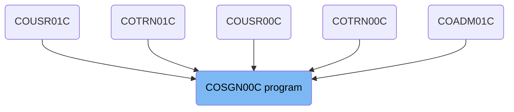
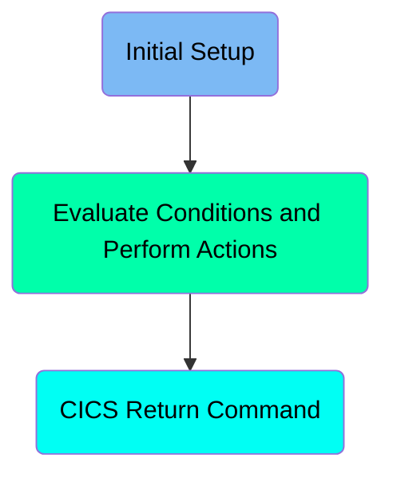
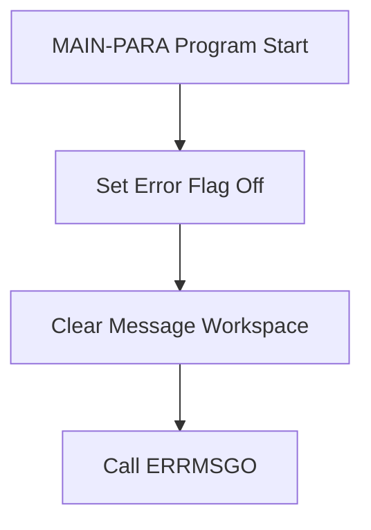
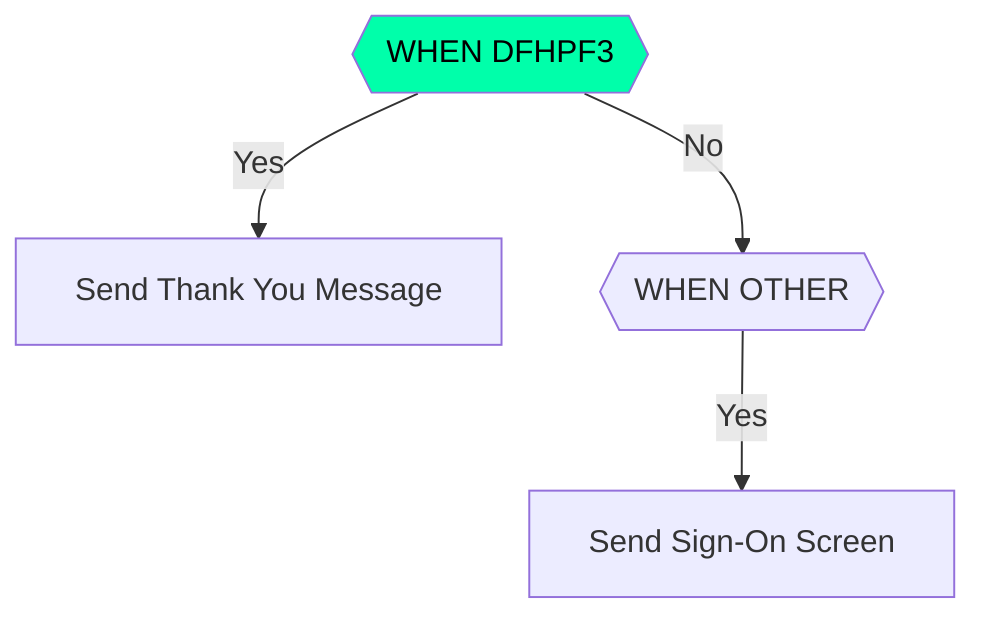
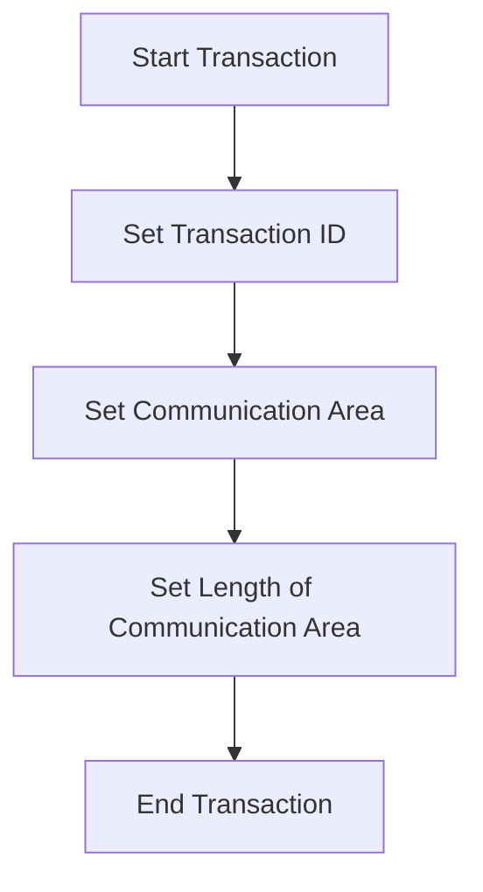

The <SwmToken path="app/cbl/COSGN00C.cbl" pos="2:7:7" line-data="      * Program     : COSGN00C.CBL">`COSGN00C`</SwmToken> program is used for handling user sign-on processes in the <SwmToken path="app/cbl/COSGN00C.cbl" pos="3:7:7" line-data="      * Application : CardDemo">`CardDemo`</SwmToken> application. It ensures proper user authentication by evaluating user inputs and performing necessary actions based on the input received. The program initializes necessary variables, evaluates user actions, and sends appropriate responses or error messages.

The flow starts with the initial setup where error flags are cleared and the message workspace is prepared. Then, user inputs are evaluated to determine the action to be taken, such as sending a thank you message or displaying the sign-on screen. Finally, the program sends the appropriate response to the user and ends the transaction.

# Where is this program used?

This program is used multiple times in the codebase as represented in the following diagram:

(Note - these are only some of the usages of this flow)



Here is a high level diagram of the program:



# Initial Setup



<SwmSnippet path="/app/cbl/COSGN00C.cbl" line="75">

---

## Set Error Flag Off

First, the error flag is set to off. This ensures that any previous error states are cleared and the program starts with a clean slate.

```cobol
           SET ERR-FLG-OFF TO TRUE
```

---

</SwmSnippet>

<SwmSnippet path="/app/cbl/COSGN00C.cbl" line="77">

---

## Clear Message Workspace

Next, the message workspace is cleared by moving spaces to <SwmToken path="app/cbl/COSGN00C.cbl" pos="77:7:9" line-data="           MOVE SPACES TO WS-MESSAGE">`WS-MESSAGE`</SwmToken>. This prepares the workspace for any new messages that need to be displayed to the user.

```cobol
           MOVE SPACES TO WS-MESSAGE
```

---

</SwmSnippet>

<SwmSnippet path="/app/cbl/COSGN00C.cbl" line="78">

---

## Call ERRMSGO

Then, the <SwmToken path="app/cbl/COSGN00C.cbl" pos="78:1:1" line-data="                          ERRMSGO OF COSGN0AO">`ERRMSGO`</SwmToken> function of <SwmToken path="app/cbl/COSGN00C.cbl" pos="78:5:5" line-data="                          ERRMSGO OF COSGN0AO">`COSGN0AO`</SwmToken> is called. This function likely handles any error messages that need to be displayed or logged.

```cobol
                          ERRMSGO OF COSGN0AO
```

---

</SwmSnippet>

# Evaluate Conditions and Perform Actions



<SwmSnippet path="/app/cbl/COSGN00C.cbl" line="81">

---

## Handling User Input

First, the code initializes <SwmToken path="app/cbl/COSGN00C.cbl" pos="81:9:9" line-data="               MOVE LOW-VALUES TO COSGN0AO">`COSGN0AO`</SwmToken> to low values and sets <SwmToken path="app/cbl/COSGN00C.cbl" pos="82:8:8" line-data="               MOVE -1       TO USERIDL OF COSGN0AI">`USERIDL`</SwmToken> of <SwmToken path="app/cbl/COSGN00C.cbl" pos="82:12:12" line-data="               MOVE -1       TO USERIDL OF COSGN0AI">`COSGN0AI`</SwmToken> to -1. This prepares the environment for the next operations. Then, it evaluates the <SwmToken path="app/cbl/COSGN00C.cbl" pos="85:3:3" line-data="               EVALUATE EIBAID">`EIBAID`</SwmToken> to determine which key was pressed by the user.

```cobol
               MOVE LOW-VALUES TO COSGN0AO
               MOVE -1       TO USERIDL OF COSGN0AI
               PERFORM SEND-SIGNON-SCREEN
           ELSE
               EVALUATE EIBAID
                   WHEN DFHENTER
                       PERFORM PROCESS-ENTER-KEY
                   WHEN DFHPF3
                       MOVE CCDA-MSG-THANK-YOU        TO WS-MESSAGE
                       PERFORM SEND-PLAIN-TEXT
                   WHEN OTHER
                       MOVE 'Y'                       TO WS-ERR-FLG
                       MOVE CCDA-MSG-INVALID-KEY      TO WS-MESSAGE
                       PERFORM SEND-SIGNON-SCREEN
               END-EVALUATE
           END-IF.

```

---

</SwmSnippet>

<SwmSnippet path="/app/cbl/COSGN00C.cbl" line="145">

---

### Sending Sign-On Screen

If the <SwmToken path="app/cbl/COSGN00C.cbl" pos="85:3:3" line-data="               EVALUATE EIBAID">`EIBAID`</SwmToken> is <SwmToken path="app/cbl/COSGN00C.cbl" pos="86:3:3" line-data="                   WHEN DFHENTER">`DFHENTER`</SwmToken>, the code performs the <SwmToken path="app/cbl/COSGN00C.cbl" pos="87:3:7" line-data="                       PERFORM PROCESS-ENTER-KEY">`PROCESS-ENTER-KEY`</SwmToken> operation. If the <SwmToken path="app/cbl/COSGN00C.cbl" pos="85:3:3" line-data="               EVALUATE EIBAID">`EIBAID`</SwmToken> is <SwmToken path="app/cbl/COSGN00C.cbl" pos="88:3:3" line-data="                   WHEN DFHPF3">`DFHPF3`</SwmToken>, it moves the message <SwmToken path="app/cbl/COSGN00C.cbl" pos="89:3:9" line-data="                       MOVE CCDA-MSG-THANK-YOU        TO WS-MESSAGE">`CCDA-MSG-THANK-YOU`</SwmToken> to <SwmToken path="app/cbl/COSGN00C.cbl" pos="149:3:5" line-data="           MOVE WS-MESSAGE TO ERRMSGO OF COSGN0AO">`WS-MESSAGE`</SwmToken> and performs the <SwmToken path="app/cbl/COSGN00C.cbl" pos="90:3:7" line-data="                       PERFORM SEND-PLAIN-TEXT">`SEND-PLAIN-TEXT`</SwmToken> operation. For any other key, it sets the error flag <SwmToken path="app/cbl/COSGN00C.cbl" pos="92:9:13" line-data="                       MOVE &#39;Y&#39;                       TO WS-ERR-FLG">`WS-ERR-FLG`</SwmToken> to 'Y', moves the message <SwmToken path="app/cbl/COSGN00C.cbl" pos="93:3:9" line-data="                       MOVE CCDA-MSG-INVALID-KEY      TO WS-MESSAGE">`CCDA-MSG-INVALID-KEY`</SwmToken> to <SwmToken path="app/cbl/COSGN00C.cbl" pos="149:3:5" line-data="           MOVE WS-MESSAGE TO ERRMSGO OF COSGN0AO">`WS-MESSAGE`</SwmToken>, and performs the <SwmToken path="app/cbl/COSGN00C.cbl" pos="145:1:5" line-data="       SEND-SIGNON-SCREEN.">`SEND-SIGNON-SCREEN`</SwmToken> operation.

```cobol
       SEND-SIGNON-SCREEN.

           PERFORM POPULATE-HEADER-INFO

           MOVE WS-MESSAGE TO ERRMSGO OF COSGN0AO

           EXEC CICS SEND
                     MAP('COSGN0A')
                     MAPSET('COSGN00')
                     FROM(COSGN0AO)
                     ERASE
                     CURSOR
           END-EXEC.
```

---

</SwmSnippet>

<SwmSnippet path="/app/cbl/COSGN00C.cbl" line="162">

---

### Sending Plain Text

The <SwmToken path="app/cbl/COSGN00C.cbl" pos="162:1:5" line-data="       SEND-PLAIN-TEXT.">`SEND-PLAIN-TEXT`</SwmToken> function sends a plain text message to the user. It uses the <SwmToken path="app/cbl/COSGN00C.cbl" pos="165:3:5" line-data="                     FROM(WS-MESSAGE)">`WS-MESSAGE`</SwmToken> variable to determine the content of the message and sends it using the CICS <SwmToken path="app/cbl/COSGN00C.cbl" pos="164:5:7" line-data="           EXEC CICS SEND TEXT">`SEND TEXT`</SwmToken> command.

```cobol
       SEND-PLAIN-TEXT.

           EXEC CICS SEND TEXT
                     FROM(WS-MESSAGE)
                     LENGTH(LENGTH OF WS-MESSAGE)
                     ERASE
                     FREEKB
           END-EXEC.

           EXEC CICS RETURN
           END-EXEC.
```

---

</SwmSnippet>

# CICS Return Command

This is the next section of the flow.



<SwmSnippet path="/app/cbl/COSGN00C.cbl" line="99">

---

## Start Transaction

First, the transaction is started by setting the transaction ID using <SwmToken path="app/cbl/COSGN00C.cbl" pos="99:1:1" line-data="                     TRANSID (WS-TRANID)">`TRANSID`</SwmToken>.

```cobol
                     TRANSID (WS-TRANID)
```

---

</SwmSnippet>

<SwmSnippet path="/app/cbl/COSGN00C.cbl" line="99">

---

## Set Transaction ID

The transaction ID is set to <SwmToken path="app/cbl/COSGN00C.cbl" pos="99:4:6" line-data="                     TRANSID (WS-TRANID)">`WS-TRANID`</SwmToken>, which identifies the specific transaction being processed.

```cobol
                     TRANSID (WS-TRANID)
```

---

</SwmSnippet>

<SwmSnippet path="/app/cbl/COSGN00C.cbl" line="100">

---

## Set Communication Area

Next, the communication area is set using <SwmToken path="app/cbl/COSGN00C.cbl" pos="100:1:1" line-data="                     COMMAREA (CARDDEMO-COMMAREA)">`COMMAREA`</SwmToken> to <SwmToken path="app/cbl/COSGN00C.cbl" pos="100:4:6" line-data="                     COMMAREA (CARDDEMO-COMMAREA)">`CARDDEMO-COMMAREA`</SwmToken>, which holds the data for the transaction.

```cobol
                     COMMAREA (CARDDEMO-COMMAREA)
```

---

</SwmSnippet>

<SwmSnippet path="/app/cbl/COSGN00C.cbl" line="101">

---

## Set Length of Communication Area

Then, the length of the communication area is set using <SwmToken path="app/cbl/COSGN00C.cbl" pos="101:1:1" line-data="                     LENGTH(LENGTH OF CARDDEMO-COMMAREA)">`LENGTH`</SwmToken> to the length of <SwmToken path="app/cbl/COSGN00C.cbl" pos="101:7:9" line-data="                     LENGTH(LENGTH OF CARDDEMO-COMMAREA)">`CARDDEMO-COMMAREA`</SwmToken>.

```cobol
                     LENGTH(LENGTH OF CARDDEMO-COMMAREA)
```

---

</SwmSnippet>

<SwmSnippet path="/app/cbl/COSGN00C.cbl" line="102">

---

## End Transaction

Finally, the transaction is ended with <SwmToken path="app/cbl/COSGN00C.cbl" pos="102:1:3" line-data="           END-EXEC.">`END-EXEC`</SwmToken>.

```cobol
           END-EXEC.
```

---

</SwmSnippet>

&nbsp;

*This is an auto-generated document by Swimm 🌊 and has not yet been verified by a human*

<SwmMeta version="3.0.0" repo-id="Z2l0aHViJTNBJTNBa3luZHJ5bC1hd3MtbWFpbmZyYW1lLW1vZGVybml6YXRpb24tY2FyZGRlbW8lM0ElM0FTd2ltbS1EZW1v" repo-name="kyndryl-aws-mainframe-modernization-carddemo"><sup>Powered by [Swimm](/)</sup></SwmMeta>
