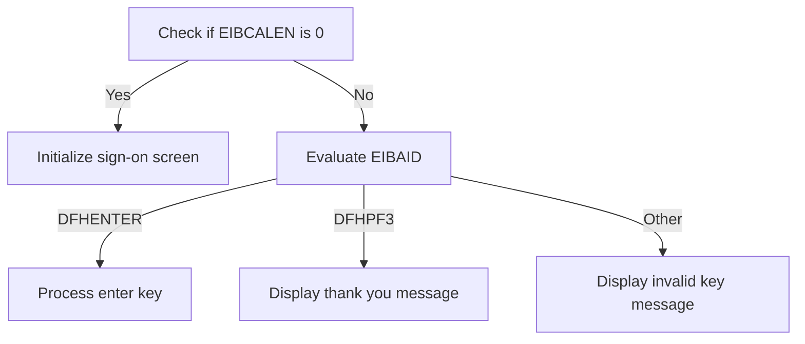
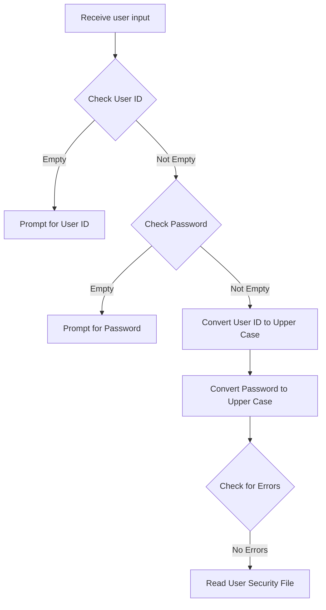
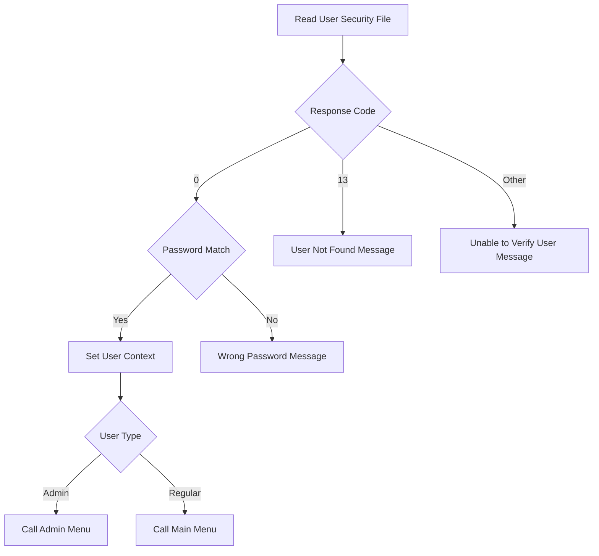

The document describes the operations of the sign-on screen in the <SwmToken path="app/cbl/COSGN00C.cbl" pos="3:7:7" line-data="      * Application : CardDemo">`CardDemo`</SwmToken> application, specifically handled by the <SwmToken path="app/cbl/COSGN00C.cbl" pos="2:7:7" line-data="      * Program     : COSGN00C.CBL">`COSGN00C`</SwmToken> program. This program ensures that users can sign on to the application by validating their credentials and displaying appropriate messages based on their input. The flow begins by checking if the communication area length is zero to initialize a new session or evaluate the user's action based on the key pressed.

For instance, if the user presses the enter key, the program processes the sign-on by validating the user ID and password. If the PF3 key is pressed, it displays a thank you message. For any other key, it displays an invalid key message, prompting the user to try again.

# Signon Screen Operations (<SwmToken path="app/cbl/COSGN00C.cbl" pos="73:1:3" line-data="       MAIN-PARA.">`MAIN-PARA`</SwmToken>)

Lets' zoom into the program flow:



<SwmSnippet path="/app/cbl/COSGN00C.cbl" line="73">

---

### Handling user sign-on and screen display

Going into the <SwmToken path="app/cbl/COSGN00C.cbl" pos="73:1:3" line-data="       MAIN-PARA.">`MAIN-PARA`</SwmToken> function, it starts by ensuring there are no error conditions and clearing any previous messages. It checks if the communication area length is zero, which indicates a new session, and initializes the sign-on screen with default values. If the communication area length is not zero, it evaluates the user's action based on the key pressed. If the enter key is pressed, it processes the sign-on by validating the user ID and password. If the PF3 key is pressed, it displays a thank you message to the user. For any other key, it sets an error flag and displays an invalid key message, prompting the user to try again.

```cobol
       MAIN-PARA.

           SET ERR-FLG-OFF TO TRUE

           MOVE SPACES TO WS-MESSAGE
                          ERRMSGO OF COSGN0AO

           IF EIBCALEN = 0
               MOVE LOW-VALUES TO COSGN0AO
               MOVE -1       TO USERIDL OF COSGN0AI
               PERFORM SEND-SIGNON-SCREEN
           ELSE
               EVALUATE EIBAID
                   WHEN DFHENTER
                       PERFORM PROCESS-ENTER-KEY
                   WHEN DFHPF3
                       MOVE CCDA-MSG-THANK-YOU        TO WS-MESSAGE
                       PERFORM SEND-PLAIN-TEXT
                   WHEN OTHER
                       MOVE 'Y'                       TO WS-ERR-FLG
                       MOVE CCDA-MSG-INVALID-KEY      TO WS-MESSAGE
                       PERFORM SEND-SIGNON-SCREEN
               END-EVALUATE
           END-IF.
```

---

</SwmSnippet>

<SwmSnippet path="/app/cbl/COSGN00C.cbl" line="98">

---

### Returning control to CICS

Next, the <SwmToken path="app/cbl/COSGN00C.cbl" pos="73:1:3" line-data="       MAIN-PARA.">`MAIN-PARA`</SwmToken> function concludes by returning control to CICS, passing along the transaction ID and communication area. This step ensures that the application state is preserved, allowing the user to continue their interaction with the system seamlessly.

```cobol
           EXEC CICS RETURN
                     TRANSID (WS-TRANID)
                     COMMAREA (CARDDEMO-COMMAREA)
                     LENGTH(LENGTH OF CARDDEMO-COMMAREA)
           END-EXEC.
```

---

</SwmSnippet>

# Send Signon Screen (<SwmToken path="app/cbl/COSGN00C.cbl" pos="83:3:7" line-data="               PERFORM SEND-SIGNON-SCREEN">`SEND-SIGNON-SCREEN`</SwmToken>)

<SwmSnippet path="/app/cbl/COSGN00C.cbl" line="145">

---

### Populating Header Information

Going into the <SwmToken path="app/cbl/COSGN00C.cbl" pos="145:1:5" line-data="       SEND-SIGNON-SCREEN.">`SEND-SIGNON-SCREEN`</SwmToken> function, the first step is to populate the header information for the signon screen, including current date and time details.

```cobol
       SEND-SIGNON-SCREEN.

           PERFORM POPULATE-HEADER-INFO
```

---

</SwmSnippet>

<SwmSnippet path="/app/cbl/COSGN00C.cbl" line="149">

---

### Sending the Signon Screen

Next, the function prepares the message to be displayed on the signon screen and sends the signon screen map to the user. This ensures that the user sees the signon screen with the appropriate message and can interact with it.

```cobol
           MOVE WS-MESSAGE TO ERRMSGO OF COSGN0AO

           EXEC CICS SEND
                     MAP('COSGN0A')
                     MAPSET('COSGN00')
                     FROM(COSGN0AO)
                     ERASE
                     CURSOR
           END-EXEC.
```

---

</SwmSnippet>

# Populate Header Info (<SwmToken path="app/cbl/COSGN00C.cbl" pos="147:3:7" line-data="           PERFORM POPULATE-HEADER-INFO">`POPULATE-HEADER-INFO`</SwmToken>)

<SwmSnippet path="/app/cbl/COSGN00C.cbl" line="177">

---

### Populating Header Information

Going into the <SwmToken path="app/cbl/COSGN00C.cbl" pos="177:1:5" line-data="       POPULATE-HEADER-INFO.">`POPULATE-HEADER-INFO`</SwmToken> function, the code first retrieves the current date and time. It then populates various fields in the header structure with titles, transaction ID, program name, and formatted current date and time. This ensures that the header information displayed on the sign-on screen is up-to-date and accurate.

```cobol
       POPULATE-HEADER-INFO.

           MOVE FUNCTION CURRENT-DATE  TO WS-CURDATE-DATA

           MOVE CCDA-TITLE01           TO TITLE01O OF COSGN0AO
           MOVE CCDA-TITLE02           TO TITLE02O OF COSGN0AO
           MOVE WS-TRANID              TO TRNNAMEO OF COSGN0AO
           MOVE WS-PGMNAME             TO PGMNAMEO OF COSGN0AO

           MOVE WS-CURDATE-MONTH       TO WS-CURDATE-MM
           MOVE WS-CURDATE-DAY         TO WS-CURDATE-DD
           MOVE WS-CURDATE-YEAR(3:2)   TO WS-CURDATE-YY

           MOVE WS-CURDATE-MM-DD-YY    TO CURDATEO OF COSGN0AO

           MOVE WS-CURTIME-HOURS       TO WS-CURTIME-HH
           MOVE WS-CURTIME-MINUTE      TO WS-CURTIME-MM
           MOVE WS-CURTIME-SECOND      TO WS-CURTIME-SS

           MOVE WS-CURTIME-HH-MM-SS    TO CURTIMEO OF COSGN0AO
```

---

</SwmSnippet>

<SwmSnippet path="/app/cbl/COSGN00C.cbl" line="198">

---

### Assigning Application and System IDs

Next, the code assigns the application ID and system ID to the corresponding fields in the header structure. This step is crucial for identifying the application and system context in which the sign-on screen is being used.

```cobol
           EXEC CICS ASSIGN
               APPLID(APPLIDO OF COSGN0AO)
           END-EXEC

           EXEC CICS ASSIGN
               SYSID(SYSIDO OF COSGN0AO)
           END-EXEC.
```

---

</SwmSnippet>

# User Sign-On (<SwmToken path="app/cbl/COSGN00C.cbl" pos="87:3:7" line-data="                       PERFORM PROCESS-ENTER-KEY">`PROCESS-ENTER-KEY`</SwmToken>)

Lets' zoom into the program flow:



<SwmSnippet path="/app/cbl/COSGN00C.cbl" line="108">

---

### Receiving user input

Going into the first snippet, the code captures the data entered by the user on the sign-on screen.

```cobol
       PROCESS-ENTER-KEY.

           EXEC CICS RECEIVE
                     MAP('COSGN0A')
                     MAPSET('COSGN00')
                     RESP(WS-RESP-CD)
                     RESP2(WS-REAS-CD)
           END-EXEC.
```

---

</SwmSnippet>

<SwmSnippet path="/app/cbl/COSGN00C.cbl" line="117">

---

### Validating user input

Now, the code evaluates the user input. It checks if the User ID or Password fields are empty. If either field is empty, it sets an error flag, displays an appropriate message to the user, and prompts them to re-enter the missing information.

```cobol
           EVALUATE TRUE
               WHEN USERIDI OF COSGN0AI = SPACES OR LOW-VALUES
                   MOVE 'Y'      TO WS-ERR-FLG
                   MOVE 'Please enter User ID ...' TO WS-MESSAGE
                   MOVE -1       TO USERIDL OF COSGN0AI
                   PERFORM SEND-SIGNON-SCREEN
               WHEN PASSWDI OF COSGN0AI = SPACES OR LOW-VALUES
                   MOVE 'Y'      TO WS-ERR-FLG
                   MOVE 'Please enter Password ...' TO WS-MESSAGE
                   MOVE -1       TO PASSWDL OF COSGN0AI
                   PERFORM SEND-SIGNON-SCREEN
               WHEN OTHER
                   CONTINUE
           END-EVALUATE.
```

---

</SwmSnippet>

<SwmSnippet path="/app/cbl/COSGN00C.cbl" line="132">

---

### Processing user credentials

Next, the code converts the User ID and Password to upper case. If no errors are detected, it proceeds to read the user security file to verify the user's credentials.

```cobol
           MOVE FUNCTION UPPER-CASE(USERIDI OF COSGN0AI) TO
                           WS-USER-ID
                           CDEMO-USER-ID
           MOVE FUNCTION UPPER-CASE(PASSWDI OF COSGN0AI) TO
                           WS-USER-PWD

           IF NOT ERR-FLG-ON
               PERFORM READ-USER-SEC-FILE
           END-IF.
```

---

</SwmSnippet>

# Authenticate User (<SwmToken path="app/cbl/COSGN00C.cbl" pos="139:3:9" line-data="               PERFORM READ-USER-SEC-FILE">`READ-USER-SEC-FILE`</SwmToken>)

Lets' zoom into the program flow:



<SwmSnippet path="/app/cbl/COSGN00C.cbl" line="209">

---

### Reading User Security File

Going into the <SwmToken path="app/cbl/COSGN00C.cbl" pos="209:1:7" line-data="       READ-USER-SEC-FILE.">`READ-USER-SEC-FILE`</SwmToken> function, the code reads the user security file to retrieve user data based on the provided user ID. This step is crucial for validating the user's credentials and determining their access level.

```cobol
       READ-USER-SEC-FILE.

           EXEC CICS READ
                DATASET   (WS-USRSEC-FILE)
                INTO      (SEC-USER-DATA)
                LENGTH    (LENGTH OF SEC-USER-DATA)
                RIDFLD    (WS-USER-ID)
                KEYLENGTH (LENGTH OF WS-USER-ID)
                RESP      (WS-RESP-CD)
                RESP2     (WS-REAS-CD)
           END-EXEC.
```

---

</SwmSnippet>

<SwmSnippet path="/app/cbl/COSGN00C.cbl" line="221">

---

### Evaluating Response Code

Next, the code evaluates the response code from the read operation. If the response code is 0, it indicates a successful read, and the code proceeds to check if the provided password matches the stored password.

```cobol
           EVALUATE WS-RESP-CD
               WHEN 0
                   IF SEC-USR-PWD = WS-USER-PWD
                       MOVE WS-TRANID    TO CDEMO-FROM-TRANID
                       MOVE WS-PGMNAME   TO CDEMO-FROM-PROGRAM
                       MOVE WS-USER-ID   TO CDEMO-USER-ID
                       MOVE SEC-USR-TYPE TO CDEMO-USER-TYPE
                       MOVE ZEROS        TO CDEMO-PGM-CONTEXT

                       IF CDEMO-USRTYP-ADMIN
                            EXEC CICS XCTL
                              PROGRAM ('COADM01C')
                              COMMAREA(CARDDEMO-COMMAREA)
                            END-EXEC
                       ELSE
                            EXEC CICS XCTL
                              PROGRAM ('COMEN01C')
                              COMMAREA(CARDDEMO-COMMAREA)
                            END-EXEC
                       END-IF
```

---

</SwmSnippet>

<SwmSnippet path="/app/cbl/COSGN00C.cbl" line="241">

---

### Handling Password Mismatch

Then, if the passwords do not match, the code sets an error message indicating a wrong password and prompts the user to try again.

```cobol
                   ELSE
                       MOVE 'Wrong Password. Try again ...' TO
                                                          WS-MESSAGE
                       MOVE -1       TO PASSWDL OF COSGN0AI
                       PERFORM SEND-SIGNON-SCREEN
                   END-IF
```

---

</SwmSnippet>

<SwmSnippet path="/app/cbl/COSGN00C.cbl" line="247">

---

### Handling User Not Found

If the response code is 13, it indicates that the user was not found. The code sets an error flag and an appropriate message, prompting the user to try again.

```cobol
               WHEN 13
                   MOVE 'Y'      TO WS-ERR-FLG
                   MOVE 'User not found. Try again ...' TO WS-MESSAGE
                   MOVE -1       TO USERIDL OF COSGN0AI
                   PERFORM SEND-SIGNON-SCREEN
```

---

</SwmSnippet>

<SwmSnippet path="/app/cbl/COSGN00C.cbl" line="252">

---

### Handling Other Errors

Finally, for any other response codes, the code sets a generic error message indicating that the user could not be verified and prompts the user to try again.

```cobol
               WHEN OTHER
                   MOVE 'Y'      TO WS-ERR-FLG
                   MOVE 'Unable to verify the User ...' TO WS-MESSAGE
                   MOVE -1       TO USERIDL OF COSGN0AI
                   PERFORM SEND-SIGNON-SCREEN
           END-EVALUATE.
```

---

</SwmSnippet>

# Send and Return (<SwmToken path="app/cbl/COSGN00C.cbl" pos="90:3:7" line-data="                       PERFORM SEND-PLAIN-TEXT">`SEND-PLAIN-TEXT`</SwmToken>)

<SwmSnippet path="/app/cbl/COSGN00C.cbl" line="162">

---

Going into the <SwmToken path="app/cbl/COSGN00C.cbl" pos="162:1:5" line-data="       SEND-PLAIN-TEXT.">`SEND-PLAIN-TEXT`</SwmToken> function, it sends a plain text message to the user interface. The message content is displayed, and the screen is cleared before showing the new message. The function also ensures that the keyboard is available for user input. Finally, it returns control to the CICS environment.

```cobol
       SEND-PLAIN-TEXT.

           EXEC CICS SEND TEXT
                     FROM(WS-MESSAGE)
                     LENGTH(LENGTH OF WS-MESSAGE)
                     ERASE
                     FREEKB
           END-EXEC.

           EXEC CICS RETURN
           END-EXEC.
```

---

</SwmSnippet>

&nbsp;

*This is an auto-generated document by Swimm 🌊 and has not yet been verified by a human*

<SwmMeta version="3.0.0" repo-id="Z2l0aHViJTNBJTNBa3luZHJ5bC1hd3MtbWFpbmZyYW1lLW1vZGVybml6YXRpb24tY2FyZGRlbW8lM0ElM0FTd2ltbS1EZW1v" repo-name="kyndryl-aws-mainframe-modernization-carddemo"><sup>Powered by [Swimm](/)</sup></SwmMeta>
