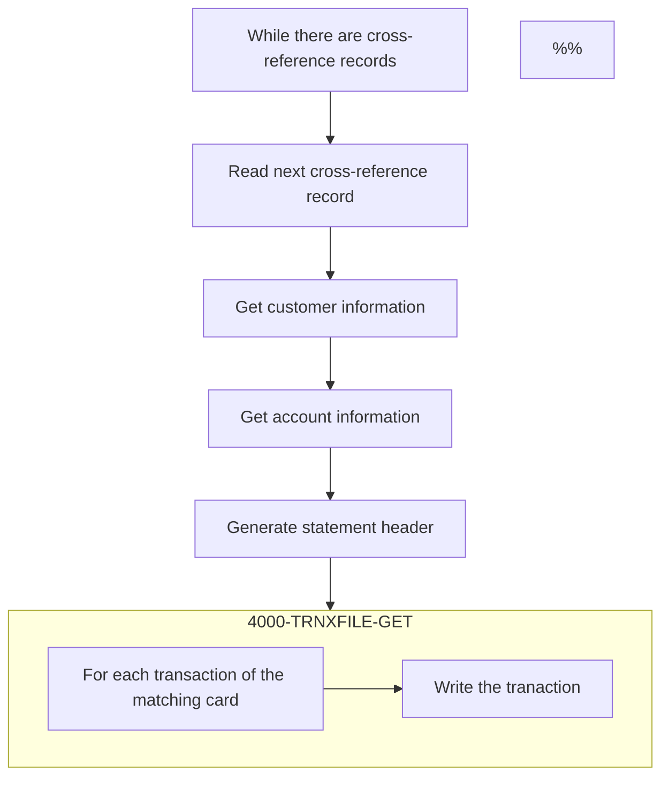

The flow describes the process of printing account statements from transaction data in both plain text and HTML formats.&nbsp;



<SwmSnippet path="/app/cbl/CBSTM03A.CBL" line="293" repo-id="Z2l0aHViJTNBJTNBa3luZHJ5bC1hd3MtbWFpbmZyYW1lLW1vZGVybml6YXRpb24tY2FyZGRlbW8lM0ElM0FTd2ltbS1EZW1v">

---

These are the output files of the program.

```cobol
           OPEN OUTPUT STMT-FILE HTML-FILE.
           INITIALIZE WS-TRNX-TABLE WS-TRN-TBL-CNTR.
```

---

</SwmSnippet>

<SwmSnippet path="/app/cbl/CBSTM03A.CBL" line="298" repo-id="Z2l0aHViJTNBJTNBa3luZHJ5bC1hd3MtbWFpbmZyYW1lLW1vZGVybml6YXRpb24tY2FyZGRlbW8lM0ElM0FTd2ltbS1EZW1v">

---

The program uses these files for the processing flow:

- Transaction file (<SwmToken path="/app/cbl/CBSTM03A.CBL" pos="299:4:4" line-data="             WHEN &#39;TRNXFILE&#39;" repo-id="Z2l0aHViJTNBJTNBa3luZHJ5bC1hd3MtbWFpbmZyYW1lLW1vZGVybml6YXRpb24tY2FyZGRlbW8lM0ElM0FTd2ltbS1EZW1v" repo-name="aws-mainframe-modernization-carddemo">`TRNXFILE`</SwmToken>)
- Cross-reference file (<SwmToken path="/app/cbl/CBSTM03A.CBL" pos="302:4:4" line-data="             WHEN &#39;XREFFILE&#39;" repo-id="Z2l0aHViJTNBJTNBa3luZHJ5bC1hd3MtbWFpbmZyYW1lLW1vZGVybml6YXRpb24tY2FyZGRlbW8lM0ElM0FTd2ltbS1EZW1v" repo-name="aws-mainframe-modernization-carddemo">`XREFFILE`</SwmToken>)
- Customer file (<SwmToken path="/app/cbl/CBSTM03A.CBL" pos="305:4:4" line-data="             WHEN &#39;CUSTFILE&#39;" repo-id="Z2l0aHViJTNBJTNBa3luZHJ5bC1hd3MtbWFpbmZyYW1lLW1vZGVybml6YXRpb24tY2FyZGRlbW8lM0ElM0FTd2ltbS1EZW1v" repo-name="aws-mainframe-modernization-carddemo">`CUSTFILE`</SwmToken>)
- Account file (<SwmToken path="/app/cbl/CBSTM03A.CBL" pos="308:4:4" line-data="             WHEN &#39;ACCTFILE&#39;" repo-id="Z2l0aHViJTNBJTNBa3luZHJ5bC1hd3MtbWFpbmZyYW1lLW1vZGVybml6YXRpb24tY2FyZGRlbW8lM0ElM0FTd2ltbS1EZW1v" repo-name="aws-mainframe-modernization-carddemo">`ACCTFILE`</SwmToken>)

```
           EVALUATE WS-FL-DD
             WHEN 'TRNXFILE'
               ALTER 8100-FILE-OPEN TO PROCEED TO 8100-TRNXFILE-OPEN
               GO TO 8100-FILE-OPEN
             WHEN 'XREFFILE'
               ALTER 8100-FILE-OPEN TO PROCEED TO 8200-XREFFILE-OPEN
               GO TO 8100-FILE-OPEN
             WHEN 'CUSTFILE'
               ALTER 8100-FILE-OPEN TO PROCEED TO 8300-CUSTFILE-OPEN
               GO TO 8100-FILE-OPEN
             WHEN 'ACCTFILE'
               ALTER 8100-FILE-OPEN TO PROCEED TO 8400-ACCTFILE-OPEN
               GO TO 8100-FILE-OPEN
```

---

</SwmSnippet>

<SwmSnippet path="/app/cbl/CBSTM03A.CBL" line="317" repo-id="Z2l0aHViJTNBJTNBa3luZHJ5bC1hd3MtbWFpbmZyYW1lLW1vZGVybml6YXRpb24tY2FyZGRlbW8lM0ElM0FTd2ltbS1EZW1v">

---

This is the main loop of the program. It reads through all the cross-reference records and coordinates the overall statement generation process. For each cross-referenced record  (<SwmToken path="/app/cbl/CBSTM03A.CBL" pos="319:3:9" line-data="                   PERFORM 1000-XREFFILE-GET-NEXT" repo-id="Z2l0aHViJTNBJTNBa3luZHJ5bC1hd3MtbWFpbmZyYW1lLW1vZGVybml6YXRpb24tY2FyZGRlbW8lM0ElM0FTd2ltbS1EZW1v" repo-name="aws-mainframe-modernization-carddemo">`1000-XREFFILE-GET-NEXT`</SwmToken>) it gets the associated customer information (<SwmToken path="/app/cbl/CBSTM03A.CBL" pos="321:3:7" line-data="                       PERFORM 2000-CUSTFILE-GET" repo-id="Z2l0aHViJTNBJTNBa3luZHJ5bC1hd3MtbWFpbmZyYW1lLW1vZGVybml6YXRpb24tY2FyZGRlbW8lM0ElM0FTd2ltbS1EZW1v" repo-name="aws-mainframe-modernization-carddemo">`2000-CUSTFILE-GET`</SwmToken>) and account information (<SwmToken path="/app/cbl/CBSTM03A.CBL" pos="322:3:7" line-data="                       PERFORM 3000-ACCTFILE-GET" repo-id="Z2l0aHViJTNBJTNBa3luZHJ5bC1hd3MtbWFpbmZyYW1lLW1vZGVybml6YXRpb24tY2FyZGRlbW8lM0ElM0FTd2ltbS1EZW1v" repo-name="aws-mainframe-modernization-carddemo">`3000-ACCTFILE-GET`</SwmToken>). Then it generates the statement (<SwmToken path="/app/cbl/CBSTM03A.CBL" pos="323:3:7" line-data="                       PERFORM 5000-CREATE-STATEMENT" repo-id="Z2l0aHViJTNBJTNBa3luZHJ5bC1hd3MtbWFpbmZyYW1lLW1vZGVybml6YXRpb24tY2FyZGRlbW8lM0ElM0FTd2ltbS1EZW1v" repo-name="aws-mainframe-modernization-carddemo">`5000-CREATE-STATEMENT`</SwmToken> and <SwmToken path="/app/cbl/CBSTM03A.CBL" pos="326:3:7" line-data="                       PERFORM 4000-TRNXFILE-GET" repo-id="Z2l0aHViJTNBJTNBa3luZHJ5bC1hd3MtbWFpbmZyYW1lLW1vZGVybml6YXRpb24tY2FyZGRlbW8lM0ElM0FTd2ltbS1EZW1v" repo-name="aws-mainframe-modernization-carddemo">`4000-TRNXFILE-GET`</SwmToken>).

```cobol
           PERFORM UNTIL END-OF-FILE = 'Y'
               IF  END-OF-FILE = 'N'
                   PERFORM 1000-XREFFILE-GET-NEXT
                   IF  END-OF-FILE = 'N'
                       PERFORM 2000-CUSTFILE-GET
                       PERFORM 3000-ACCTFILE-GET
                       PERFORM 5000-CREATE-STATEMENT
                       MOVE 1 TO CR-JMP
                       MOVE ZERO TO WS-TOTAL-AMT
                       PERFORM 4000-TRNXFILE-GET
                   END-IF
               END-IF
           END-PERFORM.

           PERFORM 9100-TRNXFILE-CLOSE.
```

---

</SwmSnippet>

<SwmSnippet path="/app/cbl/CBSTM03A.CBL" line="458" repo-id="Z2l0aHViJTNBJTNBa3luZHJ5bC1hd3MtbWFpbmZyYW1lLW1vZGVybml6YXRpb24tY2FyZGRlbW8lM0ElM0FTd2ltbS1EZW1v">

---

### <SwmToken path="/app/cbl/CBSTM03A.CBL" pos="458:1:5" line-data="       5000-CREATE-STATEMENT." repo-id="Z2l0aHViJTNBJTNBa3luZHJ5bC1hd3MtbWFpbmZyYW1lLW1vZGVybml6YXRpb24tY2FyZGRlbW8lM0ElM0FTd2ltbS1EZW1v" repo-name="aws-mainframe-modernization-carddemo">`5000-CREATE-STATEMENT`</SwmToken>

This function initializes the statement lines and writes the header information to the statement file. It then formats and writes customer and account data into predefined structures.

```
       5000-CREATE-STATEMENT.
           INITIALIZE STATEMENT-LINES.
           WRITE FD-STMTFILE-REC FROM ST-LINE0.
           PERFORM 5100-WRITE-HTML-HEADER THRU 5100-EXIT.
           STRING CUST-FIRST-NAME DELIMITED BY ' '
                  ' ' DELIMITED BY SIZE
                  CUST-MIDDLE-NAME DELIMITED BY ' '
                  ' ' DELIMITED BY SIZE
                  CUST-LAST-NAME DELIMITED BY ' '
                  ' ' DELIMITED BY SIZE
                  INTO ST-NAME
           END-STRING.
           MOVE CUST-ADDR-LINE-1 TO ST-ADD1.
           MOVE CUST-ADDR-LINE-2 TO ST-ADD2.
           STRING CUST-ADDR-LINE-3 DELIMITED BY ' '
                  ' ' DELIMITED BY SIZE
                  CUST-ADDR-STATE-CD DELIMITED BY ' '
                  ' ' DELIMITED BY SIZE
                  CUST-ADDR-COUNTRY-CD DELIMITED BY ' '
                  ' ' DELIMITED BY SIZE
                  CUST-ADDR-ZIP DELIMITED BY ' '
                  ' ' DELIMITED BY SIZE
                  INTO ST-ADD3
           END-STRING.

           MOVE ACCT-ID TO ST-ACCT-ID.
           MOVE ACCT-CURR-BAL TO ST-CURR-BAL.
           MOVE CUST-FICO-CREDIT-SCORE TO ST-FICO-SCORE.
           PERFORM 5200-WRITE-HTML-NMADBS THRU 5200-EXIT.
```

---

</SwmSnippet>

<SwmSnippet path="/app/cbl/CBSTM03A.CBL" line="416" repo-id="Z2l0aHViJTNBJTNBa3luZHJ5bC1hd3MtbWFpbmZyYW1lLW1vZGVybml6YXRpb24tY2FyZGRlbW8lM0ElM0FTd2ltbS1EZW1v">

---

### <SwmToken path="/app/cbl/CBSTM03A.CBL" pos="416:1:5" line-data="       4000-TRNXFILE-GET." repo-id="Z2l0aHViJTNBJTNBa3luZHJ5bC1hd3MtbWFpbmZyYW1lLW1vZGVybml6YXRpb24tY2FyZGRlbW8lM0ElM0FTd2ltbS1EZW1v" repo-name="aws-mainframe-modernization-carddemo">`4000-TRNXFILE-GET`</SwmToken>

The <SwmToken path="/app/cbl/CBSTM03A.CBL" pos="416:1:5" line-data="       4000-TRNXFILE-GET." repo-id="Z2l0aHViJTNBJTNBa3luZHJ5bC1hd3MtbWFpbmZyYW1lLW1vZGVybml6YXRpb24tY2FyZGRlbW8lM0ElM0FTd2ltbS1EZW1v" repo-name="aws-mainframe-modernization-carddemo">`4000-TRNXFILE-GET`</SwmToken> function retrieves all transactions for a specific card number and adds them to the customer's statement. For each transaction of the matching card, it calls <SwmToken path="/app/cbl/CBSTM03A.CBL" pos="428:3:7" line-data="                       PERFORM 6000-WRITE-TRANS" repo-id="Z2l0aHViJTNBJTNBa3luZHJ5bC1hd3MtbWFpbmZyYW1lLW1vZGVybml6YXRpb24tY2FyZGRlbW8lM0ElM0FTd2ltbS1EZW1v" repo-name="aws-mainframe-modernization-carddemo">`6000-WRITE-TRANS`</SwmToken> to write the transaction and adds the transaction amount to the running total.

```cobol
       4000-TRNXFILE-GET.
           PERFORM VARYING CR-JMP FROM 1 BY 1
             UNTIL CR-JMP > CR-CNT
             OR (WS-CARD-NUM (CR-JMP) > XREF-CARD-NUM)
               IF XREF-CARD-NUM = WS-CARD-NUM (CR-JMP)
                   MOVE WS-CARD-NUM (CR-JMP) TO TRNX-CARD-NUM
                   PERFORM VARYING TR-JMP FROM 1 BY 1
                     UNTIL (TR-JMP > WS-TRCT (CR-JMP))
                       MOVE WS-TRAN-NUM (CR-JMP, TR-JMP)
                         TO TRNX-ID
                       MOVE WS-TRAN-REST (CR-JMP, TR-JMP)
                         TO TRNX-REST
                       PERFORM 6000-WRITE-TRANS
                       ADD TRNX-AMT TO WS-TOTAL-AMT
                   END-PERFORM
               END-IF
```

---

</SwmSnippet>

<SwmSnippet path="/app/cbl/CBSTM03A.CBL" line="675" repo-id="Z2l0aHViJTNBJTNBa3luZHJ5bC1hd3MtbWFpbmZyYW1lLW1vZGVybml6YXRpb24tY2FyZGRlbW8lM0ElM0FTd2ltbS1EZW1v">

---

### <SwmToken path="/app/cbl/CBSTM03A.CBL" pos="428:3:7" line-data="                       PERFORM 6000-WRITE-TRANS" repo-id="Z2l0aHViJTNBJTNBa3luZHJ5bC1hd3MtbWFpbmZyYW1lLW1vZGVybml6YXRpb24tY2FyZGRlbW8lM0ElM0FTd2ltbS1EZW1v" repo-name="aws-mainframe-modernization-carddemo">`6000-WRITE-TRANS`</SwmToken>

The <SwmToken path="/app/cbl/CBSTM03A.CBL" pos="428:3:7" line-data="                       PERFORM 6000-WRITE-TRANS" repo-id="Z2l0aHViJTNBJTNBa3luZHJ5bC1hd3MtbWFpbmZyYW1lLW1vZGVybml6YXRpb24tY2FyZGRlbW8lM0ElM0FTd2ltbS1EZW1v" repo-name="aws-mainframe-modernization-carddemo">`6000-WRITE-TRANS`</SwmToken> routine is responsible for writing each individual transaction to both the plain text statement file (WRITE <SwmToken path="/app/cbl/CBSTM03A.CBL" pos="679:3:7" line-data="           WRITE FD-STMTFILE-REC FROM ST-LINE14." repo-id="Z2l0aHViJTNBJTNBa3luZHJ5bC1hd3MtbWFpbmZyYW1lLW1vZGVybml6YXRpb24tY2FyZGRlbW8lM0ElM0FTd2ltbS1EZW1v" repo-name="aws-mainframe-modernization-carddemo">`FD-STMTFILE-REC`</SwmToken>) and the HTML statement file (WRITE <SwmToken path="/app/cbl/CBSTM03A.CBL" pos="682:3:7" line-data="           WRITE FD-HTMLFILE-REC FROM HTML-FIXED-LN." repo-id="Z2l0aHViJTNBJTNBa3luZHJ5bC1hd3MtbWFpbmZyYW1lLW1vZGVybml6YXRpb24tY2FyZGRlbW8lM0ElM0FTd2ltbS1EZW1v" repo-name="aws-mainframe-modernization-carddemo">`FD-HTMLFILE-REC`</SwmToken>).

```
       6000-WRITE-TRANS.
           MOVE TRNX-ID TO ST-TRANID.
           MOVE TRNX-DESC TO ST-TRANDT.
           MOVE TRNX-AMT TO ST-TRANAMT.
           WRITE FD-STMTFILE-REC FROM ST-LINE14.

           SET HTML-LTRS TO TRUE.
           WRITE FD-HTMLFILE-REC FROM HTML-FIXED-LN.

           SET HTML-L58 TO TRUE.
           WRITE FD-HTMLFILE-REC FROM HTML-FIXED-LN.
           MOVE SPACES TO HTML-TRAN-LN.
           STRING '<p>' DELIMITED BY '*'
                  ST-TRANID DELIMITED BY '*'
                  '</p>' DELIMITED BY '*'
                  INTO HTML-TRAN-LN
           END-STRING.
           WRITE FD-HTMLFILE-REC FROM HTML-TRAN-LN.
           SET HTML-LTDE TO TRUE.
           WRITE FD-HTMLFILE-REC FROM HTML-FIXED-LN.

           SET HTML-L61 TO TRUE.
           WRITE FD-HTMLFILE-REC FROM HTML-FIXED-LN.
           MOVE SPACES TO HTML-TRAN-LN.
           STRING '<p>' DELIMITED BY '*'
                  ST-TRANDT DELIMITED BY '*'
                  '</p>' DELIMITED BY '*'
                  INTO HTML-TRAN-LN
           END-STRING.
           WRITE FD-HTMLFILE-REC FROM HTML-TRAN-LN.
           SET HTML-LTDE TO TRUE.
           WRITE FD-HTMLFILE-REC FROM HTML-FIXED-LN.

           SET HTML-L64 TO TRUE.
           WRITE FD-HTMLFILE-REC FROM HTML-FIXED-LN.
           MOVE SPACES TO HTML-TRAN-LN.
           STRING '<p>' DELIMITED BY '*'
                  ST-TRANAMT DELIMITED BY '*'
                  '</p>' DELIMITED BY '*'
                  INTO HTML-TRAN-LN
           END-STRING.
           WRITE FD-HTMLFILE-REC FROM HTML-TRAN-LN.
```

---

</SwmSnippet>

&nbsp;

*This is an auto-generated document by Swimm 🌊 and has not yet been verified by a human*

<SwmMeta version="3.0.0"><sup>Powered by [Swimm](https://app.swimm.io/)</sup></SwmMeta>
