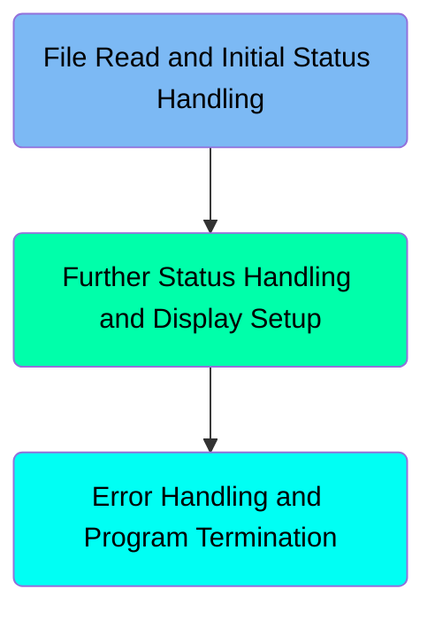
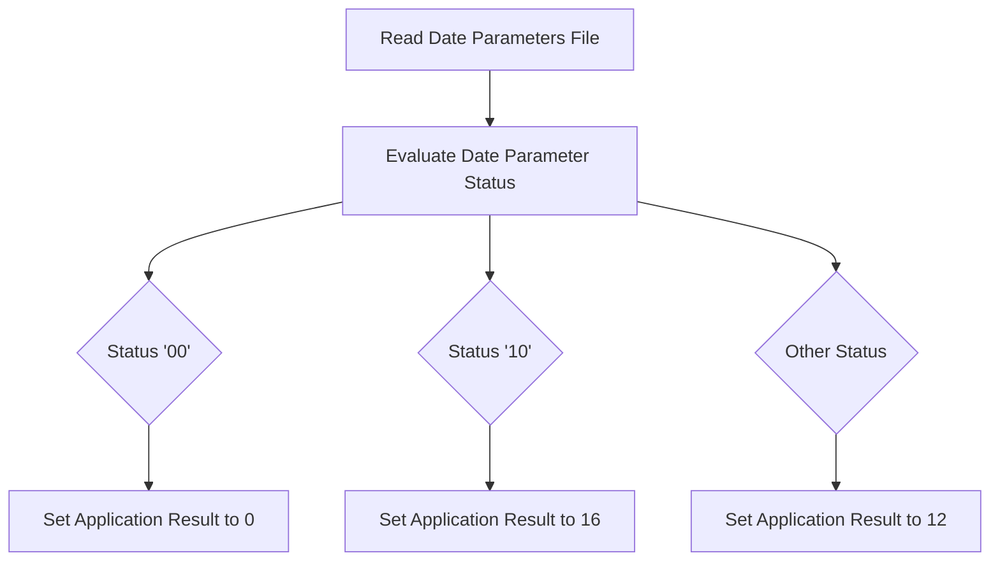
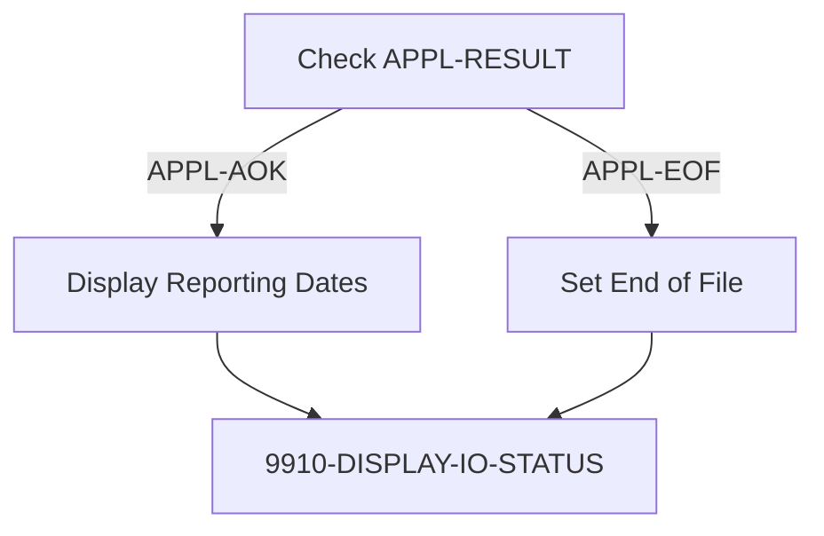
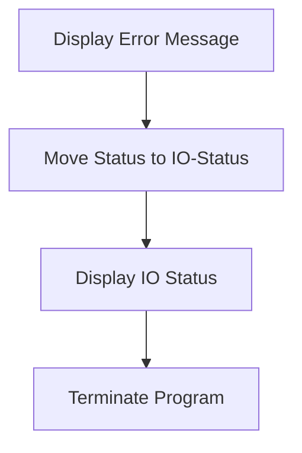

The <SwmToken path="app/cbl/CBTRN03C.cbl" pos="2:7:7" line-data="      * Program     : CBTRN03C.CBL                                      ">`CBTRN03C`</SwmToken> program is responsible for reading date parameters, evaluating their status, and handling the application result accordingly. It ensures that the correct reporting dates are displayed or sets the end-of-file flag when necessary. The program also includes error handling and program termination steps to manage any issues encountered during execution.

The flow starts with reading the date parameters file and evaluating the status of the read operation. Based on the status, the application result is set, and the program either displays the reporting dates or sets the end-of-file flag. If an error occurs, the program displays an error message, updates the <SwmToken path="app/cbl/CBTRN03C.cbl" pos="246:3:5" line-data="      * I/O ROUTINES TO ACCESS A KSDS, VSAM DATA SET...               *         ">`I/O`</SwmToken> status, and terminates the program.

Here is a high level diagram of the program:



# File Read and Initial Status Handling



<SwmSnippet path="/app/cbl/CBTRN03C.cbl" line="221">

---

## Reading Date Parameters File

First, the function reads the date parameters file into the working storage record <SwmToken path="app/cbl/CBTRN03C.cbl" pos="221:11:15" line-data="           READ DATE-PARMS-FILE INTO WS-DATEPARM-RECORD                         ">`WS-DATEPARM-RECORD`</SwmToken>. This step is crucial as it fetches the necessary date parameters required for further processing.

```cobol
           READ DATE-PARMS-FILE INTO WS-DATEPARM-RECORD                         
           EVALUATE DATEPARM-STATUS                                             
```

---

</SwmSnippet>

<SwmSnippet path="/app/cbl/CBTRN03C.cbl" line="223">

---

## Evaluating Date Parameter Status

Next, the function evaluates the status of the date parameter read operation using <SwmToken path="app/cbl/CBTRN03C.cbl" pos="222:3:5" line-data="           EVALUATE DATEPARM-STATUS                                             ">`DATEPARM-STATUS`</SwmToken>. Depending on the status value, it sets the application result accordingly. If the status is '00', it sets <SwmToken path="app/cbl/CBTRN03C.cbl" pos="224:7:9" line-data="                 MOVE 0 TO APPL-RESULT                                          ">`APPL-RESULT`</SwmToken> to 0, indicating a successful read. If the status is '10', it sets <SwmToken path="app/cbl/CBTRN03C.cbl" pos="224:7:9" line-data="                 MOVE 0 TO APPL-RESULT                                          ">`APPL-RESULT`</SwmToken> to 16, indicating a specific condition. For any other status, it sets <SwmToken path="app/cbl/CBTRN03C.cbl" pos="224:7:9" line-data="                 MOVE 0 TO APPL-RESULT                                          ">`APPL-RESULT`</SwmToken> to 12, indicating an error or unexpected condition.

```cobol
             WHEN '00'                                                          
                 MOVE 0 TO APPL-RESULT                                          
             WHEN '10'                                                          
                 MOVE 16 TO APPL-RESULT                                         
             WHEN OTHER                                                         
                 MOVE 12 TO APPL-RESULT                                         
           END-EVALUATE                                                         
                                                                                
```

---

</SwmSnippet>

<SwmSnippet path="/app/cbl/CBTRN03C.cbl" line="231">

---

## Handling Application Result

Then, the function checks if the application result is okay (<SwmToken path="app/cbl/CBTRN03C.cbl" pos="231:3:5" line-data="           IF APPL-AOK                                                          ">`APPL-AOK`</SwmToken>). If it is, it displays the reporting dates. If the end of file (<SwmToken path="app/cbl/CBTRN03C.cbl" pos="235:3:5" line-data="              IF APPL-EOF                                                       ">`APPL-EOF`</SwmToken>) is reached, it sets the end-of-file flag. Otherwise, it handles the error by displaying an error message, moving the status to <SwmToken path="app/cbl/CBTRN03C.cbl" pos="239:9:11" line-data="                 MOVE DATEPARM-STATUS TO IO-STATUS                              ">`IO-STATUS`</SwmToken>, and performing error handling routines.

```cobol
           IF APPL-AOK                                                          
              DISPLAY 'Reporting from ' WS-START-DATE                           
                 ' to ' WS-END-DATE                                             
           ELSE                                                                 
              IF APPL-EOF                                                       
                 MOVE 'Y' TO END-OF-FILE                                        
              ELSE                                                              
                 DISPLAY 'ERROR READING DATEPARM FILE'                          
                 MOVE DATEPARM-STATUS TO IO-STATUS                              
                 PERFORM 9910-DISPLAY-IO-STATUS                                 
                 PERFORM 9999-ABEND-PROGRAM                                     
              END-IF                                                            
           .                                                                    
```

---

</SwmSnippet>

# Further Status Handling and Display Setup



<SwmSnippet path="/app/cbl/CBTRN03C.cbl" line="227">

---

## Check <SwmToken path="app/cbl/CBTRN03C.cbl" pos="228:7:9" line-data="                 MOVE 12 TO APPL-RESULT                                         ">`APPL-RESULT`</SwmToken>

First, the code checks the value of <SwmToken path="app/cbl/CBTRN03C.cbl" pos="228:7:9" line-data="                 MOVE 12 TO APPL-RESULT                                         ">`APPL-RESULT`</SwmToken>. If it matches specific conditions, it sets the value accordingly. This helps in determining the next steps based on the application result.

```cobol
             WHEN OTHER                                                         
                 MOVE 12 TO APPL-RESULT                                         
           END-EVALUATE                                                         
                                                                                
```

---

</SwmSnippet>

<SwmSnippet path="/app/cbl/CBTRN03C.cbl" line="232">

---

## Display Reporting Dates

Next, if <SwmToken path="app/cbl/CBTRN03C.cbl" pos="231:3:5" line-data="           IF APPL-AOK                                                          ">`APPL-AOK`</SwmToken> is true, the code displays the reporting dates from <SwmToken path="app/cbl/CBTRN03C.cbl" pos="232:10:14" line-data="              DISPLAY &#39;Reporting from &#39; WS-START-DATE                           ">`WS-START-DATE`</SwmToken> to <SwmToken path="app/cbl/CBTRN03C.cbl" pos="233:7:11" line-data="                 &#39; to &#39; WS-END-DATE                                             ">`WS-END-DATE`</SwmToken>. This provides the user with the relevant date range for the report.

```cobol
              DISPLAY 'Reporting from ' WS-START-DATE                           
                 ' to ' WS-END-DATE                                             
           ELSE                                                                 
```

---

</SwmSnippet>

<SwmSnippet path="/app/cbl/CBTRN03C.cbl" line="236">

---

## Set End of File

Then, if <SwmToken path="app/cbl/CBTRN03C.cbl" pos="235:3:5" line-data="              IF APPL-EOF                                                       ">`APPL-EOF`</SwmToken> is true, the code sets the <SwmToken path="app/cbl/CBTRN03C.cbl" pos="236:9:13" line-data="                 MOVE &#39;Y&#39; TO END-OF-FILE                                        ">`END-OF-FILE`</SwmToken> flag to 'Y'. This indicates that the end of the file has been reached and no more data is available for processing.

```cobol
                 MOVE 'Y' TO END-OF-FILE                                        
              ELSE                                                              
```

---

</SwmSnippet>

<SwmSnippet path="/app/cbl/CBTRN03C.cbl" line="634">

---

## Display IO Status

Finally, the function <SwmToken path="app/cbl/CBTRN03C.cbl" pos="240:3:9" line-data="                 PERFORM 9910-DISPLAY-IO-STATUS                                 ">`9910-DISPLAY-IO-STATUS`</SwmToken> is called to display the IO status. This function checks the <SwmToken path="app/cbl/CBTRN03C.cbl" pos="634:3:5" line-data="           IF IO-STATUS NOT NUMERIC                                             ">`IO-STATUS`</SwmToken> and displays the appropriate file status message, helping in debugging and ensuring the correct status is shown.

```cobol
           IF IO-STATUS NOT NUMERIC                                             
              OR IO-STAT1 = '9'                                                 
              MOVE IO-STAT1 TO IO-STATUS-04(1:1)                                
              MOVE 0 TO TWO-BYTES-BINARY                                        
              MOVE IO-STAT2 TO TWO-BYTES-RIGHT                                  
              MOVE TWO-BYTES-BINARY TO IO-STATUS-0403                           
              DISPLAY 'FILE STATUS IS: NNNN' IO-STATUS-04                       
           ELSE                                                                 
              MOVE '0000' TO IO-STATUS-04                                       
              MOVE IO-STATUS TO IO-STATUS-04(3:2)                               
              DISPLAY 'FILE STATUS IS: NNNN' IO-STATUS-04                       
           END-IF                                                               
           EXIT.                                                                
      *
```

---

</SwmSnippet>

## Interim Summary

So far, we saw how the program reads the date parameters file, evaluates the status of the read operation, and handles the application result by displaying reporting dates or setting the end-of-file flag. Now, we will focus on the error handling and program termination steps, where the program displays error messages, updates the <SwmToken path="app/cbl/CBTRN03C.cbl" pos="246:3:5" line-data="      * I/O ROUTINES TO ACCESS A KSDS, VSAM DATA SET...               *         ">`I/O`</SwmToken> status, and terminates the program if necessary.

# Error Handling and Program Termination



<SwmSnippet path="/app/cbl/CBTRN03C.cbl" line="239">

---

## Display Error Message

First, the program displays an error message 'ERROR READING DATEPARM FILE' to inform the user that there was an issue reading the DATEPARM file.

```cobol
                 MOVE DATEPARM-STATUS TO IO-STATUS                              
```

---

</SwmSnippet>

<SwmSnippet path="/app/cbl/CBTRN03C.cbl" line="240">

---

## Move Status to IO-Status

Next, the program moves the <SwmToken path="app/cbl/CBTRN03C.cbl" pos="222:3:5" line-data="           EVALUATE DATEPARM-STATUS                                             ">`DATEPARM-STATUS`</SwmToken> to <SwmToken path="app/cbl/CBTRN03C.cbl" pos="240:7:9" line-data="                 PERFORM 9910-DISPLAY-IO-STATUS                                 ">`IO-STATUS`</SwmToken>. This step ensures that the current status of the DATEPARM file read operation is captured in the <SwmToken path="app/cbl/CBTRN03C.cbl" pos="240:7:9" line-data="                 PERFORM 9910-DISPLAY-IO-STATUS                                 ">`IO-STATUS`</SwmToken> variable for further processing.

```cobol
                 PERFORM 9910-DISPLAY-IO-STATUS                                 
```

---

</SwmSnippet>

<SwmSnippet path="/app/cbl/CBTRN03C.cbl" line="241">

---

## Display IO Status

Then, the program performs the <SwmToken path="app/cbl/CBTRN03C.cbl" pos="240:3:9" line-data="                 PERFORM 9910-DISPLAY-IO-STATUS                                 ">`9910-DISPLAY-IO-STATUS`</SwmToken> paragraph. This step is responsible for displaying the current <SwmToken path="app/cbl/CBTRN03C.cbl" pos="246:3:5" line-data="      * I/O ROUTINES TO ACCESS A KSDS, VSAM DATA SET...               *         ">`I/O`</SwmToken> status to the user, providing more details about the error.

```cobol
                 PERFORM 9999-ABEND-PROGRAM                                     
```

---

</SwmSnippet>

<SwmSnippet path="/app/cbl/CBTRN03C.cbl" line="242">

---

## Terminate Program

Finally, the program performs the <SwmToken path="app/cbl/CBTRN03C.cbl" pos="241:3:7" line-data="                 PERFORM 9999-ABEND-PROGRAM                                     ">`9999-ABEND-PROGRAM`</SwmToken> paragraph to terminate the program. This step ensures that the program stops execution due to the critical error encountered.

```cobol
              END-IF                                                            
```

---

</SwmSnippet>

<SwmSnippet path="/app/cbl/CBTRN03C.cbl" line="627">

---

### <SwmToken path="app/cbl/CBTRN03C.cbl" pos="241:3:7" line-data="                 PERFORM 9999-ABEND-PROGRAM                                     ">`9999-ABEND-PROGRAM`</SwmToken>

The <SwmToken path="app/cbl/CBTRN03C.cbl" pos="241:3:7" line-data="                 PERFORM 9999-ABEND-PROGRAM                                     ">`9999-ABEND-PROGRAM`</SwmToken> paragraph displays 'ABENDING PROGRAM', moves 0 to <SwmToken path="app/cbl/CBTRN03C.cbl" pos="628:7:7" line-data="           MOVE 0 TO TIMING                                                     ">`TIMING`</SwmToken>, moves 999 to <SwmToken path="app/cbl/CBTRN03C.cbl" pos="629:7:7" line-data="           MOVE 999 TO ABCODE                                                   ">`ABCODE`</SwmToken>, and calls <SwmToken path="app/cbl/CBTRN03C.cbl" pos="630:4:4" line-data="           CALL &#39;CEE3ABD&#39;.                                                      ">`CEE3ABD`</SwmToken> to abend the program. This ensures that the program terminates gracefully after logging the necessary information.

```cobol
           DISPLAY 'ABENDING PROGRAM'                                           
           MOVE 0 TO TIMING                                                     
           MOVE 999 TO ABCODE                                                   
           CALL 'CEE3ABD'.                                                      
                                                                                
```

---

</SwmSnippet>

&nbsp;

*This is an auto-generated document by Swimm 🌊 and has not yet been verified by a human*

<SwmMeta version="3.0.0" repo-id="Z2l0aHViJTNBJTNBa3luZHJ5bC1hd3MtbWFpbmZyYW1lLW1vZGVybml6YXRpb24tY2FyZGRlbW8lM0ElM0FTd2ltbS1EZW1v" repo-name="kyndryl-aws-mainframe-modernization-carddemo"><sup>Powered by [Swimm](https://staging.swimm.cloud/)</sup></SwmMeta>
