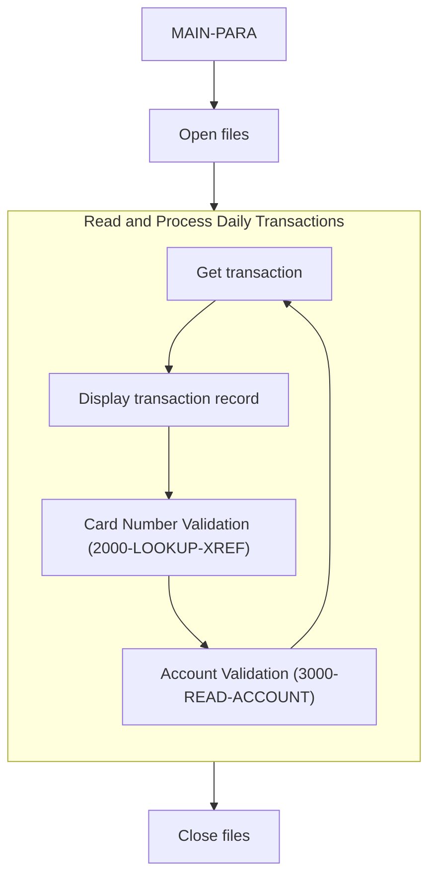

The transaction processing flow is responsible for reading, validating, and processing transactions from the daily transaction file. This flow ensures that transactions are accurately recorded and account balances are updated accordingly.



<SwmSnippet path="/app/cbl/CBTRN01C.cbl" line="155" repo-id="Z2l0aHViJTNBJTNBa3luZHJ5bC1hd3MtbWFpbmZyYW1lLW1vZGVybml6YXRpb24tY2FyZGRlbW8lM0ElM0FTd2ltbS1EZW1v">

---

## Processing Transactions

First, the program begins by opening the necessary files for processing. This includes the daily transaction file (<SwmToken path="/app/cbl/CBTRN01C.cbl" pos="29:3:5" line-data="           SELECT DALYTRAN-FILE ASSIGN TO DALYTRAN" repo-id="Z2l0aHViJTNBJTNBa3luZHJ5bC1hd3MtbWFpbmZyYW1lLW1vZGVybml6YXRpb24tY2FyZGRlbW8lM0ElM0FTd2ltbS1EZW1v" repo-name="aws-mainframe-modernization-carddemo">`DALYTRAN-FILE`</SwmToken>), customer file (<SwmToken path="/app/cbl/CBTRN01C.cbl" pos="34:3:5" line-data="           SELECT CUSTOMER-FILE ASSIGN TO   CUSTFILE" repo-id="Z2l0aHViJTNBJTNBa3luZHJ5bC1hd3MtbWFpbmZyYW1lLW1vZGVybml6YXRpb24tY2FyZGRlbW8lM0ElM0FTd2ltbS1EZW1v" repo-name="aws-mainframe-modernization-carddemo">`CUSTOMER-FILE`</SwmToken>), cross-reference file (<SwmToken path="/app/cbl/CBTRN01C.cbl" pos="40:3:5" line-data="           SELECT XREF-FILE ASSIGN TO   XREFFILE" repo-id="Z2l0aHViJTNBJTNBa3luZHJ5bC1hd3MtbWFpbmZyYW1lLW1vZGVybml6YXRpb24tY2FyZGRlbW8lM0ElM0FTd2ltbS1EZW1v" repo-name="aws-mainframe-modernization-carddemo">`XREF-FILE`</SwmToken>), card file (<SwmToken path="/app/cbl/CBTRN01C.cbl" pos="46:3:5" line-data="           SELECT CARD-FILE ASSIGN TO   CARDFILE" repo-id="Z2l0aHViJTNBJTNBa3luZHJ5bC1hd3MtbWFpbmZyYW1lLW1vZGVybml6YXRpb24tY2FyZGRlbW8lM0ElM0FTd2ltbS1EZW1v" repo-name="aws-mainframe-modernization-carddemo">`CARD-FILE`</SwmToken>), account file (<SwmToken path="/app/cbl/CBTRN01C.cbl" pos="52:3:5" line-data="           SELECT ACCOUNT-FILE ASSIGN TO   ACCTFILE" repo-id="Z2l0aHViJTNBJTNBa3luZHJ5bC1hd3MtbWFpbmZyYW1lLW1vZGVybml6YXRpb24tY2FyZGRlbW8lM0ElM0FTd2ltbS1EZW1v" repo-name="aws-mainframe-modernization-carddemo">`ACCOUNT-FILE`</SwmToken>), and transaction file (<SwmToken path="/app/cbl/CBTRN01C.cbl" pos="58:3:5" line-data="           SELECT TRANSACT-FILE ASSIGN TO   TRANFILE" repo-id="Z2l0aHViJTNBJTNBa3luZHJ5bC1hd3MtbWFpbmZyYW1lLW1vZGVybml6YXRpb24tY2FyZGRlbW8lM0ElM0FTd2ltbS1EZW1v" repo-name="aws-mainframe-modernization-carddemo">`TRANSACT-FILE`</SwmToken>).

```cobol
       MAIN-PARA.
           DISPLAY 'START OF EXECUTION OF PROGRAM CBTRN01C'.
           PERFORM 0000-DALYTRAN-OPEN.
           PERFORM 0100-CUSTFILE-OPEN.
           PERFORM 0200-XREFFILE-OPEN.
           PERFORM 0300-CARDFILE-OPEN.
           PERFORM 0400-ACCTFILE-OPEN.
           PERFORM 0500-TRANFILE-OPEN.
```

---

</SwmSnippet>

<SwmSnippet path="/app/cbl/CBTRN01C.cbl" line="164" repo-id="Z2l0aHViJTNBJTNBa3luZHJ5bC1hd3MtbWFpbmZyYW1lLW1vZGVybml6YXRpb24tY2FyZGRlbW8lM0ElM0FTd2ltbS1EZW1v">

---

Next, the function enters a loop that continues until the end of the daily transaction file is reached. Within this loop, it checks if the end of the file has not been reached (<SwmToken path="/app/cbl/CBTRN01C.cbl" pos="165:3:17" line-data="               IF  END-OF-DAILY-TRANS-FILE = &#39;N&#39;" repo-id="Z2l0aHViJTNBJTNBa3luZHJ5bC1hd3MtbWFpbmZyYW1lLW1vZGVybml6YXRpb24tY2FyZGRlbW8lM0ElM0FTd2ltbS1EZW1v" repo-name="aws-mainframe-modernization-carddemo">`END-OF-DAILY-TRANS-FILE = 'N'`</SwmToken>). If so, it performs the <SwmToken path="/app/cbl/CBTRN01C.cbl" pos="166:3:9" line-data="                   PERFORM 1000-DALYTRAN-GET-NEXT" repo-id="Z2l0aHViJTNBJTNBa3luZHJ5bC1hd3MtbWFpbmZyYW1lLW1vZGVybml6YXRpb24tY2FyZGRlbW8lM0ElM0FTd2ltbS1EZW1v" repo-name="aws-mainframe-modernization-carddemo">`1000-DALYTRAN-GET-NEXT`</SwmToken> operation to read the next transaction record.

```cobol
           PERFORM UNTIL END-OF-DAILY-TRANS-FILE = 'Y'
               IF  END-OF-DAILY-TRANS-FILE = 'N'
                   PERFORM 1000-DALYTRAN-GET-NEXT
```

---

</SwmSnippet>

<SwmSnippet path="/app/cbl/CBTRN01C.cbl" line="167" repo-id="Z2l0aHViJTNBJTNBa3luZHJ5bC1hd3MtbWFpbmZyYW1lLW1vZGVybml6YXRpb24tY2FyZGRlbW8lM0ElM0FTd2ltbS1EZW1v">

---

If the end of the file is still not reached, the transaction record (<SwmToken path="/app/cbl/CBTRN01C.cbl" pos="168:3:5" line-data="                       DISPLAY DALYTRAN-RECORD" repo-id="Z2l0aHViJTNBJTNBa3luZHJ5bC1hd3MtbWFpbmZyYW1lLW1vZGVybml6YXRpb24tY2FyZGRlbW8lM0ElM0FTd2ltbS1EZW1v" repo-name="aws-mainframe-modernization-carddemo">`DALYTRAN-RECORD`</SwmToken>) is displayed.&nbsp;

```cobol
                   IF  END-OF-DAILY-TRANS-FILE = 'N'
                       DISPLAY DALYTRAN-RECORD
                   END-IF
                   MOVE 0                 TO WS-XREF-READ-STATUS
                   MOVE DALYTRAN-CARD-NUM TO XREF-CARD-NUM
```

---

</SwmSnippet>

<SwmSnippet path="/app/cbl/CBTRN01C.cbl" line="172" repo-id="Z2l0aHViJTNBJTNBa3luZHJ5bC1hd3MtbWFpbmZyYW1lLW1vZGVybml6YXRpb24tY2FyZGRlbW8lM0ElM0FTd2ltbS1EZW1v">

---

Following this, the <SwmToken path="/app/cbl/CBTRN01C.cbl" pos="172:3:7" line-data="                   PERFORM 2000-LOOKUP-XREF" repo-id="Z2l0aHViJTNBJTNBa3luZHJ5bC1hd3MtbWFpbmZyYW1lLW1vZGVybml6YXRpb24tY2FyZGRlbW8lM0ElM0FTd2ltbS1EZW1v" repo-name="aws-mainframe-modernization-carddemo">`2000-LOOKUP-XREF`</SwmToken> operation is performed to look up the card number from the transaction in the cross-reference file (XREF-FILE). The XREF file links card numbers to account IDs.

```
                   PERFORM 2000-LOOKUP-XREF
```

---

</SwmSnippet>

<SwmSnippet path="/app/cbl/CBTRN01C.cbl" line="173" repo-id="Z2l0aHViJTNBJTNBa3luZHJ5bC1hd3MtbWFpbmZyYW1lLW1vZGVybml6YXRpb24tY2FyZGRlbW8lM0ElM0FTd2ltbS1EZW1v">

---

If the operation is successful, the <SwmToken path="/app/cbl/CBTRN01C.cbl" pos="176:3:7" line-data="                     PERFORM 3000-READ-ACCOUNT" repo-id="Z2l0aHViJTNBJTNBa3luZHJ5bC1hd3MtbWFpbmZyYW1lLW1vZGVybml6YXRpb24tY2FyZGRlbW8lM0ElM0FTd2ltbS1EZW1v" repo-name="aws-mainframe-modernization-carddemo">`3000-READ-ACCOUNT`</SwmToken> operation is performed to get the account ID from the cross-reference record.

```
                   IF WS-XREF-READ-STATUS = 0
                     MOVE 0            TO WS-ACCT-READ-STATUS
                     MOVE XREF-ACCT-ID TO ACCT-ID
                     PERFORM 3000-READ-ACCOUNT
```

---

</SwmSnippet>

<SwmSnippet path="/app/cbl/CBTRN01C.cbl" line="188" repo-id="Z2l0aHViJTNBJTNBa3luZHJ5bC1hd3MtbWFpbmZyYW1lLW1vZGVybml6YXRpb24tY2FyZGRlbW8lM0ElM0FTd2ltbS1EZW1v">

---

After processing all transactions, the function closes all the opened files, including the daily transaction file, customer file, cross-reference file, card file, account file, and transaction file. Finally, it displays an end message and terminates the program.

```cobol
           PERFORM 9000-DALYTRAN-CLOSE.
           PERFORM 9100-CUSTFILE-CLOSE.
           PERFORM 9200-XREFFILE-CLOSE.
           PERFORM 9300-CARDFILE-CLOSE.
           PERFORM 9400-ACCTFILE-CLOSE.
           PERFORM 9500-TRANFILE-CLOSE.

           DISPLAY 'END OF EXECUTION OF PROGRAM CBTRN01C'.

           GOBACK.
```

---

</SwmSnippet>

&nbsp;

_This is an auto-generated document by Swimm 🌊 and has not yet been verified by a human_

<SwmMeta version="3.0.0"><sup>Powered by [Swimm](https://staging.swimm.cloud/)</sup></SwmMeta>
