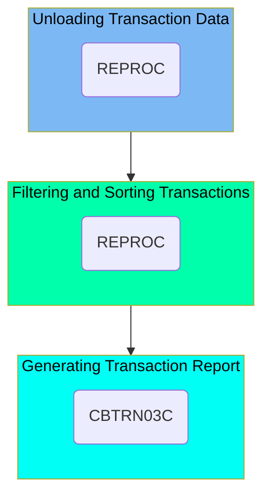

The TRANREPT job is designed to manage and process transaction data within the CardDemo application. This job involves unloading processed transaction data from a VSAM file to a backup file, filtering and sorting the transactions based on specific parameters, and generating a formatted report of the processed transactions. The input for this job includes the transaction data from the VSAM file, and the output is a detailed transaction report.

Here is a high level diagram of the file:

## Unloading Transaction Data

Steps in this section: `STEP05R`.

This section is about unloading the processed transaction data from the VSAM file to a new backup file. The process involves using the REPROC procedure to manage the data transfer and ensure that the transaction data is securely backed up.

## Filtering and Sorting Transactions

Steps in this section: `STEP05R`.

This section is about filtering and sorting transaction data based on specific parameters. The program reads the transaction backup file, filters the transactions within a specified date range, and sorts them by card number.

## Generating Transaction Report

Steps in this section: `STEP10R`.

This section is responsible for producing a formatted report for processed transactions by executing the batch COBOL program <SwmToken path="/app/cbl/CBTRN03C.cbl" pos="23:6:6" line-data="       PROGRAM-ID.    CBTRN03C.                                                 ">`CBTRN03C`</SwmToken>, which reads, processes, and summarizes transaction data from multiple files.

More about the <SwmToken path="/app/cbl/CBTRN03C.cbl" pos="23:6:6" line-data="       PROGRAM-ID.    CBTRN03C.                                                 ">`CBTRN03C`</SwmToken> program: <SwmLink doc-title="Printing transaction detail report (CBTRN03C)">[Printing transaction detail report (CBTRN03C)](/.swm/printing-transaction-detail-report-cbtrn03c.z4t3v9es.sw.md)</SwmLink>

&nbsp;

*This is an auto-generated document by Swimm 🌊 and has not yet been verified by a human*

<SwmMeta version="3.0.0" repo-id="Z2l0aHViJTNBJTNBa3luZHJ5bC1hd3MtbWFpbmZyYW1lLW1vZGVybml6YXRpb24tY2FyZGRlbW8lM0ElM0FTd2ltbS1EZW1v" repo-name="kyndryl-aws-mainframe-modernization-carddemo">Powered by [Swimm](https://app.swimm.io/)</SwmMeta>
