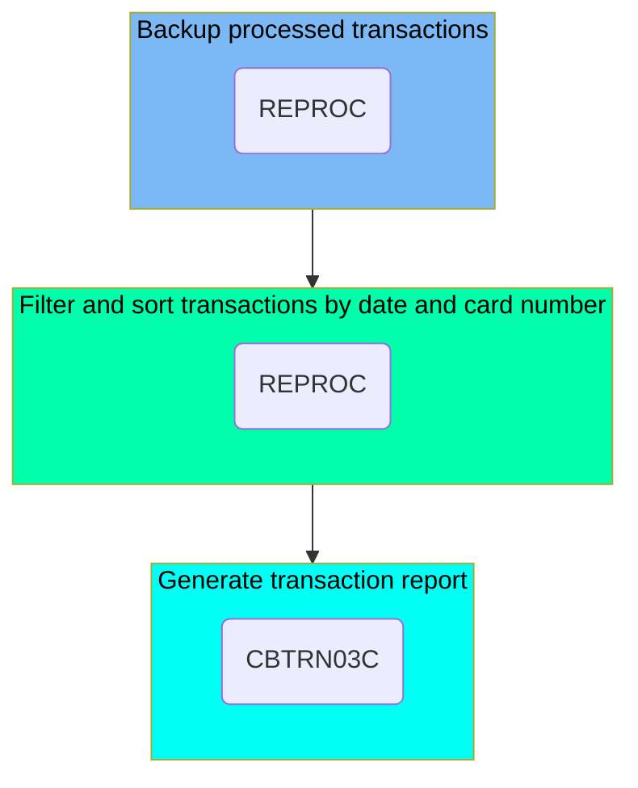

The TRANREPT job is responsible for backing up processed transactions, filtering and sorting them by date and card number, and generating a formatted transaction report. This job ensures that transaction data is safely stored, organized, and reported for further analysis or record-keeping.

For instance, the job takes the processed transaction file as input, creates a backup, filters transactions within a specified date range, sorts them by card number, and finally produces a detailed report of these transactions.

Here is a high level diagram of the file:



## Backup processed transactions

Steps in this section: <SwmToken path="app/jcl/TRANREPT.jcl" pos="23:1:1" line-data="//STEP05R EXEC PROC=REPROC,                                                     ">`STEP05R`</SwmToken>.

This section is about unloading the processed transaction file to a backup dataset. It ensures that the transaction data is safely stored in a backup file for future reference or recovery.

## Filter and sort transactions by date and card number

Steps in this section: <SwmToken path="app/jcl/TRANREPT.jcl" pos="23:1:1" line-data="//STEP05R EXEC PROC=REPROC,                                                     ">`STEP05R`</SwmToken>.

This section is responsible for unloading the processed transaction file to a backup dataset, filtering the transactions based on a specified date range, and sorting them by card number.

## Generate transaction report

Steps in this section: <SwmToken path="app/jcl/TRANREPT.jcl" pos="59:1:1" line-data="//STEP10R EXEC PGM=CBTRN03C                                                     ">`STEP10R`</SwmToken>.

This section is responsible for generating a formatted report for processed transactions. It executes the <SwmToken path="app/jcl/TRANREPT.jcl" pos="59:7:7" line-data="//STEP10R EXEC PGM=CBTRN03C                                                     ">`CBTRN03C`</SwmToken> program, which reads various input files containing transaction data, cross-references, transaction types, and categorization, and produces a detailed transaction report.

<SwmSnippet path="/app/jcl/TRANREPT.jcl" line="57">

---

Here we call the <SwmToken path="app/jcl/TRANREPT.jcl" pos="59:7:7" line-data="//STEP10R EXEC PGM=CBTRN03C                                                     ">`CBTRN03C`</SwmToken> program.

More about <SwmToken path="app/jcl/TRANREPT.jcl" pos="59:7:7" line-data="//STEP10R EXEC PGM=CBTRN03C                                                     ">`CBTRN03C`</SwmToken>: <SwmLink doc-title="Printing Transaction Detail Reports (CBTRN03C)">[Printing Transaction Detail Reports (CBTRN03C)](/.swm/printing-transaction-detail-reports-cbtrn03c.umd6qzfy.sw.md)</SwmLink>

```jcl
//* Produce a formatted report for processed transactions                       
//* *******************************************************************         
//STEP10R EXEC PGM=CBTRN03C                                                     
```

---

</SwmSnippet>

&nbsp;

*This is an auto-generated document by Swimm 🌊 and has not yet been verified by a human*

<SwmMeta version="3.0.0" repo-id="Z2l0aHViJTNBJTNBa3luZHJ5bC1hd3MtbWFpbmZyYW1lLW1vZGVybml6YXRpb24tY2FyZGRlbW8lM0ElM0FTd2ltbS1EZW1v" repo-name="kyndryl-aws-mainframe-modernization-carddemo"><sup>Powered by [Swimm](/)</sup></SwmMeta>
