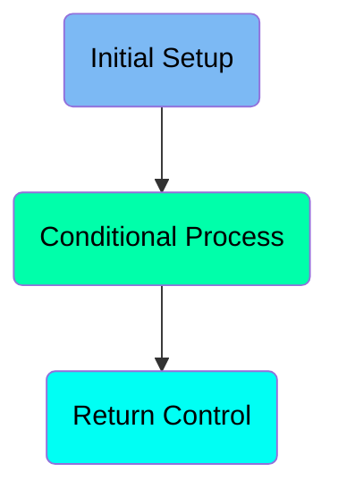
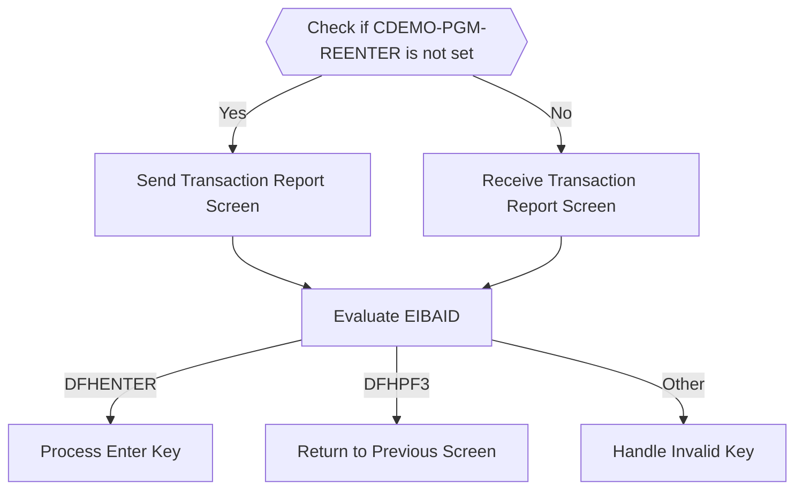
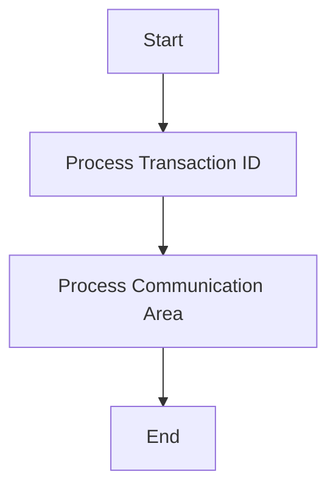

The <SwmToken path="app/cbl/CORPT00C.cbl" pos="2:7:7" line-data="      * Program     : CORPT00C.CBL">`CORPT00C`</SwmToken> program is responsible for handling the transaction report screen in the <SwmToken path="app/cbl/CORPT00C.cbl" pos="3:7:7" line-data="      * Application : CardDemo">`CardDemo`</SwmToken> application. It initializes program flags, processes transaction IDs, and manages user interactions through various screens. The program ensures that the correct screens are displayed based on user input and transaction status.

The <SwmToken path="app/cbl/CORPT00C.cbl" pos="2:7:7" line-data="      * Program     : CORPT00C.CBL">`CORPT00C`</SwmToken> program starts by initializing several flags and clearing message fields. It then checks if this is the initial entry into the program and navigates to the appropriate screen. Depending on user actions, it processes the transaction report screen, evaluates user inputs, and performs actions such as processing the enter key, returning to the previous screen, or handling invalid keys. Finally, it processes the transaction ID and communication area to complete the transaction.

Here is a high level diagram of the program:



# Initial Setup

```mermaid
graph TD
  A[Initialize Program Flags] --> B{Check EIBCALEN}
  B -->|Yes| C[Move COSGN00C to CDEMO-TO-PROGRAM]
  C --> D[Perform RETURN-TO-PREV-SCREEN]
  B -->|No| E{Check CDEMO-PGM-REENTER}
  E -->|No| F[Set CDEMO-PGM-REENTER to TRUE]
  F --> G[Move LOW-VALUES to CORPT0AO]
  G --> H[Move -1 to MONTHLYL of CORPT0AI]
  H --> I[Perform SEND-TRNRPT-SCREEN]
  E -->|Yes| J[Perform RECEIVE-TRNRPT-SCREEN]

%% Swimm:
%% graph TD
%%   A[Initialize Program Flags] --> B{Check EIBCALEN}
%%   B -->|Yes| C[Move <SwmToken path="app/cbl/CORPT00C.cbl" pos="173:4:4" line-data="               MOVE &#39;COSGN00C&#39; TO CDEMO-TO-PROGRAM">`COSGN00C`</SwmToken> to CDEMO-TO-PROGRAM]
%%   C --> D[Perform RETURN-TO-PREV-SCREEN]
%%   B -->|No| E{Check CDEMO-PGM-REENTER}
%%   E -->|No| F[Set <SwmToken path="app/cbl/CORPT00C.cbl" pos="177:5:9" line-data="               IF NOT CDEMO-PGM-REENTER">`CDEMO-PGM-REENTER`</SwmToken> to TRUE]
%%   F --> G[Move <SwmToken path="app/cbl/CORPT00C.cbl" pos="179:3:5" line-data="                   MOVE LOW-VALUES          TO CORPT0AO">`LOW-VALUES`</SwmToken> to CORPT0AO]
%%   G --> H[Move -1 to MONTHLYL of CORPT0AI]
%%   H --> I[Perform SEND-TRNRPT-SCREEN]
%%   E -->|Yes| J[Perform RECEIVE-TRNRPT-SCREEN]
```



<SwmSnippet path="/app/cbl/CORPT00C.cbl" line="163">

---

## Initialize Program Flags

First, the program initializes several flags to their default states. <SwmToken path="app/cbl/CORPT00C.cbl" pos="165:3:7" line-data="           SET ERR-FLG-OFF TO TRUE">`ERR-FLG-OFF`</SwmToken> is set to TRUE to indicate no errors initially. <SwmToken path="app/cbl/CORPT00C.cbl" pos="166:3:7" line-data="           SET TRANSACT-NOT-EOF TO TRUE">`TRANSACT-NOT-EOF`</SwmToken> is set to TRUE to indicate that the transaction file has not reached the end. <SwmToken path="app/cbl/CORPT00C.cbl" pos="167:3:7" line-data="           SET SEND-ERASE-YES TO TRUE">`SEND-ERASE-YES`</SwmToken> is set to TRUE to prepare for sending a screen erase command.

```cobol
       MAIN-PARA.

           SET ERR-FLG-OFF TO TRUE
           SET TRANSACT-NOT-EOF TO TRUE
           SET SEND-ERASE-YES TO TRUE

```

---

</SwmSnippet>

<SwmSnippet path="/app/cbl/CORPT00C.cbl" line="169">

---

## Clear Message Fields

Next, the program clears the message fields by moving spaces to <SwmToken path="app/cbl/CORPT00C.cbl" pos="169:7:9" line-data="           MOVE SPACES TO WS-MESSAGE">`WS-MESSAGE`</SwmToken> and <SwmToken path="app/cbl/CORPT00C.cbl" pos="170:1:5" line-data="                          ERRMSGO OF CORPT0AO">`ERRMSGO OF CORPT0AO`</SwmToken>. This ensures that any previous messages are cleared before proceeding.

```cobol
           MOVE SPACES TO WS-MESSAGE
                          ERRMSGO OF CORPT0AO
```

---

</SwmSnippet>

<SwmSnippet path="/app/cbl/CORPT00C.cbl" line="172">

---

## Check EIBCALEN

Then, the program checks if <SwmToken path="app/cbl/CORPT00C.cbl" pos="172:3:3" line-data="           IF EIBCALEN = 0">`EIBCALEN`</SwmToken> is equal to 0. If it is, this indicates that this is the initial entry into the program. In this case, it moves <SwmToken path="app/cbl/CORPT00C.cbl" pos="173:4:4" line-data="               MOVE &#39;COSGN00C&#39; TO CDEMO-TO-PROGRAM">`COSGN00C`</SwmToken> to <SwmToken path="app/cbl/CORPT00C.cbl" pos="173:9:13" line-data="               MOVE &#39;COSGN00C&#39; TO CDEMO-TO-PROGRAM">`CDEMO-TO-PROGRAM`</SwmToken> and performs <SwmToken path="app/cbl/CORPT00C.cbl" pos="189:3:9" line-data="                           PERFORM RETURN-TO-PREV-SCREEN">`RETURN-TO-PREV-SCREEN`</SwmToken> to navigate to the previous screen.

```cobol
           IF EIBCALEN = 0
               MOVE 'COSGN00C' TO CDEMO-TO-PROGRAM
```

---

</SwmSnippet>

# Conditional Process



<SwmSnippet path="/app/cbl/CORPT00C.cbl" line="177">

---

## Check if <SwmToken path="app/cbl/CORPT00C.cbl" pos="177:5:9" line-data="               IF NOT CDEMO-PGM-REENTER">`CDEMO-PGM-REENTER`</SwmToken> is not set

First, the code checks if <SwmToken path="app/cbl/CORPT00C.cbl" pos="177:5:9" line-data="               IF NOT CDEMO-PGM-REENTER">`CDEMO-PGM-REENTER`</SwmToken> is not set. If it is not set, it sets <SwmToken path="app/cbl/CORPT00C.cbl" pos="177:5:9" line-data="               IF NOT CDEMO-PGM-REENTER">`CDEMO-PGM-REENTER`</SwmToken> to true and initializes some variables.

```cobol
               IF NOT CDEMO-PGM-REENTER
                   SET CDEMO-PGM-REENTER    TO TRUE
```

---

</SwmSnippet>

<SwmSnippet path="/app/cbl/CORPT00C.cbl" line="181">

---

## Send Transaction Report Screen

If <SwmToken path="app/cbl/CORPT00C.cbl" pos="177:5:9" line-data="               IF NOT CDEMO-PGM-REENTER">`CDEMO-PGM-REENTER`</SwmToken> was not set, the code performs the <SwmToken path="app/cbl/CORPT00C.cbl" pos="181:3:7" line-data="                   PERFORM SEND-TRNRPT-SCREEN">`SEND-TRNRPT-SCREEN`</SwmToken> paragraph to send the transaction report screen to the user.

```cobol
                   PERFORM SEND-TRNRPT-SCREEN
```

---

</SwmSnippet>

<SwmSnippet path="/app/cbl/CORPT00C.cbl" line="183">

---

## Receive Transaction Report Screen

If <SwmToken path="app/cbl/CORPT00C.cbl" pos="177:5:9" line-data="               IF NOT CDEMO-PGM-REENTER">`CDEMO-PGM-REENTER`</SwmToken> was set, the code performs the <SwmToken path="app/cbl/CORPT00C.cbl" pos="183:3:7" line-data="                   PERFORM RECEIVE-TRNRPT-SCREEN">`RECEIVE-TRNRPT-SCREEN`</SwmToken> paragraph to receive input from the transaction report screen.

```cobol
                   PERFORM RECEIVE-TRNRPT-SCREEN
```

---

</SwmSnippet>

<SwmSnippet path="/app/cbl/CORPT00C.cbl" line="184">

---

## Evaluate EIBAID

Next, the code evaluates the <SwmToken path="app/cbl/CORPT00C.cbl" pos="184:3:3" line-data="                   EVALUATE EIBAID">`EIBAID`</SwmToken> to determine the user's action. Depending on the value of <SwmToken path="app/cbl/CORPT00C.cbl" pos="184:3:3" line-data="                   EVALUATE EIBAID">`EIBAID`</SwmToken>, it performs different actions such as processing the enter key, returning to the previous screen, or handling an invalid key.

```cobol
                   EVALUATE EIBAID
                       WHEN DFHENTER
                           PERFORM PROCESS-ENTER-KEY
                       WHEN DFHPF3
                           MOVE 'COMEN01C' TO CDEMO-TO-PROGRAM
                           PERFORM RETURN-TO-PREV-SCREEN
                       WHEN OTHER
                           MOVE 'Y'                       TO WS-ERR-FLG
                           MOVE -1       TO MONTHLYL OF CORPT0AI
                           MOVE CCDA-MSG-INVALID-KEY      TO WS-MESSAGE
                           PERFORM SEND-TRNRPT-SCREEN
                   END-EVALUATE
```

---

</SwmSnippet>

<SwmSnippet path="/app/cbl/CORPT00C.cbl" line="186">

---

### Process Enter Key

When <SwmToken path="app/cbl/CORPT00C.cbl" pos="184:3:3" line-data="                   EVALUATE EIBAID">`EIBAID`</SwmToken> is <SwmToken path="app/cbl/CORPT00C.cbl" pos="185:3:3" line-data="                       WHEN DFHENTER">`DFHENTER`</SwmToken>, the code performs the <SwmToken path="app/cbl/CORPT00C.cbl" pos="186:3:7" line-data="                           PERFORM PROCESS-ENTER-KEY">`PROCESS-ENTER-KEY`</SwmToken> paragraph to handle the enter key action.

```cobol
                           PERFORM PROCESS-ENTER-KEY
```

---

</SwmSnippet>

<SwmSnippet path="/app/cbl/CORPT00C.cbl" line="188">

---

### Return to Previous Screen

When <SwmToken path="app/cbl/CORPT00C.cbl" pos="184:3:3" line-data="                   EVALUATE EIBAID">`EIBAID`</SwmToken> is <SwmToken path="app/cbl/CORPT00C.cbl" pos="187:3:3" line-data="                       WHEN DFHPF3">`DFHPF3`</SwmToken>, the code sets <SwmToken path="app/cbl/CORPT00C.cbl" pos="188:9:13" line-data="                           MOVE &#39;COMEN01C&#39; TO CDEMO-TO-PROGRAM">`CDEMO-TO-PROGRAM`</SwmToken> to <SwmToken path="app/cbl/CORPT00C.cbl" pos="188:4:4" line-data="                           MOVE &#39;COMEN01C&#39; TO CDEMO-TO-PROGRAM">`COMEN01C`</SwmToken> and performs the <SwmToken path="app/cbl/CORPT00C.cbl" pos="189:3:9" line-data="                           PERFORM RETURN-TO-PREV-SCREEN">`RETURN-TO-PREV-SCREEN`</SwmToken> paragraph to return to the previous screen.

```cobol
                           MOVE 'COMEN01C' TO CDEMO-TO-PROGRAM
                           PERFORM RETURN-TO-PREV-SCREEN
```

---

</SwmSnippet>

<SwmSnippet path="/app/cbl/CORPT00C.cbl" line="191">

---

### Handle Invalid Key

When <SwmToken path="app/cbl/CORPT00C.cbl" pos="184:3:3" line-data="                   EVALUATE EIBAID">`EIBAID`</SwmToken> is any other value, the code sets the error flag, initializes some variables, and performs the <SwmToken path="app/cbl/CORPT00C.cbl" pos="194:3:7" line-data="                           PERFORM SEND-TRNRPT-SCREEN">`SEND-TRNRPT-SCREEN`</SwmToken> paragraph to send an error message to the user.

```cobol
                           MOVE 'Y'                       TO WS-ERR-FLG
                           MOVE -1       TO MONTHLYL OF CORPT0AI
                           MOVE CCDA-MSG-INVALID-KEY      TO WS-MESSAGE
                           PERFORM SEND-TRNRPT-SCREEN
```

---

</SwmSnippet>

# Return Control

This is the next section of the flow.



<SwmSnippet path="/app/cbl/CORPT00C.cbl" line="200">

---

## Processing Transaction ID

First, the transaction ID is processed using the <SwmToken path="app/cbl/CORPT00C.cbl" pos="200:1:1" line-data="                     TRANSID (WS-TRANID)">`TRANSID`</SwmToken> variable. This step is crucial as it identifies the specific transaction being handled.

```cobol
                     TRANSID (WS-TRANID)
```

---

</SwmSnippet>

<SwmSnippet path="/app/cbl/CORPT00C.cbl" line="201">

---

## Processing Communication Area

Next, the communication area is processed using the <SwmToken path="app/cbl/CORPT00C.cbl" pos="201:1:1" line-data="                     COMMAREA (CARDDEMO-COMMAREA)">`COMMAREA`</SwmToken> variable. This area contains all the necessary data for the transaction, ensuring that the correct information is passed along for further processing.

```cobol
                     COMMAREA (CARDDEMO-COMMAREA)
```

---

</SwmSnippet>

<SwmSnippet path="/app/cbl/CORPT00C.cbl" line="202">

---

## End of EXEC CICS

Then, the <SwmToken path="app/cbl/CORPT00C.cbl" pos="202:1:3" line-data="           END-EXEC.">`END-EXEC`</SwmToken> statement marks the end of the EXEC CICS command, indicating that the processing of the transaction ID and communication area is complete.

```cobol
           END-EXEC.
```

---

</SwmSnippet>

<SwmSnippet path="/app/cbl/CORPT00C.cbl" line="206">

---

## Process Enter Key

Finally, the <SwmToken path="app/cbl/CORPT00C.cbl" pos="206:3:7" line-data="      *                      PROCESS-ENTER-KEY">`PROCESS-ENTER-KEY`</SwmToken> section is a placeholder for handling the Enter key event, which would typically trigger further actions based on the processed transaction ID and communication area.

```cobol
      *                      PROCESS-ENTER-KEY
```

---

</SwmSnippet>

&nbsp;

*This is an auto-generated document by Swimm 🌊 and has not yet been verified by a human*

<SwmMeta version="3.0.0" repo-id="Z2l0aHViJTNBJTNBa3luZHJ5bC1hd3MtbWFpbmZyYW1lLW1vZGVybml6YXRpb24tY2FyZGRlbW8lM0ElM0FTd2ltbS1EZW1v" repo-name="kyndryl-aws-mainframe-modernization-carddemo"><sup>Powered by [Swimm](/)</sup></SwmMeta>
