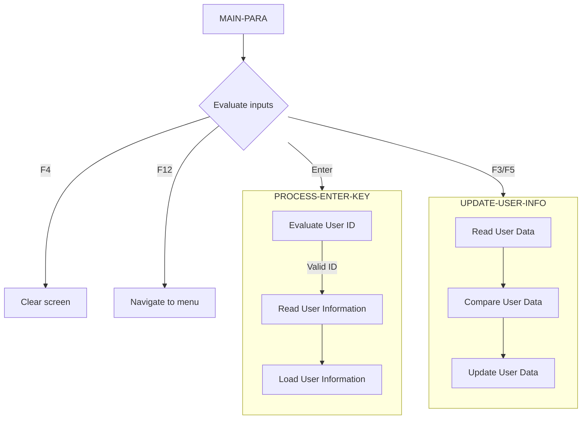

<SwmToken path="/app/cbl/COUSR02C.cbl" pos="2:7:7" line-data="      * Program     : COUSR02C.CBL">`COUSR02C`</SwmToken> manages the update screen interface for modifying existing user records in the USRSEC file.



<SwmSnippet path="/app/cbl/COUSR02C.cbl" line="108">

---

## <SwmToken path="/app/cbl/COUSR02C.cbl" pos="82:1:3" line-data="       MAIN-PARA.">`MAIN-PARA`</SwmToken>

The <SwmToken path="/app/cbl/COUSR00C.cbl" pos="98:1:3" line-data="       MAIN-PARA.">`MAIN-PARA`</SwmToken> function evaluates the user input (EIBAID) to determine the next action:

- If the user presses the Enter key (<SwmToken path="/app/cbl/COUSR00C.cbl" pos="123:3:3" line-data="                       WHEN DFHENTER">`DFHENTER`</SwmToken>), it performs the <SwmToken path="/app/cbl/COUSR00C.cbl" pos="124:3:7" line-data="                           PERFORM PROCESS-ENTER-KEY">`PROCESS-ENTER-KEY`</SwmToken> function.&nbsp;
- If the user presses the PF3 key (<SwmToken path="/app/cbl/COUSR02C.cbl" pos="111:3:3" line-data="                       WHEN DFHPF3">`DFHPF3`</SwmToken>), it updates the user information and navigates to the admin menu (<SwmToken path="/app/cbl/COUSR02C.cbl" pos="114:4:4" line-data="                               MOVE &#39;COADM01C&#39; TO CDEMO-TO-PROGRAM">`COADM01C`</SwmToken>).
- If the user presses the PF4 key (<SwmToken path="/app/cbl/COUSR02C.cbl" pos="120:3:3" line-data="                       WHEN DFHPF4">`DFHPF4`</SwmToken>), it clears the current screen.
- If the user presses the `PF5` key (<SwmToken path="/app/cbl/COUSR02C.cbl" pos="122:3:3" line-data="                       WHEN DFHPF5">`DFHPF5`</SwmToken>), it updates the user information.
- If the user presses the PF12 key (<SwmToken path="/app/cbl/COUSR02C.cbl" pos="124:3:3" line-data="                       WHEN DFHPF12">`DFHPF12`</SwmToken>), it navigates to the admin menu (<SwmToken path="/app/cbl/COUSR02C.cbl" pos="114:4:4" line-data="                               MOVE &#39;COADM01C&#39; TO CDEMO-TO-PROGRAM">`COADM01C`</SwmToken>)
- For any other input, it shows an error.

```cobol
                   EVALUATE EIBAID
                       WHEN DFHENTER
                           PERFORM PROCESS-ENTER-KEY
                       WHEN DFHPF3
                           PERFORM UPDATE-USER-INFO
                           IF CDEMO-FROM-PROGRAM = SPACES OR LOW-VALUES
                               MOVE 'COADM01C' TO CDEMO-TO-PROGRAM
                           ELSE
                               MOVE CDEMO-FROM-PROGRAM TO
                               CDEMO-TO-PROGRAM
                           END-IF
                           PERFORM RETURN-TO-PREV-SCREEN
                       WHEN DFHPF4
                           PERFORM CLEAR-CURRENT-SCREEN
                       WHEN DFHPF5
                           PERFORM UPDATE-USER-INFO
                       WHEN DFHPF12
                           MOVE 'COADM01C' TO CDEMO-TO-PROGRAM
                           PERFORM RETURN-TO-PREV-SCREEN
                       WHEN OTHER
                           MOVE 'Y'                       TO WS-ERR-FLG
                           MOVE CCDA-MSG-INVALID-KEY      TO WS-MESSAGE
                           PERFORM SEND-USRUPD-SCREEN
                   END-EVALUATE
```

---

</SwmSnippet>

<SwmSnippet path="/app/cbl/COUSR02C.cbl" line="157">

---

## <SwmToken path="/app/cbl/COUSR00C.cbl" pos="124:3:7" line-data="                           PERFORM PROCESS-ENTER-KEY">`PROCESS-ENTER-KEY`</SwmToken>

When the enter key is pressed, the <SwmToken path="/app/cbl/COUSR02C.cbl" pos="82:1:3" line-data="       MAIN-PARA.">`MAIN-PARA`</SwmToken> function calls the <SwmToken path="/app/cbl/COUSR00C.cbl" pos="124:3:7" line-data="                           PERFORM PROCESS-ENTER-KEY">`PROCESS-ENTER-KEY`</SwmToken> function.&nbsp;

If the user ID is not empty, the function clears the first name, last name, password, and user type fields in the <SwmToken path="/app/cbl/COUSR02C.cbl" pos="158:11:11" line-data="               MOVE SPACES      TO FNAMEI   OF COUSR2AI">`COUSR2AI`</SwmToken> structure. It then moves the user ID to the <SwmToken path="/app/cbl/COUSR02C.cbl" pos="216:11:15" line-data="               MOVE USRIDINI  OF COUSR2AI TO SEC-USR-ID">`SEC-USR-ID`</SwmToken> variable and performs the <SwmToken path="/app/cbl/COUSR02C.cbl" pos="217:3:9" line-data="               PERFORM READ-USER-SEC-FILE">`READ-USER-SEC-FILE`</SwmToken> operation to read the user information from the <SwmToken path="/app/cbl/COUSR02C.cbl" pos="5:15:15" line-data="      * Function    : Update a user in USRSEC file">`USRSEC`</SwmToken> file.

```cobol
           IF NOT ERR-FLG-ON
               MOVE SPACES      TO FNAMEI   OF COUSR2AI
                                   LNAMEI   OF COUSR2AI
                                   PASSWDI  OF COUSR2AI
                                   USRTYPEI OF COUSR2AI
               MOVE USRIDINI  OF COUSR2AI TO SEC-USR-ID
               PERFORM READ-USER-SEC-FILE
           END-IF.

           IF NOT ERR-FLG-ON
               MOVE SEC-USR-FNAME      TO FNAMEI    OF COUSR2AI
               MOVE SEC-USR-LNAME      TO LNAMEI    OF COUSR2AI
               MOVE SEC-USR-PWD        TO PASSWDI   OF COUSR2AI
               MOVE SEC-USR-TYPE       TO USRTYPEI  OF COUSR2AI
               PERFORM SEND-USRUPD-SCREEN
           END-IF.
```

---

</SwmSnippet>

<SwmSnippet path="/app/cbl/COUSR02C.cbl" line="157">

---

If no errors are encountered, the function moves the retrieved user information (first name, last name, password, and user type) to the corresponding fields in the <SwmToken path="/app/cbl/COUSR02C.cbl" pos="158:11:11" line-data="               MOVE SPACES      TO FNAMEI   OF COUSR2AI">`COUSR2AI`</SwmToken> structure and performs the <SwmToken path="/app/cbl/COUSR02C.cbl" pos="242:3:7" line-data="                   PERFORM SEND-USRUPD-SCREEN">`SEND-USRUPD-SCREEN`</SwmToken> operation to display the user update screen.

```cobol
           IF NOT ERR-FLG-ON
               MOVE SPACES      TO FNAMEI   OF COUSR2AI
                                   LNAMEI   OF COUSR2AI
                                   PASSWDI  OF COUSR2AI
                                   USRTYPEI OF COUSR2AI
               MOVE USRIDINI  OF COUSR2AI TO SEC-USR-ID
               PERFORM READ-USER-SEC-FILE
           END-IF.

           IF NOT ERR-FLG-ON
               MOVE SEC-USR-FNAME      TO FNAMEI    OF COUSR2AI
               MOVE SEC-USR-LNAME      TO LNAMEI    OF COUSR2AI
               MOVE SEC-USR-PWD        TO PASSWDI   OF COUSR2AI
               MOVE SEC-USR-TYPE       TO USRTYPEI  OF COUSR2AI
               PERFORM SEND-USRUPD-SCREEN
           END-IF.
```

---

</SwmSnippet>

<SwmSnippet path="/app/cbl/COUSR02C.cbl" line="215">

---

## <SwmToken path="/app/cbl/COUSR02C.cbl" pos="112:3:7" line-data="                           PERFORM UPDATE-USER-INFO">`UPDATE-USER-INFO`</SwmToken>

The <SwmToken path="/app/cbl/COUSR02C.cbl" pos="82:1:3" line-data="       MAIN-PARA.">`MAIN-PARA`</SwmToken> function calls the <SwmToken path="/app/cbl/COUSR02C.cbl" pos="112:3:7" line-data="                           PERFORM UPDATE-USER-INFO">`UPDATE-USER-INFO`</SwmToken> function to update user information. This function first validates all required fields are not empty.

```cobol
           IF NOT ERR-FLG-ON
               MOVE USRIDINI  OF COUSR2AI TO SEC-USR-ID
               PERFORM READ-USER-SEC-FILE

               IF FNAMEI  OF COUSR2AI NOT = SEC-USR-FNAME
                   MOVE FNAMEI   OF COUSR2AI TO SEC-USR-FNAME
                   SET USR-MODIFIED-YES TO TRUE
               END-IF
               IF LNAMEI  OF COUSR2AI NOT = SEC-USR-LNAME
                   MOVE LNAMEI   OF COUSR2AI TO SEC-USR-LNAME
                   SET USR-MODIFIED-YES TO TRUE
               END-IF
               IF PASSWDI  OF COUSR2AI NOT = SEC-USR-PWD
                   MOVE PASSWDI  OF COUSR2AI TO SEC-USR-PWD
                   SET USR-MODIFIED-YES TO TRUE
               END-IF
               IF USRTYPEI  OF COUSR2AI NOT = SEC-USR-TYPE
                   MOVE USRTYPEI OF COUSR2AI TO SEC-USR-TYPE
                   SET USR-MODIFIED-YES TO TRUE
               END-IF

               IF USR-MODIFIED-YES
                   PERFORM UPDATE-USER-SEC-FILE
               ELSE
                   MOVE 'Please modify to update ...' TO
                                   WS-MESSAGE
                   MOVE DFHRED       TO ERRMSGC  OF COUSR2AO
                   PERFORM SEND-USRUPD-SCREEN
               END-IF

```

---

</SwmSnippet>

<SwmSnippet path="/app/cbl/COUSR02C.cbl" line="215">

---

If validation passes the function moves the user ID to the <SwmToken path="/app/cbl/COUSR02C.cbl" pos="216:11:15" line-data="               MOVE USRIDINI  OF COUSR2AI TO SEC-USR-ID">`SEC-USR-ID`</SwmToken> variable and performs the <SwmToken path="/app/cbl/COUSR02C.cbl" pos="217:3:9" line-data="               PERFORM READ-USER-SEC-FILE">`READ-USER-SEC-FILE`</SwmToken> operation to read the existing user information. It then compares the input data with the existing data to determine if any updates are needed. If any changes are detected, it updates the corresponding fields in the <SwmToken path="/app/cbl/COUSR02C.cbl" pos="216:11:13" line-data="               MOVE USRIDINI  OF COUSR2AI TO SEC-USR-ID">`SEC-USR`</SwmToken> structure and sets the <SwmToken path="/app/cbl/COUSR02C.cbl" pos="221:3:7" line-data="                   SET USR-MODIFIED-YES TO TRUE">`USR-MODIFIED-YES`</SwmToken> flag to true.

```cobol
           IF NOT ERR-FLG-ON
               MOVE USRIDINI  OF COUSR2AI TO SEC-USR-ID
               PERFORM READ-USER-SEC-FILE

               IF FNAMEI  OF COUSR2AI NOT = SEC-USR-FNAME
                   MOVE FNAMEI   OF COUSR2AI TO SEC-USR-FNAME
                   SET USR-MODIFIED-YES TO TRUE
               END-IF
               IF LNAMEI  OF COUSR2AI NOT = SEC-USR-LNAME
                   MOVE LNAMEI   OF COUSR2AI TO SEC-USR-LNAME
                   SET USR-MODIFIED-YES TO TRUE
               END-IF
               IF PASSWDI  OF COUSR2AI NOT = SEC-USR-PWD
                   MOVE PASSWDI  OF COUSR2AI TO SEC-USR-PWD
                   SET USR-MODIFIED-YES TO TRUE
               END-IF
               IF USRTYPEI  OF COUSR2AI NOT = SEC-USR-TYPE
                   MOVE USRTYPEI OF COUSR2AI TO SEC-USR-TYPE
                   SET USR-MODIFIED-YES TO TRUE
               END-IF

               IF USR-MODIFIED-YES
                   PERFORM UPDATE-USER-SEC-FILE
               ELSE
                   MOVE 'Please modify to update ...' TO
                                   WS-MESSAGE
                   MOVE DFHRED       TO ERRMSGC  OF COUSR2AO
                   PERFORM SEND-USRUPD-SCREEN
               END-IF

```

---

</SwmSnippet>

<SwmSnippet path="/app/cbl/COUSR02C.cbl" line="215">

---

If the user information has been modified, the function performs the <SwmToken path="/app/cbl/COUSR02C.cbl" pos="237:3:9" line-data="                   PERFORM UPDATE-USER-SEC-FILE">`UPDATE-USER-SEC-FILE`</SwmToken> operation to update the user information in the <SwmToken path="/app/cbl/COUSR02C.cbl" pos="5:15:15" line-data="      * Function    : Update a user in USRSEC file">`USRSEC`</SwmToken> file.

```cobol
           IF NOT ERR-FLG-ON
               MOVE USRIDINI  OF COUSR2AI TO SEC-USR-ID
               PERFORM READ-USER-SEC-FILE

               IF FNAMEI  OF COUSR2AI NOT = SEC-USR-FNAME
                   MOVE FNAMEI   OF COUSR2AI TO SEC-USR-FNAME
                   SET USR-MODIFIED-YES TO TRUE
               END-IF
               IF LNAMEI  OF COUSR2AI NOT = SEC-USR-LNAME
                   MOVE LNAMEI   OF COUSR2AI TO SEC-USR-LNAME
                   SET USR-MODIFIED-YES TO TRUE
               END-IF
               IF PASSWDI  OF COUSR2AI NOT = SEC-USR-PWD
                   MOVE PASSWDI  OF COUSR2AI TO SEC-USR-PWD
                   SET USR-MODIFIED-YES TO TRUE
               END-IF
               IF USRTYPEI  OF COUSR2AI NOT = SEC-USR-TYPE
                   MOVE USRTYPEI OF COUSR2AI TO SEC-USR-TYPE
                   SET USR-MODIFIED-YES TO TRUE
               END-IF

               IF USR-MODIFIED-YES
                   PERFORM UPDATE-USER-SEC-FILE
               ELSE
                   MOVE 'Please modify to update ...' TO
                                   WS-MESSAGE
                   MOVE DFHRED       TO ERRMSGC  OF COUSR2AO
                   PERFORM SEND-USRUPD-SCREEN
               END-IF

```

---

</SwmSnippet>

&nbsp;

_This is an auto-generated document by Swimm 🌊 and has not yet been verified by a human_

<SwmMeta version="3.0.0" repo-id="Z2l0aHViJTNBJTNBYXdzLW1haW5mcmFtZS1tb2Rlcm5pemF0aW9uLWNhcmRkZW1vJTNBJTNBU3dpbW0tRGVtbw==" repo-name="aws-mainframe-modernization-carddemo"><sup>Powered by [Swimm](https://staging.swimm.cloud/)</sup></SwmMeta>
